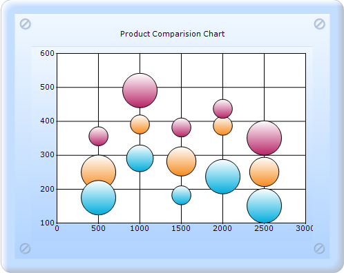

::: {style="DISPLAY: none"}
{#d2h_url_template}{#d2h_package_url style="WIDTH: 0px; DISPLAY: none; HEIGHT: 0px"}
:::

::: {.d2h_secondary_topic style="PADDING-BOTTOM: 10pt; MARGIN: 0pt; PADDING-LEFT: 0pt; PADDING-RIGHT: 0pt; PADDING-TOP: 0pt"}
##### ChartModel {#chartmodel style="tab-stops: 0pt"}

 

To create a Bubble chart through ChartModel:

1.   In Controller, create an instance of **MVCChartModel**.

2.   Create an instance of **ChartSeries**, and set the SeriesType to **Bubble**.

3.   Set the **ChartSeries**, **ChartArea**, and **ChartModel** properties.

4.   Return view to the corresponding View page after setting the **ChartModel** to the **ViewData**.

[]{style="FONT-FAMILY: 'Calibri','sans-serif'"} 

+-------------------------------------------------------------------------------------------------------------------------------------------------------------------------------------------------------------------------------------------------------------------------+
| \[C#\]                                                                                                                                                                                                                                                                  |
|                                                                                                                                                                                                                                                                         |
| [        [public]{style="COLOR: blue"} [ActionResult]{style="COLOR: #2b91af"} SimpleChart()]{style="FONT-FAMILY: 'Courier New'"}                                                                                                                                        |
|                                                                                                                                                                                                                                                                         |
| [        {            ]{style="FONT-FAMILY: 'Courier New'"}                                                                                                                                                                                                             |
|                                                                                                                                                                                                                                                                         |
| [        [string]{style="COLOR: blue"} accessFileLocation = Server.MapPath([\".\"]{style="COLOR: #a31515"});]{style="FONT-FAMILY: 'Courier New'"}                                                                                                                       |
|                                                                                                                                                                                                                                                                         |
| [            accessFileLocation += [@\"\\Content\\Bubble.png\"]{style="COLOR: #a31515"};]{style="FONT-FAMILY: 'Courier New'"}                                                                                                                                           |
|                                                                                                                                                                                                                                                                         |
| [            System.Drawing.[Bitmap]{style="COLOR: #2b91af"} flower = [new]{style="COLOR: blue"} System.Drawing.[Bitmap]{style="COLOR: #2b91af"}(accessFileLocation);]{style="FONT-FAMILY: 'Courier New'"}                                                              |
|                                                                                                                                                                                                                                                                         |
| [            [MVCChartModel]{style="COLOR: #2b91af"} chartModel = [new]{style="COLOR: blue"} [MVCChartModel]{style="COLOR: #2b91af"}();]{style="FONT-FAMILY: 'Courier New'"}                                                                                            |
|                                                                                                                                                                                                                                                                         |
| [            [// Creating chart series and adding data points to it.]{style="COLOR: green"}]{style="FONT-FAMILY: 'Courier New'"}                                                                                                                                        |
|                                                                                                                                                                                                                                                                         |
| []{style="FONT-FAMILY: 'Courier New'"}                                                                                                                                                                                                                                  |
|                                                                                                                                                                                                                                                                         |
| **[            [ChartSeries]{style="COLOR: #2b91af"} series1 = [new]{style="COLOR: blue"} [ChartSeries]{style="COLOR: #2b91af"}([\"Technology AAA\"]{style="COLOR: #a31515"}, [ChartSeriesType]{style="COLOR: #2b91af"}.Bubble);]{style="FONT-FAMILY: 'Courier New'"}** |
|                                                                                                                                                                                                                                                                         |
| []{style="FONT-FAMILY: 'Courier New'"}                                                                                                                                                                                                                                  |
|                                                                                                                                                                                                                                                                         |
| **[            series1.Points.Add(500, 356, 3);]{style="FONT-FAMILY: 'Courier New'"}**                                                                                                                                                                                  |
|                                                                                                                                                                                                                                                                         |
| **[            series1.Points.Add(1000, 491, 4);]{style="FONT-FAMILY: 'Courier New'"}**                                                                                                                                                                                 |
|                                                                                                                                                                                                                                                                         |
| **[            series1.Points.Add(1500, 382, 3);]{style="FONT-FAMILY: 'Courier New'"}**                                                                                                                                                                                 |
|                                                                                                                                                                                                                                                                         |
| **[            series1.Points.Add(2000, 437, 3);]{style="FONT-FAMILY: 'Courier New'"}**                                                                                                                                                                                 |
|                                                                                                                                                                                                                                                                         |
| **[            series1.Points.Add(2500, 351, 4);]{style="FONT-FAMILY: 'Courier New'"}**                                                                                                                                                                                 |
|                                                                                                                                                                                                                                                                         |
| [            series1.ScatterConnectType = [ScatterConnectType]{style="COLOR: #2b91af"}.None;]{style="FONT-FAMILY: 'Courier New'"}                                                                                                                                       |
|                                                                                                                                                                                                                                                                         |
| [            series1.ScatterSplineTension = 0;]{style="FONT-FAMILY: 'Courier New'"}                                                                                                                                                                                     |
|                                                                                                                                                                                                                                                                         |
| [            series1.ConfigItems.BubbleItem.BubbleType = [ChartBubbleType]{style="COLOR: #2b91af"}.Circle;]{style="FONT-FAMILY: 'Courier New'"}                                                                                                                         |
|                                                                                                                                                                                                                                                                         |
| []{style="FONT-FAMILY: 'Courier New'"}                                                                                                                                                                                                                                  |
|                                                                                                                                                                                                                                                                         |
| [            [// Adding Chart Series to the Chart Model]{style="COLOR: green"}]{style="FONT-FAMILY: 'Courier New'"}                                                                                                                                                     |
|                                                                                                                                                                                                                                                                         |
| **[            chartModel.Series.Add(series1);]{style="FONT-FAMILY: 'Courier New'"}**                                                                                                                                                                                   |
|                                                                                                                                                                                                                                                                         |
| **[]{style="FONT-FAMILY: 'Courier New'"}**                                                                                                                                                                                                                              |
|                                                                                                                                                                                                                                                                         |
| **[            [ChartSeries]{style="COLOR: #2b91af"} series2 = [new]{style="COLOR: blue"} [ChartSeries]{style="COLOR: #2b91af"}([\"Technology BBB\"]{style="COLOR: #a31515"}, [ChartSeriesType]{style="COLOR: #2b91af"}.Bubble);]{style="FONT-FAMILY: 'Courier New'"}** |
|                                                                                                                                                                                                                                                                         |
| []{style="FONT-FAMILY: 'Courier New'"}                                                                                                                                                                                                                                  |
|                                                                                                                                                                                                                                                                         |
| **[            series2.Points.Add(500, 175, 4);]{style="FONT-FAMILY: 'Courier New'"}**                                                                                                                                                                                  |
|                                                                                                                                                                                                                                                                         |
| **[            series2.Points.Add(1000, 291, 3);]{style="FONT-FAMILY: 'Courier New'"}**                                                                                                                                                                                 |
|                                                                                                                                                                                                                                                                         |
| **[            series2.Points.Add(1500, 182, 2);]{style="FONT-FAMILY: 'Courier New'"}**                                                                                                                                                                                 |
|                                                                                                                                                                                                                                                                         |
| **[            series2.Points.Add(2000, 237, 4);]{style="FONT-FAMILY: 'Courier New'"}**                                                                                                                                                                                 |
|                                                                                                                                                                                                                                                                         |
| **[            series2.Points.Add(2500, 151, 4);]{style="FONT-FAMILY: 'Courier New'"}**                                                                                                                                                                                 |
|                                                                                                                                                                                                                                                                         |
| [            series2.ScatterConnectType = [ScatterConnectType]{style="COLOR: #2b91af"}.None;]{style="FONT-FAMILY: 'Courier New'"}                                                                                                                                       |
|                                                                                                                                                                                                                                                                         |
| [            series2.ScatterSplineTension = 0;]{style="FONT-FAMILY: 'Courier New'"}                                                                                                                                                                                     |
|                                                                                                                                                                                                                                                                         |
| [            series2.ConfigItems.BubbleItem.BubbleType = [ChartBubbleType]{style="COLOR: #2b91af"}.Circle;]{style="FONT-FAMILY: 'Courier New'"}                                                                                                                         |
|                                                                                                                                                                                                                                                                         |
| []{style="FONT-FAMILY: 'Courier New'"}                                                                                                                                                                                                                                  |
|                                                                                                                                                                                                                                                                         |
| [            [// Adding Chart Series to the Chart Model]{style="COLOR: green"}]{style="FONT-FAMILY: 'Courier New'"}                                                                                                                                                     |
|                                                                                                                                                                                                                                                                         |
| **[            chartModel.Series.Add(series2);]{style="FONT-FAMILY: 'Courier New'"}**                                                                                                                                                                                   |
|                                                                                                                                                                                                                                                                         |
| **[]{style="FONT-FAMILY: 'Courier New'"}**                                                                                                                                                                                                                              |
|                                                                                                                                                                                                                                                                         |
| **[            [ChartSeries]{style="COLOR: #2b91af"} series3 = [new]{style="COLOR: blue"} [ChartSeries]{style="COLOR: #2b91af"}([\"Technology CCC\"]{style="COLOR: #a31515"}, [ChartSeriesType]{style="COLOR: #2b91af"}.Bubble);]{style="FONT-FAMILY: 'Courier New'"}** |
|                                                                                                                                                                                                                                                                         |
| **[]{style="FONT-FAMILY: 'Courier New'"}**                                                                                                                                                                                                                              |
|                                                                                                                                                                                                                                                                         |
| **[            series3.Points.Add(500, 250, 5);]{style="FONT-FAMILY: 'Courier New'"}**                                                                                                                                                                                  |
|                                                                                                                                                                                                                                                                         |
| **[            series3.Points.Add(1000, 391, 2);]{style="FONT-FAMILY: 'Courier New'"}**                                                                                                                                                                                 |
|                                                                                                                                                                                                                                                                         |
| **[            series3.Points.Add(1500, 282, 4);]{style="FONT-FAMILY: 'Courier New'"}**                                                                                                                                                                                 |
|                                                                                                                                                                                                                                                                         |
| **[            series3.Points.Add(2000, 387, 2);]{style="FONT-FAMILY: 'Courier New'"}**                                                                                                                                                                                 |
|                                                                                                                                                                                                                                                                         |
| **[            series3.Points.Add(2500, 251, 4);]{style="FONT-FAMILY: 'Courier New'"}**                                                                                                                                                                                 |
|                                                                                                                                                                                                                                                                         |
| []{style="FONT-FAMILY: Consolas; FONT-SIZE: 9.5pt"}                                                                                                                                                                                                                     |
|                                                                                                                                                                                                                                                                         |
| [            ]{style="FONT-FAMILY: Consolas; FONT-SIZE: 9.5pt"}                                                                                                                                                                                                         |
|                                                                                                                                                                                                                                                                         |
| [            ]{style="FONT-FAMILY: Consolas; FONT-SIZE: 9.5pt"}[series3.ScatterConnectType = [ScatterConnectType]{style="COLOR: #2b91af"}.None;]{style="FONT-FAMILY: 'Courier New'"}                                                                                    |
|                                                                                                                                                                                                                                                                         |
| [            series3.ScatterSplineTension = 0;]{style="FONT-FAMILY: 'Courier New'"}                                                                                                                                                                                     |
|                                                                                                                                                                                                                                                                         |
| [            series3.ConfigItems.BubbleItem.BubbleType = [ChartBubbleType]{style="COLOR: #2b91af"}.Circle;]{style="FONT-FAMILY: 'Courier New'"}                                                                                                                         |
|                                                                                                                                                                                                                                                                         |
| []{style="FONT-FAMILY: 'Courier New'"}                                                                                                                                                                                                                                  |
|                                                                                                                                                                                                                                                                         |
| [            [// Adding Chart Series to the Chart Model]{style="COLOR: green"}]{style="FONT-FAMILY: 'Courier New'"}                                                                                                                                                     |
|                                                                                                                                                                                                                                                                         |
| **[            chartModel.Series.Add(series3);]{style="FONT-FAMILY: 'Courier New'"}**                                                                                                                                                                                   |
|                                                                                                                                                                                                                                                                         |
| [            chartModel.Series\[2\].Style.Images = [new]{style="COLOR: blue"} [ChartImageCollection]{style="COLOR: #2b91af"}();]{style="FONT-FAMILY: 'Courier New'"}                                                                                                    |
|                                                                                                                                                                                                                                                                         |
| [            chartModel.Series\[2\].Style.Images.Add(flower);]{style="FONT-FAMILY: 'Courier New'"}                                                                                                                                                                      |
|                                                                                                                                                                                                                                                                         |
| []{style="FONT-FAMILY: 'Courier New'"}                                                                                                                                                                                                                                  |
|                                                                                                                                                                                                                                                                         |
| [            chartModel.Skins = [ChartModelSkins]{style="COLOR: #2b91af"}.Office2007Blue;]{style="FONT-FAMILY: 'Courier New'"}                                                                                                                                          |
|                                                                                                                                                                                                                                                                         |
| [            chartModel.ChartSeriesSkins = [ChartSeriesSkins]{style="COLOR: #2b91af"}.Analog;]{style="FONT-FAMILY: 'Courier New'"}                                                                                                                                      |
|                                                                                                                                                                                                                                                                         |
| [            chartModel.SmoothingMode = System.Drawing.Drawing2D.[SmoothingMode]{style="COLOR: #2b91af"}.AntiAlias;]{style="FONT-FAMILY: 'Courier New'"}                                                                                                                |
|                                                                                                                                                                                                                                                                         |
| [            chartModel.BorderAppearance.SkinStyle = [ChartBorderSkinStyle]{style="COLOR: #2b91af"}.Pinned;]{style="FONT-FAMILY: 'Courier New'"}                                                                                                                        |
|                                                                                                                                                                                                                                                                         |
| []{style="FONT-FAMILY: 'Courier New'"}                                                                                                                                                                                                                                  |
|                                                                                                                                                                                                                                                                         |
| [            chartModel.Text = [\"Product Comparision Chart\"]{style="COLOR: #a31515"};]{style="FONT-FAMILY: 'Courier New'"}                                                                                                                                            |
|                                                                                                                                                                                                                                                                         |
| []{style="FONT-FAMILY: 'Courier New'"}                                                                                                                                                                                                                                  |
|                                                                                                                                                                                                                                                                         |
| [            chartModel.Size = [new]{style="COLOR: blue"} System.Drawing.[Size]{style="COLOR: #2b91af"}(500, 400);]{style="FONT-FAMILY: 'Courier New'"}                                                                                                                 |
|                                                                                                                                                                                                                                                                         |
| [            ViewData.Model = chartModel;]{style="FONT-FAMILY: 'Courier New'"}                                                                                                                                                                                          |
|                                                                                                                                                                                                                                                                         |
| []{style="FONT-FAMILY: 'Courier New'"}                                                                                                                                                                                                                                  |
|                                                                                                                                                                                                                                                                         |
| [            [return]{style="COLOR: blue"} View();]{style="FONT-FAMILY: 'Courier New'"}                                                                                                                                                                                 |
|                                                                                                                                                                                                                                                                         |
| [}]{style="FONT-FAMILY: 'Courier New'"}                                                                                                                                                                                                                                 |
|                                                                                                                                                                                                                                                                         |
| []{style="FONT-FAMILY: Consolas; COLOR: blue; FONT-SIZE: 9.5pt"}                                                                                                                                                                                                        |
+-------------------------------------------------------------------------------------------------------------------------------------------------------------------------------------------------------------------------------------------------------------------------+

[]{style="FONT-FAMILY: Consolas; FONT-SIZE: 9.5pt"} 

[]{style="FONT-FAMILY: Consolas; FONT-SIZE: 9.5pt"} 

5.   In the View page, invoke the ChartBuilder by using the control ID as the first argument, and convert the ViewData to **MVCChartModel** and set it as the second argument.

[                  ]{style="FONT-FAMILY: 'Calibri','sans-serif'"}[]{style="FONT-FAMILY: 'Calibri','sans-serif'"}

+---------------------------------------------------------------------------------------------------------------------------------------------------------------------------------------------------------------------------------------------------------------------------------------------------------+
| **View\[ASPX\]**                                                                                                                                                                                                                                                                                        |
|                                                                                                                                                                                                                                                                                                         |
| []{style="FONT-FAMILY: 'Calibri','sans-serif'"}                                                                                                                                                                                                                                                         |
|                                                                                                                                                                                                                                                                                                         |
| [\<%]{style="FONT-FAMILY: 'Courier New'; BACKGROUND: yellow"}[=]{style="FONT-FAMILY: 'Courier New'; COLOR: blue"}[ Html.Chart([\"SimpleChart\"]{style="COLOR: #a31515"},([MVCChartModel]{style="COLOR: #2b91af"})ViewData.Model) [%\>]{style="BACKGROUND: yellow"}]{style="FONT-FAMILY: 'Courier New'"} |
|                                                                                                                                                                                                                                                                                                         |
| [               ]{style="FONT-FAMILY: Consolas; FONT-SIZE: 9.5pt"}                                                                                                                                                                                                                                      |
|                                                                                                                                                                                                                                                                                                         |
| []{style="FONT-FAMILY: Consolas; COLOR: blue; FONT-SIZE: 9.5pt"}                                                                                                                                                                                                                                        |
+---------------------------------------------------------------------------------------------------------------------------------------------------------------------------------------------------------------------------------------------------------------------------------------------------------+

[]{style="FONT-FAMILY: Consolas; FONT-SIZE: 9.5pt"} 

 

[                  ]{style="FONT-FAMILY: 'Calibri','sans-serif'"}[]{style="FONT-FAMILY: 'Calibri','sans-serif'"}

+----------------------------------------------------------------------------------------------------------------------------------------------------------------------------------------------------------------------------------------------------------------------------------------------------------------------------------------------------------------------------------------------------------+
| **View\[cshtml\]**[]{style="FONT-FAMILY: 'Calibri','sans-serif'"}                                                                                                                                                                                                                                                                                                                                        |
|                                                                                                                                                                                                                                                                                                                                                                                                          |
| [  ]{style="FONT-FAMILY: Consolas; FONT-SIZE: 9.5pt"}                                                                                                                                                                                                                                                                                                                                                    |
|                                                                                                                                                                                                                                                                                                                                                                                                          |
| [    [@(]{style="BACKGROUND: yellow"}[new]{style="COLOR: blue"} [HtmlString]{style="COLOR: #2b91af"}(]{style="FONT-FAMILY: Consolas; FONT-SIZE: 9.5pt"}[Html.Chart([\"SimpleChart\"]{style="COLOR: #a31515"},([MVCChartModel]{style="COLOR: #2b91af"})ViewData.Model)]{style="FONT-FAMILY: 'Courier New'"}[.ToString())[)]{style="BACKGROUND: yellow"}]{style="FONT-FAMILY: Consolas; FONT-SIZE: 9.5pt"} |
|                                                                                                                                                                                                                                                                                                                                                                                                          |
| [            []{style="COLOR: blue"}]{style="FONT-FAMILY: Consolas; FONT-SIZE: 9.5pt"}                                                                                                                                                                                                                                                                                                                   |
+----------------------------------------------------------------------------------------------------------------------------------------------------------------------------------------------------------------------------------------------------------------------------------------------------------------------------------------------------------------------------------------------------------+

[]{style="FONT-FAMILY: Consolas; FONT-SIZE: 9.5pt"} 

6.   Build and run the code, to get the following output:

[]{style="FONT-FAMILY: 'Calibri','sans-serif'"} 

{border="0"}

Figure 124: Chart displaying Bubble chart Series

[]{#related-topics}
:::
