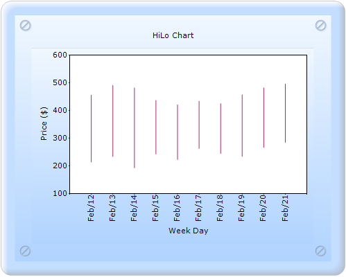

::: {style="DISPLAY: none"}
{#d2h_url_template}{#d2h_package_url style="WIDTH: 0px; DISPLAY: none; HEIGHT: 0px"}
:::

::: {.d2h_secondary_topic style="PADDING-BOTTOM: 10pt; MARGIN: 0pt; PADDING-LEFT: 0pt; PADDING-RIGHT: 0pt; PADDING-TOP: 0pt"}
##### ChartModel {#chartmodel style="tab-stops: 0pt"}

To create a HiLo chart through ChartModel:

1.   In Controller, create an instance of **MVCChartModel**.

2.   Create an instance of **ChartSeries**, and set the SeriesType to **HiLo**.

3.   Set the **ChartSeries**, **ChartArea**, and **ChartModel** properties.

4.   Return view to the corresponding View page after setting the **ChartModel** to the ViewData.

[]{style="FONT-FAMILY: 'Calibri','sans-serif'"} 

+------------------------------------------------------------------------------------------------------------------------------------------------------------------------------------------------------------------------------------------------------------------+
| \[C#\]                                                                                                                                                                                                                                                           |
|                                                                                                                                                                                                                                                                  |
| [        ]{style="FONT-FAMILY: Consolas; FONT-SIZE: 9.5pt"}[public]{style="FONT-FAMILY: 'Courier New'; COLOR: blue"}[ [ActionResult]{style="COLOR: #2b91af"} SimpleChart()]{style="FONT-FAMILY: 'Courier New'"}                                                  |
|                                                                                                                                                                                                                                                                  |
| [        {            ]{style="FONT-FAMILY: 'Courier New'"}                                                                                                                                                                                                      |
|                                                                                                                                                                                                                                                                  |
| [           [MVCChartModel]{style="COLOR: #2b91af"} chartModel = [new]{style="COLOR: blue"} [MVCChartModel]{style="COLOR: #2b91af"}();]{style="FONT-FAMILY: 'Courier New'"}                                                                                      |
|                                                                                                                                                                                                                                                                  |
| [            [// Create chart series and add data points to it.]{style="COLOR: green"}]{style="FONT-FAMILY: 'Courier New'"}                                                                                                                                      |
|                                                                                                                                                                                                                                                                  |
| []{style="FONT-FAMILY: 'Courier New'"}                                                                                                                                                                                                                           |
|                                                                                                                                                                                                                                                                  |
| [            **[ChartSeries]{style="COLOR: #2b91af"} series = [new]{style="COLOR: blue"} [ChartSeries]{style="COLOR: #2b91af"}([\"HiLo Chart\"]{style="COLOR: #a31515"}, [ChartSeriesType]{style="COLOR: #2b91af"}.HiLo);**]{style="FONT-FAMILY: 'Courier New'"} |
|                                                                                                                                                                                                                                                                  |
| []{style="FONT-FAMILY: 'Courier New'"}                                                                                                                                                                                                                           |
|                                                                                                                                                                                                                                                                  |
| [            series.Text = series.Name;]{style="FONT-FAMILY: 'Courier New'"}                                                                                                                                                                                     |
|                                                                                                                                                                                                                                                                  |
| []{style="FONT-FAMILY: 'Courier New'"}                                                                                                                                                                                                                           |
|                                                                                                                                                                                                                                                                  |
| []{style="FONT-FAMILY: 'Courier New'"}                                                                                                                                                                                                                           |
|                                                                                                                                                                                                                                                                  |
| [            [DateTime]{style="COLOR: #2b91af"} start = [new]{style="COLOR: blue"} [DateTime]{style="COLOR: #2b91af"}(2006, 2, 12);]{style="FONT-FAMILY: 'Courier New'"}                                                                                         |
|                                                                                                                                                                                                                                                                  |
| []{style="FONT-FAMILY: 'Courier New'"}                                                                                                                                                                                                                           |
|                                                                                                                                                                                                                                                                  |
| **[            series.Points.Add(start.AddDays(0), 456, 214, 364, 386);]{style="FONT-FAMILY: 'Courier New'"}**                                                                                                                                                   |
|                                                                                                                                                                                                                                                                  |
| **[]{style="FONT-FAMILY: Consolas; FONT-SIZE: 9.5pt"}**                                                                                                                                                                                                          |
|                                                                                                                                                                                                                                                                  |
| **[            ]{style="FONT-FAMILY: Consolas; FONT-SIZE: 9.5pt"}[series.Points.Add(start.AddDays(1), 491, 234, 321, 378);]{style="FONT-FAMILY: 'Courier New'"}**                                                                                                |
|                                                                                                                                                                                                                                                                  |
| **[]{style="FONT-FAMILY: 'Courier New'"}**                                                                                                                                                                                                                       |
|                                                                                                                                                                                                                                                                  |
| **[            series.Points.Add(start.AddDays(2), 482, 193, 302, 352);]{style="FONT-FAMILY: 'Courier New'"}**                                                                                                                                                   |
|                                                                                                                                                                                                                                                                  |
| **[]{style="FONT-FAMILY: 'Courier New'"}**                                                                                                                                                                                                                       |
|                                                                                                                                                                                                                                                                  |
| **[            series.Points.Add(start.AddDays(3), 437, 243, 354, 391);]{style="FONT-FAMILY: 'Courier New'"}**                                                                                                                                                   |
|                                                                                                                                                                                                                                                                  |
| **[]{style="FONT-FAMILY: 'Courier New'"}**                                                                                                                                                                                                                       |
|                                                                                                                                                                                                                                                                  |
| **[            series.Points.Add(start.AddDays(4), 421, 223, 317, 367);]{style="FONT-FAMILY: 'Courier New'"}**                                                                                                                                                   |
|                                                                                                                                                                                                                                                                  |
| **[]{style="FONT-FAMILY: 'Courier New'"}**                                                                                                                                                                                                                       |
|                                                                                                                                                                                                                                                                  |
| **[            series.Points.Add(start.AddDays(5), 434, 263, 339, 385);]{style="FONT-FAMILY: 'Courier New'"}**                                                                                                                                                   |
|                                                                                                                                                                                                                                                                  |
| **[]{style="FONT-FAMILY: 'Courier New'"}**                                                                                                                                                                                                                       |
|                                                                                                                                                                                                                                                                  |
| **[            series.Points.Add(start.AddDays(6), 425, 245, 365, 396);]{style="FONT-FAMILY: 'Courier New'"}**                                                                                                                                                   |
|                                                                                                                                                                                                                                                                  |
| **[]{style="FONT-FAMILY: 'Courier New'"}**                                                                                                                                                                                                                       |
|                                                                                                                                                                                                                                                                  |
| **[            series.Points.Add(start.AddDays(7), 457, 234, 385, 398);]{style="FONT-FAMILY: 'Courier New'"}**                                                                                                                                                   |
|                                                                                                                                                                                                                                                                  |
| **[]{style="FONT-FAMILY: 'Courier New'"}**                                                                                                                                                                                                                       |
|                                                                                                                                                                                                                                                                  |
| **[            series.Points.Add(start.AddDays(8), 482, 267, 316, 389);]{style="FONT-FAMILY: 'Courier New'"}**                                                                                                                                                   |
|                                                                                                                                                                                                                                                                  |
| **[]{style="FONT-FAMILY: 'Courier New'"}**                                                                                                                                                                                                                       |
|                                                                                                                                                                                                                                                                  |
| **[            series.Points.Add(start.AddDays(9), 496, 285, 374, 399);]{style="FONT-FAMILY: 'Courier New'"}**                                                                                                                                                   |
|                                                                                                                                                                                                                                                                  |
| []{style="FONT-FAMILY: 'Courier New'"}                                                                                                                                                                                                                           |
|                                                                                                                                                                                                                                                                  |
| [            chartModel.Series.Add(series);]{style="FONT-FAMILY: 'Courier New'"}                                                                                                                                                                                 |
|                                                                                                                                                                                                                                                                  |
| []{style="FONT-FAMILY: 'Courier New'"}                                                                                                                                                                                                                           |
|                                                                                                                                                                                                                                                                  |
| [            chartModel.Skins = [ChartModelSkins]{style="COLOR: #2b91af"}.Office2007Blue;]{style="FONT-FAMILY: 'Courier New'"}                                                                                                                                   |
|                                                                                                                                                                                                                                                                  |
| [            chartModel.ChartSeriesSkins = [ChartSeriesSkins]{style="COLOR: #2b91af"}.Analog;]{style="FONT-FAMILY: 'Courier New'"}                                                                                                                               |
|                                                                                                                                                                                                                                                                  |
| [            chartModel.SmoothingMode = System.Drawing.Drawing2D.[SmoothingMode]{style="COLOR: #2b91af"}.AntiAlias;]{style="FONT-FAMILY: 'Courier New'"}                                                                                                         |
|                                                                                                                                                                                                                                                                  |
| [            chartModel.BorderAppearance.SkinStyle = [ChartBorderSkinStyle]{style="COLOR: #2b91af"}.Pinned;]{style="FONT-FAMILY: 'Courier New'"}                                                                                                                 |
|                                                                                                                                                                                                                                                                  |
| []{style="FONT-FAMILY: 'Courier New'"}                                                                                                                                                                                                                           |
|                                                                                                                                                                                                                                                                  |
| [            chartModel.Text = [\"HiLo Chart\"]{style="COLOR: #a31515"};]{style="FONT-FAMILY: 'Courier New'"}                                                                                                                                                    |
|                                                                                                                                                                                                                                                                  |
| [            chartModel.PrimaryXAxis.Title = [\"Week Day\"]{style="COLOR: #a31515"};]{style="FONT-FAMILY: 'Courier New'"}                                                                                                                                        |
|                                                                                                                                                                                                                                                                  |
| [            chartModel.PrimaryYAxis.Title = [\"Price (\$)\"]{style="COLOR: #a31515"};]{style="FONT-FAMILY: 'Courier New'"}                                                                                                                                      |
|                                                                                                                                                                                                                                                                  |
| []{style="FONT-FAMILY: 'Courier New'"}                                                                                                                                                                                                                           |
|                                                                                                                                                                                                                                                                  |
| [            chartModel.PrimaryXAxis.ValueType = [ChartValueType]{style="COLOR: #2b91af"}.DateTime;]{style="FONT-FAMILY: 'Courier New'"}                                                                                                                         |
|                                                                                                                                                                                                                                                                  |
| [            chartModel.PrimaryXAxis.DrawGrid = [false]{style="COLOR: blue"};]{style="FONT-FAMILY: 'Courier New'"}                                                                                                                                               |
|                                                                                                                                                                                                                                                                  |
| [            chartModel.PrimaryXAxis.LabelRotate = [true]{style="COLOR: blue"};]{style="FONT-FAMILY: 'Courier New'"}                                                                                                                                             |
|                                                                                                                                                                                                                                                                  |
| [            chartModel.PrimaryXAxis.LabelRotateAngle = 270;]{style="FONT-FAMILY: 'Courier New'"}                                                                                                                                                                |
|                                                                                                                                                                                                                                                                  |
| []{style="FONT-FAMILY: 'Courier New'"}                                                                                                                                                                                                                           |
|                                                                                                                                                                                                                                                                  |
| [            chartModel.PrimaryYAxis.DrawGrid = [false]{style="COLOR: blue"};]{style="FONT-FAMILY: 'Courier New'"}                                                                                                                                               |
|                                                                                                                                                                                                                                                                  |
| []{style="FONT-FAMILY: 'Courier New'"}                                                                                                                                                                                                                           |
|                                                                                                                                                                                                                                                                  |
| [            chartModel.Indexed = [true]{style="COLOR: blue"};]{style="FONT-FAMILY: 'Courier New'"}                                                                                                                                                              |
|                                                                                                                                                                                                                                                                  |
| [            chartModel.PrimaryXAxis.DateTimeFormat = [\"MMM/dd\"]{style="COLOR: #a31515"};]{style="FONT-FAMILY: 'Courier New'"}                                                                                                                                 |
|                                                                                                                                                                                                                                                                  |
| [            chartModel.PrimaryXAxis.HidePartialLabels = [true]{style="COLOR: blue"};]{style="FONT-FAMILY: 'Courier New'"}                                                                                                                                       |
|                                                                                                                                                                                                                                                                  |
| [            chartModel.Size = [new]{style="COLOR: blue"} System.Drawing.[Size]{style="COLOR: #2b91af"}(500, 400);]{style="FONT-FAMILY: 'Courier New'"}                                                                                                          |
|                                                                                                                                                                                                                                                                  |
| [            ViewData.Model = chartModel;]{style="FONT-FAMILY: 'Courier New'"}                                                                                                                                                                                   |
|                                                                                                                                                                                                                                                                  |
| []{style="FONT-FAMILY: 'Courier New'"}                                                                                                                                                                                                                           |
|                                                                                                                                                                                                                                                                  |
| [            [return]{style="COLOR: blue"} View();]{style="FONT-FAMILY: 'Courier New'"}                                                                                                                                                                          |
|                                                                                                                                                                                                                                                                  |
| [}]{style="FONT-FAMILY: 'Courier New'"}                                                                                                                                                                                                                          |
|                                                                                                                                                                                                                                                                  |
| []{style="FONT-FAMILY: Consolas; COLOR: blue; FONT-SIZE: 9.5pt"}                                                                                                                                                                                                 |
+------------------------------------------------------------------------------------------------------------------------------------------------------------------------------------------------------------------------------------------------------------------+

[                ]{style="FONT-FAMILY: 'Calibri','sans-serif'"}

5.   In the **View** page, invoke the ChartBuilder by using the control ID as the first argument, and convert the ViewData to **MVCChartModel** and set it as the second argument.

[]{style="FONT-FAMILY: 'Calibri','sans-serif'"} 

+-------------------------------------------------------------------------------------------------------------------------------------------------------------------------------------------------------------------------------------------------------------------------------------------------------------------------------------------------------------------------------------+
| **View\[ASPX\]**                                                                                                                                                                                                                                                                                                                                                                    |
|                                                                                                                                                                                                                                                                                                                                                                                     |
| []{style="FONT-FAMILY: 'Calibri','sans-serif'"}                                                                                                                                                                                                                                                                                                                                     |
|                                                                                                                                                                                                                                                                                                                                                                                     |
| [\<%]{style="FONT-FAMILY: 'Courier New'; BACKGROUND: yellow"}[=]{style="FONT-FAMILY: 'Courier New'; COLOR: blue"}[ Html.Chart([\"SimpleChart\"]{style="COLOR: #a31515"},([MVCChartModel]{style="COLOR: #2b91af"})ViewData.Model) [%\>]{style="BACKGROUND: yellow"}]{style="FONT-FAMILY: 'Courier New'"}[]{style="FONT-FAMILY: 'Courier New'; BACKGROUND: yellow; FONT-SIZE: 9.5pt"} |
|                                                                                                                                                                                                                                                                                                                                                                                     |
| []{style="FONT-FAMILY: Consolas; COLOR: blue; FONT-SIZE: 9.5pt"}                                                                                                                                                                                                                                                                                                                    |
+-------------------------------------------------------------------------------------------------------------------------------------------------------------------------------------------------------------------------------------------------------------------------------------------------------------------------------------------------------------------------------------+

[]{style="FONT-FAMILY: Consolas; FONT-SIZE: 9.5pt"} 

[]{style="FONT-FAMILY: 'Calibri','sans-serif'"} 

+-----------------------------------------------------------------------------------------------------------------------------------------------------------------------------------------------------------------------------------------------------------------------------------------------------------------+
| **View\[cshtml\]**[  ]{style="FONT-FAMILY: Consolas; FONT-SIZE: 9.5pt"}                                                                                                                                                                                                                                         |
|                                                                                                                                                                                                                                                                                                                 |
| [    [@(]{style="BACKGROUND: yellow"}[new]{style="COLOR: blue"} [HtmlString]{style="COLOR: #2b91af"}(Html.Chart([\"SimpleChart\"]{style="COLOR: #a31515"},([MVCChartModel]{style="COLOR: #2b91af"})ViewData.Model).ToString())[)]{style="BACKGROUND: yellow"}]{style="FONT-FAMILY: Consolas; FONT-SIZE: 9.5pt"} |
|                                                                                                                                                                                                                                                                                                                 |
| []{style="FONT-FAMILY: Consolas; COLOR: blue; FONT-SIZE: 9.5pt"}                                                                                                                                                                                                                                                |
+-----------------------------------------------------------------------------------------------------------------------------------------------------------------------------------------------------------------------------------------------------------------------------------------------------------------+

[]{style="FONT-FAMILY: Consolas; FONT-SIZE: 9.5pt"} 

[]{style="FONT-FAMILY: Consolas; BACKGROUND: yellow; FONT-SIZE: 9.5pt"} 

[]{style="FONT-FAMILY: Consolas; BACKGROUND: yellow; FONT-SIZE: 9.5pt"} 

6.   Build and run the code, to get the following output:

{border="0"}

[]{#_HiLo_OpenClose_Chart}Figure 128: Chart displaying HiLo chart Series

[]{#related-topics}
:::
