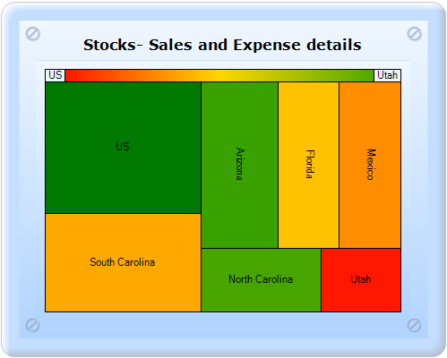

::: {style="DISPLAY: none"}
{#d2h_url_template}{#d2h_package_url style="WIDTH: 0px; DISPLAY: none; HEIGHT: 0px"}
:::

::: {.d2h_secondary_topic style="PADDING-BOTTOM: 10pt; MARGIN: 0pt; PADDING-LEFT: 0pt; PADDING-RIGHT: 0pt; PADDING-TOP: 0pt"}
#### ChartModel {#chartmodel style="tab-stops: 0pt"}

[]{style="FONT-FAMILY: 'Calibri','sans-serif'"} 

To create a HeatMap chart through ChartModel:

1.   In Controller, create an instance of **MVCChartModel**.

2.   Create an instance of **ChartSeries**, and set the SeriesType to **HeatMap**.

3.   Set the ChartSeries, ChartArea, and ChartModel properties.

4.   Return view to the corresponding View page after setting the ChartModel to the ViewData.

[]{style="FONT-FAMILY: 'Calibri','sans-serif'"} 

+-----------------------------------------------------------------------------------------------------------------------------------------------------------------------------------------------------------------------------------------------------------------+
| \[C#\]                                                                                                                                                                                                                                                          |
|                                                                                                                                                                                                                                                                 |
| [        ]{style="FONT-FAMILY: Consolas; FONT-SIZE: 9.5pt"}[public]{style="FONT-FAMILY: 'Courier New'; COLOR: blue"}[ [ActionResult]{style="COLOR: #2b91af"} SimpleChart()]{style="FONT-FAMILY: 'Courier New'"}                                                 |
|                                                                                                                                                                                                                                                                 |
| [        {            ]{style="FONT-FAMILY: 'Courier New'"}                                                                                                                                                                                                     |
|                                                                                                                                                                                                                                                                 |
| [            [MVCChartModel]{style="COLOR: #2b91af"} chartModel = [new]{style="COLOR: blue"} [MVCChartModel]{style="COLOR: #2b91af"}();]{style="FONT-FAMILY: 'Courier New'"}                                                                                    |
|                                                                                                                                                                                                                                                                 |
| [            [// Create chart series and add data points to it.]{style="COLOR: green"}]{style="FONT-FAMILY: 'Courier New'"}                                                                                                                                     |
|                                                                                                                                                                                                                                                                 |
| []{style="FONT-FAMILY: 'Courier New'"}                                                                                                                                                                                                                          |
|                                                                                                                                                                                                                                                                 |
| **[            [ChartSeries]{style="COLOR: #2b91af"} Stocks = [new]{style="COLOR: blue"} [ChartSeries]{style="COLOR: #2b91af"}([\"Stocks\"]{style="COLOR: #a31515"}, [ChartSeriesType]{style="COLOR: #2b91af"}.HeatMap);]{style="FONT-FAMILY: 'Courier New'"}** |
|                                                                                                                                                                                                                                                                 |
| **[            Stocks.Points.Add(7, 4, 10000);]{style="FONT-FAMILY: 'Courier New'"}**                                                                                                                                                                           |
|                                                                                                                                                                                                                                                                 |
| **[            Stocks.Points.Add(6, 3, 5541);]{style="FONT-FAMILY: 'Courier New'"}**                                                                                                                                                                            |
|                                                                                                                                                                                                                                                                 |
| **[            Stocks.Points.Add(5, 2, 6007);]{style="FONT-FAMILY: 'Courier New'"}**                                                                                                                                                                            |
|                                                                                                                                                                                                                                                                 |
| **[            Stocks.Points.Add(4, 2, 5022);]{style="FONT-FAMILY: 'Courier New'"}**                                                                                                                                                                            |
|                                                                                                                                                                                                                                                                 |
| **[            Stocks.Points.Add(3, 2.5, 6882);]{style="FONT-FAMILY: 'Courier New'"}**                                                                                                                                                                          |
|                                                                                                                                                                                                                                                                 |
| **[            Stocks.Points.Add(2, 1.5, 6584);]{style="FONT-FAMILY: 'Courier New'"}**                                                                                                                                                                          |
|                                                                                                                                                                                                                                                                 |
| **[            Stocks.Points.Add(1, 1, 2799);]{style="FONT-FAMILY: 'Courier New'"}**                                                                                                                                                                            |
|                                                                                                                                                                                                                                                                 |
| []{style="FONT-FAMILY: 'Courier New'"}                                                                                                                                                                                                                          |
|                                                                                                                                                                                                                                                                 |
| [            Stocks.Styles\[0\].Text = [\"US\"]{style="COLOR: #a31515"};]{style="FONT-FAMILY: 'Courier New'"}                                                                                                                                                   |
|                                                                                                                                                                                                                                                                 |
| [            Stocks.Styles\[1\].Text = [\"South Carolina\"]{style="COLOR: #a31515"};]{style="FONT-FAMILY: 'Courier New'"}                                                                                                                                       |
|                                                                                                                                                                                                                                                                 |
| [            Stocks.Styles\[2\].Text = [\"Florida\"]{style="COLOR: #a31515"};]{style="FONT-FAMILY: 'Courier New'"}                                                                                                                                              |
|                                                                                                                                                                                                                                                                 |
| [            Stocks.Styles\[3\].Text = [\"Mexico\"]{style="COLOR: #a31515"};]{style="FONT-FAMILY: 'Courier New'"}                                                                                                                                               |
|                                                                                                                                                                                                                                                                 |
| [            Stocks.Styles\[4\].Text = [\"Arizona\"]{style="COLOR: #a31515"};]{style="FONT-FAMILY: 'Courier New'"}                                                                                                                                              |
|                                                                                                                                                                                                                                                                 |
| [            Stocks.Styles\[5\].Text = [\"North Carolina\"]{style="COLOR: #a31515"};]{style="FONT-FAMILY: 'Courier New'"}                                                                                                                                       |
|                                                                                                                                                                                                                                                                 |
| [            Stocks.Styles\[6\].Text = [\"Utah\"]{style="COLOR: #a31515"};]{style="FONT-FAMILY: 'Courier New'"}                                                                                                                                                 |
|                                                                                                                                                                                                                                                                 |
| []{style="FONT-FAMILY: 'Courier New'"}                                                                                                                                                                                                                          |
|                                                                                                                                                                                                                                                                 |
| [            Stocks.Style.DisplayText = [true]{style="COLOR: blue"};]{style="FONT-FAMILY: 'Courier New'"}                                                                                                                                                       |
|                                                                                                                                                                                                                                                                 |
| [            Stocks.Style.Font.Size = 9f;]{style="FONT-FAMILY: 'Courier New'"}                                                                                                                                                                                  |
|                                                                                                                                                                                                                                                                 |
| [            chartModel.Series.Add(Stocks);]{style="FONT-FAMILY: 'Courier New'"}                                                                                                                                                                                |
|                                                                                                                                                                                                                                                                 |
| []{style="FONT-FAMILY: 'Courier New'"}                                                                                                                                                                                                                          |
|                                                                                                                                                                                                                                                                 |
| [            Stocks.ConfigItems.HeatMapItem.DisplayTitle = [true]{style="COLOR: blue"};]{style="FONT-FAMILY: 'Courier New'"}                                                                                                                                    |
|                                                                                                                                                                                                                                                                 |
| [            Stocks.ConfigItems.HeatMapItem.LowestValueColor = [Color]{style="COLOR: #2b91af"}.FromArgb(255, 23, 0);]{style="FONT-FAMILY: 'Courier New'"}                                                                                                       |
|                                                                                                                                                                                                                                                                 |
| [            Stocks.ConfigItems.HeatMapItem.HighestValueColor = [Color]{style="COLOR: #2b91af"}.FromArgb(81, 168, 0);]{style="FONT-FAMILY: 'Courier New'"}                                                                                                      |
|                                                                                                                                                                                                                                                                 |
| [            Stocks.ConfigItems.HeatMapItem.MiddleValueColor = [Color]{style="COLOR: #2b91af"}.Gold;]{style="FONT-FAMILY: 'Courier New'"}                                                                                                                       |
|                                                                                                                                                                                                                                                                 |
| [            Stocks.ConfigItems.HeatMapItem.StartText = [\"US\"]{style="COLOR: #a31515"};]{style="FONT-FAMILY: 'Courier New'"}                                                                                                                                  |
|                                                                                                                                                                                                                                                                 |
| [            Stocks.ConfigItems.HeatMapItem.EndText = [\"Utah\"]{style="COLOR: #a31515"};]{style="FONT-FAMILY: 'Courier New'"}                                                                                                                                  |
|                                                                                                                                                                                                                                                                 |
| []{style="FONT-FAMILY: 'Courier New'"}                                                                                                                                                                                                                          |
|                                                                                                                                                                                                                                                                 |
| [            chartModel.ElementsSpacing = 5;]{style="FONT-FAMILY: 'Courier New'"}                                                                                                                                                                               |
|                                                                                                                                                                                                                                                                 |
| [            chartModel.Text = [\"Stocks- Sales and Expense details\"]{style="COLOR: #a31515"};]{style="FONT-FAMILY: 'Courier New'"}                                                                                                                            |
|                                                                                                                                                                                                                                                                 |
| []{style="FONT-FAMILY: 'Courier New'"}                                                                                                                                                                                                                          |
|                                                                                                                                                                                                                                                                 |
| [            chartModel.Skins = [ChartModelSkins]{style="COLOR: #2b91af"}.Office2007Blue;]{style="FONT-FAMILY: 'Courier New'"}                                                                                                                                  |
|                                                                                                                                                                                                                                                                 |
| []{style="FONT-FAMILY: 'Courier New'"}                                                                                                                                                                                                                          |
|                                                                                                                                                                                                                                                                 |
| [            chartModel.SmoothingMode = System.Drawing.Drawing2D.[SmoothingMode]{style="COLOR: #2b91af"}.AntiAlias;]{style="FONT-FAMILY: 'Courier New'"}                                                                                                        |
|                                                                                                                                                                                                                                                                 |
| [            chartModel.BorderAppearance.SkinStyle = [ChartBorderSkinStyle]{style="COLOR: #2b91af"}.Pinned;]{style="FONT-FAMILY: 'Courier New'"}                                                                                                                |
|                                                                                                                                                                                                                                                                 |
| [                                 ]{style="FONT-FAMILY: 'Courier New'"}                                                                                                                                                                                         |
|                                                                                                                                                                                                                                                                 |
| [            chartModel.Size = [new]{style="COLOR: blue"} System.Drawing.[Size]{style="COLOR: #2b91af"}(500, 400);]{style="FONT-FAMILY: 'Courier New'"}                                                                                                         |
|                                                                                                                                                                                                                                                                 |
| [            ViewData.Model = chartModel;]{style="FONT-FAMILY: 'Courier New'"}                                                                                                                                                                                  |
|                                                                                                                                                                                                                                                                 |
| []{style="FONT-FAMILY: 'Courier New'"}                                                                                                                                                                                                                          |
|                                                                                                                                                                                                                                                                 |
| [            [return]{style="COLOR: blue"} View();]{style="FONT-FAMILY: 'Courier New'"}                                                                                                                                                                         |
|                                                                                                                                                                                                                                                                 |
| [}]{style="FONT-FAMILY: 'Courier New'"}                                                                                                                                                                                                                         |
|                                                                                                                                                                                                                                                                 |
| []{style="FONT-FAMILY: Consolas; COLOR: blue; FONT-SIZE: 9.5pt"}                                                                                                                                                                                                |
+-----------------------------------------------------------------------------------------------------------------------------------------------------------------------------------------------------------------------------------------------------------------+

[]{style="FONT-FAMILY: 'Calibri','sans-serif'"} 

5.   In the View page, invoke the ChartBuilder by using the control ID as the first argument, and convert the ViewData to **MVCChartModel** and set it as the second argument.

[      ]{style="FONT-FAMILY: 'Calibri','sans-serif'"}[]{style="FONT-FAMILY: Consolas; FONT-SIZE: 9.5pt"}

+---------------------------------------------------------------------------------------------------------------------------------------------------------------------------------------------------------------------------------------------------------------------------------------------------------+
| **View\[ASPX\]**                                                                                                                                                                                                                                                                                        |
|                                                                                                                                                                                                                                                                                                         |
|                                                                                                                                                                                                                                                                                                         |
|                                                                                                                                                                                                                                                                                                         |
| [\<%]{style="FONT-FAMILY: 'Courier New'; BACKGROUND: yellow"}[=]{style="FONT-FAMILY: 'Courier New'; COLOR: blue"}[ Html.Chart([\"SimpleChart\"]{style="COLOR: #a31515"},([MVCChartModel]{style="COLOR: #2b91af"})ViewData.Model) [%\>]{style="BACKGROUND: yellow"}]{style="FONT-FAMILY: 'Courier New'"} |
|                                                                                                                                                                                                                                                                                                         |
| []{style="FONT-FAMILY: Consolas; COLOR: blue; FONT-SIZE: 9.5pt"}                                                                                                                                                                                                                                        |
+---------------------------------------------------------------------------------------------------------------------------------------------------------------------------------------------------------------------------------------------------------------------------------------------------------+

[]{style="FONT-FAMILY: Consolas; BACKGROUND: yellow; FONT-SIZE: 9.5pt"} 

[]{style="FONT-FAMILY: Consolas; FONT-SIZE: 9.5pt"} 

+----------------------------------------------------------------------------------------------------------------------------------------------------------------------------------------------------------------------------------------------------------------------------------------------------------------------------------------------------------------------------------------------------------+
| **View\[cshtml\]**                                                                                                                                                                                                                                                                                                                                                                                       |
|                                                                                                                                                                                                                                                                                                                                                                                                          |
| [  ]{style="FONT-FAMILY: Consolas; FONT-SIZE: 9.5pt"}                                                                                                                                                                                                                                                                                                                                                    |
|                                                                                                                                                                                                                                                                                                                                                                                                          |
| [    [@(]{style="BACKGROUND: yellow"}[new]{style="COLOR: blue"} [HtmlString]{style="COLOR: #2b91af"}(]{style="FONT-FAMILY: Consolas; FONT-SIZE: 9.5pt"}[Html.Chart([\"SimpleChart\"]{style="COLOR: #a31515"},([MVCChartModel]{style="COLOR: #2b91af"})ViewData.Model)]{style="FONT-FAMILY: 'Courier New'"}[.ToString())[)]{style="BACKGROUND: yellow"}]{style="FONT-FAMILY: Consolas; FONT-SIZE: 9.5pt"} |
|                                                                                                                                                                                                                                                                                                                                                                                                          |
| []{style="FONT-FAMILY: Consolas; COLOR: blue; FONT-SIZE: 9.5pt"}                                                                                                                                                                                                                                                                                                                                         |
+----------------------------------------------------------------------------------------------------------------------------------------------------------------------------------------------------------------------------------------------------------------------------------------------------------------------------------------------------------------------------------------------------------+

[]{style="FONT-FAMILY: Consolas; BACKGROUND: yellow; FONT-SIZE: 9.5pt"} 

[]{style="FONT-FAMILY: Consolas; BACKGROUND: yellow; FONT-SIZE: 9.5pt"} 

6.   Build and run the code, to get the following output:

[]{style="FONT-FAMILY: 'Calibri','sans-serif'"} 

{border="0"}

Figure 150: Chart displaying HeatMap Series

[]{#related-topics}
:::
