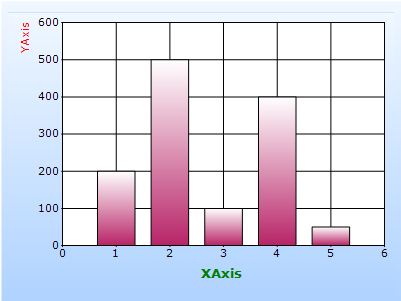

::: {style="DISPLAY: none"}
{#d2h_url_template}{#d2h_package_url style="WIDTH: 0px; DISPLAY: none; HEIGHT: 0px"}
:::

::::: {.d2h_secondary_topic style="PADDING-BOTTOM: 10pt; MARGIN: 0pt; PADDING-LEFT: 0pt; PADDING-RIGHT: 0pt; PADDING-TOP: 0pt"}
#### ChartModel {#chartmodel style="tab-stops: 0pt"}

[]{style="FONT-FAMILY: 'Calibri','sans-serif'"} 

To create an Axis Title in any chart type through ChartModel:

1.   In Controller, create an instance of **MVCChartModel**.

2.   Create an instance of **ChartSeries**, and set the SeriesType to **Line**.

3.   Set the ChartSeries, ChartArea, and ChartModel properties.

4.   Return view to the corresponding View page after setting the ChartModel to the ViewData.

 

+--------------------------------------------------------------------------------------------------------------------------------------------------------------------------------------------------------------------------------------------------------------------+
| \[C#\]                                                                                                                                                                                                                                                             |
|                                                                                                                                                                                                                                                                    |
| [        [public]{style="COLOR: blue"} [ActionResult]{style="COLOR: #2b91af"} SimpleChart()]{style="FONT-FAMILY: 'Courier New'"}                                                                                                                                   |
|                                                                                                                                                                                                                                                                    |
| [        {            ]{style="FONT-FAMILY: 'Courier New'"}                                                                                                                                                                                                        |
|                                                                                                                                                                                                                                                                    |
| [            [MVCChartModel]{style="COLOR: #2b91af"} chartModel = [new]{style="COLOR: blue"} [MVCChartModel]{style="COLOR: #2b91af"}();]{style="FONT-FAMILY: 'Courier New'"}                                                                                       |
|                                                                                                                                                                                                                                                                    |
| [            [//\-\-\-\-\-\-\-\-\-\-\-\-\-- Add the series, add the points to the series and set some stylings you want to the series \-\-\-\-\-\-\-\-\-\-\-\-\-\-\-\-\--]{style="COLOR: green"}]{style="FONT-FAMILY: 'Courier New'"}                              |
|                                                                                                                                                                                                                                                                    |
| **[            chartModel.PrimaryXAxis.Title = [\"XAxis\"]{style="COLOR: #a31515"};]{style="FONT-FAMILY: 'Courier New'"}**                                                                                                                                         |
|                                                                                                                                                                                                                                                                    |
| **[            chartModel.PrimaryXAxis.TitleColor = [Color]{style="COLOR: #2b91af"}.Green;]{style="FONT-FAMILY: 'Courier New'"}**                                                                                                                                  |
|                                                                                                                                                                                                                                                                    |
| **[            chartModel.PrimaryXAxis.TitleAlignment = [StringAlignment]{style="COLOR: #2b91af"}.Center;]{style="FONT-FAMILY: 'Courier New'"}**                                                                                                                   |
|                                                                                                                                                                                                                                                                    |
| **[            chartModel.PrimaryXAxis.Font = [new]{style="COLOR: blue"} [Font]{style="COLOR: #2b91af"}([\"Verdana\"]{style="COLOR: #a31515"}, 10, System.Drawing.[FontStyle]{style="COLOR: #2b91af"}.Bold);]{style="FONT-FAMILY: 'Courier New'"}**                |
|                                                                                                                                                                                                                                                                    |
| **[]{style="FONT-FAMILY: 'Courier New'"}**                                                                                                                                                                                                                         |
|                                                                                                                                                                                                                                                                    |
| **[            chartModel.PrimaryXAxis.Title = [\"YAxis\"]{style="COLOR: #a31515"};]{style="FONT-FAMILY: 'Courier New'"}**                                                                                                                                         |
|                                                                                                                                                                                                                                                                    |
| **[            chartModel.PrimaryXAxis.TitleColor = [Color]{style="COLOR: #2b91af"}.Red;]{style="FONT-FAMILY: 'Courier New'"}**                                                                                                                                    |
|                                                                                                                                                                                                                                                                    |
| **[            chartModel.PrimaryXAxis.TitleAlignment = [StringAlignment]{style="COLOR: #2b91af"}.Center;]{style="FONT-FAMILY: 'Courier New'"}**                                                                                                                   |
|                                                                                                                                                                                                                                                                    |
| **[]{style="FONT-FAMILY: 'Courier New'"}**                                                                                                                                                                                                                         |
|                                                                                                                                                                                                                                                                    |
| [    //\-\-\-\-\-\-\-\-\-\-\-\-- Set needed properties to chartmodel to set skin, size, legend visibility and so on   \-\-\-\-\-\-\-\-\-\-\-\-\-\-\-\-\-\-\-\-\-\-\--]{style="FONT-FAMILY: 'Courier New'; COLOR: green"}[    ]{style="FONT-FAMILY: 'Courier New'"} |
|                                                                                                                                                                                                                                                                    |
| [            ViewData.Model = chartModel;]{style="FONT-FAMILY: 'Courier New'"}                                                                                                                                                                                     |
|                                                                                                                                                                                                                                                                    |
| [            [return]{style="COLOR: blue"} View(); ]{style="FONT-FAMILY: 'Courier New'"}                                                                                                                                                                           |
|                                                                                                                                                                                                                                                                    |
| [}]{style="FONT-FAMILY: 'Courier New'"}                                                                                                                                                                                                                            |
|                                                                                                                                                                                                                                                                    |
| []{style="FONT-FAMILY: Consolas; COLOR: blue; FONT-SIZE: 9.5pt"}                                                                                                                                                                                                   |
+--------------------------------------------------------------------------------------------------------------------------------------------------------------------------------------------------------------------------------------------------------------------+

[]{style="FONT-FAMILY: Consolas; FONT-SIZE: 9.5pt"} 

5.   In the View page, invoke the ChartBuilder by using the control ID as the first argument, and convert the ViewData to **MVCChartModel** and set it as the second argument.

[]{style="FONT-FAMILY: Consolas; FONT-SIZE: 9.5pt"} 

::: {style="BORDER-BOTTOM: #c8c8c8 1pt solid; BORDER-LEFT: #c8c8c8 1pt solid; PADDING-BOTTOM: 1pt; MARGIN-TOP: 0pt; PADDING-LEFT: 4pt; PADDING-RIGHT: 4pt; MARGIN-BOTTOM: 0pt; BACKGROUND: #f0f0f0; BORDER-TOP: #c8c8c8 1pt solid; BORDER-RIGHT: #c8c8c8 1pt solid; PADDING-TOP: 1pt"}
View \[ASPX\]

[]{style="FONT-FAMILY: 'Calibri','sans-serif'"} 

[\<%]{style="FONT-FAMILY: 'Courier New'; BACKGROUND: yellow"}[=]{style="FONT-FAMILY: 'Courier New'; COLOR: blue"}[ Html.Chart([\"SimpleChart\"]{style="COLOR: #a31515"},([MVCChartModel]{style="COLOR: #2b91af"})ViewData.Model) [%\>]{style="BACKGROUND: yellow"}]{style="FONT-FAMILY: 'Courier New'"}

[]{style="FONT-FAMILY: 'Courier New'; BACKGROUND: yellow"} 
:::

[]{style="FONT-FAMILY: Consolas; FONT-SIZE: 9.5pt"} 

[]{style="FONT-FAMILY: Consolas; FONT-SIZE: 9.5pt"} 

::: {style="BORDER-BOTTOM: #c8c8c8 1pt solid; BORDER-LEFT: #c8c8c8 1pt solid; PADDING-BOTTOM: 1pt; MARGIN-TOP: 0pt; PADDING-LEFT: 4pt; PADDING-RIGHT: 4pt; MARGIN-BOTTOM: 0pt; BACKGROUND: #f0f0f0; BORDER-TOP: #c8c8c8 1pt solid; BORDER-RIGHT: #c8c8c8 1pt solid; PADDING-TOP: 1pt"}
View \[cshtml\]

 

[@(]{style="FONT-FAMILY: 'Courier New'; BACKGROUND: yellow"}[new]{style="FONT-FAMILY: Consolas; COLOR: blue; FONT-SIZE: 9.5pt"}[ [HtmlString]{style="COLOR: #2b91af"}]{style="FONT-FAMILY: Consolas; FONT-SIZE: 9.5pt"}[(Html.Chart([\"SimpleChart\"]{style="COLOR: #a31515"},([MVCChartModel]{style="COLOR: #2b91af"})ViewData.Model).ToString())[)]{style="BACKGROUND: yellow"}]{style="FONT-FAMILY: 'Courier New'"}

[]{style="FONT-FAMILY: 'Calibri','sans-serif'"} 

[]{style="FONT-FAMILY: 'Courier New'; BACKGROUND: yellow"} 
:::

[]{style="FONT-FAMILY: Consolas; BACKGROUND: yellow; FONT-SIZE: 9.5pt"} 

[]{style="FONT-FAMILY: Consolas; BACKGROUND: yellow; FONT-SIZE: 9.5pt"} 

6.   Build and run the code, to get the following output:

[]{style="FONT-FAMILY: Consolas; BACKGROUND: yellow; FONT-SIZE: 9.5pt"} 

{border="0"}

Figure 277: Customized Axis Titles

[]{#related-topics}
:::::
