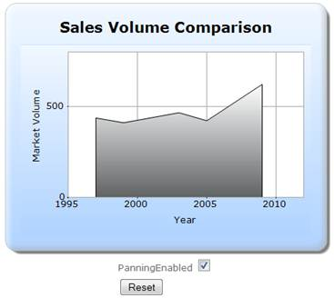
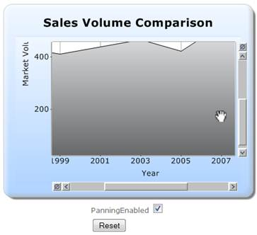

::: {style="DISPLAY: none"}
{#d2h_url_template}{#d2h_package_url style="WIDTH: 0px; DISPLAY: none; HEIGHT: 0px"}
:::

::::::::: {.d2h_secondary_topic style="PADDING-BOTTOM: 10pt; MARGIN: 0pt; PADDING-LEFT: 0pt; PADDING-RIGHT: 0pt; PADDING-TOP: 0pt"}
##### ChartModel {#chartmodel style="tab-stops: 0pt"}

**[]{style="FONT-FAMILY: 'Calibri','sans-serif'"}** 

The steps to create a chart with the panning feature through ChartModel are as follows:

Step 1:

Controller:

Add the code displayed below in the HomeController.cs file.

::: {style="BORDER-BOTTOM: #c8c8c8 1pt solid; BORDER-LEFT: #c8c8c8 1pt solid; PADDING-BOTTOM: 1pt; MARGIN-TOP: 0pt; PADDING-LEFT: 4pt; PADDING-RIGHT: 4pt; MARGIN-BOTTOM: 0pt; BACKGROUND: #f0f0f0; BORDER-TOP: #c8c8c8 1pt solid; BORDER-RIGHT: #c8c8c8 1pt solid; PADDING-TOP: 1pt"}
[using]{style="FONT-FAMILY: 'Courier New'; COLOR: blue"}[ System;]{style="FONT-FAMILY: 'Courier New'"}

[using]{style="FONT-FAMILY: 'Courier New'; COLOR: blue"}[ System.Collections.Generic;]{style="FONT-FAMILY: 'Courier New'"}

[using]{style="FONT-FAMILY: 'Courier New'; COLOR: blue"}[ System.Linq;]{style="FONT-FAMILY: 'Courier New'"}

[using]{style="FONT-FAMILY: 'Courier New'; COLOR: blue"}[ System.Web;]{style="FONT-FAMILY: 'Courier New'"}

[using]{style="FONT-FAMILY: 'Courier New'; COLOR: blue"}[ System.Web.Mvc;]{style="FONT-FAMILY: 'Courier New'"}

[using]{style="FONT-FAMILY: 'Courier New'; COLOR: blue"}[ Syncfusion.Mvc.Shared;]{style="FONT-FAMILY: 'Courier New'"}

[using]{style="FONT-FAMILY: 'Courier New'; COLOR: blue"}[ Syncfusion.Mvc.Chart;]{style="FONT-FAMILY: 'Courier New'"}

[using]{style="FONT-FAMILY: 'Courier New'; COLOR: blue"}[ Syncfusion.Windows.Forms.Chart;]{style="FONT-FAMILY: 'Courier New'"}

[using]{style="FONT-FAMILY: 'Courier New'; COLOR: blue"}[ Syncfusion.Drawing;]{style="FONT-FAMILY: 'Courier New'"}

[using]{style="FONT-FAMILY: 'Courier New'; COLOR: blue"}[ System.Drawing;]{style="FONT-FAMILY: 'Courier New'"}

[]{style="FONT-FAMILY: 'Courier New'"} 

[namespace]{style="FONT-FAMILY: 'Courier New'; COLOR: blue"}[ Sample.Controllers]{style="FONT-FAMILY: 'Courier New'"}

[{]{style="FONT-FAMILY: 'Courier New'"}

[    \[[HandleError]{style="COLOR: #2b91af"}\]]{style="FONT-FAMILY: 'Courier New'"}

[    [public]{style="COLOR: blue"} [class]{style="COLOR: blue"} [HomeController]{style="COLOR: #2b91af"} : [Controller]{style="COLOR: #2b91af"}]{style="FONT-FAMILY: 'Courier New'"}

[    {]{style="FONT-FAMILY: 'Courier New'"}

[        [bool]{style="COLOR: blue"} PanningEnabled = [true]{style="COLOR: blue"};]{style="FONT-FAMILY: 'Courier New'"}

[        [public]{style="COLOR: blue"} [ActionResult]{style="COLOR: #2b91af"} Index()]{style="FONT-FAMILY: 'Courier New'"}

[        {]{style="FONT-FAMILY: 'Courier New'"}

[            [MVCChartModel]{style="COLOR: #2b91af"} chartModel = [new]{style="COLOR: blue"} [MVCChartModel]{style="COLOR: #2b91af"}();]{style="FONT-FAMILY: 'Courier New'"}

[            InitializeChart(chartModel);]{style="FONT-FAMILY: 'Courier New'"}

[            CustomizeChartAppearance(chartModel);]{style="FONT-FAMILY: 'Courier New'"}

[            ViewData\[[\"ChartModel\"]{style="COLOR: #a31515"}\] = chartModel;]{style="FONT-FAMILY: 'Courier New'"}

[            [return]{style="COLOR: blue"} View();]{style="FONT-FAMILY: 'Courier New'"}

[        }]{style="FONT-FAMILY: 'Courier New'"}

[]{style="FONT-FAMILY: 'Courier New'"} 

[        \[[AcceptVerbs]{style="COLOR: #2b91af"}([HttpVerbs]{style="COLOR: #2b91af"}.Post)\]]{style="FONT-FAMILY: 'Courier New'"}

[        ]{style="FONT-FAMILY: 'Calibri','sans-serif'"}[public]{style="FONT-FAMILY: 'Courier New'; COLOR: blue"}[ [ActionResult]{style="COLOR: #2b91af"} Index([MVCChartModel]{style="COLOR: #2b91af"} chartModel, [ChartParams]{style="COLOR: #2b91af"} param, [bool]{style="COLOR: blue"} EnablePanning)]{style="FONT-FAMILY: 'Courier New'"}

[        {]{style="FONT-FAMILY: 'Courier New'"}

[            PanningEnabled = EnablePanning;]{style="FONT-FAMILY: 'Courier New'"}

[            InitializeChart(chartModel);]{style="FONT-FAMILY: 'Courier New'"}

[            CustomizeChartAppearance(chartModel);]{style="FONT-FAMILY: 'Courier New'"}

[            ViewData\[[\"ChartModel\"]{style="COLOR: #a31515"}\] = chartModel;]{style="FONT-FAMILY: 'Courier New'"}

[            [if]{style="COLOR: blue"}(param.ChartAction== [ChartHtmlAction]{style="COLOR: #2b91af"}.RegionZoom)]{style="FONT-FAMILY: 'Courier New'"}

[                [return]{style="COLOR: blue"} chartModel.ChartActionResult(param);]{style="FONT-FAMILY: 'Courier New'"}

[            [else]{style="COLOR: blue"}]{style="FONT-FAMILY: 'Courier New'"}

[                [return]{style="COLOR: blue"} PartialView([\"PartialView\"]{style="COLOR: #a31515"}, [this]{style="COLOR: blue"}.ViewData);]{style="FONT-FAMILY: 'Courier New'"}

[]{style="FONT-FAMILY: 'Courier New'"} 

[        }]{style="FONT-FAMILY: 'Courier New'"}

[]{style="FONT-FAMILY: 'Courier New'"} 

[        [///]{style="COLOR: gray"}[ ]{style="COLOR: green"}[\<summary\>]{style="COLOR: gray"}]{style="FONT-FAMILY: 'Courier New'"}

[        [///]{style="COLOR: gray"}[ Initializes the chart data and enables zooming.]{style="COLOR: green"}]{style="FONT-FAMILY: 'Courier New'"}

[        [///]{style="COLOR: gray"}[ ]{style="COLOR: green"}[\</summary\>]{style="COLOR: gray"}]{style="FONT-FAMILY: 'Courier New'"}

[        [///]{style="COLOR: gray"}[ ]{style="COLOR: green"}[\<param name=\"chartModel\"\>]{style="COLOR: gray"}[The chart model.]{style="COLOR: green"}[\</param\>]{style="COLOR: gray"}]{style="FONT-FAMILY: 'Courier New'"}

[        [protected]{style="COLOR: blue"} [void]{style="COLOR: blue"} InitializeChart([MVCChartModel]{style="COLOR: #2b91af"} chartModel)]{style="FONT-FAMILY: 'Courier New'"}

[        {]{style="FONT-FAMILY: 'Courier New'"}

[            chartModel.Series.Clear();]{style="FONT-FAMILY: 'Courier New'"}

[            chartModel.Size = [new]{style="COLOR: blue"} [Size]{style="COLOR: #2b91af"}(450, 350);]{style="FONT-FAMILY: 'Courier New'"}

[]{style="FONT-FAMILY: 'Courier New'"} 

[            [//Enabling X-Axis and Y-Axis Zooming]{style="COLOR: green"}]{style="FONT-FAMILY: 'Courier New'"}

[            chartModel.EnableXZooming = [true]{style="COLOR: blue"};]{style="FONT-FAMILY: 'Courier New'"}

[            chartModel.EnableYZooming = [true]{style="COLOR: blue"};]{style="FONT-FAMILY: 'Courier New'"}

[]{style="FONT-FAMILY: 'Courier New'"} 

[            [//Enabling Panning]{style="COLOR: green"}]{style="FONT-FAMILY: 'Courier New'"}

[            [if]{style="COLOR: blue"} (PanningEnabled)]{style="FONT-FAMILY: 'Courier New'"}

[            {]{style="FONT-FAMILY: 'Courier New'"}

[                chartModel.PrimaryXAxis.ZoomActions = [ChartZoomingAction]{style="COLOR: #2b91af"}.Panning;]{style="FONT-FAMILY: 'Courier New'"}

[                chartModel.PrimaryYAxis.ZoomActions = [ChartZoomingAction]{style="COLOR: #2b91af"}.Panning;]{style="FONT-FAMILY: 'Courier New'"}

[            }]{style="FONT-FAMILY: 'Courier New'"}

[]{style="FONT-FAMILY: 'Courier New'"} 

[            [//Creating Chart series]{style="COLOR: green"}]{style="FONT-FAMILY: 'Courier New'"}

[            [ChartSeries]{style="COLOR: #2b91af"} series;]{style="FONT-FAMILY: 'Courier New'"}

[            series = [new]{style="COLOR: blue"} [ChartSeries]{style="COLOR: #2b91af"}([\"Saab\"]{style="COLOR: #a31515"}, [ChartSeriesType]{style="COLOR: #2b91af"}.Area);]{style="FONT-FAMILY: 'Courier New'"}

[            series.Text = series.Name;]{style="FONT-FAMILY: 'Courier New'"}

[]{style="FONT-FAMILY: 'Courier New'"} 

[            [//Adding Chart Series Points]{style="COLOR: green"}]{style="FONT-FAMILY: 'Courier New'"}

[            series.Points.Add(1997, 437);]{style="FONT-FAMILY: 'Courier New'"}

[            series.Points.Add(1999, 411);]{style="FONT-FAMILY: 'Courier New'"}

[            series.Points.Add(2003, 466);]{style="FONT-FAMILY: 'Courier New'"}

[            series.Points.Add(2005, 422);]{style="FONT-FAMILY: 'Courier New'"}

[            series.Points.Add(2009, 622);]{style="FONT-FAMILY: 'Courier New'"}

[]{style="FONT-FAMILY: 'Courier New'"} 

[            [//Adding the chart series in the chart model]{style="COLOR: green"}]{style="FONT-FAMILY: 'Courier New'"}

[            chartModel.Series.Add(series);]{style="FONT-FAMILY: 'Courier New'"}

[            chartModel.PrimaryYAxis.GridLineType.ForeColor = [Color]{style="COLOR: #2b91af"}.DarkGray;]{style="FONT-FAMILY: 'Courier New'"}

[            chartModel.PrimaryXAxis.LineType.ForeColor = [Color]{style="COLOR: #2b91af"}.DarkGray;]{style="FONT-FAMILY: 'Courier New'"}

[]{style="FONT-FAMILY: 'Courier New'"} 

[            [//Specifying the chart x-axis and y-axis titles]{style="COLOR: green"}]{style="FONT-FAMILY: 'Courier New'"}

[            chartModel.PrimaryXAxis.Title = [\" Year \"]{style="COLOR: #a31515"};]{style="FONT-FAMILY: 'Courier New'"}

[            chartModel.PrimaryYAxis.Title = [\"Market Volume \"]{style="COLOR: #a31515"};]{style="FONT-FAMILY: 'Courier New'"}

[            [//Adding title for the chart]{style="COLOR: green"}]{style="FONT-FAMILY: 'Courier New'"}

[            chartModel.Text = [\"Sales Volume Comparison\"]{style="COLOR: #a31515"};]{style="FONT-FAMILY: 'Courier New'"}

[            chartModel.Font = [new]{style="COLOR: blue"} [Font]{style="COLOR: #2b91af"}([\"Verdana\"]{style="COLOR: #a31515"}, 12, [FontStyle]{style="COLOR: #2b91af"}.Bold);]{style="FONT-FAMILY: 'Courier New'"}

[]{style="FONT-FAMILY: 'Courier New'"} 

[            [//Setting the maximum and minimum range values for x-axis and y-axis]{style="COLOR: green"}]{style="FONT-FAMILY: 'Courier New'"}

[            chartModel.PrimaryYAxis.Range = [new]{style="COLOR: blue"} [MinMaxInfo]{style="COLOR: #2b91af"}(0, 800, 500);]{style="FONT-FAMILY: 'Courier New'"}

[            chartModel.PrimaryXAxis.Range = [new]{style="COLOR: blue"} [MinMaxInfo]{style="COLOR: #2b91af"}(1995, 2012, 5);]{style="FONT-FAMILY: 'Courier New'"}

[]{style="FONT-FAMILY: 'Courier New'"} 

[        }]{style="FONT-FAMILY: 'Courier New'"}

[]{style="FONT-FAMILY: 'Courier New'"} 

[        [///]{style="COLOR: gray"}[ ]{style="COLOR: green"}[\<summary\>]{style="COLOR: gray"}]{style="FONT-FAMILY: 'Courier New'"}

[        [///]{style="COLOR: gray"}[ Customizing the chart appearance]{style="COLOR: green"}]{style="FONT-FAMILY: 'Courier New'"}

[        [///]{style="COLOR: gray"}[ ]{style="COLOR: green"}[\</summary\>]{style="COLOR: gray"}]{style="FONT-FAMILY: 'Courier New'"}

[        [///]{style="COLOR: gray"}[ ]{style="COLOR: green"}[\<param name=\"chartModel\"\>]{style="COLOR: gray"}[The chart model.]{style="COLOR: green"}[\</param\>]{style="COLOR: gray"}]{style="FONT-FAMILY: 'Courier New'"}

[        [private]{style="COLOR: blue"} [void]{style="COLOR: blue"} CustomizeChartAppearance([MVCChartModel]{style="COLOR: #2b91af"} chartModel)]{style="FONT-FAMILY: 'Courier New'"}

[        {]{style="FONT-FAMILY: 'Courier New'"}

[            [//Setting the border appearance]{style="COLOR: green"}]{style="FONT-FAMILY: 'Courier New'"}

[            chartModel.BorderAppearance.SkinStyle = [ChartBorderSkinStyle]{style="COLOR: #2b91af"}.Emboss;]{style="FONT-FAMILY: 'Courier New'"}

[            [//Setting the skins]{style="COLOR: green"}]{style="FONT-FAMILY: 'Courier New'"}

[            chartModel.Skins = [ChartModelSkins]{style="COLOR: #2b91af"}.Office2007Blue;]{style="FONT-FAMILY: 'Courier New'"}

[            [//Setting the series skins]{style="COLOR: green"}]{style="FONT-FAMILY: 'Courier New'"}

[            chartModel.ChartSeriesSkins = [ChartSeriesSkins]{style="COLOR: #2b91af"}.GrayScale;]{style="FONT-FAMILY: 'Courier New'"}

[            ]{style="FONT-FAMILY: 'Courier New'"}

[        }]{style="FONT-FAMILY: 'Courier New'"}

[    }]{style="FONT-FAMILY: 'Courier New'"}

[}]{style="FONT-FAMILY: 'Courier New'"}
:::

[]{style="FONT-FAMILY: 'Calibri','sans-serif'"} 

Step 2:

View:

Add the code displayed below in the Index.aspx file.

[]{style="FONT-FAMILY: 'Calibri','sans-serif'"} 

::: {style="BORDER-BOTTOM: #c8c8c8 1pt solid; BORDER-LEFT: #c8c8c8 1pt solid; PADDING-BOTTOM: 1pt; MARGIN-TOP: 0pt; PADDING-LEFT: 4pt; PADDING-RIGHT: 4pt; MARGIN-BOTTOM: 0pt; BACKGROUND: #f0f0f0; BORDER-TOP: #c8c8c8 1pt solid; BORDER-RIGHT: #c8c8c8 1pt solid; PADDING-TOP: 1pt"}
View \[ASPX\]

[]{style="FONT-FAMILY: 'Courier New'; BACKGROUND: yellow"} 

[\<%]{style="FONT-FAMILY: 'Courier New'; BACKGROUND: yellow"}[@]{style="FONT-FAMILY: 'Courier New'; COLOR: blue"}[ [Page]{style="COLOR: #a31515"} [Language]{style="COLOR: red"}[=\"C#\"]{style="COLOR: blue"} [MasterPageFile]{style="COLOR: red"}[=\"\~/Views/Shared/Site.Master\"]{style="COLOR: blue"} [Inherits]{style="COLOR: red"}[=\"System.Web.Mvc.ViewPage\"]{style="COLOR: blue"} [%\>]{style="BACKGROUND: yellow"}]{style="FONT-FAMILY: 'Courier New'"}

[]{style="FONT-FAMILY: 'Courier New'; BACKGROUND: yellow"} 

[\<]{style="FONT-FAMILY: 'Courier New'; COLOR: blue"}[asp]{style="FONT-FAMILY: 'Courier New'; COLOR: #a31515"}[:]{style="FONT-FAMILY: 'Courier New'; COLOR: blue"}[Content]{style="FONT-FAMILY: 'Courier New'; COLOR: #a31515"}[ [ID]{style="COLOR: red"}[=\"Content1\"]{style="COLOR: blue"} [ContentPlaceHolderID]{style="COLOR: red"}[=\"TitleContent\"]{style="COLOR: blue"} [runat]{style="COLOR: red"}[=\"server\"\>]{style="COLOR: blue"}]{style="FONT-FAMILY: 'Courier New'"}

[    Chart Zooming]{style="FONT-FAMILY: 'Courier New'"}

[\</]{style="FONT-FAMILY: 'Courier New'; COLOR: blue"}[asp]{style="FONT-FAMILY: 'Courier New'; COLOR: #a31515"}[:]{style="FONT-FAMILY: 'Courier New'; COLOR: blue"}[Content]{style="FONT-FAMILY: 'Courier New'; COLOR: #a31515"}[\>]{style="FONT-FAMILY: 'Courier New'; COLOR: blue"}

[\<]{style="FONT-FAMILY: 'Courier New'; COLOR: blue"}[asp]{style="FONT-FAMILY: 'Courier New'; COLOR: #a31515"}[:]{style="FONT-FAMILY: 'Courier New'; COLOR: blue"}[Content]{style="FONT-FAMILY: 'Courier New'; COLOR: #a31515"}[ [ID]{style="COLOR: red"}[=\"Content2\"]{style="COLOR: blue"} [ContentPlaceHolderID]{style="COLOR: red"}[=\"MainContent\"]{style="COLOR: blue"} [runat]{style="COLOR: red"}[=\"server\"\>]{style="COLOR: blue"}]{style="FONT-FAMILY: 'Courier New'"}

[    [\<%]{style="BACKGROUND: yellow"}[\--Rendering the Chart Control through partial view\--]{style="COLOR: green"}[%\>]{style="BACKGROUND: yellow"}]{style="FONT-FAMILY: 'Courier New'"}

[    [\<]{style="COLOR: blue"}[div]{style="COLOR: #a31515"} [id]{style="COLOR: red"}[=\"Chart\"\>]{style="COLOR: blue"}]{style="FONT-FAMILY: 'Courier New'"}

[       [\<%]{style="BACKGROUND: yellow"}Html.RenderPartial([\"PartialView\"]{style="COLOR: #a31515"}, [this]{style="COLOR: blue"}.ViewData); [%\>]{style="BACKGROUND: yellow"}]{style="FONT-FAMILY: 'Courier New'"}

[    [\</]{style="COLOR: blue"}[div]{style="COLOR: #a31515"}[\>]{style="COLOR: blue"}]{style="FONT-FAMILY: 'Courier New'"}

[    [\<%]{style="BACKGROUND: yellow"}[using]{style="COLOR: blue"} (Ajax.BeginFormExt([\"Index\"]{style="COLOR: #a31515"}, [new]{style="COLOR: blue"} [AjaxOptions]{style="COLOR: #2b91af"}() { UpdateTargetId = [\"Chart\"]{style="COLOR: #a31515"}}))]{style="FONT-FAMILY: 'Courier New'"}

[      { [%\>]{style="BACKGROUND: yellow"}]{style="FONT-FAMILY: 'Courier New'"}

[    [\<%]{style="BACKGROUND: yellow"}[=]{style="COLOR: blue"}Html.CheckBox([\"EnablePanning\"]{style="COLOR: #a31515"}, [true]{style="COLOR: blue"})[%\>]{style="BACKGROUND: yellow"}]{style="FONT-FAMILY: 'Courier New'"}

[    [\<]{style="COLOR: blue"}[input]{style="COLOR: #a31515"} [type]{style="COLOR: red"}[=\"submit\"]{style="COLOR: blue"} [value]{style="COLOR: red"}[=\"Reset\"]{style="COLOR: blue"} [/\>]{style="COLOR: blue"}]{style="FONT-FAMILY: 'Courier New'"}

[    [\<%]{style="BACKGROUND: yellow"}} [%\>]{style="BACKGROUND: yellow"}]{style="FONT-FAMILY: 'Courier New'"}

[\</]{style="FONT-FAMILY: 'Courier New'; COLOR: blue"}[asp]{style="FONT-FAMILY: 'Courier New'; COLOR: #a31515"}[:]{style="FONT-FAMILY: 'Courier New'; COLOR: blue"}[Content]{style="FONT-FAMILY: 'Courier New'; COLOR: #a31515"}[\>]{style="FONT-FAMILY: 'Courier New'; COLOR: blue"}
:::

 

::: {style="BORDER-BOTTOM: #c8c8c8 1pt solid; BORDER-LEFT: #c8c8c8 1pt solid; PADDING-BOTTOM: 1pt; MARGIN-TOP: 0pt; PADDING-LEFT: 4pt; PADDING-RIGHT: 4pt; MARGIN-BOTTOM: 0pt; BACKGROUND: #f0f0f0; BORDER-TOP: #c8c8c8 1pt solid; BORDER-RIGHT: #c8c8c8 1pt solid; PADDING-TOP: 1pt"}
[View\[cshtml\]]{style="FONT-FAMILY: 'Courier New'"}

[]{style="FONT-FAMILY: 'Courier New'; BACKGROUND: yellow"} 

[\@{]{style="FONT-FAMILY: 'Courier New'; BACKGROUND: yellow"}

[]{style="FONT-FAMILY: 'Courier New'; BACKGROUND: yellow"} 

[Layout=\"\~/Views/Shared/\_Layout.cshtml\";]{style="FONT-FAMILY: 'Courier New'"}

[ViewBag.Title=" Chart Zooming";]{style="FONT-FAMILY: 'Courier New'"}

[}]{style="FONT-FAMILY: 'Courier New'; BACKGROUND: yellow"}

[]{style="FONT-FAMILY: 'Courier New'; COLOR: blue"} 

[\<]{style="FONT-FAMILY: 'Courier New'; COLOR: blue"}[div]{style="FONT-FAMILY: 'Courier New'; COLOR: #a31515"}[\>]{style="FONT-FAMILY: 'Courier New'; COLOR: blue"}

[]{style="FONT-FAMILY: 'Courier New'; COLOR: blue"} 

[\<%]{style="FONT-FAMILY: 'Courier New'; BACKGROUND: yellow"}[\--Rendering the Chart Control through partial view\--]{style="FONT-FAMILY: 'Courier New'; COLOR: green"}[\*@]{style="FONT-FAMILY: 'Courier New'; BACKGROUND: yellow"}

[\<]{style="FONT-FAMILY: 'Courier New'; COLOR: blue"}[div]{style="FONT-FAMILY: 'Courier New'; COLOR: #a31515"}[ [id]{style="COLOR: red"}[=\"Chart\"\>]{style="COLOR: blue"}]{style="FONT-FAMILY: 'Courier New'"}

[       [@]{style="BACKGROUND: yellow"}Html.RenderPartial([\"PartialView\"]{style="COLOR: #a31515"}, [this]{style="COLOR: blue"}.ViewData)]{style="FONT-FAMILY: 'Courier New'"}

[    [\</]{style="COLOR: blue"}[div]{style="COLOR: #a31515"}[\>]{style="COLOR: blue"}]{style="FONT-FAMILY: 'Courier New'"}

[    [@]{style="BACKGROUND: yellow"}[using]{style="COLOR: blue"} (Ajax.BeginFormExt([\"Index\"]{style="COLOR: #a31515"}, [new]{style="COLOR: blue"} [AjaxOptions]{style="COLOR: #2b91af"}() { UpdateTargetId = [\"Chart\"]{style="COLOR: #a31515"}}))]{style="FONT-FAMILY: 'Courier New'"}

[      {[]{style="BACKGROUND: yellow"}]{style="FONT-FAMILY: 'Courier New'"}

[    [@]{style="BACKGROUND: yellow"}Html.CheckBox([\"EnablePanning\"]{style="COLOR: #a31515"}, [true]{style="COLOR: blue"})[]{style="BACKGROUND: yellow"}]{style="FONT-FAMILY: 'Courier New'"}

[    [\<]{style="COLOR: blue"}[input]{style="COLOR: #a31515"} [type]{style="COLOR: red"}[=\"submit\"]{style="COLOR: blue"} [value]{style="COLOR: red"}[=\"Reset\"]{style="COLOR: blue"} [/\>]{style="COLOR: blue"}]{style="FONT-FAMILY: 'Courier New'"}

[    } []{style="BACKGROUND: yellow"}]{style="FONT-FAMILY: 'Courier New'"}

[\</]{style="FONT-FAMILY: 'Courier New'; COLOR: blue"}[div]{style="FONT-FAMILY: 'Courier New'; COLOR: #a31515"}[\>]{style="FONT-FAMILY: 'Courier New'; COLOR: blue"}
:::

 

 

 

Step 3:

PartialView:

Create a Partial View named **"PartialView.ascx"**, and add the code displayed below in it.

 

::: {style="BORDER-BOTTOM: #c8c8c8 1pt solid; BORDER-LEFT: #c8c8c8 1pt solid; PADDING-BOTTOM: 1pt; MARGIN-TOP: 0pt; PADDING-LEFT: 4pt; PADDING-RIGHT: 4pt; MARGIN-BOTTOM: 0pt; BACKGROUND: #f0f0f0; BORDER-TOP: #c8c8c8 1pt solid; BORDER-RIGHT: #c8c8c8 1pt solid; PADDING-TOP: 1pt"}
View \[ASPX\]

[]{style="FONT-FAMILY: 'Courier New'; BACKGROUND: yellow"} 

[\<%]{style="FONT-FAMILY: 'Courier New'; BACKGROUND: yellow"}[@]{style="FONT-FAMILY: 'Courier New'; COLOR: blue"}[ [Control]{style="COLOR: #a31515"} [Language]{style="COLOR: red"}[=\"C#\"]{style="COLOR: blue"} [Inherits]{style="COLOR: red"}[=\"System.Web.Mvc.ViewUserControl\"]{style="COLOR: blue"} [%\>]{style="BACKGROUND: yellow"}]{style="FONT-FAMILY: 'Courier New'"}

[\<%]{style="FONT-FAMILY: 'Courier New'; BACKGROUND: yellow"}[\--Rendering the Chart Control\--]{style="FONT-FAMILY: 'Courier New'; COLOR: green"}[%\>]{style="FONT-FAMILY: 'Courier New'; BACKGROUND: yellow"}

[\<%]{style="FONT-FAMILY: 'Courier New'; BACKGROUND: yellow"}[=]{style="FONT-FAMILY: 'Courier New'; COLOR: blue"}[Html.Chart([\"chart_Model\"]{style="COLOR: #a31515"},([MVCChartModel]{style="COLOR: #2b91af"})ViewData\[[\"ChartModel\"]{style="COLOR: #a31515"}\])[%\>]{style="BACKGROUND: yellow"}]{style="FONT-FAMILY: 'Courier New'"}

[]{style="FONT-FAMILY: 'Courier New'"} 
:::

 

::: {style="BORDER-BOTTOM: #c8c8c8 1pt solid; BORDER-LEFT: #c8c8c8 1pt solid; PADDING-BOTTOM: 1pt; MARGIN-TOP: 0pt; PADDING-LEFT: 4pt; PADDING-RIGHT: 4pt; MARGIN-BOTTOM: 0pt; BACKGROUND: #f0f0f0; BORDER-TOP: #c8c8c8 1pt solid; BORDER-RIGHT: #c8c8c8 1pt solid; PADDING-TOP: 1pt"}
View \[cshtml\]

[]{style="FONT-FAMILY: 'Courier New'; BACKGROUND: yellow"} 

[@\*]{style="FONT-FAMILY: 'Courier New'; BACKGROUND: yellow"}[\--Rendering the Chart Control\--]{style="FONT-FAMILY: 'Courier New'; COLOR: green"}[\*@]{style="FONT-FAMILY: 'Courier New'; BACKGROUND: yellow"}

[]{style="FONT-FAMILY: 'Courier New'; BACKGROUND: yellow"} 

[@(]{style="FONT-FAMILY: 'Courier New'; BACKGROUND: yellow"}[new]{style="FONT-FAMILY: Consolas; COLOR: blue; FONT-SIZE: 9.5pt"}[ [HtmlString]{style="COLOR: #2b91af"}]{style="FONT-FAMILY: Consolas; FONT-SIZE: 9.5pt"}[  ]{style="FONT-FAMILY: 'Courier New'; COLOR: blue"}[(Html.Chart([\"chart_Model\"]{style="COLOR: #a31515"},([MVCChartModel]{style="COLOR: #2b91af"})ViewData\[[\"ChartModel\"]{style="COLOR: #a31515"}\]).ToString())[)]{style="BACKGROUND: yellow"}]{style="FONT-FAMILY: 'Courier New'"}

[]{style="FONT-FAMILY: 'Courier New'; BACKGROUND: yellow"} 
:::

Step 4:

Run the code, to get the following output:

[]{style="FONT-FAMILY: 'Calibri','sans-serif'"} 

{border="0"}

Figure 322: Before Zooming

[]{style="FONT-FAMILY: 'Calibri','sans-serif'"} 

[]{style="FONT-FAMILY: 'Calibri','sans-serif'"} 

[]{style="FONT-FAMILY: 'Calibri','sans-serif'"} 

{border="0"}

Figure 323: After Zooming - Panning Enabled

[]{style="FONT-FAMILY: 'Calibri','sans-serif'"} 

::: {style="BORDER-BOTTOM: windowtext 1pt solid; BORDER-LEFT: medium none; PADDING-BOTTOM: 1pt; MARGIN-TOP: 9pt; PADDING-LEFT: 0pt; PADDING-RIGHT: 0pt; MARGIN-BOTTOM: 9pt; BORDER-TOP: windowtext 1pt solid; BORDER-RIGHT: medium none; PADDING-TOP: 1pt"}
{border="0"}Note: In this sample, to enable and disable panning, check and uncheck the PanningEnabled checkbox respectively, click Reset, to reset the chart, and zoom by selecting the area inside the chart.
:::

[]{#related-topics}
:::::::::
