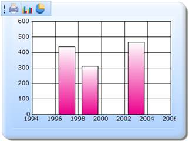

::: {style="DISPLAY: none"}
{#d2h_url_template}{#d2h_package_url style="WIDTH: 0px; DISPLAY: none; HEIGHT: 0px"}
:::

:::::: {.d2h_secondary_topic style="PADDING-BOTTOM: 10pt; MARGIN: 0pt; PADDING-LEFT: 0pt; PADDING-RIGHT: 0pt; PADDING-TOP: 0pt"}
##### ChartModel {#chartmodel style="tab-stops: 0pt"}

[]{style="FONT-FAMILY: 'Calibri','sans-serif'"} 

The steps to customize the ToolBar through ChartModel are as follows:

Step 1:

View:

Add the code displayed below in the view.

::: {style="BORDER-BOTTOM: #c8c8c8 1pt solid; BORDER-LEFT: #c8c8c8 1pt solid; PADDING-BOTTOM: 1pt; MARGIN-TOP: 0pt; PADDING-LEFT: 4pt; PADDING-RIGHT: 4pt; MARGIN-BOTTOM: 0pt; BACKGROUND: #f0f0f0; BORDER-TOP: #c8c8c8 1pt solid; BORDER-RIGHT: #c8c8c8 1pt solid; PADDING-TOP: 1pt"}
[View\[ASPX\]]{style="FONT-FAMILY: 'Courier New'"}

[]{style="FONT-FAMILY: 'Courier New'; BACKGROUND: yellow"} 

[\<%]{style="FONT-FAMILY: 'Courier New'; BACKGROUND: yellow"}[\--Rendering the Chart COntrol\--]{style="FONT-FAMILY: 'Courier New'; COLOR: green"}[%\>]{style="FONT-FAMILY: 'Courier New'; BACKGROUND: yellow"}

[  ]{style="FONT-FAMILY: 'Courier New'"}

[        [\<%]{style="BACKGROUND: yellow"}[=]{style="COLOR: blue"} Html.Chart([\"ChartModel\"]{style="COLOR: #a31515"},([MVCChartModel]{style="COLOR: #2b91af"})ViewData\[[\"ChartModel\"]{style="COLOR: #a31515"}\]) [%\>]{style="BACKGROUND: yellow"}]{style="FONT-FAMILY: 'Courier New'"}**[]{style="FONT-FAMILY: 'Courier New'"}**
:::

 

 

::: {style="BORDER-BOTTOM: #c8c8c8 1pt solid; BORDER-LEFT: #c8c8c8 1pt solid; PADDING-BOTTOM: 1pt; MARGIN-TOP: 0pt; PADDING-LEFT: 4pt; PADDING-RIGHT: 4pt; MARGIN-BOTTOM: 0pt; BACKGROUND: #f0f0f0; BORDER-TOP: #c8c8c8 1pt solid; BORDER-RIGHT: #c8c8c8 1pt solid; PADDING-TOP: 1pt"}
View \[cshtml\]

[]{style="FONT-FAMILY: 'Courier New'; BACKGROUND: yellow"} 

[@\*]{style="FONT-FAMILY: 'Courier New'; BACKGROUND: yellow"}[\--Rendering the Chart Control\--]{style="FONT-FAMILY: 'Courier New'; COLOR: green"}[\*@]{style="FONT-FAMILY: 'Courier New'; BACKGROUND: yellow"}

[]{style="FONT-FAMILY: 'Courier New'; BACKGROUND: yellow"} 

[@(]{style="FONT-FAMILY: 'Courier New'; BACKGROUND: yellow"}[new]{style="FONT-FAMILY: Consolas; COLOR: blue; FONT-SIZE: 9.5pt"}[ [HtmlString]{style="COLOR: #2b91af"}]{style="FONT-FAMILY: Consolas; FONT-SIZE: 9.5pt"}[(Html.Chart([\"ChartModel\"]{style="COLOR: #a31515"},([MVCChartModel]{style="COLOR: #2b91af"})ViewData\[[\"ChartModel\"]{style="COLOR: #a31515"}\]).ToString())[)]{style="BACKGROUND: yellow"}]{style="FONT-FAMILY: 'Courier New'"}

[]{style="FONT-FAMILY: 'Courier New'; BACKGROUND: yellow"} 
:::

 

 

Step 2:

Controller:

Add the code displayed below in the Controller.

In the InitializeChart function, the chart data's are initialized. By setting the **ShowToolBar** property to true, the Toolbar can be enabled. The **ChartParams** class is used to get the post parameter values. For this, the **ChartParams** class is used as a parameter in the post action method and passed as a parameter to the **ChartActionResult** method. To get the updated chart, the **ChartActionResult** method is called.

The specified ToolBaritems can be added by using the **ToolBarItems** list.

**[]{style="FONT-FAMILY: 'Calibri','sans-serif'"}** 

[]{style="FONT-FAMILY: 'Calibri','sans-serif'"} 

::: {style="BORDER-BOTTOM: #c8c8c8 1pt solid; BORDER-LEFT: #c8c8c8 1pt solid; PADDING-BOTTOM: 1pt; MARGIN-TOP: 0pt; PADDING-LEFT: 4pt; PADDING-RIGHT: 4pt; MARGIN-BOTTOM: 0pt; BACKGROUND: #f0f0f0; BORDER-TOP: #c8c8c8 1pt solid; BORDER-RIGHT: #c8c8c8 1pt solid; PADDING-TOP: 1pt"}
[        ]{style="FONT-FAMILY: 'Calibri','sans-serif'"}[public]{style="FONT-FAMILY: 'Courier New'; COLOR: blue"}[ [ActionResult]{style="COLOR: #2b91af"} Index()]{style="FONT-FAMILY: 'Courier New'"}

[        {]{style="FONT-FAMILY: 'Courier New'"}

[            [MVCChartModel]{style="COLOR: #2b91af"} chartModel = [new]{style="COLOR: blue"} [MVCChartModel]{style="COLOR: #2b91af"}();]{style="FONT-FAMILY: 'Courier New'"}

[            [//Rendering the chart]{style="COLOR: green"}]{style="FONT-FAMILY: 'Courier New'"}

[            InitializeChart (chartModel);]{style="FONT-FAMILY: 'Courier New'"}

[            ViewData\[[\"ChartModel\"]{style="COLOR: #a31515"}\] = chartModel;]{style="FONT-FAMILY: 'Courier New'"}

[            [return]{style="COLOR: blue"} View();]{style="FONT-FAMILY: 'Courier New'"}

[        }]{style="FONT-FAMILY: 'Courier New'"}

[]{style="FONT-FAMILY: 'Courier New'"} 

[        \[[AcceptVerbs]{style="COLOR: #2b91af"}([HttpVerbs]{style="COLOR: #2b91af"}.Post)\]]{style="FONT-FAMILY: 'Courier New'"}

[        [public]{style="COLOR: blue"} [ActionResult]{style="COLOR: #2b91af"} Index([MVCChartModel]{style="COLOR: #2b91af"} chartModel, [ChartParams]{style="COLOR: #2b91af"} param)]{style="FONT-FAMILY: 'Courier New'"}

[        {]{style="FONT-FAMILY: 'Courier New'"}

[            [//Rendering the chart]{style="COLOR: green"}]{style="FONT-FAMILY: 'Courier New'"}

[            InitializeChart (chartModel);]{style="FONT-FAMILY: 'Courier New'"}

[            ViewData\[[\"ChartModel\"]{style="COLOR: #a31515"}\] = chartModel;]{style="FONT-FAMILY: 'Courier New'"}

[            [//calling the ChartActionResult method to get the updated chart ]{style="COLOR: green"}]{style="FONT-FAMILY: 'Courier New'"}

[            [return]{style="COLOR: blue"} chartModel.ChartActionResult(param);]{style="FONT-FAMILY: 'Courier New'"}

[]{style="FONT-FAMILY: 'Courier New'"} 

[]{style="FONT-FAMILY: 'Courier New'"} 

[        }]{style="FONT-FAMILY: 'Courier New'"}

[]{style="FONT-FAMILY: 'Courier New'"} 

[        [//Rendering the chart]{style="COLOR: green"}]{style="FONT-FAMILY: 'Courier New'"}

[        [protected]{style="COLOR: blue"} [void]{style="COLOR: blue"} InitializeChart ([MVCChartModel]{style="COLOR: #2b91af"} chartModel)]{style="FONT-FAMILY: 'Courier New'"}

[        {]{style="FONT-FAMILY: 'Courier New'"}

[            [//Enabling the ToolBar]{style="COLOR: green"}]{style="FONT-FAMILY: 'Courier New'"}

**[            chartModel.ShowToolBar = [true]{style="COLOR: blue"};]{style="FONT-FAMILY: 'Courier New'"}**

[]{style="FONT-FAMILY: 'Courier New'"} 

[            [//Adding the specified context menu items]{style="COLOR: green"}]{style="FONT-FAMILY: 'Courier New'"}

**[            chartModel.ToolBarItems.Add([ToolBarItem]{style="COLOR: #2b91af"}.Print);]{style="FONT-FAMILY: 'Courier New'"}**

**[            chartModel.ToolBarItems.Add([ToolBarItem]{style="COLOR: #2b91af"}.ChartTypes);]{style="FONT-FAMILY: 'Courier New'"}**

**[            chartModel.ToolBarItems.Add([ToolBarItem]{style="COLOR: #2b91af"}.Enable3D);]{style="FONT-FAMILY: 'Courier New'"}**

[             //Disabling the toolbar drag functionality]{style="FONT-FAMILY: 'Courier New'; COLOR: green"}[]{style="FONT-FAMILY: 'Courier New'"}

**[chartModel.IsToolBarDraggable = [false]{style="COLOR: blue"};]{style="FONT-FAMILY: 'Courier New'"}**

[]{style="FONT-FAMILY: 'Courier New'"} 

[            [//Creating Chart series]{style="COLOR: green"}]{style="FONT-FAMILY: 'Courier New'"}

[            [ChartSeries]{style="COLOR: #2b91af"} series;]{style="FONT-FAMILY: 'Courier New'"}

[            series = [new]{style="COLOR: blue"} [ChartSeries]{style="COLOR: #2b91af"}([\"Saab\"]{style="COLOR: #a31515"}, [ChartSeriesType]{style="COLOR: #2b91af"}.Column);]{style="FONT-FAMILY: 'Courier New'"}

[            series.Text = series.Name;]{style="FONT-FAMILY: 'Courier New'"}

[            series.Points.Add(1997, 437);]{style="FONT-FAMILY: 'Courier New'"}

[            series.Points.Add(1999, 311);]{style="FONT-FAMILY: 'Courier New'"}

[            series.Points.Add(2003, 466);]{style="FONT-FAMILY: 'Courier New'"}

[            chartModel.Series.Add(series);]{style="FONT-FAMILY: 'Courier New'"}

[            chartModel.BorderAppearance.SkinStyle = [ChartBorderSkinStyle]{style="COLOR: #2b91af"}.Emboss;]{style="FONT-FAMILY: 'Courier New'"}

[            chartModel.Skins = [ChartModelSkins]{style="COLOR: #2b91af"}.Office2007Blue;]{style="FONT-FAMILY: 'Courier New'"}

[            chartModel.ChartSeriesSkins = [ChartSeriesSkins]{style="COLOR: #2b91af"}.Colorful;]{style="FONT-FAMILY: 'Courier New'"}

[            chartModel.EnableXZooming = [true]{style="COLOR: blue"};]{style="FONT-FAMILY: 'Courier New'"}

[            chartModel.EnableYZooming = [true]{style="COLOR: blue"};]{style="FONT-FAMILY: 'Courier New'"}

[        }]{style="FONT-FAMILY: 'Courier New'"}
:::

**[]{style="FONT-FAMILY: 'Calibri','sans-serif'"}** 

Step 3:

Run the code, to get the following output:

**[]{style="FONT-FAMILY: 'Calibri','sans-serif'"}** 

{border="0"}

Figure 331: Customized ToolBar

[]{style="FONT-FAMILY: 'Calibri','sans-serif'"} 

**[]{style="FONT-FAMILY: 'Arial','sans-serif'; COLOR: #4e84c4; FONT-SIZE: 14pt"}** 

[]{#related-topics}
::::::
