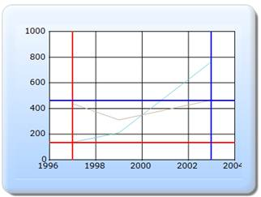

::: {style="DISPLAY: none"}
{#d2h_url_template}{#d2h_package_url style="WIDTH: 0px; DISPLAY: none; HEIGHT: 0px"}
:::

:::::: {.d2h_secondary_topic style="PADDING-BOTTOM: 10pt; MARGIN: 0pt; PADDING-LEFT: 0pt; PADDING-RIGHT: 0pt; PADDING-TOP: 0pt"}
#### ChartModel {#chartmodel style="tab-stops: 0pt"}

[]{style="FONT-FAMILY: 'Calibri','sans-serif'"} 

The steps to add the Interactive Cursor to the ChartModel through ChartModel are as follows:

Step 1:

Add the code displayed below in the view.

 

::: {style="BORDER-BOTTOM: #c8c8c8 1pt solid; BORDER-LEFT: #c8c8c8 1pt solid; PADDING-BOTTOM: 1pt; MARGIN-TOP: 0pt; PADDING-LEFT: 4pt; PADDING-RIGHT: 4pt; MARGIN-BOTTOM: 0pt; BACKGROUND: #f0f0f0; BORDER-TOP: #c8c8c8 1pt solid; BORDER-RIGHT: #c8c8c8 1pt solid; PADDING-TOP: 1pt"}
View \[ASPX\]

[]{style="FONT-FAMILY: 'Courier New'; BACKGROUND: yellow"} 

[\<%]{style="FONT-FAMILY: 'Courier New'; BACKGROUND: yellow"}[\--Rendering the Chart COntrol\--]{style="FONT-FAMILY: 'Courier New'; COLOR: green"}[%\>]{style="FONT-FAMILY: 'Courier New'; BACKGROUND: yellow"}

[  ]{style="FONT-FAMILY: 'Courier New'"}

[        [\<%]{style="BACKGROUND: yellow"}[=]{style="COLOR: blue"} Html.Chart([\"ChartModel\"]{style="COLOR: #a31515"},([MVCChartModel]{style="COLOR: #2b91af"})ViewData\[[\"ChartModel\"]{style="COLOR: #a31515"}\]) [%\>]{style="BACKGROUND: yellow"}]{style="FONT-FAMILY: 'Courier New'"}**[]{style="FONT-FAMILY: 'Courier New'"}**
:::

 

::: {style="BORDER-BOTTOM: #c8c8c8 1pt solid; BORDER-LEFT: #c8c8c8 1pt solid; PADDING-BOTTOM: 1pt; MARGIN-TOP: 0pt; PADDING-LEFT: 4pt; PADDING-RIGHT: 4pt; MARGIN-BOTTOM: 0pt; BACKGROUND: #f0f0f0; BORDER-TOP: #c8c8c8 1pt solid; BORDER-RIGHT: #c8c8c8 1pt solid; PADDING-TOP: 1pt"}
View \[cshtml\]

[]{style="FONT-FAMILY: 'Courier New'; BACKGROUND: yellow"} 

[@\*]{style="FONT-FAMILY: 'Courier New'; BACKGROUND: yellow"}[\--Rendering the Chart Control\--]{style="FONT-FAMILY: 'Courier New'; COLOR: green"}[\*@]{style="FONT-FAMILY: 'Courier New'; BACKGROUND: yellow"}

[]{style="FONT-FAMILY: 'Courier New'; BACKGROUND: yellow"} 

[@(]{style="FONT-FAMILY: 'Courier New'; BACKGROUND: yellow"}[new]{style="FONT-FAMILY: Consolas; COLOR: blue; FONT-SIZE: 9.5pt"}[ [HtmlString]{style="COLOR: #2b91af"}]{style="FONT-FAMILY: Consolas; FONT-SIZE: 9.5pt"}[(Html.Chart([\"ChartModel\"]{style="COLOR: #a31515"},([MVCChartModel]{style="COLOR: #2b91af"})ViewData\[[\"ChartModel\"]{style="COLOR: #a31515"}\]).ToString())[)]{style="BACKGROUND: yellow"}]{style="FONT-FAMILY: 'Courier New'"}

[]{style="FONT-FAMILY: 'Courier New'; BACKGROUND: yellow"} 
:::

 

 

**[]{style="FONT-FAMILY: 'Calibri','sans-serif'"}** 

Step 2:

Controller:

The Interactive cursors can be enabled by setting the **ShowInteractiveCursors** property to true. The Interactive cursors can be customized by using the [ChartInteractiveCursor ]{style="COLOR: #2b91af"}class properties and it is added to the ChartModel.

Add the code displayed below in the Controller.

::: {style="BORDER-BOTTOM: #c8c8c8 1pt solid; BORDER-LEFT: #c8c8c8 1pt solid; PADDING-BOTTOM: 1pt; MARGIN-TOP: 0pt; PADDING-LEFT: 4pt; PADDING-RIGHT: 4pt; MARGIN-BOTTOM: 0pt; BACKGROUND: #f0f0f0; BORDER-TOP: #c8c8c8 1pt solid; BORDER-RIGHT: #c8c8c8 1pt solid; PADDING-TOP: 1pt"}
[public]{style="FONT-FAMILY: 'Courier New'; COLOR: blue"}[ [ActionResult]{style="COLOR: #2b91af"} Index()]{style="FONT-FAMILY: 'Courier New'"}

[        {]{style="FONT-FAMILY: 'Courier New'"}

[            [MVCChartModel]{style="COLOR: #2b91af"} chartModel = [new]{style="COLOR: blue"} [MVCChartModel]{style="COLOR: #2b91af"}();]{style="FONT-FAMILY: 'Courier New'"}

[            InitializeChart(chartModel);]{style="FONT-FAMILY: 'Courier New'"}

[]{style="FONT-FAMILY: 'Courier New'"} 

[            ViewData\[[\"ChartModel\"]{style="COLOR: #a31515"}\] = chartModel;]{style="FONT-FAMILY: 'Courier New'"}

[           ]{style="FONT-FAMILY: 'Courier New'"}

[]{style="FONT-FAMILY: 'Courier New'"} 

[            [return]{style="COLOR: blue"} View();]{style="FONT-FAMILY: 'Courier New'"}

[]{style="FONT-FAMILY: 'Courier New'"} 

[        }]{style="FONT-FAMILY: 'Courier New'"}

[]{style="FONT-FAMILY: 'Courier New'"} 

[        [void]{style="COLOR: blue"} InitializeChart([MVCChartModel]{style="COLOR: #2b91af"} chartModel)]{style="FONT-FAMILY: 'Courier New'"}

[        {]{style="FONT-FAMILY: 'Courier New'"}

[]{style="FONT-FAMILY: 'Courier New'"} 

[            [ChartSeries]{style="COLOR: #2b91af"} series1, series2;]{style="FONT-FAMILY: 'Courier New'"}

[]{style="FONT-FAMILY: 'Courier New'"} 

[            series1 = [new]{style="COLOR: blue"} [ChartSeries]{style="COLOR: #2b91af"}([\"Saab\"]{style="COLOR: #a31515"}, [ChartSeriesType]{style="COLOR: #2b91af"}.Line);]{style="FONT-FAMILY: 'Courier New'"}

[            series1.Text = series1.Name;]{style="FONT-FAMILY: 'Courier New'"}

[            series1.Points.Add(1997, 137);]{style="FONT-FAMILY: 'Courier New'"}

[            series1.Points.Add(1999, 211);]{style="FONT-FAMILY: 'Courier New'"}

[]{style="FONT-FAMILY: 'Courier New'"} 

[            series1.Points.Add(2003, 766);]{style="FONT-FAMILY: 'Courier New'"}

[]{style="FONT-FAMILY: 'Courier New'"} 

[            series2 = [new]{style="COLOR: blue"} [ChartSeries]{style="COLOR: #2b91af"}([\"Saab\"]{style="COLOR: #a31515"}, [ChartSeriesType]{style="COLOR: #2b91af"}.Line);]{style="FONT-FAMILY: 'Courier New'"}

[            series2.Text = series2.Name;]{style="FONT-FAMILY: 'Courier New'"}

[            series2.Points.Add(1997, 437);]{style="FONT-FAMILY: 'Courier New'"}

[            series2.Points.Add(1999, 311);]{style="FONT-FAMILY: 'Courier New'"}

[]{style="FONT-FAMILY: 'Courier New'"} 

[            series2.Points.Add(2003, 466);]{style="FONT-FAMILY: 'Courier New'"}

[]{style="FONT-FAMILY: 'Courier New'"} 

[            chartModel.Series.Add(series1);]{style="FONT-FAMILY: 'Courier New'"}

[            chartModel.Series.Add(series2);]{style="FONT-FAMILY: 'Courier New'"}

[            chartModel.BorderAppearance.SkinStyle = [ChartBorderSkinStyle]{style="COLOR: #2b91af"}.Emboss;]{style="FONT-FAMILY: 'Courier New'"}

[            chartModel.Skins = [ChartModelSkins]{style="COLOR: #2b91af"}.Office2007Blue;]{style="FONT-FAMILY: 'Courier New'"}

[            chartModel.ChartSeriesSkins = [ChartSeriesSkins]{style="COLOR: #2b91af"}.WarmCold;]{style="FONT-FAMILY: 'Courier New'"}

[]{style="FONT-FAMILY: 'Courier New'"} 

[            [//Enabling the Interactive cursors]{style="COLOR: green"}]{style="FONT-FAMILY: 'Courier New'"}

**[            chartModel.ShowInteractiveCursors = [true]{style="COLOR: blue"};]{style="FONT-FAMILY: 'Courier New'"}**

[]{style="FONT-FAMILY: 'Courier New'"} 

[            [//Customizing the Interactive cursors]{style="COLOR: green"}]{style="FONT-FAMILY: 'Courier New'"}

[            [ChartInteractiveCursor]{style="COLOR: #2b91af"} cursor1 = [new]{style="COLOR: blue"} [ChartInteractiveCursor]{style="COLOR: #2b91af"}(chartModel.Series\[0\]);]{style="FONT-FAMILY: 'Courier New'"}

[            chartModel.ChartArea.InteractiveCursors.Add(cursor1);]{style="FONT-FAMILY: 'Courier New'"}

[            [ChartInteractiveCursor]{style="COLOR: #2b91af"} cursor2 = [new]{style="COLOR: blue"} [ChartInteractiveCursor]{style="COLOR: #2b91af"}(chartModel.Series\[1\]);]{style="FONT-FAMILY: 'Courier New'"}

[            cursor2.XPosition = 6;]{style="FONT-FAMILY: 'Courier New'"}

[            cursor2.Color = [Color]{style="COLOR: #2b91af"}.Blue;]{style="FONT-FAMILY: 'Courier New'"}

[            chartModel.ChartArea.InteractiveCursors.Add(cursor2);]{style="FONT-FAMILY: 'Courier New'"}

[]{style="FONT-FAMILY: 'Courier New'"} 

[]{style="FONT-FAMILY: 'Courier New'"} 

[        }]{style="FONT-FAMILY: 'Courier New'"}[]{style="FONT-FAMILY: 'Courier New'"}
:::

Step 3:

Run the code, to get the following output:

[]{style="FONT-FAMILY: 'Calibri','sans-serif'"} 

{border="0"}

Figure 339: Chart - Interactive Cursor

[]{style="FONT-FAMILY: 'Calibri','sans-serif'"} 

[]{#related-topics}
::::::
