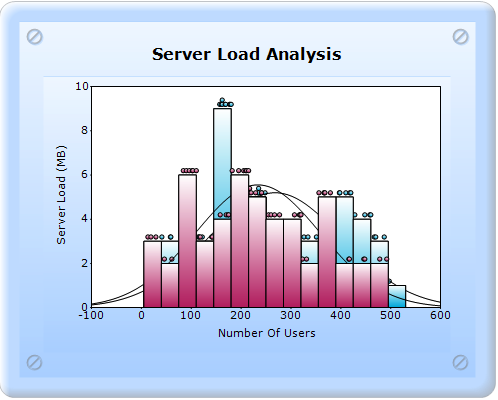

::: {style="DISPLAY: none"}
{#d2h_url_template}{#d2h_package_url style="WIDTH: 0px; DISPLAY: none; HEIGHT: 0px"}
:::

::: {.d2h_secondary_topic style="PADDING-BOTTOM: 10pt; MARGIN: 0pt; PADDING-LEFT: 0pt; PADDING-RIGHT: 0pt; PADDING-TOP: 0pt"}
##### ChartModel {#chartmodel style="tab-stops: 0pt"}

[]{style="FONT-FAMILY: 'Calibri','sans-serif'"} 

To create a Histogram chart through ChartModel:

1.   In Controller, create an instance of **MVCChartModel**.

2.   Create an instance of **ChartSeries**, and set the SeriesType to **Histogram**.

3.   Set the **ChartSeries**, **ChartArea**, and **ChartModel** properties.

4.   Return view to the corresponding **View** page after setting the **ChartModel** to the **ViewData**.

[]{style="FONT-FAMILY: 'Calibri','sans-serif'"} 

+-------------------------------------------------------------------------------------------------------------------------------------------------------------------------------------------------------------------------------------------------------------------------------------+
| \[C#\]                                                                                                                                                                                                                                                                              |
|                                                                                                                                                                                                                                                                                     |
| [     ]{style="FONT-FAMILY: Consolas; FONT-SIZE: 9.5pt"}[public]{style="FONT-FAMILY: 'Courier New'; COLOR: blue"}[ [ActionResult]{style="COLOR: #2b91af"} SimpleChart()]{style="FONT-FAMILY: 'Courier New'"}                                                                        |
|                                                                                                                                                                                                                                                                                     |
| [        {]{style="FONT-FAMILY: 'Courier New'"}                                                                                                                                                                                                                                     |
|                                                                                                                                                                                                                                                                                     |
| [            [MVCChartModel]{style="COLOR: #2b91af"} chartModel = [new]{style="COLOR: blue"} [MVCChartModel]{style="COLOR: #2b91af"}();]{style="FONT-FAMILY: 'Courier New'"}                                                                                                        |
|                                                                                                                                                                                                                                                                                     |
| [            [Random]{style="COLOR: #2b91af"} r = [new]{style="COLOR: blue"} [Random]{style="COLOR: #2b91af"}();]{style="FONT-FAMILY: 'Courier New'"}                                                                                                                               |
|                                                                                                                                                                                                                                                                                     |
| [            [double]{style="COLOR: blue"}\[\] points = {   25.250,27.750,29.000,28.275,29.750,27.750,28.275,26.250,25.750,25.250,26.250,25.250,24.500,]{style="FONT-FAMILY: 'Courier New'"}                                                                                        |
|                                                                                                                                                                                                                                                                                     |
| [                                          25.625,25.500,26.625,26.275,26.250,26.875,27.250,26.875,26.500,27.125,26.275,25.875,26.625,]{style="FONT-FAMILY: 'Courier New'"}                                                                                                         |
|                                                                                                                                                                                                                                                                                     |
| [                                          27.125,26.250,27.000,27.250,27.500,28.500,29.500,28.875,28.500,29.000,28.500,28.500,29.000,]{style="FONT-FAMILY: 'Courier New'"}                                                                                                         |
|                                                                                                                                                                                                                                                                                     |
| [                                          29.000]{style="FONT-FAMILY: 'Courier New'"}                                                                                                                                                                                              |
|                                                                                                                                                                                                                                                                                     |
| [                                      };]{style="FONT-FAMILY: 'Courier New'"}                                                                                                                                                                                                      |
|                                                                                                                                                                                                                                                                                     |
| [            [double]{style="COLOR: blue"}\[\] points1 = {  23.000,26.500,27.750,25.025,26.500,26.500,28.025,29.250,26.750,27.250,26.250,25.250,24.500,]{style="FONT-FAMILY: 'Courier New'"}                                                                                        |
|                                                                                                                                                                                                                                                                                     |
| [                                           25.625,25.500,26.625,26.275,26.250,26.875,27.250,26.875,26.500,27.125,26.275,25.875,26.625,]{style="FONT-FAMILY: 'Courier New'"}                                                                                                        |
|                                                                                                                                                                                                                                                                                     |
| [                                           27.125,26.250,27.000,27.250,27.500,28.500,29.500,28.875,28.500,29.000,28.500,28.500,29.000,]{style="FONT-FAMILY: 'Courier New'"}                                                                                                        |
|                                                                                                                                                                                                                                                                                     |
| [                                           29.000]{style="FONT-FAMILY: 'Courier New'"}                                                                                                                                                                                             |
|                                                                                                                                                                                                                                                                                     |
| [                                       };]{style="FONT-FAMILY: 'Courier New'"}                                                                                                                                                                                                     |
|                                                                                                                                                                                                                                                                                     |
| [            [DateTime]{style="COLOR: #2b91af"} date = [DateTime]{style="COLOR: #2b91af"}.Today.AddDays(-points1.Length);]{style="FONT-FAMILY: 'Courier New'"}                                                                                                                      |
|                                                                                                                                                                                                                                                                                     |
| []{style="FONT-FAMILY: 'Courier New'"}                                                                                                                                                                                                                                              |
|                                                                                                                                                                                                                                                                                     |
| [            [for]{style="COLOR: blue"} ([int]{style="COLOR: blue"} i = 1; i \<= 2; i++)]{style="FONT-FAMILY: 'Courier New'"}                                                                                                                                                       |
|                                                                                                                                                                                                                                                                                     |
| [            {]{style="FONT-FAMILY: 'Courier New'"}                                                                                                                                                                                                                                 |
|                                                                                                                                                                                                                                                                                     |
| []{style="FONT-FAMILY: 'Courier New'"}                                                                                                                                                                                                                                              |
|                                                                                                                                                                                                                                                                                     |
| [            [// Create chart series and add data points to it.]{style="COLOR: green"}]{style="FONT-FAMILY: 'Courier New'"}                                                                                                                                                         |
|                                                                                                                                                                                                                                                                                     |
| []{style="FONT-FAMILY: 'Courier New'"}                                                                                                                                                                                                                                              |
|                                                                                                                                                                                                                                                                                     |
| [                [ChartSeries]{style="COLOR: #2b91af"} Histogram = [new]{style="COLOR: blue"} [ChartSeries]{style="COLOR: #2b91af"}([\"Series\"]{style="COLOR: #a31515"} + i.ToString(), [ChartSeriesType]{style="COLOR: #2b91af"}.Histogram);]{style="FONT-FAMILY: 'Courier New'"} |
|                                                                                                                                                                                                                                                                                     |
| [                [for]{style="COLOR: blue"} ([int]{style="COLOR: blue"} j = 0; j \< 50; j++)]{style="FONT-FAMILY: 'Courier New'"}                                                                                                                                                   |
|                                                                                                                                                                                                                                                                                     |
| [                    Histogram.Points.Add(r.Next(10, 500), 1000);]{style="FONT-FAMILY: 'Courier New'"}                                                                                                                                                                              |
|                                                                                                                                                                                                                                                                                     |
| []{style="FONT-FAMILY: 'Courier New'"}                                                                                                                                                                                                                                              |
|                                                                                                                                                                                                                                                                                     |
| [                Histogram.Text = Histogram.Name;]{style="FONT-FAMILY: 'Courier New'"}                                                                                                                                                                                              |
|                                                                                                                                                                                                                                                                                     |
| [                Histogram.ConfigItems.HistogramItem.NumberOfIntervals = 20;]{style="FONT-FAMILY: 'Courier New'"}                                                                                                                                                                   |
|                                                                                                                                                                                                                                                                                     |
| [                Histogram.ConfigItems.HistogramItem.ShowNormalDistribution = [true]{style="COLOR: blue"};]{style="FONT-FAMILY: 'Courier New'"}                                                                                                                                     |
|                                                                                                                                                                                                                                                                                     |
| []{style="FONT-FAMILY: 'Courier New'"}                                                                                                                                                                                                                                              |
|                                                                                                                                                                                                                                                                                     |
| [            [// Add the series to the chart series collection.]{style="COLOR: green"}]{style="FONT-FAMILY: 'Courier New'"}                                                                                                                                                         |
|                                                                                                                                                                                                                                                                                     |
| [                chartModel.Series.Add(Histogram);]{style="FONT-FAMILY: 'Courier New'"}                                                                                                                                                                                             |
|                                                                                                                                                                                                                                                                                     |
| [            ]{style="FONT-FAMILY: 'Courier New'"}[}]{style="FONT-FAMILY: 'Courier New'"}                                                                                                                                                                                           |
|                                                                                                                                                                                                                                                                                     |
| []{style="FONT-FAMILY: 'Courier New'"}                                                                                                                                                                                                                                              |
|                                                                                                                                                                                                                                                                                     |
| []{style="FONT-FAMILY: 'Courier New'"}                                                                                                                                                                                                                                              |
|                                                                                                                                                                                                                                                                                     |
| [            chartModel.DropSeriesPoints = [true]{style="COLOR: blue"};]{style="FONT-FAMILY: 'Courier New'"}                                                                                                                                                                        |
|                                                                                                                                                                                                                                                                                     |
| [            chartModel.PrimaryYAxis.ForceZero = [true]{style="COLOR: blue"};]{style="FONT-FAMILY: 'Courier New'"}                                                                                                                                                                  |
|                                                                                                                                                                                                                                                                                     |
| []{style="FONT-FAMILY: 'Courier New'"}                                                                                                                                                                                                                                              |
|                                                                                                                                                                                                                                                                                     |
| [            chartModel.ChartArea.XAxesLayoutMode = [ChartAxesLayoutMode]{style="COLOR: #2b91af"}.Stacking;]{style="FONT-FAMILY: 'Courier New'"}                                                                                                                                    |
|                                                                                                                                                                                                                                                                                     |
| []{style="FONT-FAMILY: 'Courier New'"}                                                                                                                                                                                                                                              |
|                                                                                                                                                                                                                                                                                     |
| [            chartModel.PrimaryXAxis.DrawGrid = [false]{style="COLOR: blue"};]{style="FONT-FAMILY: 'Courier New'"}                                                                                                                                                                  |
|                                                                                                                                                                                                                                                                                     |
| [            chartModel.PrimaryYAxis.DrawGrid = [false]{style="COLOR: blue"};]{style="FONT-FAMILY: 'Courier New'"}                                                                                                                                                                  |
|                                                                                                                                                                                                                                                                                     |
| []{style="FONT-FAMILY: 'Courier New'"}                                                                                                                                                                                                                                              |
|                                                                                                                                                                                                                                                                                     |
| [            chartModel.BorderAppearance.SkinStyle = [ChartBorderSkinStyle]{style="COLOR: #2b91af"}.Pinned;]{style="FONT-FAMILY: 'Courier New'"}                                                                                                                                    |
|                                                                                                                                                                                                                                                                                     |
| []{style="FONT-FAMILY: 'Courier New'"}                                                                                                                                                                                                                                              |
|                                                                                                                                                                                                                                                                                     |
| [            chartModel.PrimaryXAxis.RangeType = [ChartAxisRangeType]{style="COLOR: #2b91af"}.Set;]{style="FONT-FAMILY: 'Courier New'"}                                                                                                                                             |
|                                                                                                                                                                                                                                                                                     |
| [            chartModel.PrimaryXAxis.Range = [new]{style="COLOR: blue"} [MinMaxInfo]{style="COLOR: #2b91af"}(-100, 600, 100);]{style="FONT-FAMILY: 'Courier New'"}                                                                                                                  |
|                                                                                                                                                                                                                                                                                     |
| []{style="FONT-FAMILY: 'Courier New'"}                                                                                                                                                                                                                                              |
|                                                                                                                                                                                                                                                                                     |
| [            chartModel.PrimaryYAxis.ValueType = [ChartValueType]{style="COLOR: #2b91af"}.Double;]{style="FONT-FAMILY: 'Courier New'"}                                                                                                                                              |
|                                                                                                                                                                                                                                                                                     |
| [            chartModel.PrimaryYAxis.RangeType = [ChartAxisRangeType]{style="COLOR: #2b91af"}.Auto;]{style="FONT-FAMILY: 'Courier New'"}                                                                                                                                            |
|                                                                                                                                                                                                                                                                                     |
| []{style="FONT-FAMILY: 'Courier New'"}                                                                                                                                                                                                                                              |
|                                                                                                                                                                                                                                                                                     |
| [            chartModel.BorderStyle = System.Web.UI.WebControls.[BorderStyle]{style="COLOR: #2b91af"}.None;]{style="FONT-FAMILY: 'Courier New'"}                                                                                                                                    |
|                                                                                                                                                                                                                                                                                     |
| [            chartModel.BorderAppearance.SkinStyle = [ChartBorderSkinStyle]{style="COLOR: #2b91af"}.Emboss;]{style="FONT-FAMILY: 'Courier New'"}                                                                                                                                    |
|                                                                                                                                                                                                                                                                                     |
| []{style="FONT-FAMILY: 'Courier New'"}                                                                                                                                                                                                                                              |
|                                                                                                                                                                                                                                                                                     |
| [            chartModel.PrimaryXAxis.Title = [\"Number Of Users\"]{style="COLOR: #a31515"};]{style="FONT-FAMILY: 'Courier New'"}                                                                                                                                                    |
|                                                                                                                                                                                                                                                                                     |
| []{style="FONT-FAMILY: 'Courier New'"}                                                                                                                                                                                                                                              |
|                                                                                                                                                                                                                                                                                     |
| [            chartModel.ChartSeriesSkins = [ChartSeriesSkins]{style="COLOR: #2b91af"}.Analog;]{style="FONT-FAMILY: 'Courier New'"}                                                                                                                                                  |
|                                                                                                                                                                                                                                                                                     |
| [            chartModel.Skins = [ChartModelSkins]{style="COLOR: #2b91af"}.Office2007Blue;]{style="FONT-FAMILY: 'Courier New'"}                                                                                                                                                      |
|                                                                                                                                                                                                                                                                                     |
| []{style="FONT-FAMILY: 'Courier New'"}                                                                                                                                                                                                                                              |
|                                                                                                                                                                                                                                                                                     |
| [            chartModel.Size = [new]{style="COLOR: blue"} [Size]{style="COLOR: #2b91af"}(500, 400);]{style="FONT-FAMILY: 'Courier New'"}                                                                                                                                            |
|                                                                                                                                                                                                                                                                                     |
| [            chartModel.Text = [\"Server Load Analysis\"]{style="COLOR: #a31515"};]{style="FONT-FAMILY: 'Courier New'"}                                                                                                                                                             |
|                                                                                                                                                                                                                                                                                     |
| [            chartModel.Font = [new]{style="COLOR: blue"} [Font]{style="COLOR: #2b91af"}([\"Verdana\"]{style="COLOR: #a31515"}, 12, [FontStyle]{style="COLOR: #2b91af"}.Bold);]{style="FONT-FAMILY: 'Courier New'"}                                                                 |
|                                                                                                                                                                                                                                                                                     |
| [            chartModel.PrimaryYAxis.Title = [\"Server Load (MB)\"]{style="COLOR: #a31515"};]{style="FONT-FAMILY: 'Courier New'"}                                                                                                                                                   |
|                                                                                                                                                                                                                                                                                     |
| [            chartModel.ElementsSpacing = 0;]{style="FONT-FAMILY: 'Courier New'"}                                                                                                                                                                                                   |
|                                                                                                                                                                                                                                                                                     |
| [            ViewData.Model = chartModel;]{style="FONT-FAMILY: 'Courier New'"}                                                                                                                                                                                                      |
|                                                                                                                                                                                                                                                                                     |
| [            [return]{style="COLOR: blue"} View();]{style="FONT-FAMILY: 'Courier New'"}                                                                                                                                                                                             |
|                                                                                                                                                                                                                                                                                     |
| [        }]{style="FONT-FAMILY: 'Courier New'"}                                                                                                                                                                                                                                     |
|                                                                                                                                                                                                                                                                                     |
| []{style="FONT-FAMILY: Consolas; COLOR: blue; FONT-SIZE: 9.5pt"}                                                                                                                                                                                                                    |
+-------------------------------------------------------------------------------------------------------------------------------------------------------------------------------------------------------------------------------------------------------------------------------------+

[]{style="FONT-FAMILY: 'Calibri','sans-serif'"} 

[]{style="FONT-FAMILY: Consolas; FONT-SIZE: 9.5pt"} 

5.   In the **View** page, invoke the ChartBuilder by using the control ID as the first argument, and convert the **ViewData** to **MVCChartModel** and set it as the second argument.

[]{style="FONT-FAMILY: Consolas; FONT-SIZE: 9.5pt"} 

+---------------------------------------------------------------------------------------------------------------------------------------------------------------------------------------------------------------------------------------------------------------------------------------------------------+
| **View\[ASPX\]**                                                                                                                                                                                                                                                                                        |
|                                                                                                                                                                                                                                                                                                         |
| [\<%]{style="FONT-FAMILY: 'Courier New'; BACKGROUND: yellow"}[=]{style="FONT-FAMILY: 'Courier New'; COLOR: blue"}[ Html.Chart([\"SimpleChart\"]{style="COLOR: #a31515"},([MVCChartModel]{style="COLOR: #2b91af"})ViewData.Model) [%\>]{style="BACKGROUND: yellow"}]{style="FONT-FAMILY: 'Courier New'"} |
|                                                                                                                                                                                                                                                                                                         |
| []{style="FONT-FAMILY: 'Courier New'; BACKGROUND: yellow; FONT-SIZE: 9.5pt"}                                                                                                                                                                                                                            |
+---------------------------------------------------------------------------------------------------------------------------------------------------------------------------------------------------------------------------------------------------------------------------------------------------------+

[]{style="FONT-FAMILY: Consolas; FONT-SIZE: 9.5pt"} 

[]{style="FONT-FAMILY: Consolas; FONT-SIZE: 9.5pt"} 

+-----------------------------------------------------------------------------------------------------------------------------------------------------------------------------------------------------------------------------------------------------------------------------------------------------------------+
| **View\[cshtml\]**                                                                                                                                                                                                                                                                                              |
|                                                                                                                                                                                                                                                                                                                 |
| [    [@(]{style="BACKGROUND: yellow"}[new]{style="COLOR: blue"} [HtmlString]{style="COLOR: #2b91af"}(Html.Chart([\"SimpleChart\"]{style="COLOR: #a31515"},([MVCChartModel]{style="COLOR: #2b91af"})ViewData.Model).ToString())[)]{style="BACKGROUND: yellow"}]{style="FONT-FAMILY: Consolas; FONT-SIZE: 9.5pt"} |
|                                                                                                                                                                                                                                                                                                                 |
| []{style="FONT-FAMILY: Consolas; FONT-SIZE: 9.5pt"}                                                                                                                                                                                                                                                             |
|                                                                                                                                                                                                                                                                                                                 |
| []{style="FONT-FAMILY: 'Courier New'; BACKGROUND: yellow; FONT-SIZE: 9.5pt"}                                                                                                                                                                                                                                    |
+-----------------------------------------------------------------------------------------------------------------------------------------------------------------------------------------------------------------------------------------------------------------------------------------------------------------+

[]{style="FONT-FAMILY: Consolas; FONT-SIZE: 9.5pt"} 

[]{style="FONT-FAMILY: Consolas; FONT-SIZE: 9.5pt"} 

6.   Build and run the code, to get the following output:

[]{style="FONT-FAMILY: 'Calibri','sans-serif'"} 

[]{style="FONT-FAMILY: 'Calibri','sans-serif'"} 

{border="0"}

Figure 86: Chart displaying Histogram Series

[]{style="FONT-FAMILY: 'Calibri','sans-serif'"} 

[]{#related-topics}
:::
