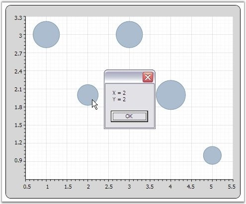

::: {style="DISPLAY: none"}
{#d2h_url_template}{#d2h_package_url style="WIDTH: 0px; DISPLAY: none; HEIGHT: 0px"}
:::

::: {.d2h_secondary_topic style="PADDING-BOTTOM: 10pt; MARGIN: 0pt; PADDING-LEFT: 0pt; PADDING-RIGHT: 0pt; PADDING-TOP: 0pt"}
##### Chart MouseEventArgs {#chart-mouseeventargs style="tab-stops: 0pt"}

ChartMouseEventArgs are the arguments returned when the mouse events are triggered by ChartSeries. ChartMouseEventArgs returns the segment on which the mouse events are triggered along with default mouse event args. This event args can be used to perform customization of a segment when a mouse event is encountered. The segment returns different values that can be used to perform calculations or operations. The following lines of code demonstrates how ChartMouseEventArgs can be used to retrieve information about the ChartSeries segment.

 

+---------------------------------------------------------------------------------------------------------------------------------------------------------------------------------------------------------------------------------------------------------------------+
| **[\[C#\]]{style="FONT-FAMILY: 'Courier New'"}**                                                                                                                                                                                                                    |
|                                                                                                                                                                                                                                                                     |
| []{style="FONT-FAMILY: 'Courier New'"}                                                                                                                                                                                                                              |
|                                                                                                                                                                                                                                                                     |
| [series.MouseClick += [new]{style="COLOR: blue"} ChartMouseEventHandler(series_MouseClick);]{style="FONT-FAMILY: 'Courier New'"}                                                                                                                                    |
|                                                                                                                                                                                                                                                                     |
| [static]{style="FONT-FAMILY: 'Courier New'; COLOR: blue"}[ [void]{style="COLOR: blue"} series_MouseClick([object]{style="COLOR: blue"} sender, [ChartMouseEventArgs]{style="COLOR: #2b91af"} e)]{style="FONT-FAMILY: 'Courier New'"}                                |
|                                                                                                                                                                                                                                                                     |
| [{]{style="FONT-FAMILY: 'Courier New'"}                                                                                                                                                                                                                             |
|                                                                                                                                                                                                                                                                     |
| [ChartPoint]{style="FONT-FAMILY: 'Courier New'; COLOR: #2b91af"}[ point = ([ChartPoint]{style="COLOR: #2b91af"})e.Segment.CorrespondingPoints\[0\].DataPoint;]{style="FONT-FAMILY: 'Courier New'"}                                                                  |
|                                                                                                                                                                                                                                                                     |
| [MessageBox]{style="FONT-FAMILY: 'Courier New'; COLOR: #2b91af"}[.Show([\"X = \"]{style="COLOR: #a31515"} + point.X.ToString() + [\"\\n\"]{style="COLOR: #a31515"} + [\"Y = \"]{style="COLOR: #a31515"} + point.Y.ToString());]{style="FONT-FAMILY: 'Courier New'"} |
|                                                                                                                                                                                                                                                                     |
| [}]{style="FONT-FAMILY: 'Courier New'"}                                                                                                                                                                                                                             |
+---------------------------------------------------------------------------------------------------------------------------------------------------------------------------------------------------------------------------------------------------------------------+

[]{style="FONT-SIZE: 8pt"} 

{border="0"}

Figure 256: Displays DataPoint obtained using ChartMouseEventArgs on MouseClick

**[]{style="FONT-FAMILY: 'Trebuchet MS','sans-serif'; COLOR: #4f81bd; FONT-SIZE: 9pt"}** 

See Also

[[Chart Axis Events]{.UGHyperlink}](ms-xhelp:///?Id=a61c5b27-730a-4df4-890a-fe72ccbbadd8)[, ]{style="COLOR: #15428b"}[[Chart MouseEventArgs]{.UGHyperlink}]()

 

 

[]{#p161} 

[]{#related-topics}
:::
