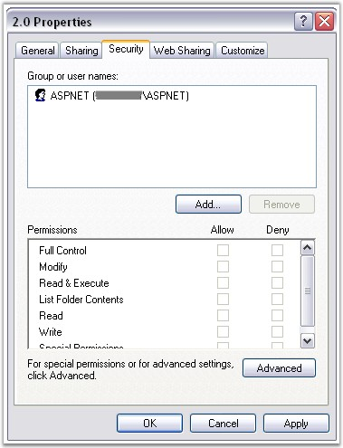

::: {style="DISPLAY: none"}
{#d2h_url_template}{#d2h_package_url style="WIDTH: 0px; DISPLAY: none; HEIGHT: 0px"}
:::

::::: {#nsbanner .d2h_main_nsbanner style="BORDER-BOTTOM: #999999 1px solid; POSITION: relative; PADDING-BOTTOM: 0px; BACKGROUND-COLOR: transparent; PADDING-LEFT: 0px; PADDING-RIGHT: 0px; DISPLAY: none; BORDER-TOP: #999999 1px solid; PADDING-TOP: 0px; LEFT: 0px"}
:::: {#TitleRow .d2h_main_titlerow style="PADDING-BOTTOM: 4px; BACKGROUND-COLOR: transparent; PADDING-LEFT: 22px; WIDTH: 100%; PADDING-RIGHT: 10px; DISPLAY: none; PADDING-TOP: 4px"}
::: {#ienav .d2h_main_ienav style="DISPLAY: none"}
{#D2HPrevious .D2HPreviousEnabled}  {#D2HNext .D2HNextEnabled}
:::
::::
:::::

:::::: {#nstext .d2h_main_nstext style="PADDING-BOTTOM: 10px; BACKGROUND-COLOR: transparent; PADDING-LEFT: 22px; PADDING-RIGHT: 10px; HEIGHT: 100%; OVERFLOW: auto; PADDING-TOP: 5px" hasuserbackground="true" valign="bottom"}
::: {#d2h_breadcrumbs .d2h_breadcrumbs}
[Essential Studio User Guide Documentation](ms-xhelp:///?Id=12457748-09e3-4d74-a240-8e049cedf030){.d2h_breadcrumbsNormal}[ \> ]{.d2h_breadcrumbsLinkSeparator}[User Interface Edition](ms-xhelp:///?Id=c29296b7-531c-413b-a0ec-488ca1f7f669){.d2h_breadcrumbsNormal}[ \> ]{.d2h_breadcrumbsLinkSeparator}[Essential ASP.NET](ms-xhelp:///?Id=25c35330-c127-4dad-9a92-ed79dc7261a6){.d2h_breadcrumbsNormal}[ \> ]{.d2h_breadcrumbsLinkSeparator}[Essential Chart]{.d2h_breadcrumbsContentsOnly}[ \> ]{.d2h_breadcrumbsLinkSeparator}[Getting Started](ms-xhelp:///?Id=e6f85824-7e04-4dab-9e3f-effb3938f621){.d2h_breadcrumbsNormal}
:::

## Chart Output Format {#chart-output-format style="tab-stops: 0pt"}

[]{style="FONT-FAMILY: 'Trebuchet MS','sans-serif'; FONT-SIZE: 9pt"} 

Essential Chart is first rendered as an image on the server which is then displayed on the client browser.

 

The **OutputFormat** property in ChartWebControl defines how the Chart image from the server is to be served to the Client at runtime. This property can be set to **DiskFile** or **Handler**.                                

[]{style="FONT-FAMILY: 'Trebuchet MS','sans-serif'; FONT-SIZE: 9pt"} 

DiskFile

[]{style="FONT-FAMILY: 'Trebuchet MS','sans-serif'; FONT-SIZE: 9pt"} 

[·      ]{style="FONT-FAMILY: Symbol"}When the **OutputFormat** property is set to **DiskFile**, the chart generates a temporary disk file whose link is served to the Client. The **ImageUrlPath** controls where the disk files are stored.

[·      ]{style="FONT-FAMILY: Symbol"}In DiskFile setting, the chart creates several temporary disk files (images of the generated chart). Setting the AutoTempFileCleanUp property to true will automatically clean up these files based on the AutoCleanupCacheExpiration property setting. The latter property controls the time for which such images are allowed to exist on disk. Note that this time is approximate. Actual cleanup time cannot be accurately controlled.

::: {style="BORDER-BOTTOM: windowtext 1pt solid; BORDER-LEFT: medium none; PADDING-BOTTOM: 1pt; MARGIN-TOP: 9pt; PADDING-LEFT: 0pt; PADDING-RIGHT: 0pt; MARGIN-BOTTOM: 9pt; BORDER-TOP: windowtext 1pt solid; BORDER-RIGHT: medium none; PADDING-TOP: 1pt"}
{border="0"}Note: The ASP.NET user will need to have permissions to use this folder on the server. If the permission is not provided, the chart will not be able to write it to disk.
:::

[]{style="FONT-FAMILY: 'Trebuchet MS','sans-serif'; FONT-SIZE: 9pt"} 

{border="0"}

**[]{style="FONT-FAMILY: 'Trebuchet MS','sans-serif'; FONT-SIZE: 9pt"}** 

Figure 10: Permissions for the Chart

[]{style="FONT-FAMILY: 'Trebuchet MS','sans-serif'; FONT-SIZE: 9pt"} 

Handler

**[]{style="FONT-FAMILY: 'Trebuchet MS','sans-serif'; FONT-SIZE: 9pt"}** 

[·      ]{style="FONT-FAMILY: Symbol"}When the **OutputFormat** is set to **Handler**, the chart does not generate any disk files. **This can lead to better performance than when using DiskFiles.** The Handler entry will be made in the Web.config file automatically, if you drag the control, on to the designer. Otherwise, if you add the control manually, you must specify the entry in the HttpHandlers section of the Web.Config file as follows.

[]{style="FONT-FAMILY: 'Trebuchet MS','sans-serif'; FONT-SIZE: 9pt"} 

+-----------------------------------------------------------------------------------------------------------------------------------------------------------------------------------------------------------------------------------------------------------------------------------------------------------------------------------------------------------------------------------------------------------------------------------------------------------------------------------------------------------------------------------------------------------------------------------------------------------------------------------------------------------------------------------------------------------------------------------------------------------------------------------------------------------------------------------------------------+
| **[\[ASPX\]]{style="FONT-FAMILY: 'Courier New'; COLOR: black"}**                                                                                                                                                                                                                                                                                                                                                                                                                                                                                                                                                                                                                                                                                                                                                                                    |
|                                                                                                                                                                                                                                                                                                                                                                                                                                                                                                                                                                                                                                                                                                                                                                                                                                                     |
| []{style="FONT-FAMILY: 'Courier New'; COLOR: black"}                                                                                                                                                                                                                                                                                                                                                                                                                                                                                                                                                                                                                                                                                                                                                                                                |
|                                                                                                                                                                                                                                                                                                                                                                                                                                                                                                                                                                                                                                                                                                                                                                                                                                                     |
| [\<]{style="FONT-FAMILY: 'Courier New'; COLOR: blue"}[httpHandlers]{style="FONT-FAMILY: 'Courier New'; COLOR: #a31515"}[\>]{style="FONT-FAMILY: 'Courier New'; COLOR: blue"}                                                                                                                                                                                                                                                                                                                                                                                                                                                                                                                                                                                                                                                                        |
|                                                                                                                                                                                                                                                                                                                                                                                                                                                                                                                                                                                                                                                                                                                                                                                                                                                     |
| [\<]{style="FONT-FAMILY: 'Courier New'; COLOR: blue"}[add]{style="FONT-FAMILY: 'Courier New'; COLOR: #a31515"}[ ]{style="FONT-FAMILY: 'Courier New'; COLOR: blue"}[verb]{style="FONT-FAMILY: 'Courier New'; COLOR: red"}[=]{style="FONT-FAMILY: 'Courier New'; COLOR: blue"}[\"[\*]{style="COLOR: blue"}\"[ ]{style="COLOR: blue"}[path]{style="COLOR: red"}[=]{style="COLOR: blue"}\"[syncfusion_generate.ashx]{style="COLOR: blue"}\"[ ]{style="COLOR: blue"}[type]{style="COLOR: red"}[=]{style="COLOR: blue"}\"[Syncfusion.Web.UI.WebControls.Chart.ChartWebHandler,Syncfusion.Chart.Web, Version=X.X.X.X, culture=]{style="COLOR: blue"}\"[Neutral]{style="COLOR: red"},[PublicKeyToken]{style="COLOR: red"}[=]{style="COLOR: blue"}\"[3d67ed1f87d44c89]{style="COLOR: blue"}\"[/\>]{style="COLOR: blue"}]{style="FONT-FAMILY: 'Courier New'"} |
|                                                                                                                                                                                                                                                                                                                                                                                                                                                                                                                                                                                                                                                                                                                                                                                                                                                     |
| [\</]{style="FONT-FAMILY: 'Courier New'; COLOR: blue"}[httpHandlers]{style="FONT-FAMILY: 'Courier New'; COLOR: #a31515"}[\>]{style="FONT-FAMILY: 'Courier New'; COLOR: blue"}                                                                                                                                                                                                                                                                                                                                                                                                                                                                                                                                                                                                                                                                       |
+-----------------------------------------------------------------------------------------------------------------------------------------------------------------------------------------------------------------------------------------------------------------------------------------------------------------------------------------------------------------------------------------------------------------------------------------------------------------------------------------------------------------------------------------------------------------------------------------------------------------------------------------------------------------------------------------------------------------------------------------------------------------------------------------------------------------------------------------------------+

[]{style="FONT-FAMILY: 'Trebuchet MS','sans-serif'; FONT-SIZE: 9pt"} 

::: {style="BORDER-BOTTOM: windowtext 1pt solid; BORDER-LEFT: medium none; PADDING-BOTTOM: 1pt; MARGIN-TOP: 9pt; PADDING-LEFT: 0pt; PADDING-RIGHT: 0pt; MARGIN-BOTTOM: 9pt; BORDER-TOP: windowtext 1pt solid; BORDER-RIGHT: medium none; PADDING-TOP: 1pt"}
 

 

{border="0"} Note: X.X.X.X in the above code corresponds to the correct version number of the Essential Studio version that you are currently using.
:::

 

+-----------------------------------+---------------------------------------------------------------------------------------------------------------------------------------------------------------------------------------------------------------------------------------------------------------------------------------------------------------------------------------------------------------------------------------------------------------------------------------------------------------------------------------------------------------------------------------------------------------------------------------------------------------------------------------------------------+
| ChartWebControl Properties        | Description                                                                                                                                                                                                                                                                                                                                                                                                                                                                                                                                                                                                                                             |
+-----------------------------------+---------------------------------------------------------------------------------------------------------------------------------------------------------------------------------------------------------------------------------------------------------------------------------------------------------------------------------------------------------------------------------------------------------------------------------------------------------------------------------------------------------------------------------------------------------------------------------------------------------------------------------------------------------+
| ImageFormat                       | Specifies the image format in which the chart image should be generated. Is of type System.Drawing.ImageFormat. Default is **Png**.                                                                                                                                                                                                                                                                                                                                                                                                                                                                                                                     |
+-----------------------------------+---------------------------------------------------------------------------------------------------------------------------------------------------------------------------------------------------------------------------------------------------------------------------------------------------------------------------------------------------------------------------------------------------------------------------------------------------------------------------------------------------------------------------------------------------------------------------------------------------------------------------------------------------------+
| OutputFormat                      | Controls how the chart is served at run time from the server. Possible values:                                                                                                                                                                                                                                                                                                                                                                                                                                                                                                                                                                          |
|                                   |                                                                                                                                                                                                                                                                                                                                                                                                                                                                                                                                                                                                                                                         |
|                                   | *[]{style="FONT-FAMILY: 'Segoe UI','sans-serif'"}*                                                                                                                                                                                                                                                                                                                                                                                                                                                                                                                                                                                                      |
|                                   |                                                                                                                                                                                                                                                                                                                                                                                                                                                                                                                                                                                                                                                         |
|                                   | DiskFile (**default**)                                                                                                                                                                                                                                                                                                                                                                                                                                                                                                                                                                                                                                  |
|                                   |                                                                                                                                                                                                                                                                                                                                                                                                                                                                                                                                                                                                                                                         |
|                                   | Handler                                                                                                                                                                                                                                                                                                                                                                                                                                                                                                                                                                                                                                                 |
+-----------------------------------+---------------------------------------------------------------------------------------------------------------------------------------------------------------------------------------------------------------------------------------------------------------------------------------------------------------------------------------------------------------------------------------------------------------------------------------------------------------------------------------------------------------------------------------------------------------------------------------------------------------------------------------------------------+
| AutoTempFileCleanUp               | After enabling this, temporary disk files are cleaned, when the **Outputformat** is set to **DiskFile**, based on the expiration time specified below. Default is **false**.                                                                                                                                                                                                                                                                                                                                                                                                                                                                            |
+-----------------------------------+---------------------------------------------------------------------------------------------------------------------------------------------------------------------------------------------------------------------------------------------------------------------------------------------------------------------------------------------------------------------------------------------------------------------------------------------------------------------------------------------------------------------------------------------------------------------------------------------------------------------------------------------------------+
| AutoCleanupCacheExpiration        | This setting specifies the approximate time for which, the above images are allowed to exist on disk.                                                                                                                                                                                                                                                                                                                                                                                                                                                                                                                                                   |
+-----------------------------------+---------------------------------------------------------------------------------------------------------------------------------------------------------------------------------------------------------------------------------------------------------------------------------------------------------------------------------------------------------------------------------------------------------------------------------------------------------------------------------------------------------------------------------------------------------------------------------------------------------------------------------------------------------+
| ImageUrlPath                      | This specifies the path, where the chart images are stored, that are automatically generated by the chart when the **OutputFormat** is set to **DiskFileMode**. This directory has to exist and the ASP.NET user account need to be provided access to it for the chart to be able to generate images. The default setting is that the chart stores images in the base virtual directory. For this reason if the OutputFormat is set to DiskFile, user ASP.NET should be given write permission for your application root directory (see above for more info). The format of this path must be relative to the application root (default is \".\\\\\"). |
+-----------------------------------+---------------------------------------------------------------------------------------------------------------------------------------------------------------------------------------------------------------------------------------------------------------------------------------------------------------------------------------------------------------------------------------------------------------------------------------------------------------------------------------------------------------------------------------------------------------------------------------------------------------------------------------------------------+

[]{style="FONT-FAMILY: 'Trebuchet MS','sans-serif'; FONT-SIZE: 9pt"} 

[]{style="FONT-FAMILY: 'Trebuchet MS','sans-serif'; FONT-SIZE: 9pt"} 

+-------------------------------------------------------------------------------------------------------------------------------+
| **[\[C#\]]{style="FONT-FAMILY: 'Courier New'; COLOR: black"}**                                                                |
|                                                                                                                               |
| []{style="FONT-FAMILY: 'Courier New'; COLOR: black"}                                                                          |
|                                                                                                                               |
| [//To access a subfolder, \"Images\" in the application]{style="FONT-FAMILY: 'Courier New'; COLOR: green"}                    |
|                                                                                                                               |
| [ChartWebControl1.ImageURLPath = [\"Images\"]{style="COLOR: maroon"};]{style="FONT-FAMILY: 'Courier New'"}                    |
|                                                                                                                               |
| []{style="FONT-FAMILY: 'Courier New'"}                                                                                        |
|                                                                                                                               |
| [//To access a folder outside the application folder]{style="FONT-FAMILY: 'Courier New'; COLOR: green"}                       |
|                                                                                                                               |
| [ChartWebControl1.ImageURLPath = [\"syncfusion\\\\web\\\\data\"]{style="COLOR: maroon"};]{style="FONT-FAMILY: 'Courier New'"} |
+-------------------------------------------------------------------------------------------------------------------------------+

[]{style="FONT-FAMILY: 'Trebuchet MS','sans-serif'; FONT-SIZE: 9pt"} 

+------------------------------------------------------------------------------------------------------------------------------+
| **[\[VB\]]{style="FONT-FAMILY: 'Courier New'; COLOR: black"}**                                                               |
|                                                                                                                              |
| [\'To access a subfolder, \"Images\" in the application]{style="FONT-FAMILY: 'Courier New'; COLOR: green"}                   |
|                                                                                                                              |
| [ChartWebControl1.ImageURLPath = [\"Images\"]{style="COLOR: maroon"}]{style="FONT-FAMILY: 'Courier New'"}                    |
|                                                                                                                              |
| []{style="FONT-FAMILY: 'Courier New'; COLOR: maroon"}                                                                        |
|                                                                                                                              |
| [\'To access a folder outside the application folder]{style="FONT-FAMILY: 'Courier New'; COLOR: green"}                      |
|                                                                                                                              |
| [ChartWebControl1.ImageURLPath = [\"syncfusion\\\\web\\\\data\"]{style="COLOR: maroon"}]{style="FONT-FAMILY: 'Courier New'"} |
+------------------------------------------------------------------------------------------------------------------------------+

**[]{style="FONT-FAMILY: 'Trebuchet MS','sans-serif'"}** 

Running ChartWebApplication with Handler OutputFormat in IIS7

**[]{style="FONT-FAMILY: 'Trebuchet MS','sans-serif'"}** 

While running ChartWebApplication in IIS7 with default Integrated managed pipeline mode, Handler Output format will work only when HTTP Handlers for ChartWebControl are added under the \<System.WebServer\> whereas, when the Chart is added to the Web application, the HTTP Handlers will be added under \<System.Web\> by default.

 

For the application to work properly with IIS 7, any of the following methods can be used.

[]{style="FONT-FAMILY: 'Trebuchet MS','sans-serif'; FONT-SIZE: 9pt"} 

1.   Migrate the application to work with the Integrated .NET mode.

[]{style="FONT-FAMILY: 'Trebuchet MS','sans-serif'; FONT-SIZE: 9pt"} 

Cmd prompt\>%systemroot%\\system32\\inetsrv\\APPCMD.EXE migrate config \"Default Web Site/\<SampleWebSiteName\>\"

[]{style="FONT-FAMILY: 'Trebuchet MS','sans-serif'; FONT-SIZE: 9pt"} 

2.   Change the ApplicationPool of the website to Classic.NetApplicationPool using the following command.

[]{style="FONT-FAMILY: 'Trebuchet MS','sans-serif'; FONT-SIZE: 9pt"} 

%systemroot%\\system32\\inetsrv\\APPCMD.EXE set app \"Default Web Site/\<SampleWebSiteName\>\" \" /applicationPool:\"Classic .NET AppPool\".

 

Refer to the following link for more information on ASP.NET Integration With IIS 7.0.

[ ]{.UGHyperlink}[[http://learn.iis.net/page.aspx/243/aspnet-integration-with-iis7.]{.UGHyperlink}](http://learn.iis.net/page.aspx/243/aspnet-integration-with-iis7.)[]{.UGHyperlink}

[]{#p14} 

[]{#related-topics}
::::::
