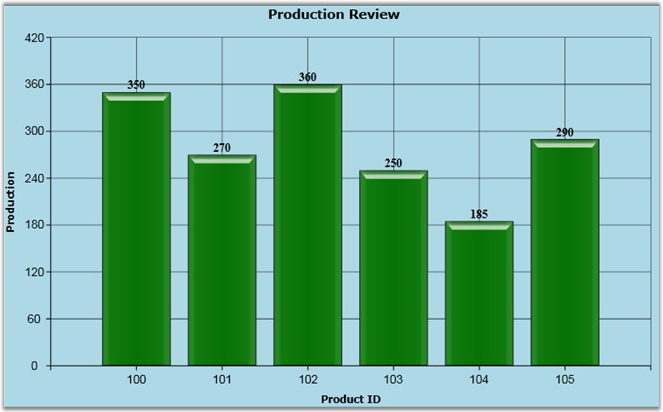

::: {style="DISPLAY: none"}
{#d2h_url_template}{#d2h_package_url style="WIDTH: 0px; DISPLAY: none; HEIGHT: 0px"}
:::

::::: {#nsbanner .d2h_main_nsbanner style="BORDER-BOTTOM: #999999 1px solid; POSITION: relative; PADDING-BOTTOM: 0px; BACKGROUND-COLOR: transparent; PADDING-LEFT: 0px; PADDING-RIGHT: 0px; DISPLAY: none; BORDER-TOP: #999999 1px solid; PADDING-TOP: 0px; LEFT: 0px"}
:::: {#TitleRow .d2h_main_titlerow style="PADDING-BOTTOM: 4px; BACKGROUND-COLOR: transparent; PADDING-LEFT: 22px; WIDTH: 100%; PADDING-RIGHT: 10px; DISPLAY: none; PADDING-TOP: 4px"}
::: {#ienav .d2h_main_ienav style="DISPLAY: none"}
{#D2HPrevious .D2HPreviousEnabled}  {#D2HNext .D2HNextEnabled}
:::
::::
:::::

::::: {#nstext .d2h_main_nstext style="PADDING-BOTTOM: 10px; BACKGROUND-COLOR: transparent; PADDING-LEFT: 22px; PADDING-RIGHT: 10px; HEIGHT: 100%; OVERFLOW: auto; PADDING-TOP: 5px" hasuserbackground="true" valign="bottom"}
::: {#d2h_breadcrumbs .d2h_breadcrumbs}
[Essential Studio User Guide Documentation](ms-xhelp:///?Id=12457748-09e3-4d74-a240-8e049cedf030){.d2h_breadcrumbsNormal}[ \> ]{.d2h_breadcrumbsLinkSeparator}[User Interface Edition](ms-xhelp:///?Id=c29296b7-531c-413b-a0ec-488ca1f7f669){.d2h_breadcrumbsNormal}[ \> ]{.d2h_breadcrumbsLinkSeparator}[Essential Silverlight](ms-xhelp:///?Id=66221bd1-ba2e-43c2-94a7-618f50e01d24){.d2h_breadcrumbsNormal}[ \> ]{.d2h_breadcrumbsLinkSeparator}[Essential Chart]{.d2h_breadcrumbsContentsOnly}[ \> ]{.d2h_breadcrumbsLinkSeparator}[Concepts and Features](ms-xhelp:///?Id=0f820843-9cdd-4436-8cae-3dc5a65fd5cd){.d2h_breadcrumbsNormal}[ \> ]{.d2h_breadcrumbsLinkSeparator}[Chart Series](ms-xhelp:///?Id=89819a94-ebab-4148-9acc-042438f9054b){.d2h_breadcrumbsNormal}
:::

### Chart Series Adornment {#chart-series-adornment style="tab-stops: 0pt"}

 

This feature is used to display additional information such as X value, Y value, Percentage, Y of Total and Data Source information about the Chart Series. The AdornmentInfo class is used to display Adornments for the Chart Series.

 

The following table lists the properties of the AdornmentInfo class.

 

 

**[]{style="COLOR: #15428b"}** 

::: {align="center"}
+----------------------------+-------------------------------+-------------------------------------------------------------------------------------------------------------------------------------------------------------+
| Property                   | Default Value                 | Description                                                                                                                                                 |
+----------------------------+-------------------------------+-------------------------------------------------------------------------------------------------------------------------------------------------------------+
| Visible                    | False                         | This property is used to determine the Visibility of Chart Adornment and Adornment Symbol.                                                                  |
|                            |                               |                                                                                                                                                             |
|                            |                               |                                                                                                                                                             |
|                            |                               |                                                                                                                                                             |
|                            |                               | If this property is set True, the adornment will be displayed, else the adornment will be hidden.                                                           |
+----------------------------+-------------------------------+-------------------------------------------------------------------------------------------------------------------------------------------------------------+
| LabelContentPath           | DataPoint.Y                   | This property is used to determine the data content which is displayed in Adornment.                                                                        |
|                            |                               |                                                                                                                                                             |
|                            |                               |                                                                                                                                                             |
|                            |                               |                                                                                                                                                             |
|                            |                               | The DataPoint.X and DataPoint.Y strings are used to display the X value and Y value in the Adornment.                                                       |
+----------------------------+-------------------------------+-------------------------------------------------------------------------------------------------------------------------------------------------------------+
| HorizontalAlignment        | Center                        | This property is used to determine the horizontal alignment for the Adornment content.                                                                      |
+----------------------------+-------------------------------+-------------------------------------------------------------------------------------------------------------------------------------------------------------+
| VerticalAlignment          | Center                        | This property is used to set the vertical alignment for the Adornment content.                                                                              |
+----------------------------+-------------------------------+-------------------------------------------------------------------------------------------------------------------------------------------------------------+
| AdornmentsPosition         | AdornmentsPosition.Top        | This property is mainly used in Column chart type. By default, the Adornments are displayed at the Top of the Chart Series.                                 |
|                            |                               |                                                                                                                                                             |
|                            |                               |                                                                                                                                                             |
|                            |                               |                                                                                                                                                             |
|                            |                               | If this property is set to Bottom, the Adornments will be displayed at the Bottom of the Series Segments.                                                   |
+----------------------------+-------------------------------+-------------------------------------------------------------------------------------------------------------------------------------------------------------+
| Symbol                     | Symbol.Custom                 | The Symbol enum type provides the set of built-in symbol options for this property. This property is used to determine the Adornment symbol.                |
|                            |                               |                                                                                                                                                             |
|                            |                               |                                                                                                                                                             |
|                            |                               |                                                                                                                                                             |
|                            |                               | Users can customize their own data template symbol by setting this property value to Custom.                                                                |
+----------------------------+-------------------------------+-------------------------------------------------------------------------------------------------------------------------------------------------------------+
| SymbolInterior             | Colors.Transparent            | This property is used to set the Symbol fill color. This property can take any value of type Brush.                                                         |
+----------------------------+-------------------------------+-------------------------------------------------------------------------------------------------------------------------------------------------------------+
| SymbolHeight               | 0                             | This property is used to specify the Adornment symbol height.                                                                                               |
+----------------------------+-------------------------------+-------------------------------------------------------------------------------------------------------------------------------------------------------------+
| SymbolWidth                | 0                             | This property is used to specify the width of the Chart Adornment\'s symbol.                                                                                |
+----------------------------+-------------------------------+-------------------------------------------------------------------------------------------------------------------------------------------------------------+
| SymbolTemplate             | null                          | This property is used to write custom symbol template for the Chart adornment symbol. This property supports DataTemplate.                                  |
+----------------------------+-------------------------------+-------------------------------------------------------------------------------------------------------------------------------------------------------------+
| LabelTemplate              | null                          | This property is used to write custom label template for the content of Chart Adornments. The DataTemplate can be written to customize the chart adornment. |
+----------------------------+-------------------------------+-------------------------------------------------------------------------------------------------------------------------------------------------------------+
| SegmentLabelContent        | LabelContent.LabelContentPath | The LabelContent enum type has set of options to display the Adornment information. It includes the following options.                                      |
|                            |                               |                                                                                                                                                             |
|                            |                               | **[]{style="COLOR: #15428b"}**                                                                                                                              |
|                            |                               |                                                                                                                                                             |
|                            |                               | [·      ]{style="FONT-FAMILY: Symbol"}LabelContentPath: Display the data which is assign to LabelContentPath property.                                      |
|                            |                               |                                                                                                                                                             |
|                            |                               | [·      ]{style="FONT-FAMILY: Symbol"}XValue: Display the X Value of chart points.                                                                          |
|                            |                               |                                                                                                                                                             |
|                            |                               | [·      ]{style="FONT-FAMILY: Symbol"}YValue: Display the Y Value of chart points.                                                                          |
|                            |                               |                                                                                                                                                             |
|                            |                               | [·      ]{style="FONT-FAMILY: Symbol"}Percentage: Display the Percentage value of Total YValue.                                                             |
|                            |                               |                                                                                                                                                             |
|                            |                               | [·      ]{style="FONT-FAMILY: Symbol"}YofTot: Display the Y value and Sum value of whole series y value.                                                    |
|                            |                               |                                                                                                                                                             |
|                            |                               | [·      ]{style="FONT-FAMILY: Symbol"}DateTime: Display the Date when we bind the Date in the chart X-Axis.                                                 |
+----------------------------+-------------------------------+-------------------------------------------------------------------------------------------------------------------------------------------------------------+
| SegmentLabelFormat         | 0.00                          | This property is used to set the Label display format. You can prefix or suffix content and format the numbers.                                             |
+----------------------------+-------------------------------+-------------------------------------------------------------------------------------------------------------------------------------------------------------+
| SegmentLabelFontFamily     | Times New Roman               | This property is used to set the font for the Chart Adornment content.                                                                                      |
+----------------------------+-------------------------------+-------------------------------------------------------------------------------------------------------------------------------------------------------------+
| SegmentLabelFontSize       | 10                            | This property is used to set the font size of the Chart Series Adornment.                                                                                   |
+----------------------------+-------------------------------+-------------------------------------------------------------------------------------------------------------------------------------------------------------+
| SegmentLabelFontWeight     | FontWeights.Normal            | This property is used to set the font weight for the segment label.                                                                                         |
+----------------------------+-------------------------------+-------------------------------------------------------------------------------------------------------------------------------------------------------------+
| SegmentLabelDateTimeFormat | dd/mm/yyyy                    | This property is used to format the DateTime related segment labels.                                                                                        |
+----------------------------+-------------------------------+-------------------------------------------------------------------------------------------------------------------------------------------------------------+
| SegmentLabelRotation       | 0                             | This property is used to rotate the segment label in a given angle.                                                                                         |
+----------------------------+-------------------------------+-------------------------------------------------------------------------------------------------------------------------------------------------------------+
:::

 

The following code example illustrates how to display Adornments in the Chart Series segments.

+--------------------------------------------------------------------------------------------------------------------------------------------------------------------------------------------------------------------------------------------------------------------------------------------------------------------------------------------------------------------------------------------------------------------------------------------------------------------------------------------------------------------------------------------------------------------------------------------------------------------------------------------------------------------------------------------------------------------------------------------------------------------------------------------------------------------------------------------------------------------------------------------------------------------------------------------------------------------------------------------------------+
| [\[XAML\]]{style="FONT-FAMILY: 'Courier New'"}                                                                                                                                                                                                                                                                                                                                                                                                                                                                                                                                                                                                                                                                                                                                                                                                                                                                                                                                                         |
|                                                                                                                                                                                                                                                                                                                                                                                                                                                                                                                                                                                                                                                                                                                                                                                                                                                                                                                                                                                                        |
| **[]{style="FONT-FAMILY: 'Courier New'; COLOR: blue"}**                                                                                                                                                                                                                                                                                                                                                                                                                                                                                                                                                                                                                                                                                                                                                                                                                                                                                                                                                |
|                                                                                                                                                                                                                                                                                                                                                                                                                                                                                                                                                                                                                                                                                                                                                                                                                                                                                                                                                                                                        |
| [\<]{style="FONT-FAMILY: 'Courier New'; COLOR: blue"}[syncfusion]{style="FONT-FAMILY: 'Courier New'; COLOR: #a31515"}[:]{style="FONT-FAMILY: 'Courier New'; COLOR: blue"}[Chart]{style="FONT-FAMILY: 'Courier New'; COLOR: #a31515"}[ Background]{style="FONT-FAMILY: 'Courier New'; COLOR: red"}[=\"LightBlue\"]{style="FONT-FAMILY: 'Courier New'; COLOR: blue"}[ Margin]{style="FONT-FAMILY: 'Courier New'; COLOR: red"}[=\"20\"]{style="FONT-FAMILY: 'Courier New'; COLOR: blue"}[ CornerRadius]{style="FONT-FAMILY: 'Courier New'; COLOR: red"}[=\"25\"]{style="FONT-FAMILY: 'Courier New'; COLOR: blue"}[ BorderBrush]{style="FONT-FAMILY: 'Courier New'; COLOR: red"}[=\"Black\"]{style="FONT-FAMILY: 'Courier New'; COLOR: blue"}[ BorderThickness]{style="FONT-FAMILY: 'Courier New'; COLOR: red"}[=\"1\"\>]{style="FONT-FAMILY: 'Courier New'; COLOR: blue"}                                                                                                                                 |
|                                                                                                                                                                                                                                                                                                                                                                                                                                                                                                                                                                                                                                                                                                                                                                                                                                                                                                                                                                                                        |
| [    ]{style="FONT-FAMILY: 'Courier New'; COLOR: #a31515"}[\<]{style="FONT-FAMILY: 'Courier New'; COLOR: blue"}[syncfusion]{style="FONT-FAMILY: 'Courier New'; COLOR: #a31515"}[:]{style="FONT-FAMILY: 'Courier New'; COLOR: blue"}[ChartArea]{style="FONT-FAMILY: 'Courier New'; COLOR: #a31515"}[ Foreground]{style="FONT-FAMILY: 'Courier New'; COLOR: red"}[=\"Black\"\>]{style="FONT-FAMILY: 'Courier New'; COLOR: blue"}                                                                                                                                                                                                                                                                                                                                                                                                                                                                                                                                                                         |
|                                                                                                                                                                                                                                                                                                                                                                                                                                                                                                                                                                                                                                                                                                                                                                                                                                                                                                                                                                                                        |
| [        ]{style="FONT-FAMILY: 'Courier New'; COLOR: #a31515"}[\<]{style="FONT-FAMILY: 'Courier New'; COLOR: blue"}[syncfusion]{style="FONT-FAMILY: 'Courier New'; COLOR: #a31515"}[:]{style="FONT-FAMILY: 'Courier New'; COLOR: blue"}[ChartArea.Header]{style="FONT-FAMILY: 'Courier New'; COLOR: #a31515"}[\>]{style="FONT-FAMILY: 'Courier New'; COLOR: blue"}                                                                                                                                                                                                                                                                                                                                                                                                                                                                                                                                                                                                                                     |
|                                                                                                                                                                                                                                                                                                                                                                                                                                                                                                                                                                                                                                                                                                                                                                                                                                                                                                                                                                                                        |
| [            ]{style="FONT-FAMILY: 'Courier New'; COLOR: #a31515"}[\<]{style="FONT-FAMILY: 'Courier New'; COLOR: blue"}[TextBlock]{style="FONT-FAMILY: 'Courier New'; COLOR: #a31515"}[ Text]{style="FONT-FAMILY: 'Courier New'; COLOR: red"}[=\"Production Review\"]{style="FONT-FAMILY: 'Courier New'; COLOR: blue"}[ FontWeight]{style="FONT-FAMILY: 'Courier New'; COLOR: red"}[=\"Bold\"]{style="FONT-FAMILY: 'Courier New'; COLOR: blue"}[ FontSize]{style="FONT-FAMILY: 'Courier New'; COLOR: red"}[=\"14\"]{style="FONT-FAMILY: 'Courier New'; COLOR: blue"}[ HorizontalAlignment]{style="FONT-FAMILY: 'Courier New'; COLOR: red"}[=\"Center\"]{style="FONT-FAMILY: 'Courier New'; COLOR: blue"}[ VerticalAlignment]{style="FONT-FAMILY: 'Courier New'; COLOR: red"}[=\"Center\"/\>]{style="FONT-FAMILY: 'Courier New'; COLOR: blue"}                                                                                                                                                          |
|                                                                                                                                                                                                                                                                                                                                                                                                                                                                                                                                                                                                                                                                                                                                                                                                                                                                                                                                                                                                        |
| [        ]{style="FONT-FAMILY: 'Courier New'; COLOR: #a31515"}[\</]{style="FONT-FAMILY: 'Courier New'; COLOR: blue"}[syncfusion]{style="FONT-FAMILY: 'Courier New'; COLOR: #a31515"}[:]{style="FONT-FAMILY: 'Courier New'; COLOR: blue"}[ChartArea.Header]{style="FONT-FAMILY: 'Courier New'; COLOR: #a31515"}[\>]{style="FONT-FAMILY: 'Courier New'; COLOR: blue"}                                                                                                                                                                                                                                                                                                                                                                                                                                                                                                                                                                                                                                    |
|                                                                                                                                                                                                                                                                                                                                                                                                                                                                                                                                                                                                                                                                                                                                                                                                                                                                                                                                                                                                        |
| [        ]{style="FONT-FAMILY: 'Courier New'; COLOR: #a31515"}[\<]{style="FONT-FAMILY: 'Courier New'; COLOR: blue"}[syncfusion]{style="FONT-FAMILY: 'Courier New'; COLOR: #a31515"}[:]{style="FONT-FAMILY: 'Courier New'; COLOR: blue"}[ChartArea.PrimaryAxis]{style="FONT-FAMILY: 'Courier New'; COLOR: #a31515"}[\>]{style="FONT-FAMILY: 'Courier New'; COLOR: blue"}                                                                                                                                                                                                                                                                                                                                                                                                                                                                                                                                                                                                                                |
|                                                                                                                                                                                                                                                                                                                                                                                                                                                                                                                                                                                                                                                                                                                                                                                                                                                                                                                                                                                                        |
| [            ]{style="FONT-FAMILY: 'Courier New'; COLOR: #a31515"}[\<]{style="FONT-FAMILY: 'Courier New'; COLOR: blue"}[syncfusion]{style="FONT-FAMILY: 'Courier New'; COLOR: #a31515"}[:]{style="FONT-FAMILY: 'Courier New'; COLOR: blue"}[ChartAxis]{style="FONT-FAMILY: 'Courier New'; COLOR: #a31515"}[ GridLineStrokeThickness]{style="FONT-FAMILY: 'Courier New'; COLOR: red"}[=\"0.5\"\>]{style="FONT-FAMILY: 'Courier New'; COLOR: blue"}                                                                                                                                                                                                                                                                                                                                                                                                                                                                                                                                                      |
|                                                                                                                                                                                                                                                                                                                                                                                                                                                                                                                                                                                                                                                                                                                                                                                                                                                                                                                                                                                                        |
| [                ]{style="FONT-FAMILY: 'Courier New'; COLOR: #a31515"}[\<]{style="FONT-FAMILY: 'Courier New'; COLOR: blue"}[syncfusion]{style="FONT-FAMILY: 'Courier New'; COLOR: #a31515"}[:]{style="FONT-FAMILY: 'Courier New'; COLOR: blue"}[ChartAxis.Header]{style="FONT-FAMILY: 'Courier New'; COLOR: #a31515"}[\>]{style="FONT-FAMILY: 'Courier New'; COLOR: blue"}                                                                                                                                                                                                                                                                                                                                                                                                                                                                                                                                                                                                                             |
|                                                                                                                                                                                                                                                                                                                                                                                                                                                                                                                                                                                                                                                                                                                                                                                                                                                                                                                                                                                                        |
| [                    ]{style="FONT-FAMILY: 'Courier New'; COLOR: #a31515"}[\<]{style="FONT-FAMILY: 'Courier New'; COLOR: blue"}[TextBlock]{style="FONT-FAMILY: 'Courier New'; COLOR: #a31515"}[ Text]{style="FONT-FAMILY: 'Courier New'; COLOR: red"}[=\"Product ID\"]{style="FONT-FAMILY: 'Courier New'; COLOR: blue"}[ FontWeight]{style="FONT-FAMILY: 'Courier New'; COLOR: red"}[=\"Bold\"/\>]{style="FONT-FAMILY: 'Courier New'; COLOR: blue"}                                                                                                                                                                                                                                                                                                                                                                                                                                                                                                                                                    |
|                                                                                                                                                                                                                                                                                                                                                                                                                                                                                                                                                                                                                                                                                                                                                                                                                                                                                                                                                                                                        |
| [                ]{style="FONT-FAMILY: 'Courier New'; COLOR: #a31515"}[\</]{style="FONT-FAMILY: 'Courier New'; COLOR: blue"}[syncfusion]{style="FONT-FAMILY: 'Courier New'; COLOR: #a31515"}[:]{style="FONT-FAMILY: 'Courier New'; COLOR: blue"}[ChartAxis.Header]{style="FONT-FAMILY: 'Courier New'; COLOR: #a31515"}[\>]{style="FONT-FAMILY: 'Courier New'; COLOR: blue"}                                                                                                                                                                                                                                                                                                                                                                                                                                                                                                                                                                                                                            |
|                                                                                                                                                                                                                                                                                                                                                                                                                                                                                                                                                                                                                                                                                                                                                                                                                                                                                                                                                                                                        |
| [            ]{style="FONT-FAMILY: 'Courier New'; COLOR: #a31515"}[\</]{style="FONT-FAMILY: 'Courier New'; COLOR: blue"}[syncfusion]{style="FONT-FAMILY: 'Courier New'; COLOR: #a31515"}[:]{style="FONT-FAMILY: 'Courier New'; COLOR: blue"}[ChartAxis]{style="FONT-FAMILY: 'Courier New'; COLOR: #a31515"}[\>]{style="FONT-FAMILY: 'Courier New'; COLOR: blue"}                                                                                                                                                                                                                                                                                                                                                                                                                                                                                                                                                                                                                                       |
|                                                                                                                                                                                                                                                                                                                                                                                                                                                                                                                                                                                                                                                                                                                                                                                                                                                                                                                                                                                                        |
| [        ]{style="FONT-FAMILY: 'Courier New'; COLOR: #a31515"}[\</]{style="FONT-FAMILY: 'Courier New'; COLOR: blue"}[syncfusion]{style="FONT-FAMILY: 'Courier New'; COLOR: #a31515"}[:]{style="FONT-FAMILY: 'Courier New'; COLOR: blue"}[ChartArea.PrimaryAxis]{style="FONT-FAMILY: 'Courier New'; COLOR: #a31515"}[\>]{style="FONT-FAMILY: 'Courier New'; COLOR: blue"}                                                                                                                                                                                                                                                                                                                                                                                                                                                                                                                                                                                                                               |
|                                                                                                                                                                                                                                                                                                                                                                                                                                                                                                                                                                                                                                                                                                                                                                                                                                                                                                                                                                                                        |
| **[]{style="FONT-FAMILY: 'Courier New'; COLOR: blue"}**                                                                                                                                                                                                                                                                                                                                                                                                                                                                                                                                                                                                                                                                                                                                                                                                                                                                                                                                                |
|                                                                                                                                                                                                                                                                                                                                                                                                                                                                                                                                                                                                                                                                                                                                                                                                                                                                                                                                                                                                        |
| [        ]{style="FONT-FAMILY: 'Courier New'; COLOR: #a31515"}[\<]{style="FONT-FAMILY: 'Courier New'; COLOR: blue"}[syncfusion]{style="FONT-FAMILY: 'Courier New'; COLOR: #a31515"}[:]{style="FONT-FAMILY: 'Courier New'; COLOR: blue"}[ChartArea.SecondaryAxis]{style="FONT-FAMILY: 'Courier New'; COLOR: #a31515"}[\>]{style="FONT-FAMILY: 'Courier New'; COLOR: blue"}                                                                                                                                                                                                                                                                                                                                                                                                                                                                                                                                                                                                                              |
|                                                                                                                                                                                                                                                                                                                                                                                                                                                                                                                                                                                                                                                                                                                                                                                                                                                                                                                                                                                                        |
| [            ]{style="FONT-FAMILY: 'Courier New'; COLOR: #a31515"}[\<]{style="FONT-FAMILY: 'Courier New'; COLOR: blue"}[syncfusion]{style="FONT-FAMILY: 'Courier New'; COLOR: #a31515"}[:]{style="FONT-FAMILY: 'Courier New'; COLOR: blue"}[ChartAxis]{style="FONT-FAMILY: 'Courier New'; COLOR: #a31515"}[ GridLineStrokeThickness]{style="FONT-FAMILY: 'Courier New'; COLOR: red"}[=\"0.5\"\>]{style="FONT-FAMILY: 'Courier New'; COLOR: blue"}                                                                                                                                                                                                                                                                                                                                                                                                                                                                                                                                                      |
|                                                                                                                                                                                                                                                                                                                                                                                                                                                                                                                                                                                                                                                                                                                                                                                                                                                                                                                                                                                                        |
| [                ]{style="FONT-FAMILY: 'Courier New'; COLOR: #a31515"}[\<]{style="FONT-FAMILY: 'Courier New'; COLOR: blue"}[syncfusion]{style="FONT-FAMILY: 'Courier New'; COLOR: #a31515"}[:]{style="FONT-FAMILY: 'Courier New'; COLOR: blue"}[ChartAxis.Header]{style="FONT-FAMILY: 'Courier New'; COLOR: #a31515"}[\>]{style="FONT-FAMILY: 'Courier New'; COLOR: blue"}                                                                                                                                                                                                                                                                                                                                                                                                                                                                                                                                                                                                                             |
|                                                                                                                                                                                                                                                                                                                                                                                                                                                                                                                                                                                                                                                                                                                                                                                                                                                                                                                                                                                                        |
| [                    ]{style="FONT-FAMILY: 'Courier New'; COLOR: #a31515"}[\<]{style="FONT-FAMILY: 'Courier New'; COLOR: blue"}[TextBlock]{style="FONT-FAMILY: 'Courier New'; COLOR: #a31515"}[ Text]{style="FONT-FAMILY: 'Courier New'; COLOR: red"}[=\"Production\"]{style="FONT-FAMILY: 'Courier New'; COLOR: blue"}[ FontWeight]{style="FONT-FAMILY: 'Courier New'; COLOR: red"}[=\"Bold\"/\>]{style="FONT-FAMILY: 'Courier New'; COLOR: blue"}                                                                                                                                                                                                                                                                                                                                                                                                                                                                                                                                                    |
|                                                                                                                                                                                                                                                                                                                                                                                                                                                                                                                                                                                                                                                                                                                                                                                                                                                                                                                                                                                                        |
| [                ]{style="FONT-FAMILY: 'Courier New'; COLOR: #a31515"}[\</]{style="FONT-FAMILY: 'Courier New'; COLOR: blue"}[syncfusion]{style="FONT-FAMILY: 'Courier New'; COLOR: #a31515"}[:]{style="FONT-FAMILY: 'Courier New'; COLOR: blue"}[ChartAxis.Header]{style="FONT-FAMILY: 'Courier New'; COLOR: #a31515"}[\>]{style="FONT-FAMILY: 'Courier New'; COLOR: blue"}                                                                                                                                                                                                                                                                                                                                                                                                                                                                                                                                                                                                                            |
|                                                                                                                                                                                                                                                                                                                                                                                                                                                                                                                                                                                                                                                                                                                                                                                                                                                                                                                                                                                                        |
| [            ]{style="FONT-FAMILY: 'Courier New'; COLOR: #a31515"}[\</]{style="FONT-FAMILY: 'Courier New'; COLOR: blue"}[syncfusion]{style="FONT-FAMILY: 'Courier New'; COLOR: #a31515"}[:]{style="FONT-FAMILY: 'Courier New'; COLOR: blue"}[ChartAxis]{style="FONT-FAMILY: 'Courier New'; COLOR: #a31515"}[\>]{style="FONT-FAMILY: 'Courier New'; COLOR: blue"}                                                                                                                                                                                                                                                                                                                                                                                                                                                                                                                                                                                                                                       |
|                                                                                                                                                                                                                                                                                                                                                                                                                                                                                                                                                                                                                                                                                                                                                                                                                                                                                                                                                                                                        |
| [        ]{style="FONT-FAMILY: 'Courier New'; COLOR: #a31515"}[\</]{style="FONT-FAMILY: 'Courier New'; COLOR: blue"}[syncfusion]{style="FONT-FAMILY: 'Courier New'; COLOR: #a31515"}[:]{style="FONT-FAMILY: 'Courier New'; COLOR: blue"}[ChartArea.SecondaryAxis]{style="FONT-FAMILY: 'Courier New'; COLOR: #a31515"}[\>]{style="FONT-FAMILY: 'Courier New'; COLOR: blue"}                                                                                                                                                                                                                                                                                                                                                                                                                                                                                                                                                                                                                             |
|                                                                                                                                                                                                                                                                                                                                                                                                                                                                                                                                                                                                                                                                                                                                                                                                                                                                                                                                                                                                        |
| **[]{style="FONT-FAMILY: 'Courier New'; COLOR: blue"}**                                                                                                                                                                                                                                                                                                                                                                                                                                                                                                                                                                                                                                                                                                                                                                                                                                                                                                                                                |
|                                                                                                                                                                                                                                                                                                                                                                                                                                                                                                                                                                                                                                                                                                                                                                                                                                                                                                                                                                                                        |
| [        ]{style="FONT-FAMILY: 'Courier New'; COLOR: #a31515"}[\<]{style="FONT-FAMILY: 'Courier New'; COLOR: blue"}[syncfusion]{style="FONT-FAMILY: 'Courier New'; COLOR: #a31515"}[:]{style="FONT-FAMILY: 'Courier New'; COLOR: blue"}[ChartSeries]{style="FONT-FAMILY: 'Courier New'; COLOR: #a31515"}[ Interior]{style="FONT-FAMILY: 'Courier New'; COLOR: red"}[=\"Green\"]{style="FONT-FAMILY: 'Courier New'; COLOR: blue"}[ DataSource]{style="FONT-FAMILY: 'Courier New'; COLOR: red"}[=\"{]{style="FONT-FAMILY: 'Courier New'; COLOR: blue"}[StaticResource]{style="FONT-FAMILY: 'Courier New'; COLOR: #a31515"}[ data]{style="FONT-FAMILY: 'Courier New'; COLOR: red"}[}\"]{style="FONT-FAMILY: 'Courier New'; COLOR: blue"}[ BindingPathX]{style="FONT-FAMILY: 'Courier New'; COLOR: red"}[=\"ProductID\"]{style="FONT-FAMILY: 'Courier New'; COLOR: blue"}[ BindingPathsY]{style="FONT-FAMILY: 'Courier New'; COLOR: red"}[=\"Produce\"\>]{style="FONT-FAMILY: 'Courier New'; COLOR: blue"} |
|                                                                                                                                                                                                                                                                                                                                                                                                                                                                                                                                                                                                                                                                                                                                                                                                                                                                                                                                                                                                        |
| [            ]{style="FONT-FAMILY: 'Courier New'; COLOR: #a31515"}[\<]{style="FONT-FAMILY: 'Courier New'; COLOR: blue"}[syncfusion]{style="FONT-FAMILY: 'Courier New'; COLOR: #a31515"}[:]{style="FONT-FAMILY: 'Courier New'; COLOR: blue"}[ChartSeries.AdornmentsInfo]{style="FONT-FAMILY: 'Courier New'; COLOR: #a31515"}[\>]{style="FONT-FAMILY: 'Courier New'; COLOR: blue"}                                                                                                                                                                                                                                                                                                                                                                                                                                                                                                                                                                                                                       |
|                                                                                                                                                                                                                                                                                                                                                                                                                                                                                                                                                                                                                                                                                                                                                                                                                                                                                                                                                                                                        |
| [                ]{style="FONT-FAMILY: 'Courier New'; COLOR: #a31515"}[\<]{style="FONT-FAMILY: 'Courier New'; COLOR: blue"}[syncfusion]{style="FONT-FAMILY: 'Courier New'; COLOR: #a31515"}[:]{style="FONT-FAMILY: 'Courier New'; COLOR: blue"}[ChartAdornmentInfo]{style="FONT-FAMILY: 'Courier New'; COLOR: #a31515"}[ Visible]{style="FONT-FAMILY: 'Courier New'; COLOR: red"}[=\"True\"]{style="FONT-FAMILY: 'Courier New'; COLOR: blue"}[ LabelContentPath]{style="FONT-FAMILY: 'Courier New'; COLOR: red"}[=\"DataPoint.Y\"]{style="FONT-FAMILY: 'Courier New'; COLOR: blue"}[ VerticalAlignment]{style="FONT-FAMILY: 'Courier New'; COLOR: red"}[=\"Top\"]{style="FONT-FAMILY: 'Courier New'; COLOR: blue"}                                                                                                                                                                                                                                                                                     |
|                                                                                                                                                                                                                                                                                                                                                                                                                                                                                                                                                                                                                                                                                                                                                                                                                                                                                                                                                                                                        |
| [                SegmentLabelFontSize]{style="FONT-FAMILY: 'Courier New'; COLOR: red"}[=\"13\"]{style="FONT-FAMILY: 'Courier New'; COLOR: blue"}[ SegmentLabelFontWeight]{style="FONT-FAMILY: 'Courier New'; COLOR: red"}[=\"Bold\"/\>]{style="FONT-FAMILY: 'Courier New'; COLOR: blue"}                                                                                                                                                                                                                                                                                                                                                                                                                                                                                                                                                                                                                                                                                                               |
|                                                                                                                                                                                                                                                                                                                                                                                                                                                                                                                                                                                                                                                                                                                                                                                                                                                                                                                                                                                                        |
| [            ]{style="FONT-FAMILY: 'Courier New'; COLOR: #a31515"}[\</]{style="FONT-FAMILY: 'Courier New'; COLOR: blue"}[syncfusion]{style="FONT-FAMILY: 'Courier New'; COLOR: #a31515"}[:]{style="FONT-FAMILY: 'Courier New'; COLOR: blue"}[ChartSeries.AdornmentsInfo]{style="FONT-FAMILY: 'Courier New'; COLOR: #a31515"}[\>]{style="FONT-FAMILY: 'Courier New'; COLOR: blue"}                                                                                                                                                                                                                                                                                                                                                                                                                                                                                                                                                                                                                      |
|                                                                                                                                                                                                                                                                                                                                                                                                                                                                                                                                                                                                                                                                                                                                                                                                                                                                                                                                                                                                        |
| [        ]{style="FONT-FAMILY: 'Courier New'; COLOR: #a31515"}[\</]{style="FONT-FAMILY: 'Courier New'; COLOR: blue"}[syncfusion]{style="FONT-FAMILY: 'Courier New'; COLOR: #a31515"}[:]{style="FONT-FAMILY: 'Courier New'; COLOR: blue"}[ChartSeries]{style="FONT-FAMILY: 'Courier New'; COLOR: #a31515"}[\>]{style="FONT-FAMILY: 'Courier New'; COLOR: blue"}                                                                                                                                                                                                                                                                                                                                                                                                                                                                                                                                                                                                                                         |
|                                                                                                                                                                                                                                                                                                                                                                                                                                                                                                                                                                                                                                                                                                                                                                                                                                                                                                                                                                                                        |
| [    ]{style="FONT-FAMILY: 'Courier New'; COLOR: #a31515"}[\</]{style="FONT-FAMILY: 'Courier New'; COLOR: blue"}[syncfusion]{style="FONT-FAMILY: 'Courier New'; COLOR: #a31515"}[:]{style="FONT-FAMILY: 'Courier New'; COLOR: blue"}[ChartArea]{style="FONT-FAMILY: 'Courier New'; COLOR: #a31515"}[\>]{style="FONT-FAMILY: 'Courier New'; COLOR: blue"}                                                                                                                                                                                                                                                                                                                                                                                                                                                                                                                                                                                                                                               |
|                                                                                                                                                                                                                                                                                                                                                                                                                                                                                                                                                                                                                                                                                                                                                                                                                                                                                                                                                                                                        |
| [\</]{style="FONT-FAMILY: 'Courier New'; COLOR: blue"}[syncfusion]{style="FONT-FAMILY: 'Courier New'; COLOR: #a31515"}[:]{style="FONT-FAMILY: 'Courier New'; COLOR: blue"}[Chart]{style="FONT-FAMILY: 'Courier New'; COLOR: #a31515"}[\>]{style="FONT-FAMILY: 'Courier New'; COLOR: blue"}                                                                                                                                                                                                                                                                                                                                                                                                                                                                                                                                                                                                                                                                                                             |
+--------------------------------------------------------------------------------------------------------------------------------------------------------------------------------------------------------------------------------------------------------------------------------------------------------------------------------------------------------------------------------------------------------------------------------------------------------------------------------------------------------------------------------------------------------------------------------------------------------------------------------------------------------------------------------------------------------------------------------------------------------------------------------------------------------------------------------------------------------------------------------------------------------------------------------------------------------------------------------------------------------+

**[]{style="COLOR: #15428b"}** 

+-------------------------------------------------------------------------------------------------------------------------------------------------------------------------------------------------------+
| [\[C#\]]{style="FONT-FAMILY: 'Courier New'"}                                                                                                                                                          |
|                                                                                                                                                                                                       |
| **[]{style="FONT-FAMILY: 'Courier New'"}**                                                                                                                                                            |
|                                                                                                                                                                                                       |
| [// Initialize the Chart and Chart Area.]{style="FONT-FAMILY: 'Courier New'; COLOR: green"}                                                                                                           |
|                                                                                                                                                                                                       |
| [Chart]{style="FONT-FAMILY: 'Courier New'; COLOR: #2b91af"}[ chart = [new]{style="COLOR: blue"} [Chart]{style="COLOR: #2b91af"}();]{style="FONT-FAMILY: 'Courier New'"}                               |
|                                                                                                                                                                                                       |
| [ChartArea]{style="FONT-FAMILY: 'Courier New'; COLOR: #2b91af"}[ area = [new]{style="COLOR: blue"} [ChartArea]{style="COLOR: #2b91af"}();]{style="FONT-FAMILY: 'Courier New'"}                        |
|                                                                                                                                                                                                       |
| [chart.Areas.Add(area);]{style="FONT-FAMILY: 'Courier New'"}                                                                                                                                          |
|                                                                                                                                                                                                       |
| **[]{style="FONT-FAMILY: 'Courier New'"}**                                                                                                                                                            |
|                                                                                                                                                                                                       |
| [// Initialize the Adornment Information.]{style="FONT-FAMILY: 'Courier New'; COLOR: green"}                                                                                                          |
|                                                                                                                                                                                                       |
| [ChartAdornmentInfo]{style="FONT-FAMILY: 'Courier New'; COLOR: #2b91af"}[ adornment = [new]{style="COLOR: blue"} [ChartAdornmentInfo]{style="COLOR: #2b91af"}();]{style="FONT-FAMILY: 'Courier New'"} |
|                                                                                                                                                                                                       |
| [adornment.Visible = [true]{style="COLOR: blue"};]{style="FONT-FAMILY: 'Courier New'"}                                                                                                                |
|                                                                                                                                                                                                       |
| [adornment.HorizontalAlignment = [HorizontalAlignment]{style="COLOR: #2b91af"}.Center;]{style="FONT-FAMILY: 'Courier New'"}                                                                           |
|                                                                                                                                                                                                       |
| [adornment.VerticalAlignment = [VerticalAlignment]{style="COLOR: #2b91af"}.Top;]{style="FONT-FAMILY: 'Courier New'"}                                                                                  |
|                                                                                                                                                                                                       |
| [adornment.LabelContentPath = [\"DataPoint.Y\"]{style="COLOR: #a31515"};]{style="FONT-FAMILY: 'Courier New'"}                                                                                         |
|                                                                                                                                                                                                       |
| [adornment.SegmentLabelFontWeight = [FontWeights]{style="COLOR: #2b91af"}.Bold;]{style="FONT-FAMILY: 'Courier New'"}                                                                                  |
|                                                                                                                                                                                                       |
| [adornment.SegmentLabelFormat = [\"0.00\"]{style="COLOR: #a31515"};]{style="FONT-FAMILY: 'Courier New'"}                                                                                              |
|                                                                                                                                                                                                       |
| [adornment.SegmentLabelFontSize = 12;]{style="FONT-FAMILY: 'Courier New'"}                                                                                                                            |
|                                                                                                                                                                                                       |
| **[]{style="FONT-FAMILY: 'Courier New'"}**                                                                                                                                                            |
|                                                                                                                                                                                                       |
| [// Assign the AdornmentInfo class instance to Chart Series.]{style="FONT-FAMILY: 'Courier New'; COLOR: green"}                                                                                       |
|                                                                                                                                                                                                       |
| [ChartSeries]{style="FONT-FAMILY: 'Courier New'; COLOR: #2b91af"}[ series = [new]{style="COLOR: blue"} [ChartSeries]{style="COLOR: #2b91af"}();]{style="FONT-FAMILY: 'Courier New'"}                  |
|                                                                                                                                                                                                       |
| [series.AdornmentsInfo = adornment;]{style="FONT-FAMILY: 'Courier New'"}                                                                                                                              |
|                                                                                                                                                                                                       |
| **[]{style="FONT-FAMILY: 'Courier New'"}**                                                                                                                                                            |
|                                                                                                                                                                                                       |
| [// Add the Chart Series to the Chart Area.]{style="FONT-FAMILY: 'Courier New'; COLOR: green"}                                                                                                        |
|                                                                                                                                                                                                       |
| [area.Series.Add(series);]{style="FONT-FAMILY: 'Courier New'"}                                                                                                                                        |
+-------------------------------------------------------------------------------------------------------------------------------------------------------------------------------------------------------+

{border="0"}

Figure 67: Chart Series Adornment

More:

[ ]{#related-topics}

[{border="0" align="absMiddle"}Custom Adornment Template](ms-xhelp:///?Id=229c509f-68ad-4cb8-b620-b401bc081987){style="TEXT-DECORATION: none"}

[{border="0" align="absMiddle"}Adornment Symbol](ms-xhelp:///?Id=eb9fac18-6f2f-419c-ab4d-74a7e23b7e9b){style="TEXT-DECORATION: none"}

[{border="0" align="absMiddle"}Custom Adornment Symbol](ms-xhelp:///?Id=f84f3ef2-84dc-4e3d-8a83-6a8c21758f94){style="TEXT-DECORATION: none"}
:::::
