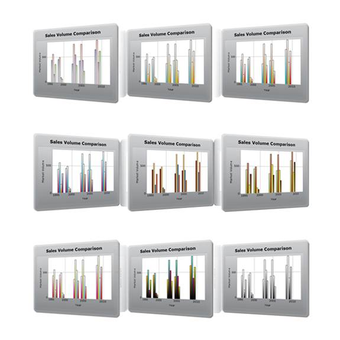

::: {style="DISPLAY: none"}
{#d2h_url_template}{#d2h_package_url style="WIDTH: 0px; DISPLAY: none; HEIGHT: 0px"}
:::

::: {.d2h_secondary_topic style="PADDING-BOTTOM: 10pt; MARGIN: 0pt; PADDING-LEFT: 0pt; PADDING-RIGHT: 0pt; PADDING-TOP: 0pt"}
#### ChartSeries Skins {#chartseries-skins style="tab-stops: 0pt"}

Essential Chart Series has several built-in skins that make styling extremely easy. It contains nine built-in skins to easily customize the appearance of the Chart series. Essential Chart\'s ChartSeriesSkins property allows you to apply predefined skins to the Chart series. Some of the available skins are illustrated in detail in the Built-in Skin Styles topic.

[]{style="FONT-FAMILY: 'Calibri','sans-serif'"} 

{border="0"}

Figure 61: Chart Series Skins

[]{#related-topics}
:::
