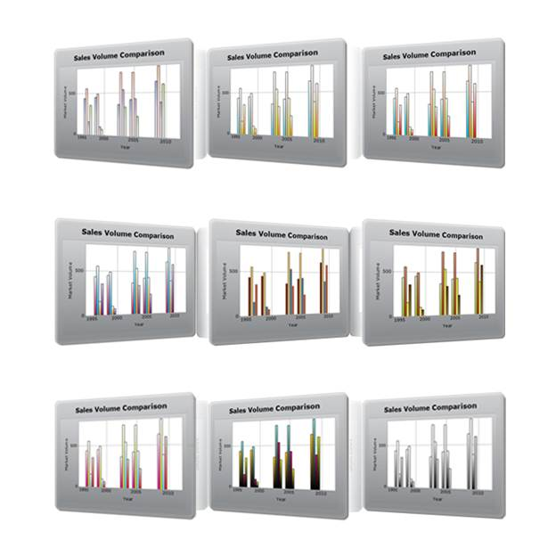

::: {style="DISPLAY: none"}
{#d2h_url_template}{#d2h_package_url style="WIDTH: 0px; DISPLAY: none; HEIGHT: 0px"}
:::

::::: {#nsbanner .d2h_main_nsbanner style="BORDER-BOTTOM: #999999 1px solid; POSITION: relative; PADDING-BOTTOM: 0px; BACKGROUND-COLOR: transparent; PADDING-LEFT: 0px; PADDING-RIGHT: 0px; DISPLAY: none; BORDER-TOP: #999999 1px solid; PADDING-TOP: 0px; LEFT: 0px"}
:::: {#TitleRow .d2h_main_titlerow style="PADDING-BOTTOM: 4px; BACKGROUND-COLOR: transparent; PADDING-LEFT: 22px; WIDTH: 100%; PADDING-RIGHT: 10px; DISPLAY: none; PADDING-TOP: 4px"}
::: {#ienav .d2h_main_ienav style="DISPLAY: none"}
{#D2HPrevious .D2HPreviousEnabled}  {#D2HNext .D2HNextEnabled}
:::
::::
:::::

::::: {#nstext .d2h_main_nstext style="PADDING-BOTTOM: 10px; BACKGROUND-COLOR: transparent; PADDING-LEFT: 22px; PADDING-RIGHT: 10px; HEIGHT: 100%; OVERFLOW: auto; PADDING-TOP: 5px" hasuserbackground="true" valign="bottom"}
::: {#d2h_breadcrumbs .d2h_breadcrumbs}
[Essential Studio User Guide Documentation](ms-xhelp:///?Id=12457748-09e3-4d74-a240-8e049cedf030){.d2h_breadcrumbsNormal}[ \> ]{.d2h_breadcrumbsLinkSeparator}[User Interface Edition](ms-xhelp:///?Id=c29296b7-531c-413b-a0ec-488ca1f7f669){.d2h_breadcrumbsNormal}[ \> ]{.d2h_breadcrumbsLinkSeparator}[Essential ASP.NET MVC](ms-xhelp:///?Id=4b14e7d1-65c4-4f67-b1aa-2c37709905a5){.d2h_breadcrumbsNormal}[ \> ]{.d2h_breadcrumbsLinkSeparator}[Essential Chart]{.d2h_breadcrumbsContentsOnly}[ \> ]{.d2h_breadcrumbsLinkSeparator}[Concepts and Features](ms-xhelp:///?Id=696f5666-8b81-4685-9bd9-12198f06f3ad){.d2h_breadcrumbsNormal}[ \> ]{.d2h_breadcrumbsLinkSeparator}[Appearance](ms-xhelp:///?Id=201bbd07-95b2-469b-a2b4-b7ebc85043f2){.d2h_breadcrumbsNormal}
:::

### ChartSeriesSkins {#chartseriesskins style="tab-stops: 0pt"}

[]{style="FONT-FAMILY: 'Calibri','sans-serif'"} 

Chart MVC supports nine built-in themes for the Chart series for the professional representation of charts.

The following are the available skins:

[]{style="FONT-FAMILY: 'Calibri','sans-serif'"} 

[·      ]{style="FONT-FAMILY: Symbol"}Pastel

[·      ]{style="FONT-FAMILY: Symbol"}Nature

[·      ]{style="FONT-FAMILY: Symbol"}GrayScale

[·      ]{style="FONT-FAMILY: Symbol"}EarthTone

[·      ]{style="FONT-FAMILY: Symbol"}Triad

[·      ]{style="FONT-FAMILY: Symbol"}DefaultAlpha

[·      ]{style="FONT-FAMILY: Symbol"}Colorful

[·      ]{style="FONT-FAMILY: Symbol"}Analog

[·      ]{style="FONT-FAMILY: Symbol"}WarmCold

[]{style="FONT-FAMILY: 'Calibri','sans-serif'"} 

{border="0"}

Figure 309: Chart Series Skins

**[]{style="FONT-FAMILY: 'Arial','sans-serif'"}** 

Properties:

::: {align="center"}
+------------------+-------------------------------+-----------------------------+----------------------------------------------------------------------------+--------------------------------------------------+
| Property         | Description                   | Property Type               | Value it Accepts                                                           | Any Other Dependencies/Sub-properties Associated |
+------------------+-------------------------------+-----------------------------+----------------------------------------------------------------------------+--------------------------------------------------+
| ChartSeriesSkins | Sets the Chartseries\' skins. | [enum]{style="COLOR: blue"} | [ChartSeriesSkins]{style="COLOR: #2b91af"}.Analog                          | [NA]{style="COLOR: #558ed5"}                     |
|                  |                               |                             |                                                                            |                                                  |
|                  |                               |                             |                                                                            |                                                  |
|                  |                               |                             |                                                                            |                                                  |
|                  |                               |                             | [ChartSeriesSkins]{style="COLOR: #2b91af"}.Colorful                        |                                                  |
|                  |                               |                             |                                                                            |                                                  |
|                  |                               |                             |                                                                            |                                                  |
|                  |                               |                             |                                                                            |                                                  |
|                  |                               |                             | [ChartSeriesSkins]{style="COLOR: #2b91af"}.Custom                          |                                                  |
|                  |                               |                             |                                                                            |                                                  |
|                  |                               |                             |                                                                            |                                                  |
|                  |                               |                             |                                                                            |                                                  |
|                  |                               |                             | [ChartSeriesSkins]{style="COLOR: #2b91af"}.DefaultAlpha                    |                                                  |
|                  |                               |                             |                                                                            |                                                  |
|                  |                               |                             |                                                                            |                                                  |
|                  |                               |                             |                                                                            |                                                  |
|                  |                               |                             | [ChartSeriesSkins]{style="COLOR: #2b91af"}.EarthTone                       |                                                  |
|                  |                               |                             |                                                                            |                                                  |
|                  |                               |                             |                                                                            |                                                  |
|                  |                               |                             |                                                                            |                                                  |
|                  |                               |                             | [ChartSeriesSkins]{style="COLOR: #2b91af"}.GrayScale                       |                                                  |
|                  |                               |                             |                                                                            |                                                  |
|                  |                               |                             |                                                                            |                                                  |
|                  |                               |                             |                                                                            |                                                  |
|                  |                               |                             | [ChartSeriesSkins]{style="COLOR: #2b91af"}.Nature                          |                                                  |
|                  |                               |                             |                                                                            |                                                  |
|                  |                               |                             |                                                                            |                                                  |
|                  |                               |                             |                                                                            |                                                  |
|                  |                               |                             | [ChartSeriesSkins]{style="COLOR: #2b91af"}.Pastel                          |                                                  |
|                  |                               |                             |                                                                            |                                                  |
|                  |                               |                             |                                                                            |                                                  |
|                  |                               |                             |                                                                            |                                                  |
|                  |                               |                             | [ChartSeriesSkins]{style="COLOR: #2b91af"}.Triad                           |                                                  |
|                  |                               |                             |                                                                            |                                                  |
|                  |                               |                             |                                                                            |                                                  |
|                  |                               |                             |                                                                            |                                                  |
|                  |                               |                             | [ChartSeriesSkins]{style="COLOR: #2b91af"}.WarmCold[]{style="COLOR: blue"} |                                                  |
+------------------+-------------------------------+-----------------------------+----------------------------------------------------------------------------+--------------------------------------------------+
:::

**[]{style="FONT-FAMILY: 'Calibri','sans-serif'"}** 

Skins can be applied for the Chart series through two ways:

[·      ]{style="FONT-FAMILY: Symbol"}Builder

[·      ]{style="FONT-FAMILY: Symbol"}ChartModel

More:

[ ]{#related-topics}

[{border="0" align="absMiddle"}Builder](ms-xhelp:///?Id=add69486-f15f-49b6-a26c-3e457e805329){style="TEXT-DECORATION: none"}

[{border="0" align="absMiddle"}ChartModel](ms-xhelp:///?Id=b0d153ee-94fd-4584-b346-ff6eb103f3c7){style="TEXT-DECORATION: none"}
:::::
