::: {style="DISPLAY: none"}
{#d2h_url_template}{#d2h_package_url style="WIDTH: 0px; DISPLAY: none; HEIGHT: 0px"}
:::

::::: {#nsbanner .d2h_main_nsbanner style="BORDER-BOTTOM: #999999 1px solid; POSITION: relative; PADDING-BOTTOM: 0px; BACKGROUND-COLOR: transparent; PADDING-LEFT: 0px; PADDING-RIGHT: 0px; DISPLAY: none; BORDER-TOP: #999999 1px solid; PADDING-TOP: 0px; LEFT: 0px"}
:::: {#TitleRow .d2h_main_titlerow style="PADDING-BOTTOM: 4px; BACKGROUND-COLOR: transparent; PADDING-LEFT: 22px; WIDTH: 100%; PADDING-RIGHT: 10px; DISPLAY: none; PADDING-TOP: 4px"}
::: {#ienav .d2h_main_ienav style="DISPLAY: none"}
{#D2HPrevious .D2HPreviousEnabled}  {#D2HNext .D2HNextEnabled}
:::
::::
:::::

:::: {#nstext .d2h_main_nstext style="PADDING-BOTTOM: 10px; BACKGROUND-COLOR: transparent; PADDING-LEFT: 22px; PADDING-RIGHT: 10px; HEIGHT: 100%; OVERFLOW: auto; PADDING-TOP: 5px" hasuserbackground="true" valign="bottom"}
::: {#d2h_breadcrumbs .d2h_breadcrumbs}
[Essential Studio User Guide Documentation](ms-xhelp:///?Id=12457748-09e3-4d74-a240-8e049cedf030){.d2h_breadcrumbsNormal}[ \> ]{.d2h_breadcrumbsLinkSeparator}[User Interface Edition](ms-xhelp:///?Id=c29296b7-531c-413b-a0ec-488ca1f7f669){.d2h_breadcrumbsNormal}[ \> ]{.d2h_breadcrumbsLinkSeparator}[Essential Windows](ms-xhelp:///?Id=e60759d8-47a4-4570-9d7a-16a68d63f2ea){.d2h_breadcrumbsNormal}[ \> ]{.d2h_breadcrumbsLinkSeparator}[Essential Chart]{.d2h_breadcrumbsContentsOnly}[ \> ]{.d2h_breadcrumbsLinkSeparator}[Concepts and Features](ms-xhelp:///?Id=71321e9c-336c-4c1c-a127-be9f135ad4bb){.d2h_breadcrumbsNormal}[ \> ]{.d2h_breadcrumbsLinkSeparator}[Chart Appearance](ms-xhelp:///?Id=eb9d5ffd-71db-4613-9396-75dd4913dca1){.d2h_breadcrumbsNormal}
:::

### Chart Skins {#chart-skins style="tab-stops: 0pt"}

Chart Control has some pre-defined skins, which can be controlled through a single property setting. Essential Chart control allows the user to customize its appearance by applying pre-defined Interiors.

Some of the available skins are:

[·      ]{style="FONT-FAMILY: Symbol"}Office2007Black

[·      ]{style="FONT-FAMILY: Symbol"}Office2007Blue

[·      ]{style="FONT-FAMILY: Symbol"}Office2007Silver

[·      ]{style="FONT-FAMILY: Symbol"}Almond

[·      ]{style="FONT-FAMILY: Symbol"}Blend

[·      ]{style="FONT-FAMILY: Symbol"}Blueberry

[·      ]{style="FONT-FAMILY: Symbol"}Marble

[·      ]{style="FONT-FAMILY: Symbol"}Midnight

[·      ]{style="FONT-FAMILY: Symbol"}Monochrome

[·      ]{style="FONT-FAMILY: Symbol"}Olive

[·      ]{style="FONT-FAMILY: Symbol"}Sandune

[·      ]{style="FONT-FAMILY: Symbol"}Turquoise

[·      ]{style="FONT-FAMILY: Symbol"}Vista

[·    ]{style="FONT-FAMILY: Symbol; FONT-SIZE: 12pt"}VS2010[]{style="FONT-FAMILY: 'Times New Roman','serif'; FONT-SIZE: 12pt"}

+---------------------------------------------------------------------------------------------------------------------------------------------------------------------------------------------------------------------------+
| [\[C#\]]{style="FONT-FAMILY: 'Times New Roman','serif'; FONT-SIZE: 12pt"}                                                                                                                                                 |
|                                                                                                                                                                                                                           |
| [this]{style="FONT-FAMILY: 'Courier New'; COLOR: blue"}[.chartControl1.Skins = [Skins]{style="COLOR: #2b91af"}.Office2007Blue;]{style="FONT-FAMILY: 'Courier New'"}[]{style="FONT-FAMILY: 'Courier New'; COLOR: #a31515"} |
+---------------------------------------------------------------------------------------------------------------------------------------------------------------------------------------------------------------------------+

[]{style="FONT-FAMILY: 'Times New Roman','serif'; FONT-SIZE: 12pt"} 

+----------------------------------------------------------------------------------------------------------------------------------------------------------------------------------------------+
| [\[VB\]]{style="FONT-FAMILY: 'Times New Roman','serif'; FONT-SIZE: 12pt"}                                                                                                                    |
|                                                                                                                                                                                              |
| [Me]{style="FONT-FAMILY: 'Courier New'; COLOR: blue"}[.chartControl1.Skins = Skins.Office2007Blue]{style="FONT-FAMILY: 'Courier New'"}[]{style="FONT-FAMILY: 'Courier New'; COLOR: #a31515"} |
+----------------------------------------------------------------------------------------------------------------------------------------------------------------------------------------------+

[]{style="FONT-FAMILY: 'Times New Roman','serif'; FONT-SIZE: 12pt"} 

[]{style="FONT-FAMILY: 'Times New Roman','serif'; FONT-SIZE: 12pt"} 

The following output is displayed when the Skins value is set to Office2007 Black.

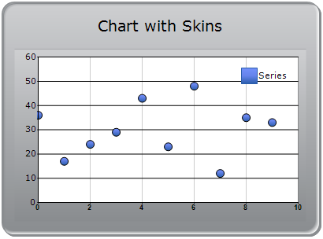{border="0"}

Figure 329: Office2007 Black

 

The following output is displayed when the Skins value is set to Office2007 Blue.

 

{border="0"}

Figure 330: Office2007 Blue

[]{style="FONT-FAMILY: 'Times New Roman','serif'; FONT-SIZE: 12pt"} 

The following output is displayed when the Skins value is set to Office2007 Silver.

[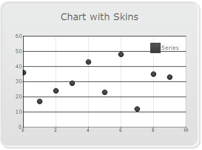{border="0"}]{style="FONT-FAMILY: 'Times New Roman','serif'; FONT-SIZE: 12pt"}

Figure 331: Office2007 Silver[]{style="FONT-FAMILY: 'Times New Roman','serif'; FONT-SIZE: 12pt"}

[]{style="FONT-FAMILY: 'Times New Roman','serif'; FONT-SIZE: 12pt"} 

The following output is displayed when the Skins value is set to Almond.

[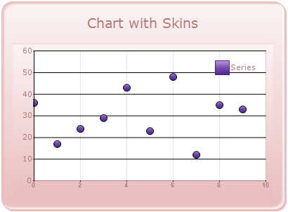{border="0"}]{style="FONT-FAMILY: 'Times New Roman','serif'; FONT-SIZE: 12pt"}[]{style="FONT-FAMILY: 'Times New Roman','serif'; FONT-SIZE: 12pt"}

Figure 332: Almond

[]{style="FONT-FAMILY: 'Times New Roman','serif'; FONT-SIZE: 12pt"} 

The following output is displayed when the Skins value is set to Blend.

[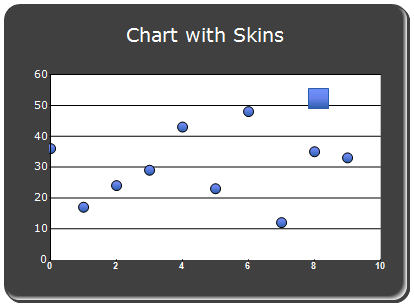{border="0"}]{style="FONT-FAMILY: 'Times New Roman','serif'; FONT-SIZE: 12pt"}[]{style="FONT-FAMILY: 'Times New Roman','serif'; FONT-SIZE: 12pt"}

Figure 333: Blend

[]{style="FONT-FAMILY: 'Times New Roman','serif'; FONT-SIZE: 12pt"} 

The following output is displayed when the Skins value is set to Blueberry.

 

[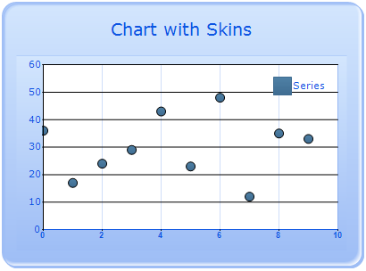{border="0"}]{style="FONT-FAMILY: 'Times New Roman','serif'; FONT-SIZE: 12pt"}[]{style="FONT-FAMILY: 'Times New Roman','serif'; FONT-SIZE: 12pt"}

Figure 334: Blueberry

[]{style="FONT-FAMILY: 'Times New Roman','serif'; FONT-SIZE: 12pt"} 

The following output is displayed when the Skins value is set to Marble.

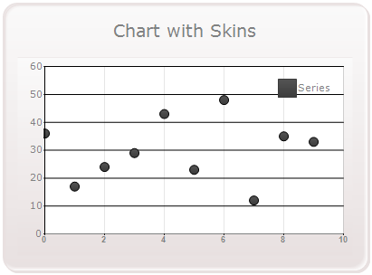{border="0"}

Figure 335: Marble

 

 

The following output is displayed when the Skins value is set to Midnight.

[]{style="FONT-FAMILY: 'Times New Roman','serif'; FONT-SIZE: 12pt"} 

[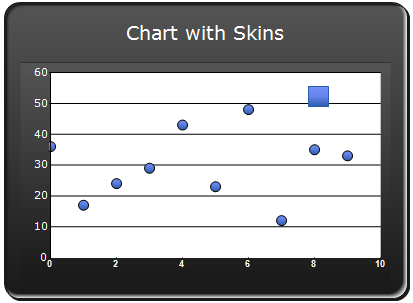{border="0"}]{style="FONT-FAMILY: 'Times New Roman','serif'; FONT-SIZE: 12pt"}[]{style="FONT-FAMILY: 'Times New Roman','serif'; FONT-SIZE: 12pt"}

Figure 336: Midnight

 

 

The following output is displayed when the Skins value is set to Monochrome.

[{border="0"}]{style="FONT-FAMILY: 'Times New Roman','serif'; FONT-SIZE: 12pt"}[]{style="FONT-FAMILY: 'Times New Roman','serif'; FONT-SIZE: 12pt"}

Figure 337: Monochrome

 

 

The following output is displayed when the Skins value is set to Olive.

[]{style="FONT-FAMILY: 'Times New Roman','serif'; FONT-SIZE: 12pt"} 

[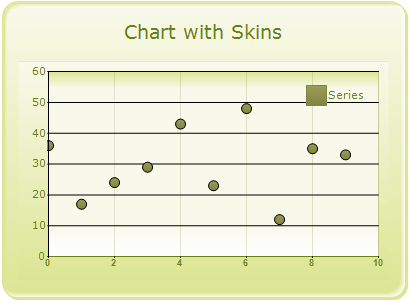{border="0"}]{style="FONT-FAMILY: 'Times New Roman','serif'; FONT-SIZE: 12pt"}[]{style="FONT-FAMILY: 'Times New Roman','serif'; FONT-SIZE: 12pt"}

Figure 338: Olive

 

 

The following output is displayed when the Skins value is set to Sandune.

 

[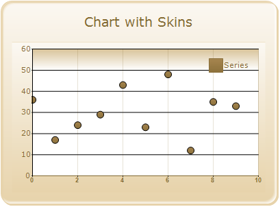{border="0"}]{style="FONT-FAMILY: 'Times New Roman','serif'; FONT-SIZE: 12pt"}[]{style="FONT-FAMILY: 'Times New Roman','serif'; FONT-SIZE: 12pt"}

Figure 339: Sandune

 

[]{style="FONT-FAMILY: 'Times New Roman','serif'; FONT-SIZE: 12pt"} 

The following output is displayed when the Skins value is set to Turquoise.

[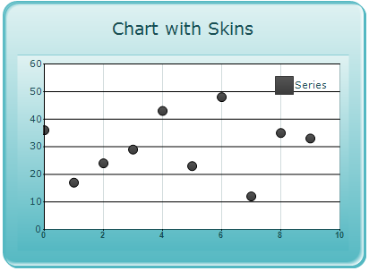{border="0"}]{style="FONT-FAMILY: 'Times New Roman','serif'; FONT-SIZE: 12pt"}[]{style="FONT-FAMILY: 'Times New Roman','serif'; FONT-SIZE: 12pt"}

Figure 340: Turquoise

 

[]{style="FONT-FAMILY: 'Times New Roman','serif'; FONT-SIZE: 12pt"} 

The following output is displayed when the Skins value is set to Vista.

 

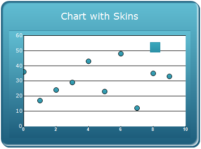{border="0"}

Figure 341: Vista

 

 

The following output is displayed when the Skins value is set to VS2010.

 

[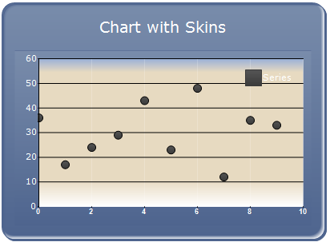{border="0"}]{style="FONT-FAMILY: 'Times New Roman','serif'; FONT-SIZE: 12pt"}[]{style="FONT-FAMILY: 'Times New Roman','serif'; FONT-SIZE: 12pt"}

Figure 342: VS2010[]{style="FONT-FAMILY: 'Times New Roman','serif'; FONT-SIZE: 12pt"}

[]{style="FONT-FAMILY: 'Times New Roman','serif'; FONT-SIZE: 12pt"} 

[]{style="FONT-FAMILY: 'Times New Roman','serif'; FONT-SIZE: 12pt"} 

[]{style="FONT-FAMILY: 'Times New Roman','serif'; FONT-SIZE: 12pt"} 

[]{style="FONT-FAMILY: 'Times New Roman','serif'; FONT-SIZE: 12pt"} 

[]{style="FONT-FAMILY: 'Times New Roman','serif'; FONT-SIZE: 12pt"} 

+--------------------------------------------------------------------------------------------------------------------------------------------------------------------------------------------------------------------------+
| [\[C#\]]{style="FONT-FAMILY: 'Times New Roman','serif'; FONT-SIZE: 12pt"}                                                                                                                                                |
|                                                                                                                                                                                                                          |
| [ChartSeries]{style="FONT-FAMILY: 'Courier New'; COLOR: #2b91af"}[ ser1 = [new]{style="COLOR: blue"} [ChartSeries]{style="COLOR: #2b91af"}([\"Series 1\"]{style="COLOR: #a31515"});]{style="FONT-FAMILY: 'Courier New'"} |
|                                                                                                                                                                                                                          |
| [ser1.Type = [ChartSeriesType]{style="COLOR: #2b91af"}.StackingColumn;]{style="FONT-FAMILY: 'Courier New'"}                                                                                                              |
|                                                                                                                                                                                                                          |
| [// specifing group name .]{style="FONT-FAMILY: 'Courier New'; COLOR: green"}                                                                                                                                            |
|                                                                                                                                                                                                                          |
| [ser1.StackingGroup = [\"FirstGroup\"]{style="COLOR: #a31515"};]{style="FONT-FAMILY: 'Courier New'"}                                                                                                                     |
|                                                                                                                                                                                                                          |
| [ChartSeries]{style="FONT-FAMILY: 'Courier New'; COLOR: #2b91af"}[ ser2 = [new]{style="COLOR: blue"} [ChartSeries]{style="COLOR: #2b91af"}([\"Series 2\"]{style="COLOR: #a31515"});]{style="FONT-FAMILY: 'Courier New'"} |
|                                                                                                                                                                                                                          |
| [ser2.Type = [ChartSeriesType]{style="COLOR: #2b91af"}.StackingColumn;]{style="FONT-FAMILY: 'Courier New'"}                                                                                                              |
|                                                                                                                                                                                                                          |
| [// specifing group name .]{style="FONT-FAMILY: 'Courier New'; COLOR: green"}                                                                                                                                            |
|                                                                                                                                                                                                                          |
| [ser2.StackingGroup = [\"SecondGroup\"]{style="COLOR: #a31515"};]{style="FONT-FAMILY: 'Courier New'"}                                                                                                                    |
|                                                                                                                                                                                                                          |
| [ChartSeries]{style="FONT-FAMILY: 'Courier New'; COLOR: #2b91af"}[ ser3 = [new]{style="COLOR: blue"} [ChartSeries]{style="COLOR: #2b91af"}([\"Series 3\"]{style="COLOR: #a31515"});]{style="FONT-FAMILY: 'Courier New'"} |
|                                                                                                                                                                                                                          |
| [ser3.Type = [ChartSeriesType]{style="COLOR: #2b91af"}.StackingColumn;]{style="FONT-FAMILY: 'Courier New'"}                                                                                                              |
|                                                                                                                                                                                                                          |
| [// specifing group name .]{style="FONT-FAMILY: 'Courier New'; COLOR: green"}                                                                                                                                            |
|                                                                                                                                                                                                                          |
| [ser3.StackingGroup = [\"FirstGroup\"]{style="COLOR: #a31515"};]{style="FONT-FAMILY: 'Courier New'"}[]{style="FONT-FAMILY: 'Courier New'; COLOR: green"}                                                                 |
+--------------------------------------------------------------------------------------------------------------------------------------------------------------------------------------------------------------------------+

[]{style="FONT-FAMILY: 'Times New Roman','serif'; FONT-SIZE: 12pt"} 

+------------------------------------------------------------------------------------------------------------------------------------------------------------------------------------------------------------+
| [\[VB\]]{style="FONT-FAMILY: 'Times New Roman','serif'; FONT-SIZE: 12pt"}                                                                                                                                  |
|                                                                                                                                                                                                            |
| [Dim]{style="FONT-FAMILY: 'Courier New'; COLOR: blue"}[ ser1 [As]{style="COLOR: blue"} [New]{style="COLOR: blue"} ChartSeries([\"Series 1\"]{style="COLOR: #a31515"})]{style="FONT-FAMILY: 'Courier New'"} |
|                                                                                                                                                                                                            |
| [ser1.Type = ChartSeriesType.StackingColumn]{style="FONT-FAMILY: 'Courier New'"}                                                                                                                           |
|                                                                                                                                                                                                            |
| [\' specifing group name .]{style="FONT-FAMILY: 'Courier New'; COLOR: green"}                                                                                                                              |
|                                                                                                                                                                                                            |
| [ser1.StackingGroup = [\"FirstGroup\"]{style="COLOR: #a31515"}]{style="FONT-FAMILY: 'Courier New'"}                                                                                                        |
|                                                                                                                                                                                                            |
| [Dim]{style="FONT-FAMILY: 'Courier New'; COLOR: blue"}[ ser2 [As]{style="COLOR: blue"} [New]{style="COLOR: blue"} ChartSeries([\"Series 2\"]{style="COLOR: #a31515"})]{style="FONT-FAMILY: 'Courier New'"} |
|                                                                                                                                                                                                            |
| [ser2.Type = ChartSeriesType.StackingColumn]{style="FONT-FAMILY: 'Courier New'"}                                                                                                                           |
|                                                                                                                                                                                                            |
| [\' specifing group name .]{style="FONT-FAMILY: 'Courier New'; COLOR: green"}                                                                                                                              |
|                                                                                                                                                                                                            |
| [ser2.StackingGroup = [\"SecondGroup\"]{style="COLOR: #a31515"}]{style="FONT-FAMILY: 'Courier New'"}                                                                                                       |
|                                                                                                                                                                                                            |
| [Dim]{style="FONT-FAMILY: 'Courier New'; COLOR: blue"}[ ser3 [As]{style="COLOR: blue"} [New]{style="COLOR: blue"} ChartSeries([\"Series 3\"]{style="COLOR: #a31515"})]{style="FONT-FAMILY: 'Courier New'"} |
|                                                                                                                                                                                                            |
| [ser3.Type = ChartSeriesType.StackingColumn]{style="FONT-FAMILY: 'Courier New'"}                                                                                                                           |
|                                                                                                                                                                                                            |
| [\' specifing group name .]{style="FONT-FAMILY: 'Courier New'; COLOR: green"}                                                                                                                              |
|                                                                                                                                                                                                            |
| [ser3.StackingGroup = [\"FirstGroup\"]{style="COLOR: #a31515"}]{style="FONT-FAMILY: 'Courier New'"}[]{style="FONT-FAMILY: 'Courier New'; COLOR: green"}                                                    |
+------------------------------------------------------------------------------------------------------------------------------------------------------------------------------------------------------------+

         

[]{#related-topics}
::::
