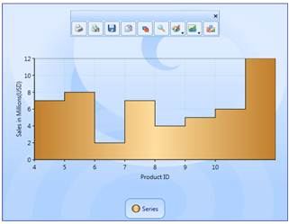
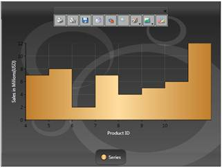
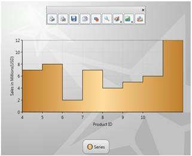
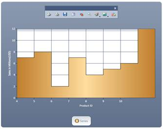
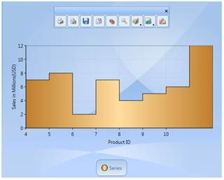
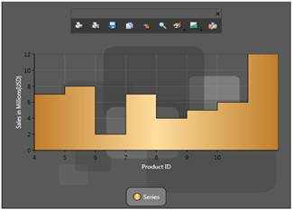
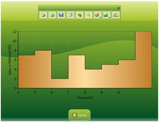
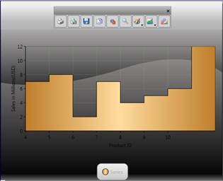
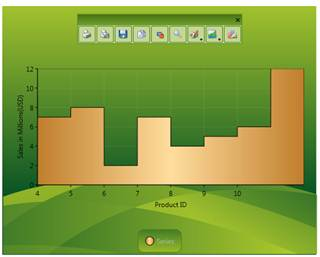

::: {style="DISPLAY: none"}
{#d2h_url_template}{#d2h_package_url style="WIDTH: 0px; DISPLAY: none; HEIGHT: 0px"}
:::

:::: {.d2h_secondary_topic style="PADDING-BOTTOM: 10pt; MARGIN: 0pt; PADDING-LEFT: 0pt; PADDING-RIGHT: 0pt; PADDING-TOP: 0pt"}
##### Chart Skins {#chart-skins style="tab-stops: 0pt"}

Essential Chart for WPF provides a number of built-in skins that delivers the chart with appealing look and feel with just one property, the **VisualStyle** property of the class SkinStorage from the **Shared.WPF** assembly. In addition for the skins getting applied to the window and Window title Bar, the skins will also be applied to all parts of the chart such as Chart Area and Chart Legend.

 

+------------------------------------------------------------------------------------------------------------------------------------------------------------------------------------------------------------------------------------------------------------------------------------------------------------------------------------------------------------------------------------------------------------------------------------------------------------------------------------------------------------------------------------------------+
| **[\[XAML\]]{style="FONT-FAMILY: 'Courier New'"}**                                                                                                                                                                                                                                                                                                                                                                                                                                                                                             |
|                                                                                                                                                                                                                                                                                                                                                                                                                                                                                                                                                |
| **[]{style="FONT-FAMILY: 'Courier New'"}**                                                                                                                                                                                                                                                                                                                                                                                                                                                                                                     |
|                                                                                                                                                                                                                                                                                                                                                                                                                                                                                                                                                |
| [\<]{style="FONT-FAMILY: 'Courier New'; COLOR: blue"}[syncfusion:Chart]{style="FONT-FAMILY: 'Courier New'; COLOR: #a31515"}[ ]{style="FONT-FAMILY: 'Courier New'; COLOR: blue"}[Grid.Column]{style="FONT-FAMILY: 'Courier New'; COLOR: red"}[=]{style="FONT-FAMILY: 'Courier New'; COLOR: blue"}[\"[0]{style="COLOR: blue"}\"[  ]{style="COLOR: blue"}[syncfusion:SkinStorage.VisualStyle]{style="COLOR: red"}[=]{style="COLOR: blue"}\"[Office2007Blue]{style="COLOR: blue"}\"[ \>]{style="COLOR: blue"}]{style="FONT-FAMILY: 'Courier New'"} |
|                                                                                                                                                                                                                                                                                                                                                                                                                                                                                                                                                |
| [\</]{style="FONT-FAMILY: 'Courier New'; COLOR: blue"}[syncfusion:Chart]{style="FONT-FAMILY: 'Courier New'; COLOR: #a31515"}[\>]{style="FONT-FAMILY: 'Courier New'; COLOR: blue"}                                                                                                                                                                                                                                                                                                                                                              |
+------------------------------------------------------------------------------------------------------------------------------------------------------------------------------------------------------------------------------------------------------------------------------------------------------------------------------------------------------------------------------------------------------------------------------------------------------------------------------------------------------------------------------------------------+

**[]{style="FONT-FAMILY: 'Trebuchet MS','sans-serif'; COLOR: #15428b"}** 

Required namespace

**[]{style="FONT-FAMILY: 'Trebuchet MS','sans-serif'; COLOR: #15428b"}** 

+---------------------------------------------------------------------------------------------------------------------------+
| **[\[C#\]]{style="FONT-FAMILY: 'Courier New'"}**                                                                          |
|                                                                                                                           |
| **[]{style="FONT-FAMILY: 'Courier New'"}**                                                                                |
|                                                                                                                           |
| [using]{style="FONT-FAMILY: 'Courier New'; COLOR: blue"}[ Syncfusion.Windows.Shared;]{style="FONT-FAMILY: 'Courier New'"} |
|                                                                                                                           |
| []{style="FONT-FAMILY: 'Courier New'"}                                                                                    |
|                                                                                                                           |
| [SkinStorage.SetVisualStyle(Chart1, [\"Office2007Blue\"]{style="COLOR: #a31515"});]{style="FONT-FAMILY: 'Courier New'"}   |
+---------------------------------------------------------------------------------------------------------------------------+

[]{style="FONT-FAMILY: 'Trebuchet MS','sans-serif'; COLOR: #15428b; FONT-SIZE: 9pt"} 

::: {style="BORDER-BOTTOM: windowtext 1pt solid; BORDER-LEFT: medium none; PADDING-BOTTOM: 1pt; MARGIN-TOP: 9pt; PADDING-LEFT: 0pt; PADDING-RIGHT: 0pt; MARGIN-BOTTOM: 9pt; BORDER-TOP: windowtext 1pt solid; BORDER-RIGHT: medium none; PADDING-TOP: 1pt"}
{border="0"}Note: Shared.WPF assembly should be referenced in the project to make use of this settings.
:::

[]{style="FONT-FAMILY: 'Trebuchet MS','sans-serif'; COLOR: #15428b; FONT-SIZE: 9pt"} 

[]{#p145} 

Various Built-In skins supported are:

[·      ]{style="FONT-FAMILY: Symbol"}Default

[·      ]{style="FONT-FAMILY: Symbol"}Blend

[·      ]{style="FONT-FAMILY: Symbol"}Office2003

[·      ]{style="FONT-FAMILY: Symbol"}Office2007Blue

[·      ]{style="FONT-FAMILY: Symbol"}Office2007Silver

[·      ]{style="FONT-FAMILY: Symbol"}Office2007Black

[·      ]{style="FONT-FAMILY: Symbol"}CoolBlue

[·      ]{style="FONT-FAMILY: Symbol"}BlueWave

[·      ]{style="FONT-FAMILY: Symbol"}BrightGray

[·      ]{style="FONT-FAMILY: Symbol"}ChocolateYellow

[·      ]{style="FONT-FAMILY: Symbol"}ForestGreen

[·      ]{style="FONT-FAMILY: Symbol"}LawnGreen

[·      ]{style="FONT-FAMILY: Symbol"}MixedGreen

[·      ]{style="FONT-FAMILY: Symbol"}SpringGreen

[·      ]{style="FONT-FAMILY: Symbol"}OrangeRed

[·      ]{style="FONT-FAMILY: Symbol"}VS2010

 

The following images illustrate the various skins applied to the Chart.

 

{border="0"}

Figure 217: Office2007Blue

 

{border="0"}

Figure 218: Office2007Black

*[]{style="FONT-SIZE: 9pt"}* 

{border="0"}

Figure 219: Office2007Silver

*[]{style="FONT-SIZE: 9pt"}* 

{border="0"}

Figure 220: VS2010

 

{border="0"}

Figure 221:Office2003

*[]{style="FONT-SIZE: 9pt"}* 

{border="0"}

Figure 222: Blend

 

{border="0"}

Figure 223: SpringGreen

 

[]{style="LINE-HEIGHT: 115%; FONT-FAMILY: 'Calibri','sans-serif'; FONT-SIZE: 11pt"} 

{border="0"}

Figure 224: BrightGray

[]{style="LINE-HEIGHT: 115%; FONT-FAMILY: 'Calibri','sans-serif'; FONT-SIZE: 11pt"} 

{border="0"}

Figure 225: LawnGreen

 

 

[]{#related-topics}
::::
