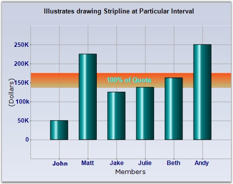
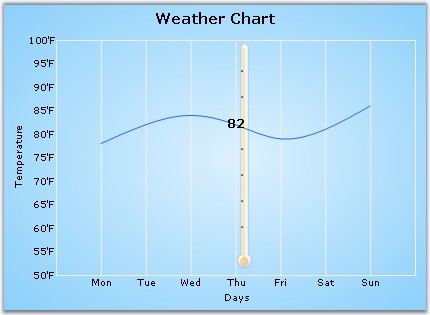

::: {style="DISPLAY: none"}
{#d2h_url_template}{#d2h_package_url style="WIDTH: 0px; DISPLAY: none; HEIGHT: 0px"}
:::

::::: {#nsbanner .d2h_main_nsbanner style="BORDER-BOTTOM: #999999 1px solid; POSITION: relative; PADDING-BOTTOM: 0px; BACKGROUND-COLOR: transparent; PADDING-LEFT: 0px; PADDING-RIGHT: 0px; DISPLAY: none; BORDER-TOP: #999999 1px solid; PADDING-TOP: 0px; LEFT: 0px"}
:::: {#TitleRow .d2h_main_titlerow style="PADDING-BOTTOM: 4px; BACKGROUND-COLOR: transparent; PADDING-LEFT: 22px; WIDTH: 100%; PADDING-RIGHT: 10px; DISPLAY: none; PADDING-TOP: 4px"}
::: {#ienav .d2h_main_ienav style="DISPLAY: none"}
{#D2HPrevious .D2HPreviousEnabled}  {#D2HNext .D2HNextEnabled}
:::
::::
:::::

::::: {#nstext .d2h_main_nstext style="PADDING-BOTTOM: 10px; BACKGROUND-COLOR: transparent; PADDING-LEFT: 22px; PADDING-RIGHT: 10px; HEIGHT: 100%; OVERFLOW: auto; PADDING-TOP: 5px" hasuserbackground="true" valign="bottom"}
::: {#d2h_breadcrumbs .d2h_breadcrumbs}
[Essential Studio User Guide Documentation](ms-xhelp:///?Id=12457748-09e3-4d74-a240-8e049cedf030){.d2h_breadcrumbsNormal}[ \> ]{.d2h_breadcrumbsLinkSeparator}[User Interface Edition](ms-xhelp:///?Id=c29296b7-531c-413b-a0ec-488ca1f7f669){.d2h_breadcrumbsNormal}[ \> ]{.d2h_breadcrumbsLinkSeparator}[Essential Windows](ms-xhelp:///?Id=e60759d8-47a4-4570-9d7a-16a68d63f2ea){.d2h_breadcrumbsNormal}[ \> ]{.d2h_breadcrumbsLinkSeparator}[Essential Chart]{.d2h_breadcrumbsContentsOnly}[ \> ]{.d2h_breadcrumbsLinkSeparator}[Concepts and Features](ms-xhelp:///?Id=71321e9c-336c-4c1c-a127-be9f135ad4bb){.d2h_breadcrumbsNormal}[ \> ]{.d2h_breadcrumbsLinkSeparator}[Chart Axes](ms-xhelp:///?Id=e0d0de4a-3c3c-41cd-9d94-6496172cab48){.d2h_breadcrumbsNormal}
:::

### Chart StripLines {#chart-striplines style="tab-stops: 0pt"}

 

Strip-lines are bands that are drawn at the background of the chart. They can be used to highlight areas of interest. They can be either vertical or horizontal and may be specified with a variety of options to precisely control where they are placed and how they are repeated. The strip-lines are stored in the **ChartAxis.StripLines** collection, which holds objects of class **ChartStripLine**.

 

A strip-line is configurable by setting its start, end, period and width in the same value type as the axis that holds it. The interior of the strip-lines support gradients, images and different text positions and orientations.

 

::: {align="center"}
  ------------------------ ---------------------------------------------------------------------------------------------------------------------------------------------------------------------------------------------------------------------------------------------------------------------------------------------------------------------------------------------------
  Chart control Property   Description
  BackImage                Sets the background image for the stripline.
  DateOffset               Gets / sets the offset of the stripline if the chart\'s PrimaryX-axis is of type **Datetime** and StartAtAxisPosition is **true**. Also see Offset.
  Enabled                  Enables the Stripline.
  End                      Gets /sets the end range (in double) of the stripline. Use this if the axis range type is **Double**. Also see EndDate.
  EndDate                  The end date of the stripline. Use this if the axis range type is **DateTime**. Also see End.
  Font                     The Font style in the which the stripline text if any will be rendered.
  FixedWidth               Specifies a fixed width for the chart stripline. Normally, the width of the stripline changes when the axis range changes. You can also set the width to be fixed irrespective of the AxisRange, by specifying a width in this property. After setting a fixed width, the stripline width will not vary beyond / less than the value that is set.
  Interior                 Interior brush information for the stripline.
  Offset                   Gets / sets the offset of the stripline if the chart\'s PrimaryX-axis is of type **Double** and StartAtAxisPosition is **true**. Also see DateOffset.
  Period                   Gets / sets the period (width of the range) over which the stripline appears.
  PeriodDate               Gets / sets the period (time span) over which the stripline appears if the value is **DateTime**.
  Start                    Gets / sets the start of the stripline. Also see End.
  StartAtAxisPosition      Indicates whether the Stripline will start at the start of the axis range.
  StartDate                The start date of the stripline.
  Text                     The text in the stripline.
  TextAlignment            Alignment of the text in the stripline.
  TextColor                The color of the text in the stripline.
  Vertical                 Indicates whether stripline is rendered vertically.
  Width                    The width of the stripline.
  WidthDate                Gets / sets the width of the stripline in a Time span.
  ------------------------ ---------------------------------------------------------------------------------------------------------------------------------------------------------------------------------------------------------------------------------------------------------------------------------------------------------------------------------------------------
:::

 

The following is the code to draw a stripline from x-axis with **DateTime** values.

 

+--------------------------------------------------------------------------------------------------------------------------------------------------------------------------------------------------------------------------------------------------------------------------------------------------------------------------+
| **[\[C#\]]{style="FONT-FAMILY: 'Courier New'; COLOR: black"}**                                                                                                                                                                                                                                                           |
|                                                                                                                                                                                                                                                                                                                          |
| []{style="FONT-FAMILY: 'Courier New'; COLOR: green"}                                                                                                                                                                                                                                                                     |
|                                                                                                                                                                                                                                                                                                                          |
| [//Declaring ]{style="FONT-FAMILY: 'Courier New'; COLOR: green"}                                                                                                                                                                                                                                                         |
|                                                                                                                                                                                                                                                                                                                          |
| [ChartStripLine]{style="FONT-FAMILY: 'Courier New'; COLOR: teal"}[ stripLine = [new]{style="COLOR: blue"} [ChartStripLine]{style="COLOR: teal"}();]{style="FONT-FAMILY: 'Courier New'"}                                                                                                                                  |
|                                                                                                                                                                                                                                                                                                                          |
| []{style="FONT-FAMILY: 'Courier New'"}                                                                                                                                                                                                                                                                                   |
|                                                                                                                                                                                                                                                                                                                          |
| [//Customizing the Stripline]{style="FONT-FAMILY: 'Courier New'; COLOR: green"}                                                                                                                                                                                                                                          |
|                                                                                                                                                                                                                                                                                                                          |
| [stripLine.Enabled = [true]{style="COLOR: blue"};]{style="FONT-FAMILY: 'Courier New'"}                                                                                                                                                                                                                                   |
|                                                                                                                                                                                                                                                                                                                          |
| [stripLine.Vertical = [false]{style="COLOR: blue"};]{style="FONT-FAMILY: 'Courier New'"}                                                                                                                                                                                                                                 |
|                                                                                                                                                                                                                                                                                                                          |
| [stripLine.Start = 140;]{style="FONT-FAMILY: 'Courier New'"}                                                                                                                                                                                                                                                             |
|                                                                                                                                                                                                                                                                                                                          |
| [stripLine.Width = 35;]{style="FONT-FAMILY: 'Courier New'"}                                                                                                                                                                                                                                                              |
|                                                                                                                                                                                                                                                                                                                          |
| [stripLine.FixedWidth = 30;]{style="FONT-FAMILY: 'Courier New'"}                                                                                                                                                                                                                                                         |
|                                                                                                                                                                                                                                                                                                                          |
| [stripLine.End = 175;]{style="FONT-FAMILY: 'Courier New'"}                                                                                                                                                                                                                                                               |
|                                                                                                                                                                                                                                                                                                                          |
| [stripLine.Text = [\"100% of Quota\"]{style="COLOR: maroon"};]{style="FONT-FAMILY: 'Courier New'"}                                                                                                                                                                                                                       |
|                                                                                                                                                                                                                                                                                                                          |
| [stripLine.TextColor = [Color]{style="COLOR: teal"}.Cyan;]{style="FONT-FAMILY: 'Courier New'"}                                                                                                                                                                                                                           |
|                                                                                                                                                                                                                                                                                                                          |
| [stripLine.TextAlignment = [ContentAlignment]{style="COLOR: teal"}.MiddleCenter;]{style="FONT-FAMILY: 'Courier New'"}                                                                                                                                                                                                    |
|                                                                                                                                                                                                                                                                                                                          |
| [stripLine.Font = [new]{style="COLOR: blue"} [Font]{style="COLOR: teal"}([\"Arial\"]{style="COLOR: maroon"}, 10, [FontStyle]{style="COLOR: teal"}.Bold);]{style="FONT-FAMILY: 'Courier New'"}                                                                                                                            |
|                                                                                                                                                                                                                                                                                                                          |
| [stripLine.Interior = [new]{style="COLOR: blue"} [BrushInfo]{style="COLOR: teal"}(230, [new]{style="COLOR: blue"} [BrushInfo]{style="COLOR: teal"}([GradientStyle]{style="COLOR: teal"}.Vertical, [Color]{style="COLOR: teal"}.OrangeRed, [Color]{style="COLOR: teal"}.DarkKhaki));]{style="FONT-FAMILY: 'Courier New'"} |
|                                                                                                                                                                                                                                                                                                                          |
| []{style="FONT-FAMILY: 'Courier New'; COLOR: blue"}                                                                                                                                                                                                                                                                      |
|                                                                                                                                                                                                                                                                                                                          |
| [//Adding stripline to the X-axis]{style="FONT-FAMILY: 'Courier New'; COLOR: green"}                                                                                                                                                                                                                                     |
|                                                                                                                                                                                                                                                                                                                          |
| [this]{style="FONT-FAMILY: 'Courier New'; COLOR: blue"}[.chartControl1.PrimaryYAxis.StripLines.Add(stripLine);]{style="FONT-FAMILY: 'Courier New'"}                                                                                                                                                                      |
+--------------------------------------------------------------------------------------------------------------------------------------------------------------------------------------------------------------------------------------------------------------------------------------------------------------------------+

 

+--------------------------------------------------------------------------------------------------------------------------------------------------------------------------------------------------------------------------------------------------------------------------------------------------+
| **[\[VB.NET\]]{style="FONT-FAMILY: 'Courier New'; COLOR: black"}**                                                                                                                                                                                                                               |
|                                                                                                                                                                                                                                                                                                  |
| []{style="COLOR: black; FONT-SIZE: 12pt"}                                                                                                                                                                                                                                                        |
|                                                                                                                                                                                                                                                                                                  |
| [\'Declaring ]{style="FONT-FAMILY: 'Courier New'; COLOR: green"}                                                                                                                                                                                                                                 |
|                                                                                                                                                                                                                                                                                                  |
| [Private]{style="FONT-FAMILY: 'Courier New'; COLOR: blue"}[ stripLine [As]{style="COLOR: blue"} ChartStripLine = [New]{style="COLOR: blue"} ChartStripLine()]{style="FONT-FAMILY: 'Courier New'"}                                                                                                |
|                                                                                                                                                                                                                                                                                                  |
| []{style="FONT-FAMILY: 'Courier New'; COLOR: green"}                                                                                                                                                                                                                                             |
|                                                                                                                                                                                                                                                                                                  |
| [\'Customizing the Stripline]{style="FONT-FAMILY: 'Courier New'; COLOR: green"}                                                                                                                                                                                                                  |
|                                                                                                                                                                                                                                                                                                  |
| [stripLine.Enabled = [True]{style="COLOR: blue"}]{style="FONT-FAMILY: 'Courier New'"}                                                                                                                                                                                                            |
|                                                                                                                                                                                                                                                                                                  |
| [stripLine.Vertical = [True]{style="COLOR: blue"}]{style="FONT-FAMILY: 'Courier New'"}                                                                                                                                                                                                           |
|                                                                                                                                                                                                                                                                                                  |
| [stripLine.Start = 140]{style="FONT-FAMILY: 'Courier New'"}                                                                                                                                                                                                                                      |
|                                                                                                                                                                                                                                                                                                  |
| [stripLine.Width = 35]{style="FONT-FAMILY: 'Courier New'"}                                                                                                                                                                                                                                       |
|                                                                                                                                                                                                                                                                                                  |
| [stripLine.FixedWidth = 30]{style="FONT-FAMILY: 'Courier New'"}                                                                                                                                                                                                                                  |
|                                                                                                                                                                                                                                                                                                  |
| [stripLine.End = 175]{style="FONT-FAMILY: 'Courier New'"}                                                                                                                                                                                                                                        |
|                                                                                                                                                                                                                                                                                                  |
| [stripLine.Text = [\"100% of Quota\"]{style="COLOR: maroon"}]{style="FONT-FAMILY: 'Courier New'"}                                                                                                                                                                                                |
|                                                                                                                                                                                                                                                                                                  |
| [stripLine.TextColor = Color.Cyan]{style="FONT-FAMILY: 'Courier New'"}                                                                                                                                                                                                                           |
|                                                                                                                                                                                                                                                                                                  |
| [stripLine.TextAlignment = ContentAlignment.MiddleCenter]{style="FONT-FAMILY: 'Courier New'"}                                                                                                                                                                                                    |
|                                                                                                                                                                                                                                                                                                  |
| [stripLine.Font = [New]{style="COLOR: blue"} Font([\"Arial\"]{style="COLOR: maroon"},10,[FontStyle]{style="COLOR: teal"}.Bold)]{style="FONT-FAMILY: 'Courier New'"}                                                                                                                              |
|                                                                                                                                                                                                                                                                                                  |
| [stripLine.Interior = [New]{style="COLOR: blue"} BrushInfo(230, [new]{style="COLOR: blue"} [BrushInfo]{style="COLOR: teal"}([GradientStyle]{style="COLOR: teal"}.Vertical,[Color]{style="COLOR: teal"}.OrangeRed, [Color]{style="COLOR: teal"}.DarkKhaki)))]{style="FONT-FAMILY: 'Courier New'"} |
|                                                                                                                                                                                                                                                                                                  |
| []{style="FONT-FAMILY: 'Courier New'"}                                                                                                                                                                                                                                                           |
|                                                                                                                                                                                                                                                                                                  |
| [\'Adding stripline to the X-axis]{style="FONT-FAMILY: 'Courier New'; COLOR: green"}                                                                                                                                                                                                             |
|                                                                                                                                                                                                                                                                                                  |
| [Me]{style="FONT-FAMILY: 'Courier New'; COLOR: blue"}[.chartControl1.PrimaryXAxis.StripLines.Add(stripLine)]{style="FONT-FAMILY: 'Courier New'"}                                                                                                                                                 |
+--------------------------------------------------------------------------------------------------------------------------------------------------------------------------------------------------------------------------------------------------------------------------------------------------+

[]{style="COLOR: red; FONT-SIZE: 8pt"} 

{border="0"}

 

Figure 273: Chart with Stripline rendered in Y-Axis

 

Use an image as StripLine by setting through **StripLine.BackImage** property.

 

{border="0"}

 

Figure 274: Chart with Image StripLine rendered in X-Axis

[]{#p190} 

[]{#related-topics}
:::::
