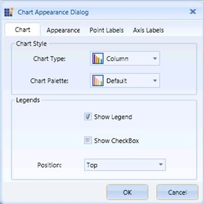

::: {style="DISPLAY: none"}
{#d2h_url_template}{#d2h_package_url style="WIDTH: 0px; DISPLAY: none; HEIGHT: 0px"}
:::

::::: {.d2h_secondary_topic style="PADDING-BOTTOM: 10pt; MARGIN: 0pt; PADDING-LEFT: 0pt; PADDING-RIGHT: 0pt; PADDING-TOP: 0pt"}
##### Chart Style and Legends   {#chart-style-and-legends style="tab-stops: 0pt"}

[]{style="FONT-FAMILY: 'Calibri','sans-serif'; FONT-SIZE: 11pt"} 

The Chart Appearance dialog box of the OLAP Chart provides options to set the Chart Type, Chart Color, Chart Legend Position, and Chart Legend and Legend Check Box Visibility.

The following table lists the properties and methods that are used to customize the Chart Style and Legends programmatically:

 

::: {align="center"}
+-----------------------------------+---------------------------------------------------------+
| Property                          | Description                                             |
+-----------------------------------+---------------------------------------------------------+
| ChartType                         | Sets the chart type for the OLAP Chart control.         |
+-----------------------------------+---------------------------------------------------------+
| ColorModel.Palette                | Specifies the chart color for the OLAP Chart control.   |
+-----------------------------------+---------------------------------------------------------+
| Legend.Visibility                 | Specifies the visibility of the Chart Legend.           |
|                                   |                                                         |
|                                   | The options included are as follows:                    |
|                                   |                                                         |
|                                   | [·      ]{style="FONT-FAMILY: Symbol"}Visible           |
|                                   |                                                         |
|                                   | [·      ]{style="FONT-FAMILY: Symbol"}Collapsed         |
+-----------------------------------+---------------------------------------------------------+
| Legend.CheckBoxVisibility         | Specifies the visibility of the Chart Legend Check Box. |
|                                   |                                                         |
|                                   |                                                         |
|                                   |                                                         |
|                                   | The options included are as follows:                    |
|                                   |                                                         |
|                                   | [·      ]{style="FONT-FAMILY: Symbol"}Visible           |
|                                   |                                                         |
|                                   | [·      ]{style="FONT-FAMILY: Symbol"}Collapsed         |
+-----------------------------------+---------------------------------------------------------+
:::

 

::: {align="center"}
+-----------------------------------+------------------------------------------------+
| Method                            | Description                                    |
+-----------------------------------+------------------------------------------------+
| ChartDockPanel.SetDock            | Specifies the position of the Chart Legend.    |
|                                   |                                                |
|                                   |                                                |
|                                   |                                                |
|                                   | The options included are as follows:           |
|                                   |                                                |
|                                   | [·      ]{style="FONT-FAMILY: Symbol"}Right    |
|                                   |                                                |
|                                   | [·      ]{style="FONT-FAMILY: Symbol"}Left     |
|                                   |                                                |
|                                   | [·      ]{style="FONT-FAMILY: Symbol"}Top      |
|                                   |                                                |
|                                   | [·      ]{style="FONT-FAMILY: Symbol"}Bottom   |
|                                   |                                                |
|                                   | [·      ]{style="FONT-FAMILY: Symbol"}Floating |
+-----------------------------------+------------------------------------------------+
:::

 

The following code examples illustrate how to customize the Chart Style and Legends:

+------------------------------------------------------------------------------------------------------------------------------------------------+
| \[**C#\]**                                                                                                                                     |
|                                                                                                                                                |
| []{style="COLOR: green"}                                                                                                                       |
|                                                                                                                                                |
| [// Set the Chart Type.]{style="COLOR: green"}\                                                                                                |
| [this]{style="COLOR: blue"}.olapchart1.ChartType = [ChartTypes]{style="COLOR: #2b91af"}.Column;\                                               |
|  \                                                                                                                                             |
| [// Set the Chart Color.]{style="COLOR: green"}\                                                                                               |
| [this]{style="COLOR: blue"}.olapchart1.ColorModel.Palette = [ChartColorPalette]{style="COLOR: #2b91af"}.Colorful;\                             |
|  \                                                                                                                                             |
| [// Set the Chart Legend and Legend Check Box Visibility.]{style="COLOR: green"}\                                                              |
| [this]{style="COLOR: blue"}.olapchart1.Legend.Visibility = [Visibility]{style="COLOR: #2b91af"}.Visible;\                                      |
| [this]{style="COLOR: blue"}.olapchart1.Legend.Visibility = [Visibility]{style="COLOR: #2b91af"}.Collapsed;\                                    |
| [this]{style="COLOR: blue"}.olapchart1.Legend.CheckBoxVisibility = [Visibility]{style="COLOR: #2b91af"}.Visible;\                              |
| [this]{style="COLOR: blue"}.olapchart1.Legend.CheckBoxVisibility = [Visibility]{style="COLOR: #2b91af"}.Collapsed;\                            |
|  \                                                                                                                                             |
| [// Set the Chart Legend Position.]{style="COLOR: green"}\                                                                                     |
| [ChartDockPanel]{style="COLOR: #2b91af"}.SetDock([this]{style="COLOR: blue"}.olapchart1.Legend, [ChartDock]{style="COLOR: #2b91af"}.Right);\   |
| [ChartDockPanel]{style="COLOR: #2b91af"}.SetDock([this]{style="COLOR: blue"}.olapchart1.Legend, [ChartDock]{style="COLOR: #2b91af"}.Left);\    |
| [ChartDockPanel]{style="COLOR: #2b91af"}.SetDock([this]{style="COLOR: blue"}.olapchart1.Legend, [ChartDock]{style="COLOR: #2b91af"}.Top);\     |
| [ChartDockPanel]{style="COLOR: #2b91af"}.SetDock([this]{style="COLOR: blue"}.olapchart1.Legend, [ChartDock]{style="COLOR: #2b91af"}.Bottom);\  |
| [ChartDockPanel]{style="COLOR: #2b91af"}.SetDock([this]{style="COLOR: blue"}.olapchart1.Legend, [ChartDock]{style="COLOR: #2b91af"}.Floating); |
+------------------------------------------------------------------------------------------------------------------------------------------------+

[]{style="FONT-FAMILY: 'Calibri','sans-serif'; FONT-SIZE: 11pt"} 

+---------------------------------------------------------------------------------------------------------------------------------------------+
| **\[VB\]**                                                                                                                                  |
|                                                                                                                                             |
| []{style="COLOR: green"}                                                                                                                    |
|                                                                                                                                             |
| [\' Set the Chart Type.]{style="COLOR: green"}\                                                                                             |
| [Me]{style="COLOR: blue"}.olapchart1.ChartType = [ChartTypes]{style="COLOR: #2b91af"}.Column\                                               |
|  \                                                                                                                                          |
| [\' Set the Chart Series Color.]{style="COLOR: green"}\                                                                                     |
| [Me]{style="COLOR: blue"}.olapchart1.ColorModel.Palette = [ChartColorPalette]{style="COLOR: #2b91af"}.Colorful\                             |
|  \                                                                                                                                          |
| [\' Set the Chart Legend and Legend Check Box Visibility.]{style="COLOR: green"}\                                                           |
| [Me]{style="COLOR: blue"}.olapchart1.Legend.Visibility = Visibility.Visible\                                                                |
| [Me]{style="COLOR: blue"}.olapchart1.Legend.Visibility = Visibility.Collapsed\                                                              |
| [Me]{style="COLOR: blue"}.olapchart1.Legend.CheckBoxVisibility = Visibility.Visible\                                                        |
| [Me]{style="COLOR: blue"}.olapchart1.Legend.CheckBoxVisibility = Visibility.Collapsed\                                                      |
|  \                                                                                                                                          |
| [\' Set the Chart Legend Position.]{style="COLOR: green"}\                                                                                  |
| [ChartDockPanel]{style="COLOR: #2b91af"}.SetDock([Me]{style="COLOR: blue"}.olapchart1.Legend, [ChartDock]{style="COLOR: #2b91af"}.Right)\   |
| [ChartDockPanel]{style="COLOR: #2b91af"}.SetDock([Me]{style="COLOR: blue"}.olapchart1.Legend, [ChartDock]{style="COLOR: #2b91af"}.Left)\    |
| [ChartDockPanel]{style="COLOR: #2b91af"}.SetDock([Me]{style="COLOR: blue"}.olapchart1.Legend, [ChartDock]{style="COLOR: #2b91af"}.Top)\     |
| [ChartDockPanel]{style="COLOR: #2b91af"}.SetDock([Me]{style="COLOR: blue"}.olapchart1.Legend, [ChartDock]{style="COLOR: #2b91af"}.Bottom)\  |
| [ChartDockPanel]{style="COLOR: #2b91af"}.SetDock([Me]{style="COLOR: blue"}.olapchart1.Legend, [ChartDock]{style="COLOR: #2b91af"}.Floating) |
+---------------------------------------------------------------------------------------------------------------------------------------------+

[]{style="FONT-FAMILY: 'Calibri','sans-serif'; FONT-SIZE: 11pt"} 

{border="0"}

Figure 65: Customizing the Chart Style and Legends[]{style="FONT-FAMILY: 'Calibri','sans-serif'; FONT-SIZE: 11pt"}

A sample, which demonstrates all the appearance properties, is available in the following installation location:

**..\\Syncfusion\\\<Version Number\>\\BI\\WPF\\OlapChart.WPF\\Samples\\Chart Appearance**

[]{style="FONT-FAMILY: 'Calibri','sans-serif'; FONT-SIZE: 11pt"} 

[]{#related-topics}
:::::
