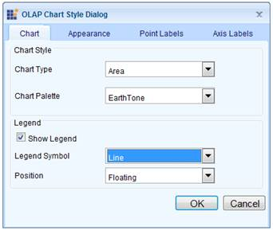

::: {style="DISPLAY: none"}
{#d2h_url_template}{#d2h_package_url style="WIDTH: 0px; DISPLAY: none; HEIGHT: 0px"}
:::

::::: {#nsbanner .d2h_main_nsbanner style="BORDER-BOTTOM: #999999 1px solid; POSITION: relative; PADDING-BOTTOM: 0px; BACKGROUND-COLOR: transparent; PADDING-LEFT: 0px; PADDING-RIGHT: 0px; DISPLAY: none; BORDER-TOP: #999999 1px solid; PADDING-TOP: 0px; LEFT: 0px"}
:::: {#TitleRow .d2h_main_titlerow style="PADDING-BOTTOM: 4px; BACKGROUND-COLOR: transparent; PADDING-LEFT: 22px; WIDTH: 100%; PADDING-RIGHT: 10px; DISPLAY: none; PADDING-TOP: 4px"}
::: {#ienav .d2h_main_ienav style="DISPLAY: none"}
{#D2HPrevious .D2HPreviousEnabled}  {#D2HNext .D2HNextEnabled}
:::
::::
:::::

::::: {#nstext .d2h_main_nstext style="PADDING-BOTTOM: 10px; BACKGROUND-COLOR: transparent; PADDING-LEFT: 22px; PADDING-RIGHT: 10px; HEIGHT: 100%; OVERFLOW: auto; PADDING-TOP: 5px" hasuserbackground="true" valign="bottom"}
::: {#d2h_breadcrumbs .d2h_breadcrumbs}
[Essential Studio User Guide Documentation](ms-xhelp:///?Id=12457748-09e3-4d74-a240-8e049cedf030){.d2h_breadcrumbsNormal}[ \> ]{.d2h_breadcrumbsLinkSeparator}[Business Intelligence Edition](ms-xhelp:///?Id=fdf33dd8-62b2-47b9-ad7b-fc50e590bca5){.d2h_breadcrumbsNormal}[ \> ]{.d2h_breadcrumbsLinkSeparator}[Essential BI ASP.NET](ms-xhelp:///?Id=99c6694e-59c3-4c59-abb5-ce9ce9a948bc){.d2h_breadcrumbsNormal}[ \> ]{.d2h_breadcrumbsLinkSeparator}[Essential BI Chart]{.d2h_breadcrumbsContentsOnly}[ \> ]{.d2h_breadcrumbsLinkSeparator}[Concepts and Features](ms-xhelp:///?Id=be4e11fe-e0a1-44d7-aa3a-05cf8b78bdb8){.d2h_breadcrumbsNormal}[ \> ]{.d2h_breadcrumbsLinkSeparator}[Chart Appearance](ms-xhelp:///?Id=6b450f80-063f-4b1a-8de8-c88c1c925ebe){.d2h_breadcrumbsNormal}
:::

### Chart Style Dialog Box {#chart-style-dialog-box style="tab-stops: 0pt"}

 

The chart style dialog box is basically called using the script in order to avoid postback and the following code snippets provide the solution to invoke the dialog box:

 

 

+-----------------------------------------------------------------------------------------------------------------------------------------------------------------------------------------------------------------------------------------------------------------------------------------+
| **[\[C#\]]{style="FONT-FAMILY: 'Courier New'"}**[]{style="FONT-FAMILY: 'Courier New'"}                                                                                                                                                                                                  |
|                                                                                                                                                                                                                                                                                         |
| [this]{style="FONT-FAMILY: 'Courier New'; COLOR: blue"}[.olapChart1.ShowStyleDialog = [true]{style="COLOR: blue"};]{style="FONT-FAMILY: 'Courier New'"}[]{style="FONT-FAMILY: 'Courier New'"}                                                                                           |
|                                                                                                                                                                                                                                                                                         |
| [if]{style="FONT-FAMILY: 'Courier New'; COLOR: blue"}[ ([this]{style="COLOR: blue"}.olapChart1.ChartStyleDialog != [null]{style="COLOR: blue"})]{style="FONT-FAMILY: 'Courier New'"}                                                                                                    |
|                                                                                                                                                                                                                                                                                         |
| [this]{style="FONT-FAMILY: 'Courier New'; COLOR: blue"}[.Button1.OnClientClick = [\"ShowWindow(\'\"]{style="COLOR: #a31515"} + [this]{style="COLOR: blue"}.olapChart1.ChartStyleDialog.ClientID + [\"\');return false;\"]{style="COLOR: #a31515"};]{style="FONT-FAMILY: 'Courier New'"} |
+-----------------------------------------------------------------------------------------------------------------------------------------------------------------------------------------------------------------------------------------------------------------------------------------+

[]{style="FONT-FAMILY: 'Calibri','sans-serif'"} 

+------------------------------------------------------------------------------------------------------------------------------------------------------------------------------------------------------------------------------------------------------------------------------------+
| **[\[VB\]]{style="FONT-FAMILY: 'Courier New'"}**[]{style="FONT-FAMILY: 'Courier New'"}                                                                                                                                                                                             |
|                                                                                                                                                                                                                                                                                    |
| [Me]{style="FONT-FAMILY: 'Courier New'; COLOR: blue"}[.olapChart1.ShowStyleDialog = [True]{style="COLOR: blue"}]{style="FONT-FAMILY: 'Courier New'"}[]{style="FONT-FAMILY: 'Courier New'"}                                                                                         |
|                                                                                                                                                                                                                                                                                    |
| [If]{style="FONT-FAMILY: 'Courier New'; COLOR: blue"}[ [Me]{style="COLOR: blue"}.olapChart1.ChartStyleDialog [IsNot]{style="COLOR: blue"} [Nothing]{style="COLOR: blue"} [Then]{style="COLOR: blue"}]{style="FONT-FAMILY: 'Courier New'"}                                          |
|                                                                                                                                                                                                                                                                                    |
| [Me]{style="FONT-FAMILY: 'Courier New'; COLOR: blue"}[.Button1.OnClientClick = [\"ShowWindow(\'\"]{style="COLOR: #a31515"} & [Me]{style="COLOR: blue"}.olapChart1.ChartStyleDialog.ClientID & [\"\');return false;\"]{style="COLOR: #a31515"}]{style="FONT-FAMILY: 'Courier New'"} |
|                                                                                                                                                                                                                                                                                    |
| [End]{style="FONT-FAMILY: 'Courier New'; COLOR: blue"}[ [If]{style="COLOR: blue"}]{style="FONT-FAMILY: 'Courier New'"}[]{style="FONT-FAMILY: 'Courier New'; COLOR: black"}                                                                                                         |
+------------------------------------------------------------------------------------------------------------------------------------------------------------------------------------------------------------------------------------------------------------------------------------+

[]{style="FONT-FAMILY: 'Calibri','sans-serif'; COLOR: black"} 

+--------------------------------------------------------------------------------------------------------------------+
| **[\[SCRIPT\] ]{style="FONT-FAMILY: 'Courier New'"}**[]{style="FONT-FAMILY: 'Courier New'"}                        |
|                                                                                                                    |
| [\<script type=\"text/javascript\"\>]{style="FONT-FAMILY: 'Courier New'; COLOR: blue"}                             |
|                                                                                                                    |
| [      function ShowWindow(winowId) {]{style="FONT-FAMILY: 'Courier New'; COLOR: blue"}                            |
|                                                                                                                    |
| [            \$find(winowId).Open();]{style="FONT-FAMILY: 'Courier New'; COLOR: blue"}                             |
|                                                                                                                    |
| [            return false;]{style="FONT-FAMILY: 'Courier New'; COLOR: blue"}                                       |
|                                                                                                                    |
| [      }]{style="FONT-FAMILY: 'Courier New'; COLOR: blue"}                                                         |
|                                                                                                                    |
| [\</script\>]{style="FONT-FAMILY: 'Courier New'; COLOR: blue"}[]{style="FONT-FAMILY: 'Courier New'; COLOR: black"} |
+--------------------------------------------------------------------------------------------------------------------+

[]{style="FONT-FAMILY: 'Calibri','sans-serif'; COLOR: black"} 

{border="0"}

 

Figure 42: Chart Style Dialog Box

 

 

Table 21: Chart Style Dialog Box

 

::: {align="center"}
+--------------------------------------------------------------+----------------------------------------------------------------------------------------------------+-------------------------------------+---------------------------------+---------------------------+
| Property                                                     | Descriptions                                                                                       | Type                                | Data                            | Reference Link            |
|                                                              |                                                                                                    |                                     |                                 |                           |
|                                                              |                                                                                                    |                                     | type                            |                           |
+--------------------------------------------------------------+----------------------------------------------------------------------------------------------------+-------------------------------------+---------------------------------+---------------------------+
| ShowStyleDialog[]{style="COLOR: black"}                      | [Enables/disables the apprearnce of style dialog box.]{style="COLOR: black"}                       | [Server side]{style="COLOR: black"} | [boolean]{style="COLOR: black"} | [-]{style="COLOR: black"} |
+--------------------------------------------------------------+----------------------------------------------------------------------------------------------------+-------------------------------------+---------------------------------+---------------------------+
| [OnClientClick]{style="FONT-FAMILY: 'Calibri','sans-serif'"} | [On clicking, the dialog box opens from client-side]{style="COLOR: black"}[]{style="COLOR: black"} | [Client side]{style="COLOR: black"} | [string]{style="COLOR: black"}  | [-]{style="COLOR: black"} |
+--------------------------------------------------------------+----------------------------------------------------------------------------------------------------+-------------------------------------+---------------------------------+---------------------------+
:::

 

Sample Link

A sample demo is available at the following location:

**** 

..\\Syncfusion\\EssentialStudio\\\<Version Number\>\\BI\\Web\\OlapChart.Web\\Samples\\3.5\\Chart Appearance\\ Chart Style DialogBox Demo\\[]{style="FONT-FAMILY: 'Cambria','serif'; COLOR: black; FONT-SIZE: 12pt"}

[]{#related-topics}
:::::
