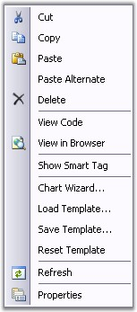

::: {style="DISPLAY: none"}
{#d2h_url_template}{#d2h_package_url style="WIDTH: 0px; DISPLAY: none; HEIGHT: 0px"}
:::

::::: {#nsbanner .d2h_main_nsbanner style="BORDER-BOTTOM: #999999 1px solid; POSITION: relative; PADDING-BOTTOM: 0px; BACKGROUND-COLOR: transparent; PADDING-LEFT: 0px; PADDING-RIGHT: 0px; DISPLAY: none; BORDER-TOP: #999999 1px solid; PADDING-TOP: 0px; LEFT: 0px"}
:::: {#TitleRow .d2h_main_titlerow style="PADDING-BOTTOM: 4px; BACKGROUND-COLOR: transparent; PADDING-LEFT: 22px; WIDTH: 100%; PADDING-RIGHT: 10px; DISPLAY: none; PADDING-TOP: 4px"}
::: {#ienav .d2h_main_ienav style="DISPLAY: none"}
{#D2HPrevious .D2HPreviousEnabled}  {#D2HNext .D2HNextEnabled}
:::
::::
:::::

:::: {#nstext .d2h_main_nstext style="PADDING-BOTTOM: 10px; BACKGROUND-COLOR: transparent; PADDING-LEFT: 22px; PADDING-RIGHT: 10px; HEIGHT: 100%; OVERFLOW: auto; PADDING-TOP: 5px" hasuserbackground="true" valign="bottom"}
::: {#d2h_breadcrumbs .d2h_breadcrumbs}
[Essential Studio User Guide Documentation](ms-xhelp:///?Id=12457748-09e3-4d74-a240-8e049cedf030){.d2h_breadcrumbsNormal}[ \> ]{.d2h_breadcrumbsLinkSeparator}[User Interface Edition](ms-xhelp:///?Id=c29296b7-531c-413b-a0ec-488ca1f7f669){.d2h_breadcrumbsNormal}[ \> ]{.d2h_breadcrumbsLinkSeparator}[Essential ASP.NET](ms-xhelp:///?Id=25c35330-c127-4dad-9a92-ed79dc7261a6){.d2h_breadcrumbsNormal}[ \> ]{.d2h_breadcrumbsLinkSeparator}[Essential Chart]{.d2h_breadcrumbsContentsOnly}[ \> ]{.d2h_breadcrumbsLinkSeparator}[Concepts and Features](ms-xhelp:///?Id=100687ce-82f2-4424-9d16-0949ea76cf15){.d2h_breadcrumbsNormal}[ \> ]{.d2h_breadcrumbsLinkSeparator}[DesignTime Features](ms-xhelp:///?Id=09ba987f-d8ce-4f07-9166-8b07e0eff244){.d2h_breadcrumbsNormal}
:::

### Chart Templates {#chart-templates style="tab-stops: 0pt"}

[]{style="FONT-FAMILY: 'Trebuchet MS','sans-serif'; FONT-SIZE: 9pt"} 

Working with Chart Template

[]{style="FONT-FAMILY: 'Trebuchet MS','sans-serif'; FONT-SIZE: 9pt"} 

Essential Chart is now associated with the creation and loading of chart templates into the ChartControl. It provides easy methods to save and load the templates. This section will walk you through the saving, loading and resetting of the chart templates and the various benefits of using it.

[]{style="FONT-FAMILY: 'Trebuchet MS','sans-serif'; FONT-SIZE: 9pt"} 

Benefits

[]{style="FONT-FAMILY: 'Trebuchet MS','sans-serif'; FONT-SIZE: 9pt"} 

[·      ]{style="FONT-FAMILY: Symbol"}Aesthetic items like appearance, positioning etc., of a chart can be saved in the template.

[·      ]{style="FONT-FAMILY: Symbol"}Appearance settings saved in a Chart Template is reusable.

[·      ]{style="FONT-FAMILY: Symbol"}Also stores any static data, if available in the chart.

[·      ]{style="FONT-FAMILY: Symbol"}The user can save the existing structure of the chart control to an .xml file format.

[·      ]{style="FONT-FAMILY: Symbol"}All the charts in your applications can be created with consistent look and feel.

[]{style="FONT-FAMILY: 'Trebuchet MS','sans-serif'; FONT-SIZE: 9pt"} 

{border="0"}

[]{style="FONT-FAMILY: 'Trebuchet MS','sans-serif'; FONT-SIZE: 9pt"} 

Figure 316: Saving Template through Context Menu

**[]{style="FONT-FAMILY: 'Trebuchet MS','sans-serif'; FONT-SIZE: 9pt"}** 

Save Template

[]{style="FONT-FAMILY: 'Trebuchet MS','sans-serif'; FONT-SIZE: 9pt"} 

The appearance settings for various components of a Chart like ChartSeries and ChartArea etc., are stored in a template, which can be loaded later into another different ChartControl.

 

A chart template can contain the properties of more than one data series. When such templates are loaded into a destination ChartControl, the appearance settings of the data series will be applied in a sequential order, i.e., the first set of appearance settings of a data series will be applied to the destination Chart\'s first series and the second set of appearance properties of the data series will be applied to the destination Chart\'s second series and so on.

 

If the destination collection\'s length is larger than the source collection, then the settings will repeat itself for these additional entries in the destination collection.

 

These Charts can be saved as templates in the below two ways.

[]{style="FONT-FAMILY: 'Trebuchet MS','sans-serif'; FONT-SIZE: 9pt"} 

[·      ]{style="FONT-FAMILY: Symbol"}Selecting the **Save Template** option from the context menu as shown above.

[·      ]{style="FONT-FAMILY: Symbol"}By clicking the **Save Template** designer verb in the Visual Studio property browser as shown above.

[·      ]{style="FONT-FAMILY: Symbol"}ChartTemplate has a static method to save the data programmatically. We need to pass ChartControl instance and a file name(it can accept stream file also.), through this save method.

[]{style="FONT-FAMILY: 'Trebuchet MS','sans-serif'; FONT-SIZE: 9pt"} 

+---------------------------------------------------------------------------------------------------------------------------------------------------------------------------------------------------------------+
| **[\[C#\]]{style="FONT-FAMILY: 'Courier New'; COLOR: black"}**                                                                                                                                                |
|                                                                                                                                                                                                               |
| **[]{style="FONT-FAMILY: 'Courier New'; COLOR: black"}**                                                                                                                                                      |
|                                                                                                                                                                                                               |
| [ChartTemplate]{style="FONT-FAMILY: 'Courier New'; COLOR: #2b91af"}[.Save([this]{style="COLOR: blue"}.ChartWebControl1, [\"TemplateName.xml\"]{style="COLOR: #a31515"});]{style="FONT-FAMILY: 'Courier New'"} |
+---------------------------------------------------------------------------------------------------------------------------------------------------------------------------------------------------------------+

[]{style="FONT-FAMILY: 'Trebuchet MS','sans-serif'; FONT-SIZE: 9pt"} 

+----------------------------------------------------------------------------------------------------------------------------------------------------------------------------------------------------------+
| **[\[VB\]]{style="FONT-FAMILY: 'Courier New'; COLOR: black"}**                                                                                                                                           |
|                                                                                                                                                                                                          |
| []{style="FONT-FAMILY: 'Courier New'; COLOR: green"}                                                                                                                                                     |
|                                                                                                                                                                                                          |
| [ChartTemplate]{style="FONT-FAMILY: 'Courier New'; COLOR: black"}[.Save([Me]{style="COLOR: blue"}.ChartWebControl1, [\"TemplateName.xml\"]{style="COLOR: #a31515"})]{style="FONT-FAMILY: 'Courier New'"} |
+----------------------------------------------------------------------------------------------------------------------------------------------------------------------------------------------------------+

[]{style="FONT-FAMILY: 'Trebuchet MS','sans-serif'; FONT-SIZE: 9pt"} 

Load Template

[]{style="FONT-FAMILY: 'Trebuchet MS','sans-serif'; FONT-SIZE: 9pt"} 

Essential Chart provides easy methods to load an already saved Chart template.

[]{style="FONT-FAMILY: 'Trebuchet MS','sans-serif'; FONT-SIZE: 9pt"} 

[·      ]{style="FONT-FAMILY: Symbol"}At the design time, by selecting the **Load Template** from the context menu.

[·      ]{style="FONT-FAMILY: Symbol"}By clicking the **Load Template** designer verb, in the Visual Studio property browser.

[]{style="FONT-FAMILY: 'Trebuchet MS','sans-serif'; FONT-SIZE: 9pt"} 

ChartTemplate has static method, to load the template data programmatically. We need to pass the ChartControl that will be applied with the loaded template data.

[]{style="FONT-FAMILY: 'Trebuchet MS','sans-serif'; FONT-SIZE: 9pt"} 

Reset Template

**[]{style="FONT-FAMILY: 'Trebuchet MS','sans-serif'; FONT-SIZE: 9pt"}** 

The ChartControl, which when loaded with a template will be applied with the appearance and other settings that were stored in the template. These settings can be reset and the Chart can be reverted back to its original appearance by using the below two methods.

[]{style="FONT-FAMILY: 'Trebuchet MS','sans-serif'; FONT-SIZE: 9pt"} 

[·      ]{style="FONT-FAMILY: Symbol"}At the design time, by selecting the \"Reset Template..\" from the context menu.

[·      ]{style="FONT-FAMILY: Symbol"}By clicking the \"Reset Template\" link in the Visual Studio property browser.

[]{style="FONT-FAMILY: 'Trebuchet MS','sans-serif'; FONT-SIZE: 9pt"} 

ChartTemplate can be reset using the following simple statements:

[]{style="FONT-FAMILY: 'Trebuchet MS','sans-serif'; FONT-SIZE: 9pt"} 

+--------------------------------------------------------------------------------------------------------------------------------------------------------------------------------------+
| **[\[C#\]]{style="FONT-FAMILY: 'Courier New'; COLOR: black"}**                                                                                                                       |
|                                                                                                                                                                                      |
| **[]{style="FONT-FAMILY: 'Courier New'; COLOR: black"}**                                                                                                                             |
|                                                                                                                                                                                      |
| [ChartTemplate]{style="FONT-FAMILY: 'Courier New'; COLOR: #2b91af"}[ ct = [new]{style="COLOR: blue"} [ChartTemplate]{style="COLOR: #2b91af"}();]{style="FONT-FAMILY: 'Courier New'"} |
|                                                                                                                                                                                      |
| [ct.Reset([this]{style="COLOR: blue"}.ChartWebControl1);]{style="FONT-FAMILY: 'Courier New'"}                                                                                        |
+--------------------------------------------------------------------------------------------------------------------------------------------------------------------------------------+

[]{style="FONT-FAMILY: 'Trebuchet MS','sans-serif'; FONT-SIZE: 9pt"} 

+---------------------------------------------------------------------------------------------------------------------------------------------------------------------------------+
| **[\[VB\]]{style="FONT-FAMILY: 'Courier New'; COLOR: black"}**                                                                                                                  |
|                                                                                                                                                                                 |
| []{style="FONT-FAMILY: 'Courier New'; COLOR: green"}                                                                                                                            |
|                                                                                                                                                                                 |
| [ChartTemplate]{style="FONT-FAMILY: 'Courier New'; COLOR: black"}[ ct = [New]{style="COLOR: blue"} [ChartTemplate]{style="COLOR: black"}()]{style="FONT-FAMILY: 'Courier New'"} |
|                                                                                                                                                                                 |
| [ct.Reset([Me]{style="COLOR: blue"}.ChartWebControl1)]{style="FONT-FAMILY: 'Courier New'"}                                                                                      |
+---------------------------------------------------------------------------------------------------------------------------------------------------------------------------------+

[]{#p257} 

[]{#related-topics}
::::
