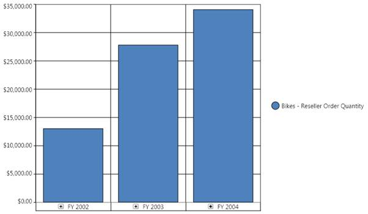

::: {style="DISPLAY: none"}
{#d2h_url_template}{#d2h_package_url style="WIDTH: 0px; DISPLAY: none; HEIGHT: 0px"}
:::

:::: {.d2h_secondary_topic style="PADDING-BOTTOM: 10pt; MARGIN: 0pt; PADDING-LEFT: 0pt; PADDING-RIGHT: 0pt; PADDING-TOP: 0pt"}
#### Chart Types {#chart-types style="tab-stops: 0pt"}

[]{style="FONT-FAMILY: 'Calibri','sans-serif'; FONT-SIZE: 11pt"} 

OlapChart includes a comprehensive set of more than 16 chart types for all your business needs.

The supported chart types are as follows:

 

[·      ]{style="FONT-FAMILY: Symbol"}Column

[·      ]{style="FONT-FAMILY: Symbol"}StackingColumn

[·      ]{style="FONT-FAMILY: Symbol"}StackingColumn100

[·      ]{style="FONT-FAMILY: Symbol"}Bar

[·      ]{style="FONT-FAMILY: Symbol"}StackingBar

[·      ]{style="FONT-FAMILY: Symbol"}StackingBar100

[·      ]{style="FONT-FAMILY: Symbol"}Area

[·      ]{style="FONT-FAMILY: Symbol"}StackingArea

[·      ]{style="FONT-FAMILY: Symbol"}SplineArea

[·      ]{style="FONT-FAMILY: Symbol"}StepArea

[·      ]{style="FONT-FAMILY: Symbol"}Line

[·      ]{style="FONT-FAMILY: Symbol"}Spline

[·      ]{style="FONT-FAMILY: Symbol"}RotatedSpline

[·      ]{style="FONT-FAMILY: Symbol"}StepLine

[·      ]{style="FONT-FAMILY: Symbol"}Scatter

[·      ]{style="FONT-FAMILY: Symbol"}Pie

 

The default chart type is Column chart. The following illustration shows a column chart:

 

{border="0"}

Figure 42: A Column Chart[]{style="FONT-FAMILY: 'Calibri','sans-serif'; FONT-SIZE: 11pt"}

[]{style="FONT-FAMILY: 'Calibri','sans-serif'; FONT-SIZE: 11pt"} 

::: {style="BORDER-BOTTOM: windowtext 1pt solid; BORDER-LEFT: medium none; PADDING-BOTTOM: 1pt; MARGIN-TOP: 9pt; PADDING-LEFT: 0pt; PADDING-RIGHT: 0pt; MARGIN-BOTTOM: 9pt; BORDER-TOP: windowtext 1pt solid; BORDER-RIGHT: medium none; PADDING-TOP: 1pt"}
[{border="0"}]{style="FONT-FAMILY: 'Calibri','sans-serif'; COLOR: black; FONT-SIZE: 11pt"}Note: The ChartType must be set before invoking the DataBind() method. Whenever you change the ChartType, you need to call the DataBind() method to reflect the changes.
:::

 

More:

[ ]{#related-topics}

[{border="0" align="absMiddle"}How to create a simple column chart?](ms-xhelp:///?Id=96155915-4c62-42cd-8028-75c1917a415c){style="TEXT-DECORATION: none"}

[{border="0" align="absMiddle"}How to create a stacking column chart?](ms-xhelp:///?Id=29a4b7db-cc33-4408-8e14-1f47fcfa8438){style="TEXT-DECORATION: none"}

[{border="0" align="absMiddle"}How to create a stacking column 100 chart?](ms-xhelp:///?Id=69ff30e3-9fb3-4f1f-b938-343215ba1060){style="TEXT-DECORATION: none"}

[{border="0" align="absMiddle"}How to create a bar chart?](ms-xhelp:///?Id=d675fbd1-dd48-4df3-8b42-0d571d837f3c){style="TEXT-DECORATION: none"}

[{border="0" align="absMiddle"}How to create a stacking bar chart?](ms-xhelp:///?Id=0c03f11b-7a29-4230-b12c-62f8d96209ed){style="TEXT-DECORATION: none"}

[{border="0" align="absMiddle"}How to create a stacking bar 100 chart?](ms-xhelp:///?Id=5299e8a2-83b7-4a8e-8c40-e6d95d4b7280){style="TEXT-DECORATION: none"}

[{border="0" align="absMiddle"}How to create an Area chart?](ms-xhelp:///?Id=e454a288-a174-4025-b84b-bfe4cb592385){style="TEXT-DECORATION: none"}

[{border="0" align="absMiddle"}How to create a stacking area chart?](ms-xhelp:///?Id=ff31e5ab-9f79-4fb3-ac11-4efe94531354){style="TEXT-DECORATION: none"}

[{border="0" align="absMiddle"}How to create a spline area?](ms-xhelp:///?Id=192c1584-c60c-4125-ada0-122a950ffb31){style="TEXT-DECORATION: none"}

[{border="0" align="absMiddle"}How to create a step area?](ms-xhelp:///?Id=2cf0a027-685f-42ef-a27c-79941c0d05f2){style="TEXT-DECORATION: none"}

[{border="0" align="absMiddle"}How to create a line chart?](ms-xhelp:///?Id=55b5d73d-e04b-49c6-aa93-5efdcdb419d0){style="TEXT-DECORATION: none"}

[{border="0" align="absMiddle"}How to create a spline chart?](ms-xhelp:///?Id=829f5eb4-669d-4c54-a632-b48210bbbb4e){style="TEXT-DECORATION: none"}

[{border="0" align="absMiddle"}How to create a rotate spline chart?](ms-xhelp:///?Id=e59d1e25-4c61-4a38-ae04-d880570ffe27){style="TEXT-DECORATION: none"}

[{border="0" align="absMiddle"}How to create a step line chart?](ms-xhelp:///?Id=8a72bbfd-be5b-48a5-98a3-53dbe0fa14d3){style="TEXT-DECORATION: none"}

[{border="0" align="absMiddle"}How to create a scatter chart?](ms-xhelp:///?Id=edcda79c-193a-472a-a55a-5bdafd10b06b){style="TEXT-DECORATION: none"}

[{border="0" align="absMiddle"}How to create a pie chart?](ms-xhelp:///?Id=369ae346-96fe-4011-ad6d-59fba40c526a){style="TEXT-DECORATION: none"}
::::
