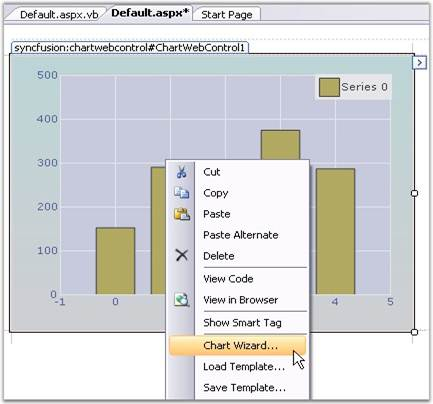

::: {style="DISPLAY: none"}
{#d2h_url_template}{#d2h_package_url style="WIDTH: 0px; DISPLAY: none; HEIGHT: 0px"}
:::

::::: {#nsbanner .d2h_main_nsbanner style="BORDER-BOTTOM: #999999 1px solid; POSITION: relative; PADDING-BOTTOM: 0px; BACKGROUND-COLOR: transparent; PADDING-LEFT: 0px; PADDING-RIGHT: 0px; DISPLAY: none; BORDER-TOP: #999999 1px solid; PADDING-TOP: 0px; LEFT: 0px"}
:::: {#TitleRow .d2h_main_titlerow style="PADDING-BOTTOM: 4px; BACKGROUND-COLOR: transparent; PADDING-LEFT: 22px; WIDTH: 100%; PADDING-RIGHT: 10px; DISPLAY: none; PADDING-TOP: 4px"}
::: {#ienav .d2h_main_ienav style="DISPLAY: none"}
{#D2HPrevious .D2HPreviousEnabled}  {#D2HNext .D2HNextEnabled}
:::
::::
:::::

:::: {#nstext .d2h_main_nstext style="PADDING-BOTTOM: 10px; BACKGROUND-COLOR: transparent; PADDING-LEFT: 22px; PADDING-RIGHT: 10px; HEIGHT: 100%; OVERFLOW: auto; PADDING-TOP: 5px" hasuserbackground="true" valign="bottom"}
::: {#d2h_breadcrumbs .d2h_breadcrumbs}
[Essential Studio User Guide Documentation](ms-xhelp:///?Id=12457748-09e3-4d74-a240-8e049cedf030){.d2h_breadcrumbsNormal}[ \> ]{.d2h_breadcrumbsLinkSeparator}[User Interface Edition](ms-xhelp:///?Id=c29296b7-531c-413b-a0ec-488ca1f7f669){.d2h_breadcrumbsNormal}[ \> ]{.d2h_breadcrumbsLinkSeparator}[Essential ASP.NET](ms-xhelp:///?Id=25c35330-c127-4dad-9a92-ed79dc7261a6){.d2h_breadcrumbsNormal}[ \> ]{.d2h_breadcrumbsLinkSeparator}[Essential Chart]{.d2h_breadcrumbsContentsOnly}[ \> ]{.d2h_breadcrumbsLinkSeparator}[Concepts and Features](ms-xhelp:///?Id=100687ce-82f2-4424-9d16-0949ea76cf15){.d2h_breadcrumbsNormal}
:::

## Chart Wizard {#chart-wizard style="tab-stops: 0pt"}

[]{style="FONT-FAMILY: 'Trebuchet MS','sans-serif'; FONT-SIZE: 9pt"} 

The Chart Wizard is a very convenient tool to setup the Chart during design-time.

 

The Wizard neatly categorizes the different portions of the Chart, and lets you customize the most common properties of these different portions easily.

[]{style="FONT-FAMILY: 'Trebuchet MS','sans-serif'; FONT-SIZE: 9pt"} 

**[]{style="FONT-FAMILY: 'Trebuchet MS','sans-serif'"}** 

Key features of the Chart wizard

[]{style="FONT-FAMILY: 'Trebuchet MS','sans-serif'; FONT-SIZE: 9pt"} 

1.   Can create various types of chart.

 

2.   Add series dynamically when the application is running.

 

3.   Change the appearance of the chart with the various options that are provided to change the color palette, back color and title of the chart.

 

4.   Customize the axes of the chart such as changing the range and labels.

 

5.   Provides support for customization of the chart legend.

 

6.   Customize the chart control\'s toolbar.

 

7.   Lets you customize the point labels.

[]{style="FONT-FAMILY: 'Trebuchet MS','sans-serif'; FONT-SIZE: 9pt"} 

This section describes about the functionality of the chart wizard.

[]{style="FONT-FAMILY: 'Trebuchet MS','sans-serif'; FONT-SIZE: 9pt"} 

{border="0"}

**[]{style="FONT-FAMILY: 'Trebuchet MS','sans-serif'; FONT-SIZE: 9pt"}** 

Figure 22: ChartWizard

**[]{style="FONT-FAMILY: 'Trebuchet MS','sans-serif'; FONT-SIZE: 9pt"}** 

Design Time

**[]{style="FONT-FAMILY: 'Trebuchet MS','sans-serif'"}** 

To display the chart wizard at design-time, follow the steps given below.

[]{style="FONT-FAMILY: 'Trebuchet MS','sans-serif'; FONT-SIZE: 9pt"} 

1.   Add a **ChartControl** to the page.

 

2.   Right-click anywhere in the chart to see a context menu.

[]{style="FONT-FAMILY: 'Trebuchet MS','sans-serif'; FONT-SIZE: 9pt"} 

{border="0"}

[]{style="FONT-FAMILY: 'Courier New'; COLOR: red"} 

Figure 23: Opening Chart Wizard through Context Menu

[]{style="FONT-FAMILY: 'Trebuchet MS','sans-serif'; FONT-SIZE: 9pt"} 

3.   Select the chart wizard item from the context menu.

[          ]{style="FONT-FAMILY: 'Trebuchet MS','sans-serif'; FONT-SIZE: 9pt"}

At Run Time

**[]{style="FONT-FAMILY: 'Trebuchet MS','sans-serif'"}** 

Optionally, you can also let your users to invoke this Wizard during run-time to let them customize the Chart\'s look and feel. To invoke the Chart wizard at runtime, use the following code.

[]{style="FONT-FAMILY: 'Trebuchet MS','sans-serif'; FONT-SIZE: 9pt"} 

+----------------------------------------------------------------------------------------------------------------------------------------------+
| **[\[C#\]]{style="FONT-FAMILY: 'Courier New'; COLOR: black"}**                                                                               |
|                                                                                                                                              |
| []{style="FONT-FAMILY: 'Courier New'; COLOR: blue"}                                                                                          |
|                                                                                                                                              |
| [this]{style="FONT-FAMILY: 'Courier New'; COLOR: blue"}[.chartControl1.DisplayWizard();  ]{style="FONT-FAMILY: 'Courier New'; COLOR: black"} |
+----------------------------------------------------------------------------------------------------------------------------------------------+

[]{style="FONT-FAMILY: 'Trebuchet MS','sans-serif'; FONT-SIZE: 9pt"} 

+-----------------------------------------------------------------------------------------------------------------------------------------+
| **[\[VB.NET\]]{style="FONT-FAMILY: 'Courier New'; COLOR: black"}**                                                                      |
|                                                                                                                                         |
| []{style="FONT-FAMILY: 'Courier New'; COLOR: blue"}                                                                                     |
|                                                                                                                                         |
| [Me]{style="FONT-FAMILY: 'Courier New'; COLOR: blue"}[.chartControl1.DisplayWizard()]{style="FONT-FAMILY: 'Courier New'; COLOR: black"} |
+-----------------------------------------------------------------------------------------------------------------------------------------+

**[]{style="FONT-FAMILY: 'Trebuchet MS','sans-serif'; FONT-SIZE: 9pt"}** 

The wizard provides six different categories whose settings can be customized.

[]{style="FONT-FAMILY: 'Trebuchet MS','sans-serif'; FONT-SIZE: 9pt"} 

1.   [[Chart type]{.UGHyperlink}](ms-xhelp:///?Id=a20ca235-70a2-44f8-845b-25578e1d510e) to let you visualize and select the type of chart to display.

 

2.   [[Series]{.UGHyperlink}](ms-xhelp:///?Id=5fcac24b-a16b-4dff-a48a-571fc711de4c) to let you add custom series to the chart and also setup data binding.

 

3.   [[Appearance]{.UGHyperlink}](ms-xhelp:///?Id=1227f833-c9a0-4862-ab58-fcd7ae3c42b7) to customize the color, font etc. of the ChartControl and ChartArea.

 

4.   [[Axes]{.UGHyperlink}](ms-xhelp:///?Id=e00c01e2-54ec-409e-ae1b-ed46f9d987ab) to change the chart control\'s axes settings.

 

5.   [[Legend]{.UGHyperlink}](ms-xhelp:///?Id=d834657a-72d4-4708-ba64-765b92f7c9ea)[ ]{.UGHyperlink}to set the properties of the legend area.

[]{style="FONT-FAMILY: 'Trebuchet MS','sans-serif'; FONT-SIZE: 9pt"} 

There is a preview panel where a Chart is rendered with the latest settings. The sub topics of this section will guide you through these settings.

After making necessary changes, click the **Apply** to apply those settings in the chart and finally, click the **Finish** to close the Wizard.

[]{#p18} 

More:

[ ]{#related-topics}

[{border="0" align="absMiddle"}Chart Type](ms-xhelp:///?Id=0d432f3b-aa76-43e1-b8d3-5e8b1521c5af){style="TEXT-DECORATION: none"}

[{border="0" align="absMiddle"}Series](ms-xhelp:///?Id=cf0ec4dd-61e6-43cf-a427-4ee9092907b8){style="TEXT-DECORATION: none"}

[{border="0" align="absMiddle"}Appearance](ms-xhelp:///?Id=bbb5d7b9-24f2-498b-8957-c9ca7c2c386c){style="TEXT-DECORATION: none"}

[{border="0" align="absMiddle"}Axes](ms-xhelp:///?Id=2d6c25a4-3ec1-4235-969e-50ddd7c277ee){style="TEXT-DECORATION: none"}

[{border="0" align="absMiddle"}Legend](ms-xhelp:///?Id=6b19608e-d210-4c7e-a865-9bd8ab1fb79c){style="TEXT-DECORATION: none"}
::::
