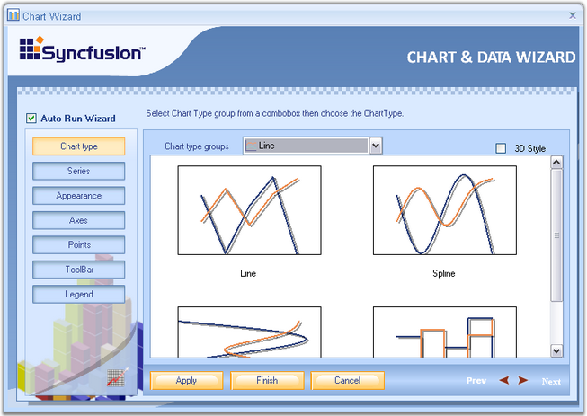

::: {style="DISPLAY: none"}
{#d2h_url_template}{#d2h_package_url style="WIDTH: 0px; DISPLAY: none; HEIGHT: 0px"}
:::

::::: {#nsbanner .d2h_main_nsbanner style="BORDER-BOTTOM: #999999 1px solid; POSITION: relative; PADDING-BOTTOM: 0px; BACKGROUND-COLOR: transparent; PADDING-LEFT: 0px; PADDING-RIGHT: 0px; DISPLAY: none; BORDER-TOP: #999999 1px solid; PADDING-TOP: 0px; LEFT: 0px"}
:::: {#TitleRow .d2h_main_titlerow style="PADDING-BOTTOM: 4px; BACKGROUND-COLOR: transparent; PADDING-LEFT: 22px; WIDTH: 100%; PADDING-RIGHT: 10px; DISPLAY: none; PADDING-TOP: 4px"}
::: {#ienav .d2h_main_ienav style="DISPLAY: none"}
{#D2HPrevious .D2HPreviousEnabled}  {#D2HNext .D2HNextEnabled}
:::
::::
:::::

:::: {#nstext .d2h_main_nstext style="PADDING-BOTTOM: 10px; BACKGROUND-COLOR: transparent; PADDING-LEFT: 22px; PADDING-RIGHT: 10px; HEIGHT: 100%; OVERFLOW: auto; PADDING-TOP: 5px" hasuserbackground="true" valign="bottom"}
::: {#d2h_breadcrumbs .d2h_breadcrumbs}
[Essential Studio User Guide Documentation](ms-xhelp:///?Id=12457748-09e3-4d74-a240-8e049cedf030){.d2h_breadcrumbsNormal}[ \> ]{.d2h_breadcrumbsLinkSeparator}[User Interface Edition](ms-xhelp:///?Id=c29296b7-531c-413b-a0ec-488ca1f7f669){.d2h_breadcrumbsNormal}[ \> ]{.d2h_breadcrumbsLinkSeparator}[Essential Windows](ms-xhelp:///?Id=e60759d8-47a4-4570-9d7a-16a68d63f2ea){.d2h_breadcrumbsNormal}[ \> ]{.d2h_breadcrumbsLinkSeparator}[Essential Chart]{.d2h_breadcrumbsContentsOnly}[ \> ]{.d2h_breadcrumbsLinkSeparator}[Concepts and Features](ms-xhelp:///?Id=71321e9c-336c-4c1c-a127-be9f135ad4bb){.d2h_breadcrumbsNormal}
:::

## Chart Wizard {#chart-wizard style="tab-stops: 0pt"}

 

The Chart Wizard is a very convenient tool to setup the Chart during design-time.

 

The Wizard neatly categorizes the different portions of the Chart, and lets you customize the most common properties of these different portions easily.

 

**Key features of the Chart wizard**

 

1.   Can create various types of chart.

 

2.   Add series dynamically when the application is running.

 

3.   Change the appearance of the chart with the various options that are provided to change the color palette, back color and title of the chart.

 

4.   Customize the axes of the chart such as changing the range and labels.

 

5.   Provides support for customization of the chart legend.

 

6.   Customize the chart control\'s toolbar.

 

7.   Lets you customize the point labels.

 

This section describes about the functionality of the chart wizard.

 

{border="0"}

 

Figure 9: Chart Wizard (Windows)

 

Design Time

 

To display the chart wizard at design-time, follow the below steps.

 

1.   Add a ChartControl to your form.

 

2.   Right-click anywhere in the chart to see a context menu.

 

3.   Select the chart wizard item from the context menu.

         

At Run Time

 

Optionally, you can also let your users to invoke this Wizard during run-time to let them customize the Chart\'s look and feel. To invoke the Chart wizard at runtime, use the below code.

 

+----------------------------------------------------------------------------------------------------------------------------------------------+
| **[\[C#\]]{style="FONT-FAMILY: 'Courier New'; COLOR: black"}**                                                                               |
|                                                                                                                                              |
| []{style="FONT-FAMILY: 'Courier New'; COLOR: blue"}                                                                                          |
|                                                                                                                                              |
| [this]{style="FONT-FAMILY: 'Courier New'; COLOR: blue"}[.chartControl1.DisplayWizard();  ]{style="FONT-FAMILY: 'Courier New'; COLOR: black"} |
+----------------------------------------------------------------------------------------------------------------------------------------------+

 

+-----------------------------------------------------------------------------------------------------------------------------------------+
| **[\[VB.NET\]]{style="FONT-FAMILY: 'Courier New'; COLOR: black"}**                                                                      |
|                                                                                                                                         |
| []{style="FONT-FAMILY: 'Courier New'; COLOR: blue"}                                                                                     |
|                                                                                                                                         |
| [Me]{style="FONT-FAMILY: 'Courier New'; COLOR: blue"}[.chartControl1.DisplayWizard()]{style="FONT-FAMILY: 'Courier New'; COLOR: black"} |
+-----------------------------------------------------------------------------------------------------------------------------------------+

 

The wizard provides six different categories whose settings can be customized.

 

1.   [Chart type]{.UGHyperlink} to let you visualize and select the type of chart to display.

 

2.   [Series]{.UGHyperlink} to let you add custom series to the chart and also setup data binding.

 

3.   [Appearance]{.UGHyperlink} to customize the color, font etc. of the ChartControl and ChartArea.

 

4.   [Axes]{.UGHyperlink} to change the chart control\'s axes settings.

 

5.   [Points]{.UGHyperlink} to customize the point labels.

 

6.   [Legend]{.UGHyperlink}[ ]{.UGHyperlink}to set the properties of the legend area.

 

7.   [Toolbar]{.UGHyperlink} to customize the various properties of the toolbar.

 

There is a preview panel where a Chart is rendered with the latest settings. The sub topics of this section will guide you through these settings.

 

After making necessary changes, click the **Apply** to apply those settings in the chart and finally, click the **Finish** to close the Wizard.

 

[]{#p13} 

 

More:

[ ]{#related-topics}

[{border="0" align="absMiddle"}Chart Type](ms-xhelp:///?Id=f41286dd-2422-425b-bb72-2081df67b33e){style="TEXT-DECORATION: none"}

[{border="0" align="absMiddle"}Series](ms-xhelp:///?Id=5e2822ff-6bd2-428e-8201-23bec5d1a92d){style="TEXT-DECORATION: none"}

[{border="0" align="absMiddle"}Appearance](ms-xhelp:///?Id=59964e1c-1874-4277-bb9e-c17826eeb29d){style="TEXT-DECORATION: none"}

[{border="0" align="absMiddle"}Axes](ms-xhelp:///?Id=ce352b05-5ad2-49bc-aa59-0384eca0915d){style="TEXT-DECORATION: none"}

[{border="0" align="absMiddle"}Points](ms-xhelp:///?Id=a979a6df-df74-46cd-b9ce-883151adf8b0){style="TEXT-DECORATION: none"}

[{border="0" align="absMiddle"}Toolbar](ms-xhelp:///?Id=7ff23521-2ec1-4891-8015-cb02e848dab0){style="TEXT-DECORATION: none"}

[{border="0" align="absMiddle"}Legend](ms-xhelp:///?Id=190fa68b-4fb2-4157-b4be-2260fe3214f4){style="TEXT-DECORATION: none"}
::::
