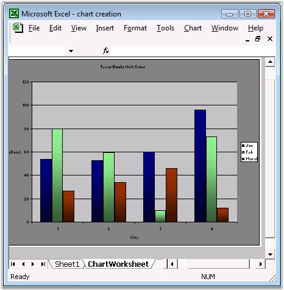

::: {style="DISPLAY: none"}
{#d2h_url_template}{#d2h_package_url style="WIDTH: 0px; DISPLAY: none; HEIGHT: 0px"}
:::

::: {.d2h_secondary_topic style="PADDING-BOTTOM: 10pt; MARGIN: 0pt; PADDING-LEFT: 0pt; PADDING-RIGHT: 0pt; PADDING-TOP: 0pt"}
#### Chart Worksheet {#chart-worksheet style="tab-stops: 0pt"}

**[]{style="FONT-FAMILY: 'Segoe UI','sans-serif'; COLOR: black"}** 

The **IChart** interface represents the in-memory representation of the Chart Worksheet in an Excel workbook. Formatting is similar to the one discussed in the [[Embedded Chart]{.UGHyperlink}](ms-xhelp:///?Id=7cd72cce-5684-4f9e-a8a6-8058acb9c640) in the previous section.

[]{style="FONT-FAMILY: 'Trebuchet MS','sans-serif'; COLOR: #15428b; FONT-SIZE: 9pt"} 

+----------------------------------------------------------------------------------------------------------------------------------------------------+
| **[\[C#\]]{style="FONT-FAMILY: 'Courier New'"}**                                                                                                   |
|                                                                                                                                                    |
| []{style="FONT-FAMILY: 'Courier New'; COLOR: black"}                                                                                               |
|                                                                                                                                                    |
| [// Entering the Data for the chart.]{style="FONT-FAMILY: 'Courier New'; COLOR: green"}                                                            |
|                                                                                                                                                    |
| [sheet.Range\[[\"A1\"]{style="COLOR: #a31515"}\].Text = [\"Texas books Unit sales\"]{style="COLOR: #a31515"};]{style="FONT-FAMILY: 'Courier New'"} |
|                                                                                                                                                    |
| [sheet.Range\[[\"A1:D1\"]{style="COLOR: #a31515"}\].Merge();]{style="FONT-FAMILY: 'Courier New'"}                                                  |
|                                                                                                                                                    |
| [sheet.Range\[[\"A1\"]{style="COLOR: #a31515"}\].CellStyle.Font.Bold = [true]{style="COLOR: blue"};]{style="FONT-FAMILY: 'Courier New'"}           |
|                                                                                                                                                    |
| []{style="FONT-FAMILY: 'Courier New'"}                                                                                                             |
|                                                                                                                                                    |
| [sheet.Range\[[\"B2\"]{style="COLOR: #a31515"}\].Text = [\"Jan\"]{style="COLOR: #a31515"};]{style="FONT-FAMILY: 'Courier New'"}                    |
|                                                                                                                                                    |
| [sheet.Range\[[\"C2\"]{style="COLOR: #a31515"}\].Text = [\"Feb\"]{style="COLOR: #a31515"};]{style="FONT-FAMILY: 'Courier New'"}                    |
|                                                                                                                                                    |
| [sheet.Range\[[\"D2\"]{style="COLOR: #a31515"}\].Text = [\"Mar\"]{style="COLOR: #a31515"};]{style="FONT-FAMILY: 'Courier New'"}                    |
|                                                                                                                                                    |
| []{style="FONT-FAMILY: 'Courier New'"}                                                                                                             |
|                                                                                                                                                    |
| [sheet.Range\[[\"A3\"]{style="COLOR: #a31515"}\].Text = [\"Austin\"]{style="COLOR: #a31515"};]{style="FONT-FAMILY: 'Courier New'"}                 |
|                                                                                                                                                    |
| [sheet.Range\[[\"A4\"]{style="COLOR: #a31515"}\].Text = [\"Dallas\"]{style="COLOR: #a31515"};]{style="FONT-FAMILY: 'Courier New'"}                 |
|                                                                                                                                                    |
| [sheet.Range\[[\"A5\"]{style="COLOR: #a31515"}\].Text = [\"Houston\"]{style="COLOR: #a31515"};]{style="FONT-FAMILY: 'Courier New'"}                |
|                                                                                                                                                    |
| [sheet.Range\[[\"A6\"]{style="COLOR: #a31515"}\].Text = [\"San Antonio\"]{style="COLOR: #a31515"};]{style="FONT-FAMILY: 'Courier New'"}            |
|                                                                                                                                                    |
| []{style="FONT-FAMILY: 'Courier New'"}                                                                                                             |
|                                                                                                                                                    |
| [sheet.Range\[[\"B3\"]{style="COLOR: #a31515"}\].Number = 53.75;]{style="FONT-FAMILY: 'Courier New'"}                                              |
|                                                                                                                                                    |
| [sheet.Range\[[\"B4\"]{style="COLOR: #a31515"}\].Number = 52.85;]{style="FONT-FAMILY: 'Courier New'"}                                              |
|                                                                                                                                                    |
| [sheet.Range\[[\"B5\"]{style="COLOR: #a31515"}\].Number = 59.77;]{style="FONT-FAMILY: 'Courier New'"}                                              |
|                                                                                                                                                    |
| [sheet.Range\[[\"B6\"]{style="COLOR: #a31515"}\].Number = 96.15;]{style="FONT-FAMILY: 'Courier New'"}                                              |
|                                                                                                                                                    |
| []{style="FONT-FAMILY: 'Courier New'"}                                                                                                             |
|                                                                                                                                                    |
| [sheet.Range\[[\"C3\"]{style="COLOR: #a31515"}\].Number = 79.79;]{style="FONT-FAMILY: 'Courier New'"}                                              |
|                                                                                                                                                    |
| [sheet.Range\[[\"C4\"]{style="COLOR: #a31515"}\].Number = 59.22;]{style="FONT-FAMILY: 'Courier New'"}                                              |
|                                                                                                                                                    |
| [sheet.Range\[[\"C5\"]{style="COLOR: #a31515"}\].Number = 10.09;]{style="FONT-FAMILY: 'Courier New'"}                                              |
|                                                                                                                                                    |
| [sheet.Range\[[\"C6\"]{style="COLOR: #a31515"}\].Number = 73.02;]{style="FONT-FAMILY: 'Courier New'"}                                              |
|                                                                                                                                                    |
| []{style="FONT-FAMILY: 'Courier New'"}                                                                                                             |
|                                                                                                                                                    |
| [sheet.Range\[[\"D3\"]{style="COLOR: #a31515"}\].Number = 26.72;]{style="FONT-FAMILY: 'Courier New'"}                                              |
|                                                                                                                                                    |
| [sheet.Range\[[\"D4\"]{style="COLOR: #a31515"}\].Number = 33.71;]{style="FONT-FAMILY: 'Courier New'"}                                              |
|                                                                                                                                                    |
| [sheet.Range\[[\"D5\"]{style="COLOR: #a31515"}\].Number = 45.81;]{style="FONT-FAMILY: 'Courier New'"}                                              |
|                                                                                                                                                    |
| [sheet.Range\[[\"D6\"]{style="COLOR: #a31515"}\].Number = 12.17;]{style="FONT-FAMILY: 'Courier New'"}                                              |
|                                                                                                                                                    |
| []{style="FONT-FAMILY: 'Courier New'"}                                                                                                             |
|                                                                                                                                                    |
| [// Adding a New chart to the Existing Worksheet.   ]{style="FONT-FAMILY: 'Courier New'; COLOR: green"}                                            |
|                                                                                                                                                    |
| [IChart]{style="FONT-FAMILY: 'Courier New'; COLOR: #2b91af"}[ chart = workbook.Charts.Add();]{style="FONT-FAMILY: 'Courier New'"}                  |
|                                                                                                                                                    |
| [chart.DataRange = sheet.Range\[[\"B3:D6\"]{style="COLOR: #a31515"}\];]{style="FONT-FAMILY: 'Courier New'"}                                        |
|                                                                                                                                                    |
| [chart.Name = [\"ChartWorksheet\"]{style="COLOR: #a31515"};]{style="FONT-FAMILY: 'Courier New'"}                                                   |
|                                                                                                                                                    |
| [chart.PrimaryCategoryAxis.Title = [\"City\"]{style="COLOR: #a31515"};]{style="FONT-FAMILY: 'Courier New'"}                                        |
|                                                                                                                                                    |
| [chart.PrimaryValueAxis.Title = [\"Sales (in Dollars)\"]{style="COLOR: #a31515"};]{style="FONT-FAMILY: 'Courier New'"}                             |
|                                                                                                                                                    |
| [chart.ChartTitle = [\"Texas Books Unit Sales\"]{style="COLOR: #a31515"};]{style="FONT-FAMILY: 'Courier New'"}                                     |
|                                                                                                                                                    |
| []{style="FONT-FAMILY: 'Courier New'"}                                                                                                             |
|                                                                                                                                                    |
| [// Setting the Series Names in a Legend.]{style="FONT-FAMILY: 'Courier New'; COLOR: green"}                                                       |
|                                                                                                                                                    |
| [IChartSerie]{style="FONT-FAMILY: 'Courier New'; COLOR: #2b91af"}[ serieOne = chart.Series\[0\];]{style="FONT-FAMILY: 'Courier New'"}              |
|                                                                                                                                                    |
| [serieOne.Name = [\"Jan\"]{style="COLOR: #a31515"};]{style="FONT-FAMILY: 'Courier New'"}                                                           |
|                                                                                                                                                    |
| [IChartSerie]{style="FONT-FAMILY: 'Courier New'; COLOR: #2b91af"}[ serietwo = chart.Series\[1\];]{style="FONT-FAMILY: 'Courier New'"}              |
|                                                                                                                                                    |
| [serietwo.Name = [\"Feb\"]{style="COLOR: #a31515"};]{style="FONT-FAMILY: 'Courier New'"}                                                           |
|                                                                                                                                                    |
| [IChartSerie]{style="FONT-FAMILY: 'Courier New'; COLOR: #2b91af"}[ seriethree = chart.Series\[2\];]{style="FONT-FAMILY: 'Courier New'"}            |
|                                                                                                                                                    |
| [seriethree.Name = [\"March\"]{style="COLOR: #a31515"};]{style="FONT-FAMILY: 'Courier New'"}                                                       |
+----------------------------------------------------------------------------------------------------------------------------------------------------+

[]{style="FONT-FAMILY: 'Trebuchet MS','sans-serif'; COLOR: #15428b; FONT-SIZE: 9pt"} 

+-----------------------------------------------------------------------------------------------------------------------------------------------------------------+
| **[\[VB.NET\]]{style="FONT-FAMILY: 'Courier New'"}**                                                                                                            |
|                                                                                                                                                                 |
| **[]{style="FONT-FAMILY: 'Courier New'"}**                                                                                                                      |
|                                                                                                                                                                 |
| [\' Entering the Data for the chart.]{style="FONT-FAMILY: 'Courier New'; COLOR: green"}                                                                         |
|                                                                                                                                                                 |
| [sheet.Range([\"A1\"]{style="COLOR: maroon"}).Text = [\"Texas books Unit sales\"]{style="COLOR: maroon"}]{style="FONT-FAMILY: 'Courier New'"}                   |
|                                                                                                                                                                 |
| [sheet.Range([\"A1:D1\"]{style="COLOR: maroon"}).Merge()]{style="FONT-FAMILY: 'Courier New'"}                                                                   |
|                                                                                                                                                                 |
| [sheet.Range([\"A1\"]{style="COLOR: maroon"}).CellStyle.Font.Bold = [True]{style="COLOR: blue"}]{style="FONT-FAMILY: 'Courier New'"}                            |
|                                                                                                                                                                 |
| []{style="FONT-FAMILY: 'Courier New'; COLOR: blue"}                                                                                                             |
|                                                                                                                                                                 |
| [sheet.Range([\"B2\"]{style="COLOR: maroon"}).Text = [\"Jan\"]{style="COLOR: maroon"}]{style="FONT-FAMILY: 'Courier New'"}                                      |
|                                                                                                                                                                 |
| [sheet.Range([\"C2\"]{style="COLOR: maroon"}).Text = [\"Feb\"]{style="COLOR: maroon"}]{style="FONT-FAMILY: 'Courier New'"}                                      |
|                                                                                                                                                                 |
| [sheet.Range([\"D2\"]{style="COLOR: maroon"}).Text = [\"Mar\"]{style="COLOR: maroon"}]{style="FONT-FAMILY: 'Courier New'"}                                      |
|                                                                                                                                                                 |
| []{style="FONT-FAMILY: 'Courier New'; COLOR: maroon"}                                                                                                           |
|                                                                                                                                                                 |
| [sheet.Range([\"A3\"]{style="COLOR: maroon"}).Text = [\"Austin\"]{style="COLOR: maroon"}]{style="FONT-FAMILY: 'Courier New'"}                                   |
|                                                                                                                                                                 |
| [sheet.Range([\"A4\"]{style="COLOR: maroon"}).Text = [\"Dallas\"]{style="COLOR: maroon"}]{style="FONT-FAMILY: 'Courier New'"}                                   |
|                                                                                                                                                                 |
| [sheet.Range([\"A5\"]{style="COLOR: maroon"}).Text = [\"Houston\"]{style="COLOR: maroon"}]{style="FONT-FAMILY: 'Courier New'"}                                  |
|                                                                                                                                                                 |
| [sheet.Range([\"A6\"]{style="COLOR: maroon"}).Text = [\"San Antonio\"]{style="COLOR: maroon"}]{style="FONT-FAMILY: 'Courier New'"}                              |
|                                                                                                                                                                 |
| []{style="FONT-FAMILY: 'Courier New'; COLOR: maroon"}                                                                                                           |
|                                                                                                                                                                 |
| [sheet.Range([\"B3\"]{style="COLOR: maroon"}).Number = 53.75]{style="FONT-FAMILY: 'Courier New'"}                                                               |
|                                                                                                                                                                 |
| [sheet.Range([\"B4\"]{style="COLOR: maroon"}).Number = 52.85]{style="FONT-FAMILY: 'Courier New'"}                                                               |
|                                                                                                                                                                 |
| [sheet.Range([\"B5\"]{style="COLOR: maroon"}).Number = 59.77]{style="FONT-FAMILY: 'Courier New'"}                                                               |
|                                                                                                                                                                 |
| [sheet.Range([\"B6\"]{style="COLOR: maroon"}).Number = 96.15]{style="FONT-FAMILY: 'Courier New'"}                                                               |
|                                                                                                                                                                 |
| []{style="FONT-FAMILY: 'Courier New'"}                                                                                                                          |
|                                                                                                                                                                 |
| [sheet.Range([\"C3\"]{style="COLOR: maroon"}).Number = 79.79]{style="FONT-FAMILY: 'Courier New'"}                                                               |
|                                                                                                                                                                 |
| [sheet.Range([\"C4\"]{style="COLOR: maroon"}).Number = 59.22]{style="FONT-FAMILY: 'Courier New'"}                                                               |
|                                                                                                                                                                 |
| [sheet.Range([\"C5\"]{style="COLOR: maroon"}).Number = 10.09]{style="FONT-FAMILY: 'Courier New'"}                                                               |
|                                                                                                                                                                 |
| [sheet.Range([\"C6\"]{style="COLOR: maroon"}).Number = 73.02]{style="FONT-FAMILY: 'Courier New'"}                                                               |
|                                                                                                                                                                 |
| []{style="FONT-FAMILY: 'Courier New'"}                                                                                                                          |
|                                                                                                                                                                 |
| [sheet.Range([\"D3\"]{style="COLOR: maroon"}).Number = 26.72]{style="FONT-FAMILY: 'Courier New'"}                                                               |
|                                                                                                                                                                 |
| [sheet.Range([\"D4\"]{style="COLOR: maroon"}).Number = 33.71]{style="FONT-FAMILY: 'Courier New'"}                                                               |
|                                                                                                                                                                 |
| [sheet.Range([\"D5\"]{style="COLOR: maroon"}).Number = 45.81]{style="FONT-FAMILY: 'Courier New'"}                                                               |
|                                                                                                                                                                 |
| [sheet.Range([\"D6\"]{style="COLOR: maroon"}).Number = 12.17]{style="FONT-FAMILY: 'Courier New'"}                                                               |
|                                                                                                                                                                 |
| []{style="FONT-FAMILY: 'Courier New'"}                                                                                                                          |
|                                                                                                                                                                 |
| [\' Adding a New chart to the Existing Worksheet.]{style="FONT-FAMILY: 'Courier New'; COLOR: green"}                                                            |
|                                                                                                                                                                 |
| [Dim]{style="FONT-FAMILY: 'Courier New'; COLOR: blue"}[ chart [As]{style="COLOR: blue"} IChart = workbook.Charts.Add()]{style="FONT-FAMILY: 'Courier New'"}     |
|                                                                                                                                                                 |
| [chart.DataRange = sheet.Range([\"B3:D6\"]{style="COLOR: maroon"})]{style="FONT-FAMILY: 'Courier New'"}                                                         |
|                                                                                                                                                                 |
| [chart.Name = [\"ChartWorksheet\"]{style="COLOR: maroon"}]{style="FONT-FAMILY: 'Courier New'"}                                                                  |
|                                                                                                                                                                 |
| [chart.PrimaryCategoryAxis.Title = [\"City\"]{style="COLOR: maroon"}]{style="FONT-FAMILY: 'Courier New'"}                                                       |
|                                                                                                                                                                 |
| [chart.PrimaryValueAxis.Title = [\"Sales (in Dollars)\"]{style="COLOR: maroon"}]{style="FONT-FAMILY: 'Courier New'"}                                            |
|                                                                                                                                                                 |
| [chart.ChartTitle = [\"Texas Books Unit Sales\"]{style="COLOR: maroon"}]{style="FONT-FAMILY: 'Courier New'"}                                                    |
|                                                                                                                                                                 |
| []{style="FONT-FAMILY: 'Courier New'; COLOR: maroon"}                                                                                                           |
|                                                                                                                                                                 |
| [\' Setting the Serie Names in a Legend.]{style="FONT-FAMILY: 'Courier New'; COLOR: green"}                                                                     |
|                                                                                                                                                                 |
| [Dim]{style="FONT-FAMILY: 'Courier New'; COLOR: blue"}[ serieOne [As]{style="COLOR: blue"} IChartSerie = chart.Series(0)]{style="FONT-FAMILY: 'Courier New'"}   |
|                                                                                                                                                                 |
| [serieOne.Name = [\"Jan\"]{style="COLOR: maroon"}]{style="FONT-FAMILY: 'Courier New'"}                                                                          |
|                                                                                                                                                                 |
| [Dim]{style="FONT-FAMILY: 'Courier New'; COLOR: blue"}[ serietwo [As]{style="COLOR: blue"} IChartSerie = chart.Series(1)]{style="FONT-FAMILY: 'Courier New'"}   |
|                                                                                                                                                                 |
| [serietwo.Name = [\"Feb\"]{style="COLOR: maroon"}]{style="FONT-FAMILY: 'Courier New'"}                                                                          |
|                                                                                                                                                                 |
| [Dim]{style="FONT-FAMILY: 'Courier New'; COLOR: blue"}[ seriethree [As]{style="COLOR: blue"} IChartSerie = chart.Series(2)]{style="FONT-FAMILY: 'Courier New'"} |
|                                                                                                                                                                 |
| [seriethree.Name = [\"March\"]{style="COLOR: maroon"} ]{style="FONT-FAMILY: 'Courier New'"}                                                                     |
+-----------------------------------------------------------------------------------------------------------------------------------------------------------------+

[]{style="FONT-FAMILY: 'Trebuchet MS','sans-serif'; COLOR: #15428b; FONT-SIZE: 9pt"} 

{border="0"}

Figure 77: XlsIO with Chart Worksheet[]{style="FONT-FAMILY: 'Trebuchet MS','sans-serif'; COLOR: #15428b"}

[]{style="FONT-FAMILY: 'Trebuchet MS','sans-serif'; COLOR: #15428b; FONT-SIZE: 9pt"} 

 

[]{#related-topics}
:::
