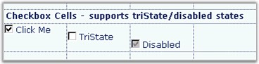

::: {style="DISPLAY: none"}
{#d2h_url_template}{#d2h_package_url style="WIDTH: 0px; DISPLAY: none; HEIGHT: 0px"}
:::

:::: {.d2h_secondary_topic style="PADDING-BOTTOM: 10pt; MARGIN: 0pt; PADDING-LEFT: 0pt; PADDING-RIGHT: 0pt; PADDING-TOP: 0pt"}
##### Check Box {#check-box style="tab-stops: 0pt"}

[]{style="FONT-FAMILY: 'Trebuchet MS','sans-serif'; COLOR: #15428b; FONT-SIZE: 9pt"} 

The **Check Box** cell type displays a check box in a grid cell. The check box has three states: **Checked, Unchecked and Indeterminate**. You can decide whether the check box should behave as a two-state check box or a three-state check box.

[]{style="FONT-FAMILY: 'Trebuchet MS','sans-serif'; COLOR: #15428b; FONT-SIZE: 9pt"} 

The following **GridStyleInfo** properties can be used to control the functioning of the check box.

[]{style="FONT-FAMILY: 'Trebuchet MS','sans-serif'; COLOR: #15428b; FONT-SIZE: 9pt"} 

::: {align="center"}
  ------------------------ ---------------------------------------------------------------------------------------------------------------------------
  GridStyleInfo Property   Description
  CellType                 Set to \"check box\" for a check box control.
  CheckBoxOptions          Defines the display value of True, False, or indeterminate (i.e., the value returned by the GridStyleInfo.Text property).
  Description              Text that appears next to the check box.
  TriState                 Whether or not indeterminate value is supported.
  CellValue                Boolean true or false values, or empty (null or nothing).
  ------------------------ ---------------------------------------------------------------------------------------------------------------------------
:::

[]{style="FONT-FAMILY: 'Trebuchet MS','sans-serif'; COLOR: #15428b; FONT-SIZE: 9pt"} 

The following code example illustrates how to set the cell type to CheckBox.

[]{style="FONT-FAMILY: 'Trebuchet MS','sans-serif'; COLOR: #15428b; FONT-SIZE: 9pt"} 

+---------------------------------------------------------------------------------------------------------------------------------------------------------------------------------------------------------------------------------------------------------------------------------------------------+
| **[\[C#\]]{style="FONT-FAMILY: 'Courier New'; COLOR: black"}**                                                                                                                                                                                                                                    |
|                                                                                                                                                                                                                                                                                                   |
| []{style="FONT-FAMILY: 'Courier New'; COLOR: black"}                                                                                                                                                                                                                                              |
|                                                                                                                                                                                                                                                                                                   |
| [// Specify display values for True/False/Indeterminate.]{style="FONT-FAMILY: 'Courier New'; COLOR: green"}                                                                                                                                                                                       |
|                                                                                                                                                                                                                                                                                                   |
| [gridControl1.TableStyle.CheckBoxOptions = [new]{style="COLOR: blue"} [GridCheckBoxCellInfo]{style="COLOR: #2b91af"}([\"True\"]{style="COLOR: #a31515"}, [\"False\"]{style="COLOR: #a31515"}, [\"\"]{style="COLOR: #a31515"}, [false]{style="COLOR: blue"});]{style="FONT-FAMILY: 'Courier New'"} |
|                                                                                                                                                                                                                                                                                                   |
| []{style="FONT-FAMILY: 'Courier New'"}                                                                                                                                                                                                                                                            |
|                                                                                                                                                                                                                                                                                                   |
| [// Set up a check box with no tristate.]{style="FONT-FAMILY: 'Courier New'; COLOR: green"}                                                                                                                                                                                                       |
|                                                                                                                                                                                                                                                                                                   |
| [gridControl1\[rowIndex,colIndex\].CellValue = [false]{style="COLOR: blue"};]{style="FONT-FAMILY: 'Courier New'"}                                                                                                                                                                                 |
|                                                                                                                                                                                                                                                                                                   |
| [gridControl1\[rowIndex,colIndex\].Description = [\"Click Me\"]{style="COLOR: #a31515"};]{style="FONT-FAMILY: 'Courier New'"}                                                                                                                                                                     |
|                                                                                                                                                                                                                                                                                                   |
| [gridControl1\[rowIndex,colIndex\].CellType = [\"CheckBox\"]{style="COLOR: #a31515"};]{style="FONT-FAMILY: 'Courier New'"}                                                                                                                                                                        |
|                                                                                                                                                                                                                                                                                                   |
| [gridControl1\[rowIndex,colIndex\].TriState = [false]{style="COLOR: blue"};]{style="FONT-FAMILY: 'Courier New'"}                                                                                                                                                                                  |
|                                                                                                                                                                                                                                                                                                   |
| []{style="FONT-FAMILY: 'Courier New'"}                                                                                                                                                                                                                                                            |
|                                                                                                                                                                                                                                                                                                   |
| [// Set up a check box with tristate.]{style="FONT-FAMILY: 'Courier New'; COLOR: green"}                                                                                                                                                                                                          |
|                                                                                                                                                                                                                                                                                                   |
| [gridControl1\[rowIndex,colIndex + 1\].CellValue = [true]{style="COLOR: blue"};]{style="FONT-FAMILY: 'Courier New'"}                                                                                                                                                                              |
|                                                                                                                                                                                                                                                                                                   |
| [gridControl1\[rowIndex,colIndex + 1\].CellType = [\"CheckBox\"]{style="COLOR: #a31515"};]{style="FONT-FAMILY: 'Courier New'"}                                                                                                                                                                    |
|                                                                                                                                                                                                                                                                                                   |
| [gridControl1\[rowIndex,colIndex + 1\].TriState = [true]{style="COLOR: blue"};]{style="FONT-FAMILY: 'Courier New'"}                                                                                                                                                                               |
|                                                                                                                                                                                                                                                                                                   |
| [gridControl1\[rowIndex,colIndex + 1\].Description = [\"TriState\"]{style="COLOR: #a31515"};]{style="FONT-FAMILY: 'Courier New'"}                                                                                                                                                                 |
+---------------------------------------------------------------------------------------------------------------------------------------------------------------------------------------------------------------------------------------------------------------------------------------------------+

[]{style="FONT-FAMILY: 'Trebuchet MS','sans-serif'; COLOR: #15428b; FONT-SIZE: 9pt"} 

+------------------------------------------------------------------------------------------------------------------------------------------------------------------------------------------------------------------------------------------------------------------------+
| **[\[VB.NET\]]{style="FONT-FAMILY: 'Courier New'; COLOR: black"}**                                                                                                                                                                                                     |
|                                                                                                                                                                                                                                                                        |
| []{style="FONT-FAMILY: 'Courier New'; COLOR: black"}                                                                                                                                                                                                                   |
|                                                                                                                                                                                                                                                                        |
| [\' Specify display values for True/False/Indeterminate.]{style="FONT-FAMILY: 'Courier New'; COLOR: green"}                                                                                                                                                            |
|                                                                                                                                                                                                                                                                        |
| [gridControl1.TableStyle.CheckBoxOptions = [New]{style="COLOR: blue"} GridCheckBoxCellInfo([\"True\"]{style="COLOR: #a31515"}, [\"False\"]{style="COLOR: #a31515"}, [\"\"]{style="COLOR: #a31515"}, [False]{style="COLOR: blue"})]{style="FONT-FAMILY: 'Courier New'"} |
|                                                                                                                                                                                                                                                                        |
| []{style="FONT-FAMILY: 'Courier New'"}                                                                                                                                                                                                                                 |
|                                                                                                                                                                                                                                                                        |
| [\' Set up a check box with no tristate.]{style="FONT-FAMILY: 'Courier New'; COLOR: green"}                                                                                                                                                                            |
|                                                                                                                                                                                                                                                                        |
| [gridControl1(rowIndex, colIndex).CellValue = [False]{style="COLOR: blue"}]{style="FONT-FAMILY: 'Courier New'"}                                                                                                                                                        |
|                                                                                                                                                                                                                                                                        |
| [gridControl1(rowIndex, colIndex).Description = [\"Click Me\"]{style="COLOR: #a31515"}]{style="FONT-FAMILY: 'Courier New'"}                                                                                                                                            |
|                                                                                                                                                                                                                                                                        |
| [gridControl1(rowIndex, colIndex).CellType = [\"CheckBox\"]{style="COLOR: #a31515"}]{style="FONT-FAMILY: 'Courier New'"}                                                                                                                                               |
|                                                                                                                                                                                                                                                                        |
| [gridControl1(rowIndex, colIndex).TriState = [False]{style="COLOR: blue"}]{style="FONT-FAMILY: 'Courier New'"}                                                                                                                                                         |
|                                                                                                                                                                                                                                                                        |
| []{style="FONT-FAMILY: 'Courier New'; COLOR: blue"}                                                                                                                                                                                                                    |
|                                                                                                                                                                                                                                                                        |
| [\' Set up a check box with tristate.]{style="FONT-FAMILY: 'Courier New'; COLOR: green"}                                                                                                                                                                               |
|                                                                                                                                                                                                                                                                        |
| [gridControl1(rowIndex, colIndex + 1).CellValue = [True]{style="COLOR: blue"}]{style="FONT-FAMILY: 'Courier New'"}                                                                                                                                                     |
|                                                                                                                                                                                                                                                                        |
| [gridControl1(rowIndex, colIndex + 1).CellType = [\"CheckBox\"]{style="COLOR: #a31515"}]{style="FONT-FAMILY: 'Courier New'"}                                                                                                                                           |
|                                                                                                                                                                                                                                                                        |
| [gridControl1(rowIndex, colIndex + 1).TriState = [True]{style="COLOR: blue"}]{style="FONT-FAMILY: 'Courier New'"}                                                                                                                                                      |
|                                                                                                                                                                                                                                                                        |
| [gridControl1(rowIndex, colIndex + 1).Description = [\"TriState\"]{style="COLOR: #a31515"}]{style="FONT-FAMILY: 'Courier New'"}                                                                                                                                        |
+------------------------------------------------------------------------------------------------------------------------------------------------------------------------------------------------------------------------------------------------------------------------+

[]{style="FONT-FAMILY: 'Trebuchet MS','sans-serif'; COLOR: #15428b; FONT-SIZE: 9pt"} 

{border="0"}

[]{style="FONT-FAMILY: 'Trebuchet MS','sans-serif'; COLOR: #15428b; FONT-SIZE: 9pt"} 

Figure 74: Check Box Cells

 

[]{#p51} 

 

[]{#related-topics}
::::
