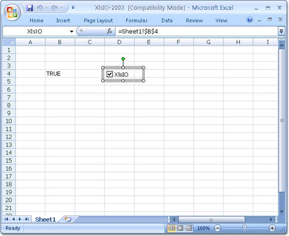

::: {style="DISPLAY: none"}
{#d2h_url_template}{#d2h_package_url style="WIDTH: 0px; DISPLAY: none; HEIGHT: 0px"}
:::

::: {.d2h_secondary_topic style="PADDING-BOTTOM: 10pt; MARGIN: 0pt; PADDING-LEFT: 0pt; PADDING-RIGHT: 0pt; PADDING-TOP: 0pt"}
#### Check Box {#check-box style="tab-stops: 0pt"}

[]{style="FONT-FAMILY: 'Trebuchet MS','sans-serif'; COLOR: #15428b; FONT-SIZE: 9pt"} 

Essential XlsIO supports reading and writing of check boxes. This can be done by using the **ICheckBoxShape** interface, which is used to add a check box inside a worksheet.

[]{style="FONT-FAMILY: 'Calibri','sans-serif'"} 

[]{style="FONT-FAMILY: 'Calibri','sans-serif'; FONT-SIZE: 12pt"} 

+------------------------------------------------------------------------------------------------------------------------------------------------------------------------------------------------------------------------------------------------------------------------------------------------------------------------------------------------+
| **[\[C#\]]{style="FONT-FAMILY: 'Courier New'; COLOR: black"}**[]{style="FONT-FAMILY: 'Courier New'; COLOR: black"}                                                                                                                                                                                                                             |
|                                                                                                                                                                                                                                                                                                                                                |
| []{style="FONT-FAMILY: 'Courier New'; COLOR: black"}                                                                                                                                                                                                                                                                                           |
|                                                                                                                                                                                                                                                                                                                                                |
| [//Create a check box with cell link.]{style="FONT-FAMILY: 'Courier New'; COLOR: green"}[]{style="FONT-FAMILY: 'Courier New'; COLOR: black"}                                                                                                                                                                                                   |
|                                                                                                                                                                                                                                                                                                                                                |
| [ICheckBoxShape]{style="FONT-FAMILY: 'Courier New'; COLOR: #2b91af"}[ chkBoxXlsIO = sheet.CheckBoxes.AddCheckBox(4, 4, 20, 75);]{style="FONT-FAMILY: 'Courier New'"}                                                                                                                                                                           |
|                                                                                                                                                                                                                                                                                                                                                |
| [chkBoxXlsIO.Text = [\"XlsIO\"]{style="COLOR: #a31515"};]{style="FONT-FAMILY: 'Courier New'"}                                                                                                                                                                                                                                                  |
|                                                                                                                                                                                                                                                                                                                                                |
| [chkBoxXlsIO.CheckState = [ExcelCheckState]{style="COLOR: #2b91af"}.Checked;]{style="FONT-FAMILY: 'Courier New'"}                                                                                                                                                                                                                              |
|                                                                                                                                                                                                                                                                                                                                                |
| [chkBoxXlsIO.LinkedCell = sheet\[[\"B4\"]{style="COLOR: #a31515"}\]; ]{style="FONT-FAMILY: 'Courier New'"}                                                                                                                                                                                                                                     |
|                                                                                                                                                                                                                                                                                                                                                |
| []{style="FONT-FAMILY: 'Courier New'; COLOR: black"}                                                                                                                                                                                                                                                                                           |
|                                                                                                                                                                                                                                                                                                                                                |
| [//Read a check box.]{style="FONT-FAMILY: 'Courier New'; COLOR: green"}[]{style="FONT-FAMILY: 'Courier New'; COLOR: black"}                                                                                                                                                                                                                    |
|                                                                                                                                                                                                                                                                                                                                                |
| [ICheckBoxShape]{style="FONT-FAMILY: 'Courier New'; COLOR: teal"}[ ]{style="FONT-FAMILY: 'Courier New'; COLOR: black"}[chkBoxXlsIO ]{style="FONT-FAMILY: 'Courier New'"}[= ]{style="FONT-FAMILY: 'Courier New'; COLOR: black"}[sheet]{style="FONT-FAMILY: 'Courier New'"}[.CheckBoxes\[0\];]{style="FONT-FAMILY: 'Courier New'; COLOR: black"} |
|                                                                                                                                                                                                                                                                                                                                                |
| [chkBoxXlsIO.Name = ]{style="FONT-FAMILY: 'Courier New'; COLOR: black"}[\"chkBoxXlsIO\"]{style="FONT-FAMILY: 'Courier New'; COLOR: maroon"}[;]{style="FONT-FAMILY: 'Courier New'; COLOR: black"}                                                                                                                                               |
+------------------------------------------------------------------------------------------------------------------------------------------------------------------------------------------------------------------------------------------------------------------------------------------------------------------------------------------------+

[]{style="COLOR: black"} 

+-------------------------------------------------------------------------------------------------------------------------------------------------------------------------------------------------------------------------------------------------------------------------------------------------------------------------------------------------------------------------------------------------------+
| **[\[VB.NET\]]{style="FONT-FAMILY: 'Courier New'; COLOR: black"}**[]{style="FONT-FAMILY: 'Courier New'; COLOR: black"}                                                                                                                                                                                                                                                                                |
|                                                                                                                                                                                                                                                                                                                                                                                                       |
| []{style="FONT-FAMILY: 'Courier New'; COLOR: black"}                                                                                                                                                                                                                                                                                                                                                  |
|                                                                                                                                                                                                                                                                                                                                                                                                       |
| [\'Create a check box.]{style="FONT-FAMILY: 'Courier New'; COLOR: green"}[]{style="FONT-FAMILY: 'Courier New'; COLOR: black"}                                                                                                                                                                                                                                                                         |
|                                                                                                                                                                                                                                                                                                                                                                                                       |
| [Dim]{style="FONT-FAMILY: 'Courier New'; COLOR: blue"}[ chkBoxXlsIO [As]{style="COLOR: blue"} [ICheckBoxShape]{style="COLOR: #2b91af"} = sheet.CheckBoxes.AddCheckBox(5, 5, 20, 75) chkBoxXlsIO.Text = [\"XlsIO\"]{style="COLOR: #a31515"}]{style="FONT-FAMILY: 'Courier New'"}                                                                                                                       |
|                                                                                                                                                                                                                                                                                                                                                                                                       |
| [chkBoxXlsIO.CheckState = [ExcelCheckState]{style="COLOR: #2b91af"}.Checked]{style="FONT-FAMILY: 'Courier New'"}                                                                                                                                                                                                                                                                                      |
|                                                                                                                                                                                                                                                                                                                                                                                                       |
| [chkBoxXlsIO.LinkedCell = sheet ([\"B4\"]{style="COLOR: #a31515"})]{style="FONT-FAMILY: 'Courier New'"}                                                                                                                                                                                                                                                                                               |
|                                                                                                                                                                                                                                                                                                                                                                                                       |
| []{style="FONT-FAMILY: 'Courier New'; COLOR: black"}                                                                                                                                                                                                                                                                                                                                                  |
|                                                                                                                                                                                                                                                                                                                                                                                                       |
| [\'Read a check box.]{style="FONT-FAMILY: 'Courier New'; COLOR: green"}[]{style="FONT-FAMILY: 'Courier New'; COLOR: black"}                                                                                                                                                                                                                                                                           |
|                                                                                                                                                                                                                                                                                                                                                                                                       |
| [Dim]{style="FONT-FAMILY: 'Courier New'; COLOR: blue"}[ ]{style="FONT-FAMILY: 'Courier New'; COLOR: black"}[chkBoxXlsIO ]{style="FONT-FAMILY: 'Courier New'"}[As]{style="FONT-FAMILY: 'Courier New'; COLOR: blue"}[ ICheckBoxShape = ]{style="FONT-FAMILY: 'Courier New'; COLOR: black"}[sheet]{style="FONT-FAMILY: 'Courier New'"}[.CheckBoxes(0)]{style="FONT-FAMILY: 'Courier New'; COLOR: black"} |
|                                                                                                                                                                                                                                                                                                                                                                                                       |
| [chkBoxXlsIO.Name = ]{style="FONT-FAMILY: 'Courier New'; COLOR: black"}[\"chkBoxXlsIO\"]{style="FONT-FAMILY: 'Courier New'; COLOR: maroon"}[]{style="FONT-FAMILY: 'Courier New'; COLOR: black"}                                                                                                                                                                                                       |
+-------------------------------------------------------------------------------------------------------------------------------------------------------------------------------------------------------------------------------------------------------------------------------------------------------------------------------------------------------------------------------------------------------+

[]{style="FONT-FAMILY: 'Calibri','sans-serif'; FONT-SIZE: 12pt"} 

[]{style="FONT-FAMILY: 'Calibri','sans-serif'; FONT-SIZE: 12pt"} 

[]{style="FONT-FAMILY: 'Calibri','sans-serif'; FONT-SIZE: 12pt"} 

{border="0"}

Figure 97: Check box with Linked Cell created using XlsIO[]{style="FONT-SIZE: 12pt"}

 

[]{#related-topics}
:::
