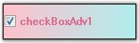

::: {style="DISPLAY: none"}
{#d2h_url_template}{#d2h_package_url style="WIDTH: 0px; DISPLAY: none; HEIGHT: 0px"}
:::

::: {.d2h_secondary_topic style="PADDING-BOTTOM: 10pt; MARGIN: 0pt; PADDING-LEFT: 0pt; PADDING-RIGHT: 0pt; PADDING-TOP: 0pt"}
#### CheckBoxAdv {#checkboxadv style="tab-stops: 0pt"}

[]{style="COLOR: #15428b"} 

The **CheckBoxAdv** is an advanced CheckBox control that supports themes, gradient colors, border settings and shadow text with various alignment options for both the text and checkbox. It provides options to display images and gradient backgrounds.

[]{style="COLOR: #15428b"} 

{border="0"}

[]{style="COLOR: #15428b"} 

Figure 607: CheckBoxAdv Control

[]{style="COLOR: #15428b"} 

CheckBoxAdv control can replace the CheckBox control provided in the Windows Forms. This type of control can be defined as consisting of a graphic and associated text that the user clicks to select or deselect an option. A check mark in the checkbox graphic indicates that the option is selected. In the CheckBoxAdv control, the graphic can be changed to an image that indicates a selected or deselected state.

[]{style="COLOR: #15428b"} 

See Also

[]{style="COLOR: #15428b"} 

More:

[ ]{#related-topics}

[{border="0" align="absMiddle"}Features](ms-xhelp:///?Id=ca607b2a-030b-4a7b-a299-cc6fe15ce6ca){style="TEXT-DECORATION: none"}

[{border="0" align="absMiddle"}Creating CheckBoxAdv](ms-xhelp:///?Id=b796799f-d62b-4842-856d-f41134197e1d){style="TEXT-DECORATION: none"}

[{border="0" align="absMiddle"}Concepts and Features](ms-xhelp:///?Id=33be5b2c-eddc-4d81-85b2-d17d019f19ed){style="TEXT-DECORATION: none"}

[{border="0" align="absMiddle"}CheckBoxAdv Events](ms-xhelp:///?Id=b5dba6e9-4227-46dd-8a05-8e58500df0ce){style="TEXT-DECORATION: none"}

[{border="0" align="absMiddle"}Frequently Asked Questions](ms-xhelp:///?Id=ddb1878e-7988-48af-8913-5d8ebedbb029){style="TEXT-DECORATION: none"}
:::
