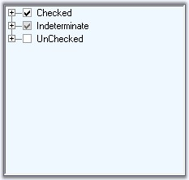
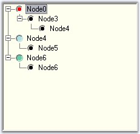
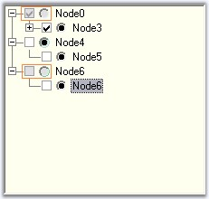

::: {style="DISPLAY: none"}
{#d2h_url_template}{#d2h_package_url style="WIDTH: 0px; DISPLAY: none; HEIGHT: 0px"}
:::

::::::::: {.d2h_secondary_topic style="PADDING-BOTTOM: 10pt; MARGIN: 0pt; PADDING-LEFT: 0pt; PADDING-RIGHT: 0pt; PADDING-TOP: 0pt"}
##### Checkbox and Option buttons {#checkbox-and-option-buttons style="MARGIN-LEFT: 18pt; tab-stops: 18.0pt"}

[]{style="COLOR: #15428b"} 

Adding Checkbox to the Nodes

 

The ShowCheckBoxes property when set will display check box for all the nodes. To apply checkbox to individual nodes, set the TreeNodeAdv.ShowCheckBox property, only for the required nodes in the NodeCollection Editor.

 

The I**nteractiveCheckBoxes** indicates whether the state of the parent node\'s checkbox is based on the checkstate of it\'s child nodes checkboxes. To set this for individual nodes set the InteractiveCheckBox property of the TreeNodeAdv.

[]{style="COLOR: #15428b"} 

::: {align="center"}
  ----------------------- ----------------------------------------------------------------------------------------------------------
  TreeViewAdv Property    Description
  ShowCheckBoxes          Indicates if the checkbox will be shown for the nodes.
  InteractiveCheckBoxes   Indicates if the state of the node\'s checkbox indicates the checkstate of the child node\'s checkboxes.
  ----------------------- ----------------------------------------------------------------------------------------------------------
:::

[]{style="COLOR: #15428b"} 

::: {align="center"}
  ---------------------- ----------------------------------------------------------
  TreeNodeAdv Property   Description
  ShowCheckBox           Indicates if the checkbox of the node is visible.
  InteractiveCheckBox    Indicates if the node will have an interactive checkbox.
  ---------------------- ----------------------------------------------------------
:::

[]{style="COLOR: #15428b"} 

::: {style="BORDER-BOTTOM: windowtext 1pt solid; BORDER-LEFT: medium none; PADDING-BOTTOM: 1pt; MARGIN: 9pt 0pt 9pt 18pt; PADDING-LEFT: 0pt; PADDING-RIGHT: 0pt; BORDER-TOP: windowtext 1pt solid; BORDER-RIGHT: medium none; PADDING-TOP: 1pt"}
{border="0"} Note: On Changing the checkstate of the checkbox,[ ]{.UGHyperlink}[[AfterInteractiveChecks]{.UGHyperlink}](../../../../../../../../Documents%20and%20Settings/sylviap/Desktop/Tools%20-%20Part%202.docx#_AfterInteractiveChecks_Event) event will be triggered.
:::

[]{#p968}[]{style="COLOR: #15428b"} 

Tristate CheckBox Settings

**[]{style="COLOR: #15428b"}** 

In the TreeViewAdv, the partial checking of the child nodes are supported. They are Checked State, Unchecked State and Intermediate State.

 

The **CheckColor** and **CheckState** property is used to set the color and the state of the check mark of the particular selected node. The options for the CheckState property are Checked, Unchecked and Indeterminate.

[]{style="COLOR: #15428b"} 

::: {align="center"}
  ---------------------------- --------------------------------------------------------------------------------------------------------------------------------------
  TreeNodeAdv Property         Description
  CheckColor                   Indicates the color of the check mark.
  CheckState                   Indicates the check state of the node.
  IntermediateCheckColor       Indicates the color of the check mark when it is in intermediate state or when its **CheckState** property is set to indeterminate.
  Checked                      This indicates if the node\'s checkbox is checked.
  EnsureDefaultOptionedChild   This specifies if at least one child of the parent node should be selected at all times.
  ---------------------------- --------------------------------------------------------------------------------------------------------------------------------------
:::

[]{style="COLOR: #15428b"} 

+---------------------------------------------------------------------------------------------------------------------------------+
| **[\[C#\]]{style="FONT-FAMILY: 'Courier New'; COLOR: black"}**                                                                  |
|                                                                                                                                 |
| **[]{style="FONT-FAMILY: 'Courier New'; COLOR: black"}**                                                                        |
|                                                                                                                                 |
| [treeNodeAdv8.CheckColor = System.Drawing.SystemColors.ControlDarkDark;]{style="FONT-FAMILY: 'Courier New'"}                    |
|                                                                                                                                 |
| [treeNodeAdv7.CheckState = System.Windows.Forms.CheckState.Indeterminate;]{style="FONT-FAMILY: 'Courier New'"}                  |
|                                                                                                                                 |
| [treeNodeAdv8.EnsureDefaultOptionedChild =  [true]{style="COLOR: blue"};]{style="FONT-FAMILY: 'Courier New'"}                   |
|                                                                                                                                 |
| [treeNodeAdv8.Checked = [true]{style="COLOR: blue"};]{style="FONT-FAMILY: 'Courier New'"}[]{style="FONT-FAMILY: 'Courier New'"} |
+---------------------------------------------------------------------------------------------------------------------------------+

[]{style="COLOR: #15428b"} 

+---------------------------------------------------------------------------------------------------------------------------------------------+
| **[\[VB.NET\]]{style="FONT-FAMILY: 'Courier New'; COLOR: black"}**                                                                          |
|                                                                                                                                             |
| **[]{style="FONT-FAMILY: 'Courier New'; COLOR: black"}**                                                                                    |
|                                                                                                                                             |
| [TreeNodeAdv8.CheckColor = System.Drawing.SystemColors.ControlDarkDark]{style="FONT-FAMILY: 'Courier New'"}                                 |
|                                                                                                                                             |
| [TreeNodeAdv7.CheckState = System.Windows.Forms.CheckState.Indeterminate]{style="FONT-FAMILY: 'Courier New'"}                               |
|                                                                                                                                             |
| [TreeNodeAdv8.EnsureDefaultOptionedChild = [True]{style="COLOR: blue"}]{style="FONT-FAMILY: 'Courier New'"}                                 |
|                                                                                                                                             |
| [TreeNodeAdv8.Checked = [True]{style="COLOR: blue"}]{style="FONT-FAMILY: 'Courier New'"}[]{style="FONT-FAMILY: 'Courier New'; COLOR: blue"} |
+---------------------------------------------------------------------------------------------------------------------------------------------+

[]{style="COLOR: #15428b"} 

{border="0"}

[]{style="COLOR: #15428b"} 

Figure 1127: Tree Nodes illustrating Tristate-CheckBox

[]{style="COLOR: #15428b"} 

Adding Option Buttons

 

**ShowOptionButtons** property, when set, will add option buttons to all the nodes which can be applied for the required nodes alone, by setting the property for the respective nodes in the NodeCollection Editor.

**[]{style="COLOR: #15428b"}** 

::: {align="center"}
  --------------------------- -----------------------------------------------------------------
  TreeNodeAdv Property        Description
  SelectedOptionButtonColor   Indicates the color of the option button in the selected state.
  ShowOptionButton            Indicates if the optionbutton of the node is visible.
  OptionButtonColor           This indicates the color of the option button.
  Optioned                    This indicates if the node\'s option button is checked.
  --------------------------- -----------------------------------------------------------------
:::

**[]{style="COLOR: #15428b"}** 

+----------------------------------------------------------------------------------------------------------------------------------------------------------------------------+
| **[\[C#\]]{style="FONT-FAMILY: 'Courier New'; COLOR: black"}**                                                                                                             |
|                                                                                                                                                                            |
| **[]{style="FONT-FAMILY: 'Courier New'; COLOR: black"}**                                                                                                                   |
|                                                                                                                                                                            |
| [treeNodeAdv9.SelectedOptionButtonColor = System.Drawing.Color.Red;]{style="FONT-FAMILY: 'Courier New'"}                                                                   |
|                                                                                                                                                                            |
| [treeNodeAdv3.OptionButtonColor = System.Drawing.[Color]{style="COLOR: teal"}.AliceBlue;]{style="FONT-FAMILY: 'Courier New'"}                                              |
|                                                                                                                                                                            |
| [treeNodeAdv6.OptionButtonColor = System.Drawing.[Color]{style="COLOR: teal"}.PowderBlue;]{style="FONT-FAMILY: 'Courier New'"}                                             |
|                                                                                                                                                                            |
| [treeNodeAdv8.OptionButtonColor = System.Drawing.[Color]{style="COLOR: teal"}.MediumAquamarine;]{style="FONT-FAMILY: 'Courier New'"}[]{style="FONT-FAMILY: 'Courier New'"} |
+----------------------------------------------------------------------------------------------------------------------------------------------------------------------------+

[]{#p969}[]{style="COLOR: #15428b"} 

+---------------------------------------------------------------------------------------------------------------------------------------------------------------------------+
| **[\[VB.NET\]]{style="FONT-FAMILY: 'Courier New'; COLOR: black"}**                                                                                                        |
|                                                                                                                                                                           |
| **[]{style="FONT-FAMILY: 'Courier New'; COLOR: black"}**                                                                                                                  |
|                                                                                                                                                                           |
| [TreeNodeAdv9.SelectedOptionButtonColor = System.Drawing.Color.Red]{style="FONT-FAMILY: 'Courier New'"}                                                                   |
|                                                                                                                                                                           |
| [treeNodeAdv3.OptionButtonColor = System.Drawing.[Color]{style="COLOR: teal"}.AliceBlue]{style="FONT-FAMILY: 'Courier New'"}                                              |
|                                                                                                                                                                           |
| [treeNodeAdv6.OptionButtonColor = System.Drawing.[Color]{style="COLOR: teal"}.PowderBlue]{style="FONT-FAMILY: 'Courier New'"}                                             |
|                                                                                                                                                                           |
| [treeNodeAdv8.OptionButtonColor = System.Drawing.[Color]{style="COLOR: teal"}.MediumAquamarine]{style="FONT-FAMILY: 'Courier New'"}[]{style="FONT-FAMILY: 'Courier New'"} |
+---------------------------------------------------------------------------------------------------------------------------------------------------------------------------+

[]{style="COLOR: #15428b"} 

{border="0"}

[]{style="COLOR: #15428b"} 

Figure 1128: Customized Selected Option Buttons

[]{style="COLOR: #15428b"} 

Disabling a node\'s Checkbox or Option button

[]{style="COLOR: #15428b"} 

The user can disable the checkbox or the option button of a node and can still select and deselect the node by setting the **EnabledButtons** property to false of the respective TreeNodeAdv.

[]{style="COLOR: #15428b"} 

::: {align="center"}
  ---------------------- -----------------------------------------------------------------------------------
  TreeNodeAdv Property   Description
  EnabledButtons         Indicates if the buttons that are displayed, are enabled for the particular node.
  ---------------------- -----------------------------------------------------------------------------------
:::

[]{style="COLOR: #15428b"} 

{border="0"}

[]{style="COLOR: #15428b"} 

Figure 1129: Disabled CheckBox and Option Buttons

[]{style="COLOR: #15428b"} 

See Also

[]{style="COLOR: #15428b"} 

[[Image Settings]{.UGHyperlink}](../../../../../../../../Documents%20and%20Settings/sylviap/Desktop/Tools%20-%20Part%202.docx#_Left,_Right_and)[]{.UGHyperlink}

 

 

 

 

[]{#related-topics}
:::::::::
