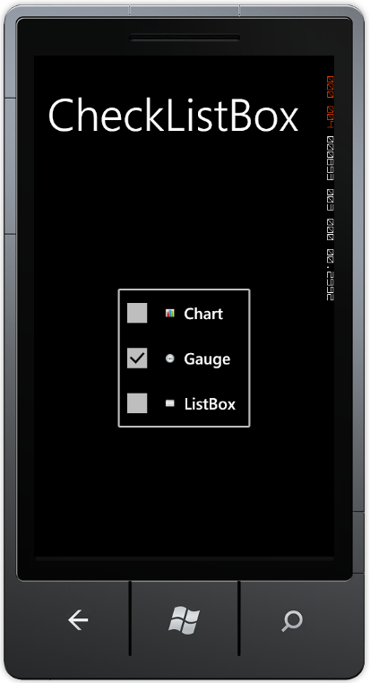
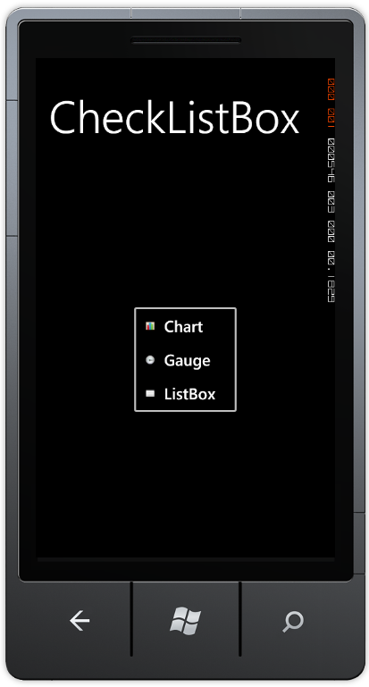
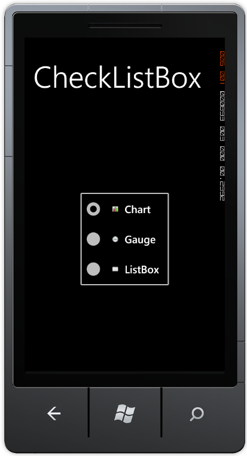

::: {style="DISPLAY: none"}
{#d2h_url_template}{#d2h_package_url style="WIDTH: 0px; DISPLAY: none; HEIGHT: 0px"}
:::

::: {.d2h_secondary_topic style="PADDING-BOTTOM: 10pt; MARGIN: 0pt; PADDING-LEFT: 0pt; PADDING-RIGHT: 0pt; PADDING-TOP: 0pt"}
#### CheckedListBox Modes {#checkedlistbox-modes style="tab-stops: 0pt"}

The mode of the CheckedListBox can be changed by using the Mode property. This is an enumeration property that holds three modes namely, Normal, Checked and RadioGroup. By setting the value for the mode, the item present in the CheckedListBox will change. The default value for the property is checked. The Normal Mode will be like a List Box with ListBoxItems listed. In the Checked mode, a Checkbox will be visible in front of the content that allows users to select / check the item, and in the RadioGroup mode a Radio button will be present, which allows users to select / check the item.

 

Use Case Scenarios

This feature will be useful for users to view the CheckedListBoxItems that can be switched between the three modes Normal, Checked and RadioGroup Modes.

 

Adding CheckedListBox Mode to an Application

The following code example illustrates the addition of CheckedListBox Mode to the application through XAML.

 

+----------------------------------------------------------------------------------------------------------------------------------------------------------------------------------------------------------------------------------------------------------------------------------------------------------------------------------------------------------------------------------------------------------------------------------------------------------------------------------------------------------------------------------------------------------------------------------------------------------------------------------------------------------------------------------------------------------------------------------------------------------------------------------------------------------------------------------------------------------------------------------------------------------------------------------------------+
| **[\[XAML\]]{style="FONT-FAMILY: 'Courier New'"}**                                                                                                                                                                                                                                                                                                                                                                                                                                                                                                                                                                                                                                                                                                                                                                                                                                                                                           |
|                                                                                                                                                                                                                                                                                                                                                                                                                                                                                                                                                                                                                                                                                                                                                                                                                                                                                                                                              |
| [\<]{style="FONT-FAMILY: 'Courier New'; COLOR: blue"}[syncfusion]{style="FONT-FAMILY: 'Courier New'; COLOR: #a31515"}[:]{style="FONT-FAMILY: 'Courier New'; COLOR: blue"}[CheckedListBox ]{style="FONT-FAMILY: 'Courier New'; COLOR: #a31515"}[Mode]{style="FONT-FAMILY: 'Courier New'; COLOR: red"}[=\"Checked\"]{style="FONT-FAMILY: 'Courier New'; COLOR: blue"}[ HorizontalAlignment]{style="FONT-FAMILY: 'Courier New'; COLOR: red"}[=\"Center\"]{style="FONT-FAMILY: 'Courier New'; COLOR: blue"}[ VerticalAlignment]{style="FONT-FAMILY: 'Courier New'; COLOR: red"}[=\"Center\"]{style="FONT-FAMILY: 'Courier New'; COLOR: blue"}[ CheckOnClick]{style="FONT-FAMILY: 'Courier New'; COLOR: red"}[=\"True\"]{style="FONT-FAMILY: 'Courier New'; COLOR: blue"}[ ]{style="FONT-FAMILY: 'Courier New'; COLOR: red"}[\>]{style="FONT-FAMILY: 'Courier New'; COLOR: blue"}[]{style="FONT-FAMILY: Consolas; COLOR: blue; FONT-SIZE: 9.5pt"} |
|                                                                                                                                                                                                                                                                                                                                                                                                                                                                                                                                                                                                                                                                                                                                                                                                                                                                                                                                              |
| [                    ]{style="FONT-FAMILY: 'Courier New'; COLOR: #a31515"}[\<]{style="FONT-FAMILY: 'Courier New'; COLOR: blue"}[syncfusion]{style="FONT-FAMILY: 'Courier New'; COLOR: #a31515"}[:]{style="FONT-FAMILY: 'Courier New'; COLOR: blue"}[CheckedListBoxItem]{style="FONT-FAMILY: 'Courier New'; COLOR: #a31515"}[ [ Content]{style="COLOR: red"}[=\"Chart\"]{style="COLOR: blue"}[ ImageMargin]{style="COLOR: red"}[=\"5,5,15,5\"]{style="COLOR: blue"} [ LeftImageSource]{style="COLOR: red"}[=\"images\\chart.png\"]{style="COLOR: blue"}[ LeftImageWidth]{style="COLOR: red"}[=\"70\"]{style="COLOR: blue"} [ ImageVerticalAlignment]{style="COLOR: red"}[=\"Center\"\>\</]{style="COLOR: blue"}[syncfusion]{style="COLOR: #a31515"}[:]{style="COLOR: blue"}[CheckedListBoxItem]{style="COLOR: #a31515"}[\>]{style="COLOR: blue"}]{style="FONT-FAMILY: 'Courier New'"}                                                         |
|                                                                                                                                                                                                                                                                                                                                                                                                                                                                                                                                                                                                                                                                                                                                                                                                                                                                                                                                              |
| [                    ]{style="FONT-FAMILY: 'Courier New'; COLOR: #a31515"}[\<]{style="FONT-FAMILY: 'Courier New'; COLOR: blue"}[syncfusion]{style="FONT-FAMILY: 'Courier New'; COLOR: #a31515"}[:]{style="FONT-FAMILY: 'Courier New'; COLOR: blue"}[CheckedListBoxItem]{style="FONT-FAMILY: 'Courier New'; COLOR: #a31515"}[ [ Content]{style="COLOR: red"}[=\"Gauge\"]{style="COLOR: blue"}[ ImageMargin]{style="COLOR: red"}[=\"5,5,15,5\"]{style="COLOR: blue"}[ LeftImageSource]{style="COLOR: red"}[=\"images\\gauge.png\"]{style="COLOR: blue"} [ LeftImageWidth]{style="COLOR: red"}[=\"70\"]{style="COLOR: blue"}[ IsChecked]{style="COLOR: red"}[=\"True\"\>\</]{style="COLOR: blue"}[syncfusion]{style="COLOR: #a31515"}[:]{style="COLOR: blue"}[CheckedListBoxItem]{style="COLOR: #a31515"}[\>]{style="COLOR: blue"}]{style="FONT-FAMILY: 'Courier New'"}                                                                         |
|                                                                                                                                                                                                                                                                                                                                                                                                                                                                                                                                                                                                                                                                                                                                                                                                                                                                                                                                              |
| [                    ]{style="FONT-FAMILY: 'Courier New'; COLOR: #a31515"}[\<]{style="FONT-FAMILY: 'Courier New'; COLOR: blue"}[syncfusion]{style="FONT-FAMILY: 'Courier New'; COLOR: #a31515"}[:]{style="FONT-FAMILY: 'Courier New'; COLOR: blue"}[CheckedListBoxItem]{style="FONT-FAMILY: 'Courier New'; COLOR: #a31515"}[ [ Content]{style="COLOR: red"}[=\"ListBox\"]{style="COLOR: blue"}[ ImageMargin]{style="COLOR: red"}[=\"5,5,15,5\"]{style="COLOR: blue"} [ LeftImageSource]{style="COLOR: red"}[=\"images\\List box.png\"]{style="COLOR: blue"}[ LeftImageWidth]{style="COLOR: red"}[=\"70\"]{style="COLOR: blue"} [ \>\</]{style="COLOR: blue"}[syncfusion]{style="COLOR: #a31515"}[:]{style="COLOR: blue"}[CheckedListBoxItem]{style="COLOR: #a31515"}[\>]{style="COLOR: blue"}]{style="FONT-FAMILY: 'Courier New'"}                                                                                                           |
|                                                                                                                                                                                                                                                                                                                                                                                                                                                                                                                                                                                                                                                                                                                                                                                                                                                                                                                                              |
| [\</]{style="FONT-FAMILY: 'Courier New'; COLOR: blue"}[syncfusion]{style="FONT-FAMILY: 'Courier New'; COLOR: #a31515"}[:]{style="FONT-FAMILY: 'Courier New'; COLOR: blue"}[CheckedListBox]{style="FONT-FAMILY: 'Courier New'; COLOR: #a31515"}[\>]{style="FONT-FAMILY: 'Courier New'; COLOR: blue"}                                                                                                                                                                                                                                                                                                                                                                                                                                                                                                                                                                                                                                          |
|                                                                                                                                                                                                                                                                                                                                                                                                                                                                                                                                                                                                                                                                                                                                                                                                                                                                                                                                              |
| [              ]{style="FONT-FAMILY: 'Courier New'"}                                                                                                                                                                                                                                                                                                                                                                                                                                                                                                                                                                                                                                                                                                                                                                                                                                                                                         |
+----------------------------------------------------------------------------------------------------------------------------------------------------------------------------------------------------------------------------------------------------------------------------------------------------------------------------------------------------------------------------------------------------------------------------------------------------------------------------------------------------------------------------------------------------------------------------------------------------------------------------------------------------------------------------------------------------------------------------------------------------------------------------------------------------------------------------------------------------------------------------------------------------------------------------------------------+

 

 

{border="0"}

Figure 45:  CheckedListBox with Checked Mode

 

{border="0"}

Figure 46: CheckedListBox with Normal Mode

 

 

{border="0"}

Figure 47: CheckedListBox with Radio Group Mode

 

 

Properties

Table 14: CheckedListBox Mode Properties Table

  ---------- -------------------------------------------------------------------- -------------------- --------------- -----------------
  Property   Description                                                          Type                 Data Type       Reference links
  Mode       Specifies the mode that is used to display the CheckedListBoxItems   DependencyProperty   Modes.Checked   
  ---------- -------------------------------------------------------------------- -------------------- --------------- -----------------

[]{style="COLOR: #c00000"} 

[]{#related-topics}
:::
