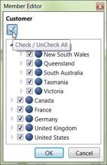
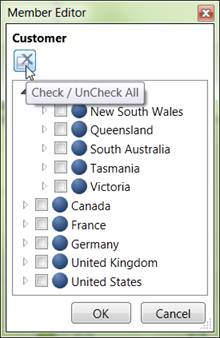

::: {style="DISPLAY: none"}
{#d2h_url_template} {#d2h_package_url style="WIDTH: 0px; DISPLAY: none; HEIGHT: 0px"}
:::

::: {.d2h_secondary_topic style="PADDING-BOTTOM: 10pt; MARGIN: 0pt; PADDING-LEFT: 0pt; PADDING-RIGHT: 0pt; PADDING-TOP: 0pt"}
#### Check/Uncheck all nodes {#checkuncheck-all-nodes style="tab-stops: 0pt"}

By clicking the Check/Uncheck All toggle button on top of the tree view in member editor, we check or uncheck all the nodes in the tree. The check/uncheck button image will get changed based on the state of the nodes in the tree.

{border="0"}

Figure 37: All nodes are checked

{border="0"}

Figure 38: All nodes are unchecked

[]{style="FONT-FAMILY: 'Calibri','sans-serif'"} 

[]{#related-topics}
:::
