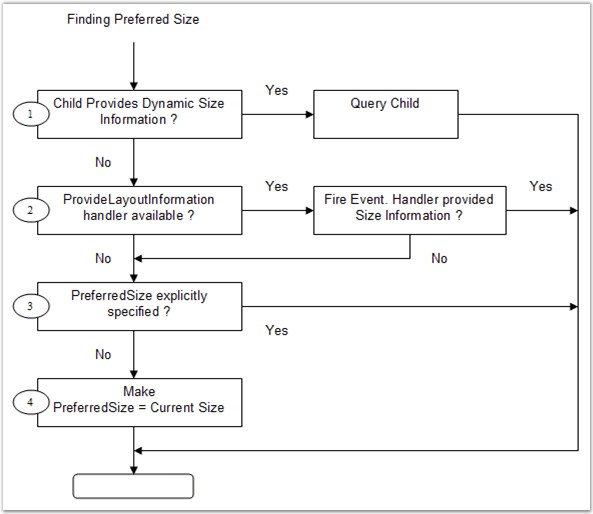

::: {style="DISPLAY: none"}
{#d2h_url_template}{#d2h_package_url style="WIDTH: 0px; DISPLAY: none; HEIGHT: 0px"}
:::

:::::: {.d2h_secondary_topic style="PADDING-BOTTOM: 10pt; MARGIN: 0pt; PADDING-LEFT: 0pt; PADDING-RIGHT: 0pt; PADDING-TOP: 0pt"}
##### Child Control Settings {#child-control-settings style="tab-stops: 0pt"}

[]{style="COLOR: #15428b"} 

The Child control settings for the Layout Managers are given below.

[]{style="COLOR: #15428b"} 

Size

[]{style="COLOR: #15428b"} 

Preferred Size

[]{style="COLOR: #15428b"} 

The Layout Managers usually layout the components based on their preferred sizes. But a .NET control does not provide information regarding it\'s preferred size. To overcome this, a **PreferredSize** extended property is provided for each Child control at design time.

 

In code, you can perform the same using the methods given below.

 

::: {align="center"}
  ------------------ ---------------------------------------------------------------------
  Methods            Description
  SetPreferredSize   Associates a preferred size with the specified control.
  GetPreferredSize   Retrieves the preferred size associated with the specified control.
  ------------------ ---------------------------------------------------------------------
:::

[]{style="COLOR: #15428b"} 

+-------------------------------------------------------------------------------------------------------------------------------------------------------------------------------------------------------------------------------------------------+
| **[\[C#\]]{style="FONT-FAMILY: 'Courier New'; COLOR: black"}**                                                                                                                                                                                  |
|                                                                                                                                                                                                                                                 |
| []{style="FONT-FAMILY: 'Courier New'; COLOR: black"}                                                                                                                                                                                            |
|                                                                                                                                                                                                                                                 |
| [this]{style="FONT-FAMILY: 'Courier New'; COLOR: blue"}[.cardLayout1.SetPreferredSize([this]{style="COLOR: blue"}.button1, [new]{style="COLOR: blue"} System.Drawing.[Size]{style="COLOR: teal"}(75, 92));]{style="FONT-FAMILY: 'Courier New'"} |
+-------------------------------------------------------------------------------------------------------------------------------------------------------------------------------------------------------------------------------------------------+

[]{style="COLOR: #15428b"} 

+---------------------------------------------------------------------------------------------------------------------------------------------------------------------------------------------------------------------+
| **[\[VB.NET\]]{style="FONT-FAMILY: 'Courier New'; COLOR: black"}**                                                                                                                                                  |
|                                                                                                                                                                                                                     |
| []{style="FONT-FAMILY: 'Courier New'; COLOR: black"}                                                                                                                                                                |
|                                                                                                                                                                                                                     |
| [Me]{style="FONT-FAMILY: 'Courier New'; COLOR: blue"}[.cardLayout1.SetPreferredSize([Me]{style="COLOR: blue"}.button1, [New]{style="COLOR: blue"} System.Drawing.Size(75, 92))]{style="FONT-FAMILY: 'Courier New'"} |
+---------------------------------------------------------------------------------------------------------------------------------------------------------------------------------------------------------------------+

[]{style="COLOR: #15428b"} 

Minimum Size

[]{style="COLOR: #15428b"} 

You can similarly associate a minimum size for a Child component through the **MinimumSize** extended property. However, some Layout Managers ignore this setting. Refer to the individual Layout Managers for more information on how the size plays an important part in the layout logic.

 

In code, you can perform the same using the methods given below.

[]{style="COLOR: #15428b"} 

::: {align="center"}
  ---------------- -------------------------------------------------------------------
  Methods          Description
  SetMinimumSize   Associates a minimum size with the specified control.
  GetMinimumSize   Retrieves the minimum size associated with the specified control.
  ---------------- -------------------------------------------------------------------
:::

[]{style="COLOR: #4a5c8c; FONT-SIZE: 8pt"} 

+-----------------------------------------------------------------------------------------------------------------------------------------------------------------------------------------------------------------------------------------------+
| **[\[C#\]]{style="FONT-FAMILY: 'Courier New'; COLOR: black"}**                                                                                                                                                                                |
|                                                                                                                                                                                                                                               |
| []{style="FONT-FAMILY: 'Courier New'; COLOR: black"}                                                                                                                                                                                          |
|                                                                                                                                                                                                                                               |
| [this]{style="FONT-FAMILY: 'Courier New'; COLOR: blue"}[.cardLayout1.SetMinimumSize([this]{style="COLOR: blue"}.button1, [new]{style="COLOR: blue"} System.Drawing.[Size]{style="COLOR: teal"}(75, 92));]{style="FONT-FAMILY: 'Courier New'"} |
+-----------------------------------------------------------------------------------------------------------------------------------------------------------------------------------------------------------------------------------------------+

[]{style="COLOR: #15428b"} 

+-------------------------------------------------------------------------------------------------------------------------------------------------------------------------------------------------------------------+
| **[\[VB.NET\]]{style="FONT-FAMILY: 'Courier New'; COLOR: black"}**                                                                                                                                                |
|                                                                                                                                                                                                                   |
| []{style="FONT-FAMILY: 'Courier New'; COLOR: black"}                                                                                                                                                              |
|                                                                                                                                                                                                                   |
| [Me]{style="FONT-FAMILY: 'Courier New'; COLOR: blue"}[.cardLayout1.SetMinimumSize([Me]{style="COLOR: blue"}.button1, [New]{style="COLOR: blue"} System.Drawing.Size(75, 92))]{style="FONT-FAMILY: 'Courier New'"} |
+-------------------------------------------------------------------------------------------------------------------------------------------------------------------------------------------------------------------+

[]{style="COLOR: #4a5c8c; FONT-SIZE: 8pt"} 

You can also dynamically provide preferred and minimum size information for a Child component at run time. The manner in which a Layout Manager determines the preferred size for a Child control is illustrated below.

[]{style="COLOR: #15428b"} 

[·      ]{style="FONT-FAMILY: Symbol"}The layout manager checks if the Child control / component implements the **IProvideLayoutInformation** interface. If so, it calls into that interface to retrieve the preferred size.

 

[·      ]{style="FONT-FAMILY: Symbol"}If the above step fails, the Layout Manager fires the **ProvideLayoutInformation** event, requesting the size information required. If the event is handled and the information provided, that size will be used.

 

[·      ]{style="FONT-FAMILY: Symbol"}If the above step fails, the Layout Manager checks if a preferred size was provided statically during design time using the extended **PreferredSize** property or in code using the **SetPreferredSize()** method. If so, that size is used. If not, the current size of the Child control is made the preferred size and that size will be used.

[]{style="COLOR: #15428b"} 

{border="0"}

[]{style="COLOR: #15428b"} 

Figure 655: Steps in determining the Preferred Size for a Child Control

[]{style="COLOR: #15428b"} 

::: {style="BORDER-BOTTOM: windowtext 1pt solid; BORDER-LEFT: medium none; PADDING-BOTTOM: 1pt; MARGIN-TOP: 9pt; PADDING-LEFT: 0pt; PADDING-RIGHT: 0pt; MARGIN-BOTTOM: 9pt; BORDER-TOP: windowtext 1pt solid; BORDER-RIGHT: medium none; PADDING-TOP: 1pt"}
{border="0"} Note: The same steps are used to determine the minimum size, if required, for a Child control.

 

{border="0"} Note:[ ]{style="COLOR: black; FONT-SIZE: 8pt"}The above properties are available as the extended properties for the Child controls of CardLayout, FlowLayout and GridBagLayout only.
:::

[]{style="COLOR: #15428b"} 

See Also

[]{style="COLOR: #15428b"} 

[BorderLayout]{.UGHyperlink}[ -- ]{.UGHyperlink}[Configuring Child Control]{.UGHyperlink}[, ]{.UGHyperlink}[CardLayout]{.UGHyperlink}[ - ]{.UGHyperlink}[Configuring Child Controls]{.UGHyperlink}[, ]{.UGHyperlink}[FlowLayout]{.UGHyperlink}[ - ]{.UGHyperlink}[Configuring Child Controls]{.UGHyperlink}[, ]{.UGHyperlink}[GridLayout]{.UGHyperlink}[ - ]{.UGHyperlink}[Configuring Child Controls]{.UGHyperlink}[, ]{.UGHyperlink}[GridBagLayout]{.UGHyperlink}[ - ]{.UGHyperlink}[Configuring Child Controls]{.UGHyperlink}[]{.UGHyperlink}

[]{#related-topics}
::::::
