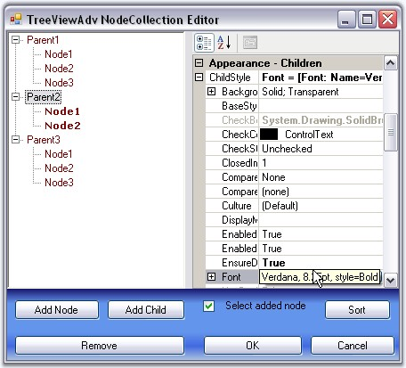
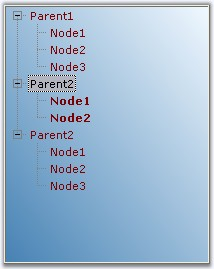

::: {style="DISPLAY: none"}
{#d2h_url_template}{#d2h_package_url style="WIDTH: 0px; DISPLAY: none; HEIGHT: 0px"}
:::

::: {.d2h_secondary_topic style="PADDING-BOTTOM: 10pt; MARGIN: 0pt; PADDING-LEFT: 0pt; PADDING-RIGHT: 0pt; PADDING-TOP: 0pt"}
##### Child Style {#child-style style="MARGIN-LEFT: 18pt; tab-stops: 18.0pt"}

 

**Setting a Common Style for All the Children of a Parent Node**

 

This topic illustrates how the appearance of all the children of a particular node can be affected by modifying the **ChildStyle** property of that TreeNodeAdv. In this example, we will modify the font for all the children of a parent node.

 

In the Node Collection Editor, modify the settings in the **TreeNodeAdv.ChildStyle** property. These changes will be reflected in the child node of this node.

[]{style="COLOR: #15428b"} 

{border="0"}

[]{style="COLOR: #15428b"} 

Figure 1160: ChildStyle set using Node Collection Editor

[]{style="COLOR: #15428b"} 

{border="0"}

[]{style="COLOR: #15428b"} 

Figure 1161: ChildStyle with Verdana, 8, Bold set for Parent2 Node

 

 

 

 

[]{#related-topics}
:::
