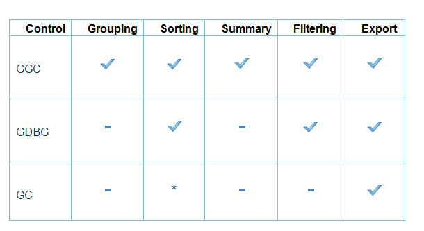

::: {style="DISPLAY: none"}
{#d2h_url_template}{#d2h_package_url style="WIDTH: 0px; DISPLAY: none; HEIGHT: 0px"}
:::

::::: {#nsbanner .d2h_main_nsbanner style="BORDER-BOTTOM: #999999 1px solid; POSITION: relative; PADDING-BOTTOM: 0px; BACKGROUND-COLOR: transparent; PADDING-LEFT: 0px; PADDING-RIGHT: 0px; DISPLAY: none; BORDER-TOP: #999999 1px solid; PADDING-TOP: 0px; LEFT: 0px"}
:::: {#TitleRow .d2h_main_titlerow style="PADDING-BOTTOM: 4px; BACKGROUND-COLOR: transparent; PADDING-LEFT: 22px; WIDTH: 100%; PADDING-RIGHT: 10px; DISPLAY: none; PADDING-TOP: 4px"}
::: {#ienav .d2h_main_ienav style="DISPLAY: none"}
{#D2HPrevious .D2HPreviousEnabled}  {#D2HNext .D2HNextEnabled}
:::
::::
:::::

:::: {#nstext .d2h_main_nstext style="PADDING-BOTTOM: 10px; BACKGROUND-COLOR: transparent; PADDING-LEFT: 22px; PADDING-RIGHT: 10px; HEIGHT: 100%; OVERFLOW: auto; PADDING-TOP: 5px" hasuserbackground="true" valign="bottom"}
::: {#d2h_breadcrumbs .d2h_breadcrumbs}
[Essential Studio User Guide Documentation](ms-xhelp:///?Id=12457748-09e3-4d74-a240-8e049cedf030){.d2h_breadcrumbsNormal}[ \> ]{.d2h_breadcrumbsLinkSeparator}[User Interface Edition](ms-xhelp:///?Id=c29296b7-531c-413b-a0ec-488ca1f7f669){.d2h_breadcrumbsNormal}[ \> ]{.d2h_breadcrumbsLinkSeparator}[Essential Windows](ms-xhelp:///?Id=e60759d8-47a4-4570-9d7a-16a68d63f2ea){.d2h_breadcrumbsNormal}[ \> ]{.d2h_breadcrumbsLinkSeparator}[Essential Grid]{.d2h_breadcrumbsContentsOnly}[ \> ]{.d2h_breadcrumbsLinkSeparator}[Overview](ms-xhelp:///?Id=7cd84c1e-bfd5-4143-b453-c3eb5a09e350){.d2h_breadcrumbsNormal}
:::

## [Choosing the Best ]{style="BACKGROUND: white"}Grid[]{style="BACKGROUND: white"} {#choosing-the-best-grid style="tab-stops: 0pt"}

[The **GridControl** (GC) is a powerful grid control that is implemented using unique styles architecture. Grid control, which is similar to Microsoft Excel, allows extremely detailed customization down to the cell level. Multilevel undo-redo, shared scrollbar support, data view separation, floating cells, more than 18 cell types, and unmatched extensibility are the unique features of the Essential Grid. This is a complete native .NET UI library, which provides several packages for building modern Windows applications using the Microsoft .NET framework. ]{style="BACKGROUND: white"}

[]{style="BACKGROUND: white"} 

The **GridGroupingControl** (GGC) is a column-row oriented grid that is used to bind to a data source. Essential Grouping allows you to easily group, sort, filter, and summarize your data. It can display true nested grids with hierarchical data, and it can also display multiple, unrelated tables in one grid.

 

The **GridDataBoundGrid** (GDBG) has been designed to be used as a grid bound to a data source such as an ADO.NET data set or data table. No data values are stored in the GridDataBoundGrid object. In GDBG, individual columns act as single entity (column-centric). Unlike the **GridControl**, GDBG is data bound.

 

This section analyses the efficiency of the Grids based on the most important features. The following are the important features:

 

[·      ]{style="FONT-FAMILY: Symbol"}Performance

[·      ]{style="FONT-FAMILY: Symbol"}Grouping

[·      ]{style="FONT-FAMILY: Symbol"}Sorting

[·      ]{style="FONT-FAMILY: Symbol"}Summary

[·      ]{style="FONT-FAMILY: Symbol"}ExcelExport

[·      ]{style="FONT-FAMILY: Symbol"}Filtering

 

*[]{style="COLOR: black"}* 

 

\*Sorting can be performed through customizing the *GridSortColumnHeaderCellModel.*

*[]{style="COLOR: black"}* 

*[]{style="COLOR: black"}* 

 

More:

[ ]{#related-topics}

[{border="0" align="absMiddle"}Performance](ms-xhelp:///?Id=44a03471-800c-415b-85a6-07d46d895f34){style="TEXT-DECORATION: none"}

[{border="0" align="absMiddle"}Grouping](ms-xhelp:///?Id=463cac4b-eddc-4dcc-9b93-ed9f1a1c95a0){style="TEXT-DECORATION: none"}

[{border="0" align="absMiddle"}Summary](ms-xhelp:///?Id=695a8044-5532-480c-90ce-7e275ec1dd7d){style="TEXT-DECORATION: none"}

[{border="0" align="absMiddle"}Sorting](ms-xhelp:///?Id=84c79987-bfde-408d-9796-764e6a3d42a2){style="TEXT-DECORATION: none"}

[{border="0" align="absMiddle"}Excel Export](ms-xhelp:///?Id=2490d680-95be-4377-b62b-72b87443806f){style="TEXT-DECORATION: none"}

[{border="0" align="absMiddle"}Filtering](ms-xhelp:///?Id=d3ade745-42c5-4b42-8f29-7eba3d4afa59){style="TEXT-DECORATION: none"}
::::
