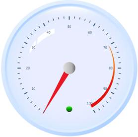
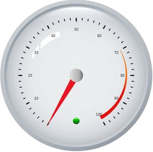
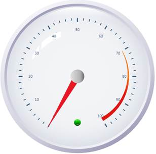
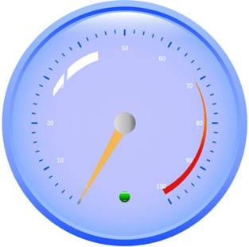
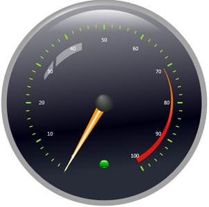
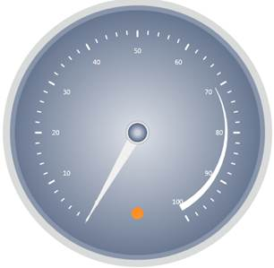
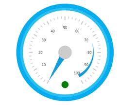

::: {style="DISPLAY: none"}
{#d2h_url_template}{#d2h_package_url style="WIDTH: 0px; DISPLAY: none; HEIGHT: 0px"}
:::

::::: {#nsbanner .d2h_main_nsbanner style="BORDER-BOTTOM: #999999 1px solid; POSITION: relative; PADDING-BOTTOM: 0px; BACKGROUND-COLOR: transparent; PADDING-LEFT: 0px; PADDING-RIGHT: 0px; DISPLAY: none; BORDER-TOP: #999999 1px solid; PADDING-TOP: 0px; LEFT: 0px"}
:::: {#TitleRow .d2h_main_titlerow style="PADDING-BOTTOM: 4px; BACKGROUND-COLOR: transparent; PADDING-LEFT: 22px; WIDTH: 100%; PADDING-RIGHT: 10px; DISPLAY: none; PADDING-TOP: 4px"}
::: {#ienav .d2h_main_ienav style="DISPLAY: none"}
{#D2HPrevious .D2HPreviousEnabled}  {#D2HNext .D2HNextEnabled}
:::
::::
:::::

:::: {#nstext .d2h_main_nstext style="PADDING-BOTTOM: 10px; BACKGROUND-COLOR: transparent; PADDING-LEFT: 22px; PADDING-RIGHT: 10px; HEIGHT: 100%; OVERFLOW: auto; PADDING-TOP: 5px" hasuserbackground="true" valign="bottom"}
::: {#d2h_breadcrumbs .d2h_breadcrumbs}
[Essential Studio User Guide Documentation](ms-xhelp:///?Id=12457748-09e3-4d74-a240-8e049cedf030){.d2h_breadcrumbsNormal}[ \> ]{.d2h_breadcrumbsLinkSeparator}[User Interface Edition](ms-xhelp:///?Id=c29296b7-531c-413b-a0ec-488ca1f7f669){.d2h_breadcrumbsNormal}[ \> ]{.d2h_breadcrumbsLinkSeparator}[Essential WPF](ms-xhelp:///?Id=7f4f82c5-151c-4262-94d0-75c4626c77bc){.d2h_breadcrumbsNormal}[ \> ]{.d2h_breadcrumbsLinkSeparator}[Essential Gauge]{.d2h_breadcrumbsContentsOnly}[ \> ]{.d2h_breadcrumbsLinkSeparator}[Gauge WPF Controls](ms-xhelp:///?Id=1b650d21-639c-453f-89e6-26b3efcea22b){.d2h_breadcrumbsNormal}[ \> ]{.d2h_breadcrumbsLinkSeparator}[Visual Styles for all the Gauges](ms-xhelp:///?Id=e210706b-dec2-4dfd-ab88-ddbf0464af16){.d2h_breadcrumbsNormal}
:::

### Circular Gauge {#circular-gauge style="tab-stops: 0pt"}

The following code snippet explains how to set the **VisualStyle** in XAML for Circular Gauge.

 

+---------------------------------------------------------------------------------------------------------------------------------------------------------------------------------------------------------------------------------------------------------------------------------------------------------------------------------------------------------------------------------------------------------------------------------------------------------------------------------------------------------------------------------------------------------------------------------------------------------------------------------------------------------------------------------------------------+
| []{style="FONT-FAMILY: Consolas; COLOR: #a31515; FONT-SIZE: 9.5pt"}                                                                                                                                                                                                                                                                                                                                                                                                                                                                                                                                                                                                                               |
|                                                                                                                                                                                                                                                                                                                                                                                                                                                                                                                                                                                                                                                                                                   |
| **[\[XAML\]  ]{style="FONT-FAMILY: 'Courier New'"}**                                                                                                                                                                                                                                                                                                                                                                                                                                                                                                                                                                                                                                              |
|                                                                                                                                                                                                                                                                                                                                                                                                                                                                                                                                                                                                                                                                                                   |
| []{style="FONT-FAMILY: 'Courier New'; COLOR: #a31515"}                                                                                                                                                                                                                                                                                                                                                                                                                                                                                                                                                                                                                                            |
|                                                                                                                                                                                                                                                                                                                                                                                                                                                                                                                                                                                                                                                                                                   |
| [\<]{style="FONT-FAMILY: 'Courier New'; COLOR: blue"}[syncfusion]{style="FONT-FAMILY: 'Courier New'; COLOR: #a31515"}[:]{style="FONT-FAMILY: 'Courier New'; COLOR: blue"}[CircularGauge]{style="FONT-FAMILY: 'Courier New'; COLOR: #a31515"}[ [Name]{style="COLOR: red"}[=\"gauge\"]{style="COLOR: blue"}[ HorizontalContentAlignment]{style="COLOR: red"}[=\"Center\"]{style="COLOR: blue"}   [HorizontalContentAlignment]{style="COLOR: red"}[=\"Center\" ]{style="COLOR: blue"}[Syncfusion]{style="COLOR: red"}[:]{style="COLOR: blue"}[SkinStorage.VisualStyle]{style="COLOR: red"}[=\"Office2007Blue\" ]{style="COLOR: blue"}/[\>]{style="COLOR: blue"}]{style="FONT-FAMILY: 'Courier New'"} |
|                                                                                                                                                                                                                                                                                                                                                                                                                                                                                                                                                                                                                                                                                                   |
|                                                                                                                                                                                                                                                                                                                                                                                                                                                                                                                                                                                                                                                                                                   |
+---------------------------------------------------------------------------------------------------------------------------------------------------------------------------------------------------------------------------------------------------------------------------------------------------------------------------------------------------------------------------------------------------------------------------------------------------------------------------------------------------------------------------------------------------------------------------------------------------------------------------------------------------------------------------------------------------+

 

The following code snippet explains how to set the **VisualStyle** in C# for Circular Gauge.

 

+------------------------------------------------------------------------------------------------------------------------------------------------------------------------------+
| []{style="FONT-FAMILY: Consolas; COLOR: #a31515; FONT-SIZE: 9.5pt"}                                                                                                          |
|                                                                                                                                                                              |
| **[\[C#\]  ]{style="FONT-FAMILY: 'Courier New'"}**                                                                                                                           |
|                                                                                                                                                                              |
| []{style="FONT-FAMILY: 'Courier New'; COLOR: #a31515"}                                                                                                                       |
|                                                                                                                                                                              |
| [SkinStorage]{style="FONT-FAMILY: 'Courier New'; COLOR: #2b91af"}[.SetVisualStyle(gauge, [\"Office2007Blue\"]{style="COLOR: #a31515"});]{style="FONT-FAMILY: 'Courier New'"} |
|                                                                                                                                                                              |
|                                                                                                                                                                              |
+------------------------------------------------------------------------------------------------------------------------------------------------------------------------------+

 

The output is shown as below.

 

 

 

{border="0"}

Figure 80: Office2007Blue

*[]{style="FONT-SIZE: 9pt"}* 

The following images illustrate the various skins applied to the Circular Gauge.

 

{border="0"}

Figure 81: Office2007Black

 

{border="0"}

Figure 82: Office2007Silver

{border="0"}

Figure 83: Office2003

*[]{style="FONT-SIZE: 9pt"}* 

{border="0"}

Figure 84: Blend

{border="0"}

Figure 85: VS2010

{border="0"}*[]{style="FONT-SIZE: 9pt"}*

Figure 86: Metro

[]{#related-topics}
::::
