::: {style="DISPLAY: none"}
{#d2h_url_template} {#d2h_package_url style="WIDTH: 0px; DISPLAY: none; HEIGHT: 0px"}
:::

::::: {#nsbanner .d2h_main_nsbanner style="BORDER-BOTTOM: #999999 1px solid; POSITION: relative; PADDING-BOTTOM: 0px; BACKGROUND-COLOR: transparent; PADDING-LEFT: 0px; PADDING-RIGHT: 0px; DISPLAY: none; BORDER-TOP: #999999 1px solid; PADDING-TOP: 0px; LEFT: 0px"}
:::: {#TitleRow .d2h_main_titlerow style="PADDING-BOTTOM: 4px; BACKGROUND-COLOR: transparent; PADDING-LEFT: 22px; WIDTH: 100%; PADDING-RIGHT: 10px; DISPLAY: none; PADDING-TOP: 4px"}
::: {#ienav .d2h_main_ienav style="DISPLAY: none"}
{#D2HPrevious .D2HPreviousEnabled}  {#D2HNext .D2HNextEnabled}
:::
::::
:::::

:::: {#nstext .d2h_main_nstext style="PADDING-BOTTOM: 10px; BACKGROUND-COLOR: transparent; PADDING-LEFT: 22px; PADDING-RIGHT: 10px; HEIGHT: 100%; OVERFLOW: auto; PADDING-TOP: 5px" hasuserbackground="true" valign="bottom"}
::: {#d2h_breadcrumbs .d2h_breadcrumbs}
[Essential Studio User Guide Documentation](ms-xhelp:///?Id=12457748-09e3-4d74-a240-8e049cedf030){.d2h_breadcrumbsNormal} [ \> ]{.d2h_breadcrumbsLinkSeparator} [User Interface Edition](ms-xhelp:///?Id=c29296b7-531c-413b-a0ec-488ca1f7f669){.d2h_breadcrumbsNormal} [ \> ]{.d2h_breadcrumbsLinkSeparator} [Essential ASP.NET](ms-xhelp:///?Id=25c35330-c127-4dad-9a92-ed79dc7261a6){.d2h_breadcrumbsNormal} [ \> ]{.d2h_breadcrumbsLinkSeparator} [Essential Gauge]{.d2h_breadcrumbsContentsOnly} [ \> ]{.d2h_breadcrumbsLinkSeparator} [Getting Started](ms-xhelp:///?Id=34a29395-708d-43cb-9013-8c236b278443){.d2h_breadcrumbsNormal} [ \> ]{.d2h_breadcrumbsLinkSeparator} [Feature Summary](ms-xhelp:///?Id=d797ebe8-dc93-4523-95bb-325c3a63eb23){.d2h_breadcrumbsNormal}
:::

### Circular Gauge {#circular-gauge style="tab-stops: 0pt"}

The Circular Gauge in ASP.NET has advanced features that include the following:

Easy Customization

The look and feel of a Web gauge is completely customizable. Even minute parts of the gauge, such as pointers, pointer caps, scales, ticks, labels, and state indicators, can all be customized quite easily.

{border="0"}

Figure 7: Customized circular gauge

 

Multiple Scales and Pointers[]{style="FONT-FAMILY: 'Calibri','sans-serif'"}

 The Circular gauge can be tweaked to display multiple scales and pointers within a single gauge. All pointers, as well as their respective scales, can be customized at runtime.

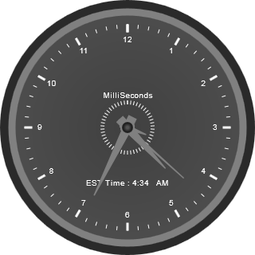{border="0"}

Figure 8: Circular gauge with multiple scales and pointers

**[]{style="FONT-FAMILY: 'Calibri','sans-serif'"}**  

Pointer Types[]{style="FONT-FAMILY: 'Calibri','sans-serif'"}

You can choose from a variety of 10 different needles and marker pointers, so that your gauge has the regular needles, or other markers pointers. The various pointer types supported by Essential Gauge on ASP.NET are:

[·      ]{style="FONT-FAMILY: Symbol"}Rectangle

[·      ]{style="FONT-FAMILY: Symbol"}Triangle

[·      ]{style="FONT-FAMILY: Symbol"}Ellipse

[·      ]{style="FONT-FAMILY: Symbol"}Diamond

[·      ]{style="FONT-FAMILY: Symbol"}Pentagon

[·      ]{style="FONT-FAMILY: Symbol"}Circle

[·      ]{style="FONT-FAMILY: Symbol"}Slider

[·      ]{style="FONT-FAMILY: Symbol"}Pointer

[·      ]{style="FONT-FAMILY: Symbol"}Wedge

[·      ]{style="FONT-FAMILY: Symbol"}Trapezoid

 

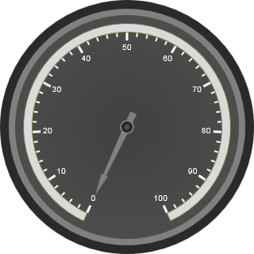{border="0"}

Figure 9: Circular gauge having a needle with triangular pointer

 

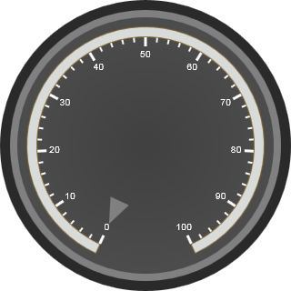{border="0"}

Figure 10:Circular gauge using a marker

 

 

Range

The range of a circular gauge displays the range meter within the specified values, so you can visually perceive how high or low a value is, without actually looking at the scale.

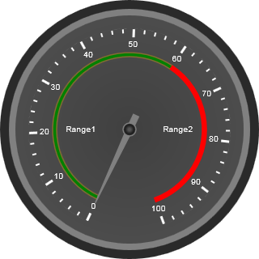{border="0"}

Figure 11:Circular gauge with different ranges

 

 

Custom Label

The Circular gauge supports custom labels in which you can even display your own label from the linear gauge.

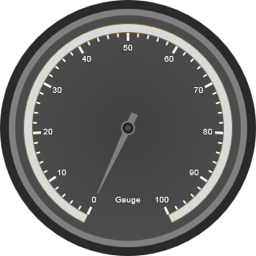{border="0"}

Figure 12: Circular gauge using label from linear gauge

 

Appearance

The Circular gauge now ships with fourteen stunning skins for a better, more professional experience. Users can easily modify the look and feel of a gauge component by using the built-in visual styles and color schemes.

Below are circular gauges with a few of the skins available:

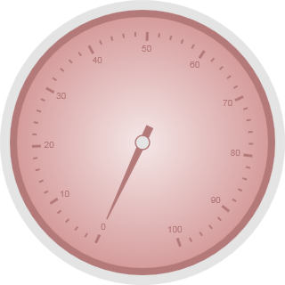{border="0"}

Figure 13: Almond skin on the circular gauge

 

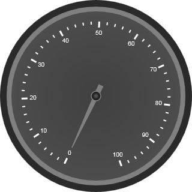{border="0"}

Figure 14:Circular Gauge using the blend skin

 

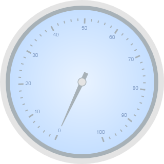{border="0"}

Figure 15: Circular gauge using the Office 2007 blue skin

 

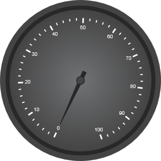{border="0"}

Figure 16: Circular gauge with the Midnight skin

 

 

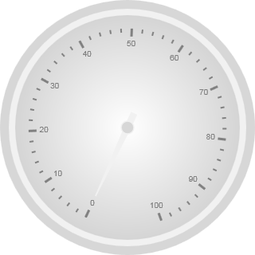{border="0"}

Figure 17: Marble skin on the circular gauge

 

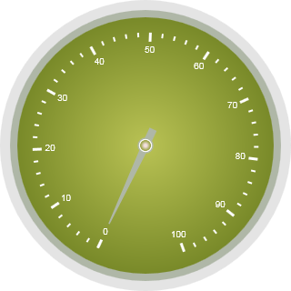{border="0"}

Figure 18: Circular gauge with Olive skin

 

[]{#related-topics}
::::
