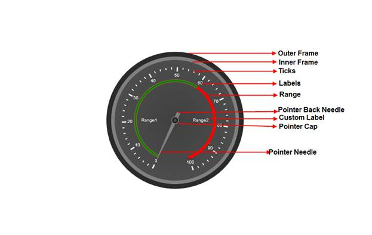

::: {style="DISPLAY: none"}
{#d2h_url_template} {#d2h_package_url style="WIDTH: 0px; DISPLAY: none; HEIGHT: 0px"}
:::

::::: {#nsbanner .d2h_main_nsbanner style="BORDER-BOTTOM: #999999 1px solid; POSITION: relative; PADDING-BOTTOM: 0px; BACKGROUND-COLOR: transparent; PADDING-LEFT: 0px; PADDING-RIGHT: 0px; DISPLAY: none; BORDER-TOP: #999999 1px solid; PADDING-TOP: 0px; LEFT: 0px"}
:::: {#TitleRow .d2h_main_titlerow style="PADDING-BOTTOM: 4px; BACKGROUND-COLOR: transparent; PADDING-LEFT: 22px; WIDTH: 100%; PADDING-RIGHT: 10px; DISPLAY: none; PADDING-TOP: 4px"}
::: {#ienav .d2h_main_ienav style="DISPLAY: none"}
{#D2HPrevious .D2HPreviousEnabled}  {#D2HNext .D2HNextEnabled}
:::
::::
:::::

:::: {#nstext .d2h_main_nstext style="PADDING-BOTTOM: 10px; BACKGROUND-COLOR: transparent; PADDING-LEFT: 22px; PADDING-RIGHT: 10px; HEIGHT: 100%; OVERFLOW: auto; PADDING-TOP: 5px" hasuserbackground="true" valign="bottom"}
::: {#d2h_breadcrumbs .d2h_breadcrumbs}
[Essential Studio User Guide Documentation](ms-xhelp:///?Id=12457748-09e3-4d74-a240-8e049cedf030){.d2h_breadcrumbsNormal} [ \> ]{.d2h_breadcrumbsLinkSeparator} [User Interface Edition](ms-xhelp:///?Id=c29296b7-531c-413b-a0ec-488ca1f7f669){.d2h_breadcrumbsNormal} [ \> ]{.d2h_breadcrumbsLinkSeparator} [Essential ASP.NET](ms-xhelp:///?Id=25c35330-c127-4dad-9a92-ed79dc7261a6){.d2h_breadcrumbsNormal} [ \> ]{.d2h_breadcrumbsLinkSeparator} [Essential Gauge]{.d2h_breadcrumbsContentsOnly} [ \> ]{.d2h_breadcrumbsLinkSeparator} [Concepts and Features](ms-xhelp:///?Id=071561c1-cde5-4272-ad2b-e81a94f42438){.d2h_breadcrumbsNormal}
:::

## Circular Gauge {#circular-gauge style="tab-stops: 0pt"}

The circular gauge is one that is most commonly observed in the analog speedometer, process control, and clocks. It is a circular shaped gauge, which uses pointers, ticks and labels to show scaled values. 

 

Where do I find the installed samples?

[To view the installed samples:]{style="BACKGROUND: white"}

1.   [Open the ASP.NET Sample browser from the Dashboard. (Refer to the Samples and Locations section).]{style="BACKGROUND: white"}

2.   [Select ASP.NET Gauge under Other Products. ]{style="BACKGROUND: white"}

3.   [Go through the samples installed.]{style="BACKGROUND: white"}

[ Refer to the ]{style="BACKGROUND: white"} [Viewing samples]{style="BACKGROUND: white"} [ section for more detail.]{style="BACKGROUND: white"}

 

Elaborate Structure of a circular gauge

This section gives you an idea of the different sections of a Gauge Control.\
None of the elements of the gauge control are steadfast, i.e. you can choose which of the elements you would want to display in your gauge.\
Below is the image that illustrates various sections of the control, along with their detailed descriptions.

[ {border="0"} ]{style="FONT-FAMILY: 'Trebuchet MS','sans-serif'; FONT-SIZE: 9pt"}

Figure 38: Elaborate structure of a circular gauge

 

Elements and Features of the circular gauge

Scales

Scales are used to control the value ranges and also used as a basis for the placement of child elementssuch as the tick marks. The radius of the scale bar is controlled by the **Radius** property. By default, the values start from the minimum value and move clock-wise to the maximum value. It is possible to reverse this direction by setting the **ScaleDirection** property to Anticlockwise.

 Pointer

Circular Pointers are scale indicator that points to a value along a scale. Circular Pointers are highly customizable. Circular Pointers can be added to the circular scale using different parameters to present the scales.

 Range

Ranges are objects that highlight a range of values.  Start Value and End value of the range can be specified using its StartValue and Endvalueproperties. The Width of the range can be customized using its StartWidth and EndWidth properties. We can set the location of the range based on the scale position using the **DistanceFromScale** property and the **RangePosition** property.

 Major and Minor Ticks

[·      ]{style="FONT-FAMILY: Symbol"} **Major Ticks** are the primary scale indicators.

[·      ]{style="FONT-FAMILY: Symbol"} **Minor Ticks** are the secondary scale indicators.

The **TickStyle** property of the tick element specifies the number of the value intervals along the entire length of the scale bar.

Labels:

[Labels in the circular gauge use different parameters to present the scales with meaningful values that are measured in universal units.\
Essential Gauge comes with numerous options to customize label display that can be added to the circular scale. ]{style="FONT-FAMILY: 'Arial','sans-serif'"}

You can set the location of the labels based on the scale position using the **DistanceFromScale** property and the **TickPlacement** property.  Labels can be shown for Major or Minor ticks. This can be set using the **TickStyle** property.  

Pointer Cap

The pointer cap anchors the pointer.

You can control the radius of the pointer cap in Essential Gauge for ASP.NET using the **PointerCapRadius** property.

Gauge Custom Label

Using the CustomLabel element of gauge, you can add custom text labels to the Essential Gauge. \
The label value can be set using its  **LabelValue**  property, using which the location and angle of the label can be customized.

You can also customize the custom text, using its FontSize and FontFamily properties.

More:

[ ]{#related-topics}

[{border="0" align="absMiddle"}Creating circular gauge in your Web application](ms-xhelp:///?Id=fd7e55d3-555d-42ab-b034-43f5d28f53d0){style="TEXT-DECORATION: none"}

[{border="0" align="absMiddle"}Features of Circular Gauge](ms-xhelp:///?Id=2c179e8d-bae4-4267-945f-bdb0303e80d1){style="TEXT-DECORATION: none"}
::::
