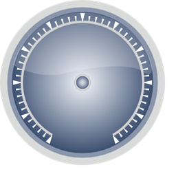

::: {style="DISPLAY: none"}
{#d2h_url_template}{#d2h_package_url style="WIDTH: 0px; DISPLAY: none; HEIGHT: 0px"}
:::

:::: {.d2h_secondary_topic style="PADDING-BOTTOM: 10pt; MARGIN: 0pt; PADDING-LEFT: 0pt; PADDING-RIGHT: 0pt; PADDING-TOP: 0pt"}
##### Circular Mark Tick {#circular-mark-tick style="tab-stops: 0pt"}

 

Gauge scales are displayed with two types of mark ticks:

[·      ]{style="FONT-FAMILY: Symbol"}Major ticks-specify primary value intervals -TickStyle property of the tick element specifies the number of the value intervals along the entire length of the scale bar. You can specify common properties and appearance for the major tick marks using **TickStyle** property of the tick element by setting its value to MajorTick .

[·      ]{style="FONT-FAMILY: Symbol"}Minor ticks-Displayed a little smaller than the major ticks- You can specify common properties and appearance for the major tick marks using **TickStyle** property of the tick element by setting its value to MinorTick .

 

These major and minor ticks are built with customization options like height and width property. They are also shipped with some inbuilt tick shapes. The tick shapes which are available are listed below.

[·      ]{style="FONT-FAMILY: Symbol"}Ellipse

[·      ]{style="FONT-FAMILY: Symbol"}Rectangle

[·      ]{style="FONT-FAMILY: Symbol"}Rounded Rectangle

[·      ]{style="FONT-FAMILY: Symbol"}Triangle

 

You can set the location of the ticks based on the scale position using the **DistanceFromScale** property and the **TickPlacement** property.

 

Properties:

 

::: {align="center"}
+-----------------------+--------------------------------------------------------------------------------------------------------------------------------------------------------------------------------------------------+--------------------------------------------------------+----------------------------------------------------------------------------------------------------------------------------------------------------------------+--------------------------------------------------+
| Property              | Description                                                                                                                                                                                      | Type of Property                                       | Value It Accepts                                                                                                                                               | Any other dependencies/Sub properties associated |
+-----------------------+--------------------------------------------------------------------------------------------------------------------------------------------------------------------------------------------------+--------------------------------------------------------+----------------------------------------------------------------------------------------------------------------------------------------------------------------+--------------------------------------------------+
| TickStyle             | Sets the tick style for the circular mark tick. Default value is major tick.                                                                                                                     | [enum]{style="COLOR: blue"}                            | [TickStyle]{style="COLOR: #2b91af"}.MajorTick                                                                                                                  | [NA]{style="COLOR: #548dd4"}                     |
|                       |                                                                                                                                                                                                  |                                                        |                                                                                                                                                                |                                                  |
|                       |                                                                                                                                                                                                  |                                                        |                                                                                                                                                                |                                                  |
|                       |                                                                                                                                                                                                  |                                                        |                                                                                                                                                                |                                                  |
|                       |                                                                                                                                                                                                  |                                                        | [TickStyle]{style="COLOR: #2b91af"}.MinorTick                                                                                                                  |                                                  |
+-----------------------+--------------------------------------------------------------------------------------------------------------------------------------------------------------------------------------------------+--------------------------------------------------------+----------------------------------------------------------------------------------------------------------------------------------------------------------------+--------------------------------------------------+
| TickShape             | Sets the tick shape for the circular mark tick.                                                                                                                                                  | [enum]{style="COLOR: blue"}                            | [TickShape]{style="COLOR: #2b91af"}.Ellipse                                                                                                                    | [NA]{style="COLOR: #548dd4"}                     |
|                       |                                                                                                                                                                                                  |                                                        |                                                                                                                                                                |                                                  |
|                       |                                                                                                                                                                                                  |                                                        |                                                                                                                                                                |                                                  |
|                       |                                                                                                                                                                                                  |                                                        |                                                                                                                                                                |                                                  |
|                       |                                                                                                                                                                                                  |                                                        | [TickShape]{style="COLOR: #2b91af"}.Rectangle                                                                                                                  |                                                  |
|                       |                                                                                                                                                                                                  |                                                        |                                                                                                                                                                |                                                  |
|                       |                                                                                                                                                                                                  |                                                        |                                                                                                                                                                |                                                  |
|                       |                                                                                                                                                                                                  |                                                        |                                                                                                                                                                |                                                  |
|                       |                                                                                                                                                                                                  |                                                        | [TickShape]{style="COLOR: #2b91af"}.RoundedRectangle                                                                                                           |                                                  |
|                       |                                                                                                                                                                                                  |                                                        |                                                                                                                                                                |                                                  |
|                       |                                                                                                                                                                                                  |                                                        |                                                                                                                                                                |                                                  |
|                       |                                                                                                                                                                                                  |                                                        |                                                                                                                                                                |                                                  |
|                       |                                                                                                                                                                                                  |                                                        | [TickShape]{style="COLOR: #2b91af"}.Triangle                                                                                                                   |                                                  |
+-----------------------+--------------------------------------------------------------------------------------------------------------------------------------------------------------------------------------------------+--------------------------------------------------------+----------------------------------------------------------------------------------------------------------------------------------------------------------------+--------------------------------------------------+
| TickHeight            | Sets the tick height.                                                                                                                                                                            | [double]{style="COLOR: blue"}                          | [double]{style="COLOR: blue"}                                                                                                                                  | [NA]{style="COLOR: #548dd4"}                     |
+-----------------------+--------------------------------------------------------------------------------------------------------------------------------------------------------------------------------------------------+--------------------------------------------------------+----------------------------------------------------------------------------------------------------------------------------------------------------------------+--------------------------------------------------+
| TickWidth             | Sets the tick width.                                                                                                                                                                             | [double]{style="COLOR: blue"}                          | [double]{style="COLOR: blue"}                                                                                                                                  | [NA]{style="COLOR: #548dd4"}                     |
+-----------------------+--------------------------------------------------------------------------------------------------------------------------------------------------------------------------------------------------+--------------------------------------------------------+----------------------------------------------------------------------------------------------------------------------------------------------------------------+--------------------------------------------------+
| Angle                 | Sets the angle rotation of ticks.                                                                                                                                                                | [double]{style="COLOR: blue"}                          | [double]{style="COLOR: blue"}                                                                                                                                  | [NA]{style="COLOR: #548dd4"}                     |
+-----------------------+--------------------------------------------------------------------------------------------------------------------------------------------------------------------------------------------------+--------------------------------------------------------+----------------------------------------------------------------------------------------------------------------------------------------------------------------+--------------------------------------------------+
| BackgroundBrush       | Sets the background  brush for ticks.                                                                                                                                                            | System.Windows.Media.[Brushes]{style="COLOR: #2b91af"} | Refer to the below Link for  Value for the Brushes class                                                                                                       | [NA]{style="COLOR: #548dd4"}                     |
|                       |                                                                                                                                                                                                  |                                                        |                                                                                                                                                                |                                                  |
|                       |                                                                                                                                                                                                  |                                                        | [[Brushes]{style="COLOR: windowtext; TEXT-DECORATION: none; text-underline: none"}](http://msdn.microsoft.com/en-us/library/system.windows.media.brushes.aspx) |                                                  |
+-----------------------+--------------------------------------------------------------------------------------------------------------------------------------------------------------------------------------------------+--------------------------------------------------------+----------------------------------------------------------------------------------------------------------------------------------------------------------------+--------------------------------------------------+
| BorderBrush           | Sets the border  brush for ticks.                                                                                                                                                                | System.Windows.Media.[Brushes]{style="COLOR: #2b91af"} | Refer to the below Link for  Value for the Brushes class                                                                                                       | [NA]{style="COLOR: #548dd4"}                     |
|                       |                                                                                                                                                                                                  |                                                        |                                                                                                                                                                |                                                  |
|                       |                                                                                                                                                                                                  |                                                        | [[Brushes]{style="COLOR: windowtext; TEXT-DECORATION: none; text-underline: none"}](http://msdn.microsoft.com/en-us/library/system.windows.media.brushes.aspx) |                                                  |
+-----------------------+--------------------------------------------------------------------------------------------------------------------------------------------------------------------------------------------------+--------------------------------------------------------+----------------------------------------------------------------------------------------------------------------------------------------------------------------+--------------------------------------------------+
| TickPlacement         | Sets the placement for ticks.                                                                                                                                                                    | [enum]{style="COLOR: blue"}                            | [ScalePlacement]{style="COLOR: #2b91af"}.Cross                                                                                                                 | [NA]{style="COLOR: #548dd4"}                     |
|                       |                                                                                                                                                                                                  |                                                        |                                                                                                                                                                |                                                  |
|                       |                                                                                                                                                                                                  |                                                        |                                                                                                                                                                |                                                  |
|                       |                                                                                                                                                                                                  |                                                        |                                                                                                                                                                |                                                  |
|                       |                                                                                                                                                                                                  |                                                        | [ScalePlacement]{style="COLOR: #2b91af"}.Inside                                                                                                                |                                                  |
|                       |                                                                                                                                                                                                  |                                                        |                                                                                                                                                                |                                                  |
|                       |                                                                                                                                                                                                  |                                                        |                                                                                                                                                                |                                                  |
|                       |                                                                                                                                                                                                  |                                                        |                                                                                                                                                                |                                                  |
|                       |                                                                                                                                                                                                  |                                                        | [ScalePlacement]{style="COLOR: #2b91af"}.Outside                                                                                                               |                                                  |
+-----------------------+--------------------------------------------------------------------------------------------------------------------------------------------------------------------------------------------------+--------------------------------------------------------+----------------------------------------------------------------------------------------------------------------------------------------------------------------+--------------------------------------------------+
| RangedBrush           | Sets the alternate brush to the ticks (apart from the brush provided by the BackgroundBrush property) for a range specified, using the RangedBrushStartValue and RangedBrushEndValue properties. | System.Windows.Media.[Brushes]{style="COLOR: #2b91af"} | Refer to the below Link for  Value for the Brushes class                                                                                                       | [NA]{style="COLOR: #548dd4"}                     |
|                       |                                                                                                                                                                                                  |                                                        |                                                                                                                                                                |                                                  |
|                       |                                                                                                                                                                                                  |                                                        | [[Brushes]{style="COLOR: windowtext; TEXT-DECORATION: none; text-underline: none"}](http://msdn.microsoft.com/en-us/library/system.windows.media.brushes.aspx) |                                                  |
+-----------------------+--------------------------------------------------------------------------------------------------------------------------------------------------------------------------------------------------+--------------------------------------------------------+----------------------------------------------------------------------------------------------------------------------------------------------------------------+--------------------------------------------------+
| RangedBrushStartValue | Sets the start value from where the ticks should be painted with the alternate brush stored in the RangedBrush property.                                                                         | [double]{style="COLOR: blue"}                          | [double]{style="COLOR: blue"}                                                                                                                                  | [NA]{style="COLOR: #548dd4"}                     |
+-----------------------+--------------------------------------------------------------------------------------------------------------------------------------------------------------------------------------------------+--------------------------------------------------------+----------------------------------------------------------------------------------------------------------------------------------------------------------------+--------------------------------------------------+
| RangedBrushEndValue   | Sets the end value up to which the ticks should be painted with the alternate brush stored in the RangedBrush property.                                                                          | [double]{style="COLOR: blue"}                          | [double]{style="COLOR: blue"}                                                                                                                                  | [NA]{style="COLOR: #548dd4"}                     |
+-----------------------+--------------------------------------------------------------------------------------------------------------------------------------------------------------------------------------------------+--------------------------------------------------------+----------------------------------------------------------------------------------------------------------------------------------------------------------------+--------------------------------------------------+
:::

[]{style="FONT-FAMILY: 'Calibri','sans-serif'"} 

###### 5.1.3.3.1.1 Through View Customization {#through-view-customization style="tab-stops: 0pt"}

 

View:

Step 1:

 

Add the below code in your aspx file. Using the **Ticks** Mapper, major and Minor ticks are added.

 

+-------------------------------------------------------------------------------------------------------------------------------------------------------------------------------------------------------------------------------------------------------------------------------------------------------------------------------------------------------------------------------------------------------------------------------------------------------------------------------------+
| [View\[ASPX\]]{style="FONT-FAMILY: 'Courier New'"}                                                                                                                                                                                                                                                                                                                                                                                                                                  |
|                                                                                                                                                                                                                                                                                                                                                                                                                                                                                     |
| [\<%]{style="FONT-FAMILY: 'Courier New'; BACKGROUND: yellow"}[@]{style="FONT-FAMILY: 'Courier New'; COLOR: blue"}[ [Page]{style="COLOR: maroon"} [Language]{style="COLOR: red"}[=\"C#\"]{style="COLOR: blue"} [MasterPageFile]{style="COLOR: red"}[=\"\~/Views/Shared/Site.Master\"]{style="COLOR: blue"} [Inherits]{style="COLOR: red"}[=\"System.Web.Mvc.ViewPage\"]{style="COLOR: blue"} [%\>]{style="BACKGROUND: yellow"}]{style="FONT-FAMILY: 'Courier New'"}                  |
|                                                                                                                                                                                                                                                                                                                                                                                                                                                                                     |
| [\<]{style="FONT-FAMILY: 'Courier New'; COLOR: blue"}[asp]{style="FONT-FAMILY: 'Courier New'; COLOR: maroon"}[:]{style="FONT-FAMILY: 'Courier New'; COLOR: blue"}[Content]{style="FONT-FAMILY: 'Courier New'; COLOR: maroon"}[ [ID]{style="COLOR: red"}[=\"Content1\"]{style="COLOR: blue"} [ContentPlaceHolderID]{style="COLOR: red"}[=\"TitleContent\"]{style="COLOR: blue"} [runat]{style="COLOR: red"}[=\"server\"\>]{style="COLOR: blue"}]{style="FONT-FAMILY: 'Courier New'"} |
|                                                                                                                                                                                                                                                                                                                                                                                                                                                                                     |
| [    Circular Gauge]{style="FONT-FAMILY: 'Courier New'"}                                                                                                                                                                                                                                                                                                                                                                                                                            |
|                                                                                                                                                                                                                                                                                                                                                                                                                                                                                     |
| [\</]{style="FONT-FAMILY: 'Courier New'; COLOR: blue"}[asp]{style="FONT-FAMILY: 'Courier New'; COLOR: maroon"}[:]{style="FONT-FAMILY: 'Courier New'; COLOR: blue"}[Content]{style="FONT-FAMILY: 'Courier New'; COLOR: maroon"}[\>]{style="FONT-FAMILY: 'Courier New'; COLOR: blue"}[]{style="FONT-FAMILY: 'Courier New'"}                                                                                                                                                           |
|                                                                                                                                                                                                                                                                                                                                                                                                                                                                                     |
| []{style="FONT-FAMILY: 'Courier New'"}                                                                                                                                                                                                                                                                                                                                                                                                                                              |
|                                                                                                                                                                                                                                                                                                                                                                                                                                                                                     |
| [\<]{style="FONT-FAMILY: 'Courier New'; COLOR: blue"}[asp]{style="FONT-FAMILY: 'Courier New'; COLOR: maroon"}[:]{style="FONT-FAMILY: 'Courier New'; COLOR: blue"}[Content]{style="FONT-FAMILY: 'Courier New'; COLOR: maroon"}[ [ID]{style="COLOR: red"}[=\"Content2\"]{style="COLOR: blue"} [ContentPlaceHolderID]{style="COLOR: red"}[=\"MainContent\"]{style="COLOR: blue"} [runat]{style="COLOR: red"}[=\"server\"\>]{style="COLOR: blue"}]{style="FONT-FAMILY: 'Courier New'"}  |
|                                                                                                                                                                                                                                                                                                                                                                                                                                                                                     |
| []{style="FONT-FAMILY: 'Courier New'"}                                                                                                                                                                                                                                                                                                                                                                                                                                              |
|                                                                                                                                                                                                                                                                                                                                                                                                                                                                                     |
| [    [\<%]{style="BACKGROUND: yellow"}[=]{style="COLOR: blue"}Html.Syncfusion().CircularGauge([\"Gauge\"]{style="COLOR: #a31515"})]{style="FONT-FAMILY: 'Courier New'"}                                                                                                                                                                                                                                                                                                             |
|                                                                                                                                                                                                                                                                                                                                                                                                                                                                                     |
| [        .Radius(160)]{style="FONT-FAMILY: 'Courier New'"}                                                                                                                                                                                                                                                                                                                                                                                                                          |
|                                                                                                                                                                                                                                                                                                                                                                                                                                                                                     |
| [        .FrameType([GaugeFrameType]{style="COLOR: #2b91af"}.CircularWithInnerTopGradient)]{style="FONT-FAMILY: 'Courier New'"}                                                                                                                                                                                                                                                                                                                                                     |
|                                                                                                                                                                                                                                                                                                                                                                                                                                                                                     |
| [        .GaugeSkins([GaugeSkins]{style="COLOR: #2b91af"}.VS2010)]{style="FONT-FAMILY: 'Courier New'"}                                                                                                                                                                                                                                                                                                                                                                              |
|                                                                                                                                                                                                                                                                                                                                                                                                                                                                                     |
| []{style="FONT-FAMILY: 'Courier New'"}                                                                                                                                                                                                                                                                                                                                                                                                                                              |
|                                                                                                                                                                                                                                                                                                                                                                                                                                                                                     |
| [                  .Scales(scale =\>]{style="FONT-FAMILY: 'Courier New'"}                                                                                                                                                                                                                                                                                                                                                                                                           |
|                                                                                                                                                                                                                                                                                                                                                                                                                                                                                     |
| [                  {]{style="FONT-FAMILY: 'Courier New'"}                                                                                                                                                                                                                                                                                                                                                                                                                           |
|                                                                                                                                                                                                                                                                                                                                                                                                                                                                                     |
| [                      scale.Add()]{style="FONT-FAMILY: 'Courier New'"}                                                                                                                                                                                                                                                                                                                                                                                                             |
|                                                                                                                                                                                                                                                                                                                                                                                                                                                                                     |
| [                      .Radius(120)]{style="FONT-FAMILY: 'Courier New'"}                                                                                                                                                                                                                                                                                                                                                                                                            |
|                                                                                                                                                                                                                                                                                                                                                                                                                                                                                     |
| [                      .ScaleBarSize(4.5)]{style="FONT-FAMILY: 'Courier New'"}                                                                                                                                                                                                                                                                                                                                                                                                      |
|                                                                                                                                                                                                                                                                                                                                                                                                                                                                                     |
| [                      .PointerCapRadius(8)]{style="FONT-FAMILY: 'Courier New'"}                                                                                                                                                                                                                                                                                                                                                                                                    |
|                                                                                                                                                                                                                                                                                                                                                                                                                                                                                     |
| [                      .Maximum(100)]{style="FONT-FAMILY: 'Courier New'"}                                                                                                                                                                                                                                                                                                                                                                                                           |
|                                                                                                                                                                                                                                                                                                                                                                                                                                                                                     |
| [                      .Minimum(0)]{style="FONT-FAMILY: 'Courier New'"}                                                                                                                                                                                                                                                                                                                                                                                                             |
|                                                                                                                                                                                                                                                                                                                                                                                                                                                                                     |
| [                      .BackgroundBrush([Brushes]{style="COLOR: #2b91af"}.LightGray)]{style="FONT-FAMILY: 'Courier New'"}                                                                                                                                                                                                                                                                                                                                                           |
|                                                                                                                                                                                                                                                                                                                                                                                                                                                                                     |
| [                      .StartAngle(120)]{style="FONT-FAMILY: 'Courier New'"}                                                                                                                                                                                                                                                                                                                                                                                                        |
|                                                                                                                                                                                                                                                                                                                                                                                                                                                                                     |
| [                      .GapSweepAngle(300)]{style="FONT-FAMILY: 'Courier New'"}                                                                                                                                                                                                                                                                                                                                                                                                     |
|                                                                                                                                                                                                                                                                                                                                                                                                                                                                                     |
| [                      .MajorIntervalValue(10)]{style="FONT-FAMILY: 'Courier New'"}                                                                                                                                                                                                                                                                                                                                                                                                 |
|                                                                                                                                                                                                                                                                                                                                                                                                                                                                                     |
| [                      .MinorIntervalValue(2)]{style="FONT-FAMILY: 'Courier New'"}                                                                                                                                                                                                                                                                                                                                                                                                  |
|                                                                                                                                                                                                                                                                                                                                                                                                                                                                                     |
| []{style="FONT-FAMILY: 'Courier New'"}                                                                                                                                                                                                                                                                                                                                                                                                                                              |
|                                                                                                                                                                                                                                                                                                                                                                                                                                                                                     |
| [                      [// Adding major and Minor Tick elements.]{style="COLOR: green"}]{style="FONT-FAMILY: 'Courier New'"}                                                                                                                                                                                                                                                                                                                                                        |
|                                                                                                                                                                                                                                                                                                                                                                                                                                                                                     |
| **[                      .Ticks(tick =\>]{style="FONT-FAMILY: 'Courier New'"}**                                                                                                                                                                                                                                                                                                                                                                                                     |
|                                                                                                                                                                                                                                                                                                                                                                                                                                                                                     |
| [                      {]{style="FONT-FAMILY: 'Courier New'"}                                                                                                                                                                                                                                                                                                                                                                                                                       |
|                                                                                                                                                                                                                                                                                                                                                                                                                                                                                     |
| [                          tick.Add()]{style="FONT-FAMILY: 'Courier New'"}                                                                                                                                                                                                                                                                                                                                                                                                          |
|                                                                                                                                                                                                                                                                                                                                                                                                                                                                                     |
| [                              [//Specifying the Tickstyle. here major ticks are added.]{style="COLOR: green"}]{style="FONT-FAMILY: 'Courier New'"}                                                                                                                                                                                                                                                                                                                                 |
|                                                                                                                                                                                                                                                                                                                                                                                                                                                                                     |
| [                              .TickStyle([TickStyle]{style="COLOR: #2b91af"}.MajorTick)]{style="FONT-FAMILY: 'Courier New'"}                                                                                                                                                                                                                                                                                                                                                       |
|                                                                                                                                                                                                                                                                                                                                                                                                                                                                                     |
| [                              [//Specifying the height and width for the major ticks.]{style="COLOR: green"}]{style="FONT-FAMILY: 'Courier New'"}                                                                                                                                                                                                                                                                                                                                  |
|                                                                                                                                                                                                                                                                                                                                                                                                                                                                                     |
| [                              .TickWidth(7)]{style="FONT-FAMILY: 'Courier New'"}                                                                                                                                                                                                                                                                                                                                                                                                   |
|                                                                                                                                                                                                                                                                                                                                                                                                                                                                                     |
| [                              .TickHeight(14)]{style="FONT-FAMILY: 'Courier New'"}                                                                                                                                                                                                                                                                                                                                                                                                 |
|                                                                                                                                                                                                                                                                                                                                                                                                                                                                                     |
| [                              [//Setting the position for the major ticks.]{style="COLOR: green"}]{style="FONT-FAMILY: 'Courier New'"}                                                                                                                                                                                                                                                                                                                                             |
|                                                                                                                                                                                                                                                                                                                                                                                                                                                                                     |
| [                              .TickPlacement([ScalePlacement]{style="COLOR: #2b91af"}.Outside)]{style="FONT-FAMILY: 'Courier New'"}                                                                                                                                                                                                                                                                                                                                                |
|                                                                                                                                                                                                                                                                                                                                                                                                                                                                                     |
| [                              [//Specifying the shape of the major ticks.]{style="COLOR: green"}]{style="FONT-FAMILY: 'Courier New'"}                                                                                                                                                                                                                                                                                                                                              |
|                                                                                                                                                                                                                                                                                                                                                                                                                                                                                     |
| [                              .TickShape([TickShape]{style="COLOR: #2b91af"}.Triangle)]{style="FONT-FAMILY: 'Courier New'"}                                                                                                                                                                                                                                                                                                                                                        |
|                                                                                                                                                                                                                                                                                                                                                                                                                                                                                     |
| [                              .BackgroundBrush([Brushes]{style="COLOR: #2b91af"}.White)]{style="FONT-FAMILY: 'Courier New'"}                                                                                                                                                                                                                                                                                                                                                       |
|                                                                                                                                                                                                                                                                                                                                                                                                                                                                                     |
| [                              .Angle(0);]{style="FONT-FAMILY: 'Courier New'"}                                                                                                                                                                                                                                                                                                                                                                                                      |
|                                                                                                                                                                                                                                                                                                                                                                                                                                                                                     |
| []{style="FONT-FAMILY: 'Courier New'"}                                                                                                                                                                                                                                                                                                                                                                                                                                              |
|                                                                                                                                                                                                                                                                                                                                                                                                                                                                                     |
| [                          tick.Add()]{style="FONT-FAMILY: 'Courier New'"}                                                                                                                                                                                                                                                                                                                                                                                                          |
|                                                                                                                                                                                                                                                                                                                                                                                                                                                                                     |
| [                              [//Specifying the Tickstyle. Here minor ticks are added.]{style="COLOR: green"}]{style="FONT-FAMILY: 'Courier New'"}                                                                                                                                                                                                                                                                                                                                 |
|                                                                                                                                                                                                                                                                                                                                                                                                                                                                                     |
| [                              .TickStyle([TickStyle]{style="COLOR: #2b91af"}.MinorTick)]{style="FONT-FAMILY: 'Courier New'"}                                                                                                                                                                                                                                                                                                                                                       |
|                                                                                                                                                                                                                                                                                                                                                                                                                                                                                     |
| [                              [//Specifying the height and width for the minor ticks.]{style="COLOR: green"}]{style="FONT-FAMILY: 'Courier New'"}                                                                                                                                                                                                                                                                                                                                  |
|                                                                                                                                                                                                                                                                                                                                                                                                                                                                                     |
| [                              .TickWidth(2)]{style="FONT-FAMILY: 'Courier New'"}                                                                                                                                                                                                                                                                                                                                                                                                   |
|                                                                                                                                                                                                                                                                                                                                                                                                                                                                                     |
| [                              .TickHeight(9)]{style="FONT-FAMILY: 'Courier New'"}                                                                                                                                                                                                                                                                                                                                                                                                  |
|                                                                                                                                                                                                                                                                                                                                                                                                                                                                                     |
| [                              [//Setting the position for the minor ticks.]{style="COLOR: green"}]{style="FONT-FAMILY: 'Courier New'"}                                                                                                                                                                                                                                                                                                                                             |
|                                                                                                                                                                                                                                                                                                                                                                                                                                                                                     |
| [                              .TickPlacement([ScalePlacement]{style="COLOR: #2b91af"}.Outside)]{style="FONT-FAMILY: 'Courier New'"}                                                                                                                                                                                                                                                                                                                                                |
|                                                                                                                                                                                                                                                                                                                                                                                                                                                                                     |
| [                              [//Specifying the shape of the minor ticks.]{style="COLOR: green"}]{style="FONT-FAMILY: 'Courier New'"}                                                                                                                                                                                                                                                                                                                                              |
|                                                                                                                                                                                                                                                                                                                                                                                                                                                                                     |
| [                              .TickShape([TickShape]{style="COLOR: #2b91af"}.Triangle)]{style="FONT-FAMILY: 'Courier New'"}                                                                                                                                                                                                                                                                                                                                                        |
|                                                                                                                                                                                                                                                                                                                                                                                                                                                                                     |
| [                              .BackgroundBrush([Brushes]{style="COLOR: #2b91af"}.White)]{style="FONT-FAMILY: 'Courier New'"}                                                                                                                                                                                                                                                                                                                                                       |
|                                                                                                                                                                                                                                                                                                                                                                                                                                                                                     |
| [                              .Angle(0);]{style="FONT-FAMILY: 'Courier New'"}                                                                                                                                                                                                                                                                                                                                                                                                      |
|                                                                                                                                                                                                                                                                                                                                                                                                                                                                                     |
| [                      });]{style="FONT-FAMILY: 'Courier New'"}                                                                                                                                                                                                                                                                                                                                                                                                                     |
|                                                                                                                                                                                                                                                                                                                                                                                                                                                                                     |
| [                  })]{style="FONT-FAMILY: 'Courier New'"}                                                                                                                                                                                                                                                                                                                                                                                                                          |
|                                                                                                                                                                                                                                                                                                                                                                                                                                                                                     |
| []{style="FONT-FAMILY: 'Courier New'"}                                                                                                                                                                                                                                                                                                                                                                                                                                              |
|                                                                                                                                                                                                                                                                                                                                                                                                                                                                                     |
| [                 [%\>]{style="BACKGROUND: yellow"}]{style="FONT-FAMILY: 'Courier New'"}                                                                                                                                                                                                                                                                                                                                                                                            |
|                                                                                                                                                                                                                                                                                                                                                                                                                                                                                     |
| []{style="FONT-FAMILY: 'Courier New'"}                                                                                                                                                                                                                                                                                                                                                                                                                                              |
|                                                                                                                                                                                                                                                                                                                                                                                                                                                                                     |
| [\</]{style="FONT-FAMILY: 'Courier New'; COLOR: blue"}[asp]{style="FONT-FAMILY: 'Courier New'; COLOR: maroon"}[:]{style="FONT-FAMILY: 'Courier New'; COLOR: blue"}[Content]{style="FONT-FAMILY: 'Courier New'; COLOR: maroon"}[\>]{style="FONT-FAMILY: 'Courier New'; COLOR: blue"}[]{style="FONT-FAMILY: 'Courier New'"}                                                                                                                                                           |
|                                                                                                                                                                                                                                                                                                                                                                                                                                                                                     |
| []{style="FONT-FAMILY: 'Courier New'"}                                                                                                                                                                                                                                                                                                                                                                                                                                              |
+-------------------------------------------------------------------------------------------------------------------------------------------------------------------------------------------------------------------------------------------------------------------------------------------------------------------------------------------------------------------------------------------------------------------------------------------------------------------------------------+

 

+-----------------------------------------------------------------------------------------------------------------------------------------------------------------------------------------------------------+
| [View\[cshtml\]]{style="FONT-FAMILY: 'Courier New'"}                                                                                                                                                      |
|                                                                                                                                                                                                           |
| [\@{]{style="FONT-FAMILY: 'Courier New'; BACKGROUND: yellow"}                                                                                                                                             |
|                                                                                                                                                                                                           |
| [Layout=[\"\~/Views/Shared/\_Layout.cshtml\"]{style="COLOR: #a31515"};  ]{style="FONT-FAMILY: Consolas; FONT-SIZE: 9.5pt"}                                                                                |
|                                                                                                                                                                                                           |
| [      ]{style="FONT-FAMILY: Consolas; FONT-SIZE: 9.5pt"}                                                                                                                                                 |
|                                                                                                                                                                                                           |
| [}]{style="FONT-FAMILY: 'Courier New'; BACKGROUND: yellow"}[]{style="FONT-FAMILY: 'Courier New'"}                                                                                                         |
|                                                                                                                                                                                                           |
| [\<]{style="FONT-FAMILY: 'Courier New'; COLOR: blue"}[div]{style="FONT-FAMILY: 'Courier New'; COLOR: maroon"}[\>]{style="FONT-FAMILY: 'Courier New'; COLOR: blue"}[]{style="FONT-FAMILY: 'Courier New'"}  |
|                                                                                                                                                                                                           |
| [    [\@{]{style="BACKGROUND: yellow"} Html.Syncfusion().CircularGauge([\"Gauge\"]{style="COLOR: #a31515"})]{style="FONT-FAMILY: 'Courier New'"}                                                          |
|                                                                                                                                                                                                           |
| [        .Radius(160)]{style="FONT-FAMILY: 'Courier New'"}                                                                                                                                                |
|                                                                                                                                                                                                           |
| [        .FrameType([GaugeFrameType]{style="COLOR: #2b91af"}.CircularWithInnerTopGradient)]{style="FONT-FAMILY: 'Courier New'"}                                                                           |
|                                                                                                                                                                                                           |
| [        .GaugeSkins([GaugeSkins]{style="COLOR: #2b91af"}.VS2010)]{style="FONT-FAMILY: 'Courier New'"}                                                                                                    |
|                                                                                                                                                                                                           |
| []{style="FONT-FAMILY: 'Courier New'"}                                                                                                                                                                    |
|                                                                                                                                                                                                           |
| [                  .Scales(scale =\>]{style="FONT-FAMILY: 'Courier New'"}                                                                                                                                 |
|                                                                                                                                                                                                           |
| [                  {]{style="FONT-FAMILY: 'Courier New'"}                                                                                                                                                 |
|                                                                                                                                                                                                           |
| [                      scale.Add()]{style="FONT-FAMILY: 'Courier New'"}                                                                                                                                   |
|                                                                                                                                                                                                           |
| [                      .Radius(120)]{style="FONT-FAMILY: 'Courier New'"}                                                                                                                                  |
|                                                                                                                                                                                                           |
| [                      .ScaleBarSize(4.5)]{style="FONT-FAMILY: 'Courier New'"}                                                                                                                            |
|                                                                                                                                                                                                           |
| [                      .PointerCapRadius(8)]{style="FONT-FAMILY: 'Courier New'"}                                                                                                                          |
|                                                                                                                                                                                                           |
| [                      .Maximum(100)]{style="FONT-FAMILY: 'Courier New'"}                                                                                                                                 |
|                                                                                                                                                                                                           |
| [                      .Minimum(0)]{style="FONT-FAMILY: 'Courier New'"}                                                                                                                                   |
|                                                                                                                                                                                                           |
| [                      .BackgroundBrush([Brushes]{style="COLOR: #2b91af"}.LightGray)]{style="FONT-FAMILY: 'Courier New'"}                                                                                 |
|                                                                                                                                                                                                           |
| [                      .StartAngle(120)]{style="FONT-FAMILY: 'Courier New'"}                                                                                                                              |
|                                                                                                                                                                                                           |
| [                      .GapSweepAngle(300)]{style="FONT-FAMILY: 'Courier New'"}                                                                                                                           |
|                                                                                                                                                                                                           |
| [                      .MajorIntervalValue(10)]{style="FONT-FAMILY: 'Courier New'"}                                                                                                                       |
|                                                                                                                                                                                                           |
| [                      .MinorIntervalValue(2)]{style="FONT-FAMILY: 'Courier New'"}                                                                                                                        |
|                                                                                                                                                                                                           |
| []{style="FONT-FAMILY: 'Courier New'"}                                                                                                                                                                    |
|                                                                                                                                                                                                           |
| [                      [// Adding major and minor Tick elements.]{style="COLOR: green"}]{style="FONT-FAMILY: 'Courier New'"}                                                                              |
|                                                                                                                                                                                                           |
| **[                      .Ticks(tick =\>]{style="FONT-FAMILY: 'Courier New'"}**                                                                                                                           |
|                                                                                                                                                                                                           |
| [                      {]{style="FONT-FAMILY: 'Courier New'"}                                                                                                                                             |
|                                                                                                                                                                                                           |
| [                          tick.Add()]{style="FONT-FAMILY: 'Courier New'"}                                                                                                                                |
|                                                                                                                                                                                                           |
| [                              [//Specifying the Tickstyle. here major ticks are added.]{style="COLOR: green"}]{style="FONT-FAMILY: 'Courier New'"}                                                       |
|                                                                                                                                                                                                           |
| [                              .TickStyle([TickStyle]{style="COLOR: #2b91af"}.MajorTick)]{style="FONT-FAMILY: 'Courier New'"}                                                                             |
|                                                                                                                                                                                                           |
| [                              [//Specifying the height and width for the major ticks.]{style="COLOR: green"}]{style="FONT-FAMILY: 'Courier New'"}                                                        |
|                                                                                                                                                                                                           |
| [                              .TickWidth(7)]{style="FONT-FAMILY: 'Courier New'"}                                                                                                                         |
|                                                                                                                                                                                                           |
| [                              .TickHeight(14)]{style="FONT-FAMILY: 'Courier New'"}                                                                                                                       |
|                                                                                                                                                                                                           |
| [                              [//Setting the position for the major ticks.]{style="COLOR: green"}]{style="FONT-FAMILY: 'Courier New'"}                                                                   |
|                                                                                                                                                                                                           |
| [                              .TickPlacement([ScalePlacement]{style="COLOR: #2b91af"}.Outside)]{style="FONT-FAMILY: 'Courier New'"}                                                                      |
|                                                                                                                                                                                                           |
| [                              [//Specifying the shape of the major ticks.]{style="COLOR: green"}]{style="FONT-FAMILY: 'Courier New'"}                                                                    |
|                                                                                                                                                                                                           |
| [                              .TickShape([TickShape]{style="COLOR: #2b91af"}.Triangle)]{style="FONT-FAMILY: 'Courier New'"}                                                                              |
|                                                                                                                                                                                                           |
| [                              .BackgroundBrush([Brushes]{style="COLOR: #2b91af"}.White)]{style="FONT-FAMILY: 'Courier New'"}                                                                             |
|                                                                                                                                                                                                           |
| [                              .Angle(0);]{style="FONT-FAMILY: 'Courier New'"}                                                                                                                            |
|                                                                                                                                                                                                           |
| []{style="FONT-FAMILY: 'Courier New'"}                                                                                                                                                                    |
|                                                                                                                                                                                                           |
| [                          tick.Add()]{style="FONT-FAMILY: 'Courier New'"}                                                                                                                                |
|                                                                                                                                                                                                           |
| [                              [//Specifying the Tickstyle. Here minor ticks are added.]{style="COLOR: green"}]{style="FONT-FAMILY: 'Courier New'"}                                                       |
|                                                                                                                                                                                                           |
| [                              .TickStyle([TickStyle]{style="COLOR: #2b91af"}.MinorTick)]{style="FONT-FAMILY: 'Courier New'"}                                                                             |
|                                                                                                                                                                                                           |
| [                              [//Specifying the Height and width for the minor ticks.]{style="COLOR: green"}]{style="FONT-FAMILY: 'Courier New'"}                                                        |
|                                                                                                                                                                                                           |
| [                              .TickWidth(2)]{style="FONT-FAMILY: 'Courier New'"}                                                                                                                         |
|                                                                                                                                                                                                           |
| [                              .TickHeight(9)]{style="FONT-FAMILY: 'Courier New'"}                                                                                                                        |
|                                                                                                                                                                                                           |
| [                              [//Setting the position for the minor ticks.]{style="COLOR: green"}]{style="FONT-FAMILY: 'Courier New'"}                                                                   |
|                                                                                                                                                                                                           |
| [                              .TickPlacement([ScalePlacement]{style="COLOR: #2b91af"}.Outside)]{style="FONT-FAMILY: 'Courier New'"}                                                                      |
|                                                                                                                                                                                                           |
| [                              [//Specifying the shape of the minor ticks.]{style="COLOR: green"}]{style="FONT-FAMILY: 'Courier New'"}                                                                    |
|                                                                                                                                                                                                           |
| [                              .TickShape([TickShape]{style="COLOR: #2b91af"}.Triangle)]{style="FONT-FAMILY: 'Courier New'"}                                                                              |
|                                                                                                                                                                                                           |
| [                              .BackgroundBrush([Brushes]{style="COLOR: #2b91af"}.White)]{style="FONT-FAMILY: 'Courier New'"}                                                                             |
|                                                                                                                                                                                                           |
| [                              .Angle(0);]{style="FONT-FAMILY: 'Courier New'"}                                                                                                                            |
|                                                                                                                                                                                                           |
| [                      });]{style="FONT-FAMILY: 'Courier New'"}                                                                                                                                           |
|                                                                                                                                                                                                           |
| [                  }).Render();]{style="FONT-FAMILY: 'Courier New'"}                                                                                                                                      |
|                                                                                                                                                                                                           |
| []{style="FONT-FAMILY: 'Courier New'"}                                                                                                                                                                    |
|                                                                                                                                                                                                           |
| [                 [}]{style="BACKGROUND: yellow"}]{style="FONT-FAMILY: 'Courier New'"}                                                                                                                    |
|                                                                                                                                                                                                           |
| [\</]{style="FONT-FAMILY: 'Courier New'; COLOR: blue"}[div]{style="FONT-FAMILY: 'Courier New'; COLOR: maroon"}[\>]{style="FONT-FAMILY: 'Courier New'; COLOR: blue"}[]{style="FONT-FAMILY: 'Courier New'"} |
|                                                                                                                                                                                                           |
| []{style="FONT-FAMILY: 'Courier New'"}                                                                                                                                                                    |
+-----------------------------------------------------------------------------------------------------------------------------------------------------------------------------------------------------------+

**[]{style="FONT-FAMILY: 'Calibri','sans-serif'"}** 

Step 2:

Controller:

 

Add the below code in your controller.

 

+-----------------------------------------------------------------------------------------------------------------------------------------------------------------------------------------------+
| **[\[Controller\]]{style="FONT-FAMILY: 'Calibri','sans-serif'"}**                                                                                                                             |
|                                                                                                                                                                                               |
| [using]{style="FONT-FAMILY: 'Calibri','sans-serif'; COLOR: blue"}[ System;]{style="FONT-FAMILY: 'Calibri','sans-serif'"}                                                                      |
|                                                                                                                                                                                               |
| [using]{style="FONT-FAMILY: 'Calibri','sans-serif'; COLOR: blue"}[ System.Collections.Generic;]{style="FONT-FAMILY: 'Calibri','sans-serif'"}                                                  |
|                                                                                                                                                                                               |
| [using]{style="FONT-FAMILY: 'Calibri','sans-serif'; COLOR: blue"}[ System.Linq;]{style="FONT-FAMILY: 'Calibri','sans-serif'"}                                                                 |
|                                                                                                                                                                                               |
| [using]{style="FONT-FAMILY: 'Calibri','sans-serif'; COLOR: blue"}[ System.Web;]{style="FONT-FAMILY: 'Calibri','sans-serif'"}                                                                  |
|                                                                                                                                                                                               |
| [using]{style="FONT-FAMILY: 'Calibri','sans-serif'; COLOR: blue"}[ System.Web.Mvc;]{style="FONT-FAMILY: 'Calibri','sans-serif'"}                                                              |
|                                                                                                                                                                                               |
| []{style="FONT-FAMILY: 'Calibri','sans-serif'"}                                                                                                                                               |
|                                                                                                                                                                                               |
| [namespace]{style="FONT-FAMILY: 'Calibri','sans-serif'; COLOR: blue"}[ CircularGauge.Controllers]{style="FONT-FAMILY: 'Calibri','sans-serif'"}                                                |
|                                                                                                                                                                                               |
| [{]{style="FONT-FAMILY: 'Calibri','sans-serif'"}                                                                                                                                              |
|                                                                                                                                                                                               |
| [    \[[HandleError]{style="COLOR: #2b91af"}\]]{style="FONT-FAMILY: 'Calibri','sans-serif'"}                                                                                                  |
|                                                                                                                                                                                               |
| [    [public]{style="COLOR: blue"} [class]{style="COLOR: blue"} [HomeController]{style="COLOR: #2b91af"} : [Controller]{style="COLOR: #2b91af"}]{style="FONT-FAMILY: 'Calibri','sans-serif'"} |
|                                                                                                                                                                                               |
| [    {]{style="FONT-FAMILY: 'Calibri','sans-serif'"}                                                                                                                                          |
|                                                                                                                                                                                               |
| [        [public]{style="COLOR: blue"} [ActionResult]{style="COLOR: #2b91af"} Index()]{style="FONT-FAMILY: 'Calibri','sans-serif'"}                                                           |
|                                                                                                                                                                                               |
| [        {]{style="FONT-FAMILY: 'Calibri','sans-serif'"}                                                                                                                                      |
|                                                                                                                                                                                               |
| [            [return]{style="COLOR: blue"} View();]{style="FONT-FAMILY: 'Calibri','sans-serif'"}                                                                                              |
|                                                                                                                                                                                               |
| [        }]{style="FONT-FAMILY: 'Calibri','sans-serif'"}                                                                                                                                      |
|                                                                                                                                                                                               |
| [       ]{style="FONT-FAMILY: 'Calibri','sans-serif'"}                                                                                                                                        |
|                                                                                                                                                                                               |
| [    }]{style="FONT-FAMILY: 'Calibri','sans-serif'"}                                                                                                                                          |
|                                                                                                                                                                                               |
| [}]{style="FONT-FAMILY: 'Calibri','sans-serif'"}                                                                                                                                              |
+-----------------------------------------------------------------------------------------------------------------------------------------------------------------------------------------------+

[]{style="FONT-FAMILY: 'Calibri','sans-serif'"} 

Step 3:

 

Run the code. You will get the following output.

[]{style="FONT-FAMILY: 'Calibri','sans-serif'"} 

[{border="0"}]{style="FONT-FAMILY: 'Calibri','sans-serif'"}

Figure 63: Circular Gauge-TickMarks**[]{style="FONT-FAMILY: 'Calibri','sans-serif'"}**

[]{style="FONT-FAMILY: 'Calibri','sans-serif'"} 

###### 5.1.3.3.1.2 Through CircularGaugeModel {#through-circulargaugemodel style="tab-stops: 0pt"}

 

Step 1:

Controller

 

Add the below code in the controller file. Using the TickMark class, you can create Tickmark elements.

Major and Minor tick elements are created by setting its TickStyle le property to MajorTick and MinorTick respectively.

And Using Ticks collection of CircularScale class, you can add the TickMark element.

 

+-----------------------------------------------------------------------------------------------------------------------------------------------------------------------------------------------+
| []{style="FONT-FAMILY: 'Calibri','sans-serif'"}                                                                                                                                               |
|                                                                                                                                                                                               |
| [using]{style="FONT-FAMILY: 'Calibri','sans-serif'; COLOR: blue"}[ System;]{style="FONT-FAMILY: 'Calibri','sans-serif'"}                                                                      |
|                                                                                                                                                                                               |
| [using]{style="FONT-FAMILY: 'Calibri','sans-serif'; COLOR: blue"}[ System.Collections.Generic;]{style="FONT-FAMILY: 'Calibri','sans-serif'"}                                                  |
|                                                                                                                                                                                               |
| [using]{style="FONT-FAMILY: 'Calibri','sans-serif'; COLOR: blue"}[ System.Linq;]{style="FONT-FAMILY: 'Calibri','sans-serif'"}                                                                 |
|                                                                                                                                                                                               |
| [using]{style="FONT-FAMILY: 'Calibri','sans-serif'; COLOR: blue"}[ System.Web;]{style="FONT-FAMILY: 'Calibri','sans-serif'"}                                                                  |
|                                                                                                                                                                                               |
| [using]{style="FONT-FAMILY: 'Calibri','sans-serif'; COLOR: blue"}[ System.Web.Mvc;]{style="FONT-FAMILY: 'Calibri','sans-serif'"}                                                              |
|                                                                                                                                                                                               |
| [using]{style="FONT-FAMILY: 'Calibri','sans-serif'; COLOR: blue"}[ Syncfusion.Mvc.Gauge;]{style="FONT-FAMILY: 'Calibri','sans-serif'"}                                                        |
|                                                                                                                                                                                               |
| [using]{style="FONT-FAMILY: 'Calibri','sans-serif'; COLOR: blue"}[ Syncfusion.Mvc.Shared;]{style="FONT-FAMILY: 'Calibri','sans-serif'"}                                                       |
|                                                                                                                                                                                               |
| [using]{style="FONT-FAMILY: 'Calibri','sans-serif'; COLOR: blue"}[ System.Windows.Media;]{style="FONT-FAMILY: 'Calibri','sans-serif'"}                                                        |
|                                                                                                                                                                                               |
| []{style="FONT-FAMILY: 'Calibri','sans-serif'"}                                                                                                                                               |
|                                                                                                                                                                                               |
| [namespace]{style="FONT-FAMILY: 'Calibri','sans-serif'; COLOR: blue"}[ CircularGauge.Controllers]{style="FONT-FAMILY: 'Calibri','sans-serif'"}                                                |
|                                                                                                                                                                                               |
| [{]{style="FONT-FAMILY: 'Calibri','sans-serif'"}                                                                                                                                              |
|                                                                                                                                                                                               |
| [    \[[HandleError]{style="COLOR: #2b91af"}\]]{style="FONT-FAMILY: 'Calibri','sans-serif'"}                                                                                                  |
|                                                                                                                                                                                               |
| [    [public]{style="COLOR: blue"} [class]{style="COLOR: blue"} [HomeController]{style="COLOR: #2b91af"} : [Controller]{style="COLOR: #2b91af"}]{style="FONT-FAMILY: 'Calibri','sans-serif'"} |
|                                                                                                                                                                                               |
| [    {]{style="FONT-FAMILY: 'Calibri','sans-serif'"}                                                                                                                                          |
|                                                                                                                                                                                               |
| [        [public]{style="COLOR: blue"} [ActionResult]{style="COLOR: #2b91af"} Index()]{style="FONT-FAMILY: 'Calibri','sans-serif'"}                                                           |
|                                                                                                                                                                                               |
| [        {]{style="FONT-FAMILY: 'Calibri','sans-serif'"}                                                                                                                                      |
|                                                                                                                                                                                               |
| [            [CircularGaugeModel]{style="COLOR: #2b91af"} model = [new]{style="COLOR: blue"} [CircularGaugeModel]{style="COLOR: #2b91af"}();]{style="FONT-FAMILY: 'Calibri','sans-serif'"}    |
|                                                                                                                                                                                               |
| [            model.Radius = 160;]{style="FONT-FAMILY: 'Calibri','sans-serif'"}                                                                                                                |
|                                                                                                                                                                                               |
| [            model.GaugeSkins = [GaugeSkins]{style="COLOR: #2b91af"}.VS2010;]{style="FONT-FAMILY: 'Calibri','sans-serif'"}                                                                    |
|                                                                                                                                                                                               |
| [            model.FrameType = [GaugeFrameType]{style="COLOR: #2b91af"}.CircularWithInnerTopGradient;]{style="FONT-FAMILY: 'Calibri','sans-serif'"}                                           |
|                                                                                                                                                                                               |
| [            [CircularScale]{style="COLOR: #2b91af"} c_Scale = [new]{style="COLOR: blue"} [CircularScale]{style="COLOR: #2b91af"}();]{style="FONT-FAMILY: 'Calibri','sans-serif'"}            |
|                                                                                                                                                                                               |
| [            c_Scale.Maximum = 100;]{style="FONT-FAMILY: 'Calibri','sans-serif'"}                                                                                                             |
|                                                                                                                                                                                               |
| [            c_Scale.Minimum = 0;]{style="FONT-FAMILY: 'Calibri','sans-serif'"}                                                                                                               |
|                                                                                                                                                                                               |
| [            c_Scale.MinorIntervalValue = 2;]{style="FONT-FAMILY: 'Calibri','sans-serif'"}                                                                                                    |
|                                                                                                                                                                                               |
| [            c_Scale.MajorIntervalValue = 10;]{style="FONT-FAMILY: 'Calibri','sans-serif'"}                                                                                                   |
|                                                                                                                                                                                               |
| [            c_Scale.GapSweepAngle = 300;]{style="FONT-FAMILY: 'Calibri','sans-serif'"}                                                                                                       |
|                                                                                                                                                                                               |
| [            c_Scale.Radius = 120;]{style="FONT-FAMILY: 'Calibri','sans-serif'"}                                                                                                              |
|                                                                                                                                                                                               |
| [            c_Scale.StartAngle = 120;]{style="FONT-FAMILY: 'Calibri','sans-serif'"}                                                                                                          |
|                                                                                                                                                                                               |
| [            c_Scale.ScaleBarSize = 4.5;]{style="FONT-FAMILY: 'Calibri','sans-serif'"}                                                                                                        |
|                                                                                                                                                                                               |
| [            c_Scale.PointerCapRadius = 8;]{style="FONT-FAMILY: 'Calibri','sans-serif'"}                                                                                                      |
|                                                                                                                                                                                               |
| [            c_Scale.BackgroundBrush = [Brushes]{style="COLOR: #2b91af"}.LightGray;]{style="FONT-FAMILY: 'Calibri','sans-serif'"}                                                             |
|                                                                                                                                                                                               |
| []{style="FONT-FAMILY: 'Calibri','sans-serif'"}                                                                                                                                               |
|                                                                                                                                                                                               |
| [            [//Creating Minor Tick elements.]{style="COLOR: green"}]{style="FONT-FAMILY: 'Calibri','sans-serif'"}                                                                            |
|                                                                                                                                                                                               |
| [            [TickMark]{style="COLOR: #2b91af"} \_minor = [new]{style="COLOR: blue"} [TickMark]{style="COLOR: #2b91af"}();]{style="FONT-FAMILY: 'Calibri','sans-serif'"}                      |
|                                                                                                                                                                                               |
| [            \_minor.TickStyle = [TickStyle]{style="COLOR: #2b91af"}.MinorTick;]{style="FONT-FAMILY: 'Calibri','sans-serif'"}                                                                 |
|                                                                                                                                                                                               |
| [            [//Setting Height and Width for Minor Tick elements.]{style="COLOR: green"}]{style="FONT-FAMILY: 'Calibri','sans-serif'"}                                                        |
|                                                                                                                                                                                               |
| [            \_minor.TickWidth = 2;]{style="FONT-FAMILY: 'Calibri','sans-serif'"}                                                                                                             |
|                                                                                                                                                                                               |
| [            \_minor.TickHeight = 9;]{style="FONT-FAMILY: 'Calibri','sans-serif'"}                                                                                                            |
|                                                                                                                                                                                               |
| [            [//Specifying the shape for the Minor ticks.]{style="COLOR: green"}]{style="FONT-FAMILY: 'Calibri','sans-serif'"}                                                                |
|                                                                                                                                                                                               |
| [            \_minor.TickShape = [TickShape]{style="COLOR: #2b91af"}.Triangle;]{style="FONT-FAMILY: 'Calibri','sans-serif'"}                                                                  |
|                                                                                                                                                                                               |
| [            \_minor.TickPlacement = [ScalePlacement]{style="COLOR: #2b91af"}.Outside;]{style="FONT-FAMILY: 'Calibri','sans-serif'"}                                                          |
|                                                                                                                                                                                               |
| [            \_minor.Angle = 0;]{style="FONT-FAMILY: 'Calibri','sans-serif'"}                                                                                                                 |
|                                                                                                                                                                                               |
| [            \_minor.BackgroundBrush = [Brushes]{style="COLOR: #2b91af"}.White;]{style="FONT-FAMILY: 'Calibri','sans-serif'"}                                                                 |
|                                                                                                                                                                                               |
| []{style="FONT-FAMILY: 'Calibri','sans-serif'"}                                                                                                                                               |
|                                                                                                                                                                                               |
| [            [//Creating Major Tick elements.]{style="COLOR: green"}]{style="FONT-FAMILY: 'Calibri','sans-serif'"}                                                                            |
|                                                                                                                                                                                               |
| [            [TickMark]{style="COLOR: #2b91af"} \_major = [new]{style="COLOR: blue"} [TickMark]{style="COLOR: #2b91af"}();]{style="FONT-FAMILY: 'Calibri','sans-serif'"}                      |
|                                                                                                                                                                                               |
| [            \_major.TickStyle = [TickStyle]{style="COLOR: #2b91af"}.MajorTick;]{style="FONT-FAMILY: 'Calibri','sans-serif'"}                                                                 |
|                                                                                                                                                                                               |
| []{style="FONT-FAMILY: 'Calibri','sans-serif'"}                                                                                                                                               |
|                                                                                                                                                                                               |
| [            [//Setting Height and Width for Major Tick elemets.]{style="COLOR: green"}]{style="FONT-FAMILY: 'Calibri','sans-serif'"}                                                         |
|                                                                                                                                                                                               |
| [            \_major.TickHeight = 14;]{style="FONT-FAMILY: 'Calibri','sans-serif'"}                                                                                                           |
|                                                                                                                                                                                               |
| [            \_major.TickWidth = 7;]{style="FONT-FAMILY: 'Calibri','sans-serif'"}                                                                                                             |
|                                                                                                                                                                                               |
| [            [//Specifying the shape for the Major ticks.]{style="COLOR: green"}]{style="FONT-FAMILY: 'Calibri','sans-serif'"}                                                                |
|                                                                                                                                                                                               |
| [            \_major.TickShape = [TickShape]{style="COLOR: #2b91af"}.Triangle;]{style="FONT-FAMILY: 'Calibri','sans-serif'"}                                                                  |
|                                                                                                                                                                                               |
| [            \_major.TickPlacement = [ScalePlacement]{style="COLOR: #2b91af"}.Outside;]{style="FONT-FAMILY: 'Calibri','sans-serif'"}                                                          |
|                                                                                                                                                                                               |
| [            \_major.Angle = 0;]{style="FONT-FAMILY: 'Calibri','sans-serif'"}                                                                                                                 |
|                                                                                                                                                                                               |
| []{style="FONT-FAMILY: 'Calibri','sans-serif'"}                                                                                                                                               |
|                                                                                                                                                                                               |
| [            [//Adding Minor  ticks into circular scale.]{style="COLOR: green"}]{style="FONT-FAMILY: 'Calibri','sans-serif'"}                                                                 |
|                                                                                                                                                                                               |
| [            c_Scale.Ticks.Add(\_minor);]{style="FONT-FAMILY: 'Calibri','sans-serif'"}                                                                                                        |
|                                                                                                                                                                                               |
| [            [//Adding Major  ticks into circular scale.]{style="COLOR: green"}]{style="FONT-FAMILY: 'Calibri','sans-serif'"}                                                                 |
|                                                                                                                                                                                               |
| [            c_Scale.Ticks.Add(\_major);]{style="FONT-FAMILY: 'Calibri','sans-serif'"}                                                                                                        |
|                                                                                                                                                                                               |
| [            model.Scales.Add(c_Scale);]{style="FONT-FAMILY: 'Calibri','sans-serif'"}                                                                                                         |
|                                                                                                                                                                                               |
| [            ViewData\[[\"GaugeModel\"]{style="COLOR: #a31515"}\] = model;]{style="FONT-FAMILY: 'Calibri','sans-serif'"}                                                                      |
|                                                                                                                                                                                               |
| [            [return]{style="COLOR: blue"} View();]{style="FONT-FAMILY: 'Calibri','sans-serif'"}                                                                                              |
|                                                                                                                                                                                               |
| [        }]{style="FONT-FAMILY: 'Calibri','sans-serif'"}                                                                                                                                      |
|                                                                                                                                                                                               |
| []{style="FONT-FAMILY: 'Calibri','sans-serif'"}                                                                                                                                               |
|                                                                                                                                                                                               |
| []{style="FONT-FAMILY: 'Calibri','sans-serif'"}                                                                                                                                               |
|                                                                                                                                                                                               |
| [    }]{style="FONT-FAMILY: 'Calibri','sans-serif'"}                                                                                                                                          |
|                                                                                                                                                                                               |
| [}]{style="FONT-FAMILY: 'Calibri','sans-serif'"}                                                                                                                                              |
+-----------------------------------------------------------------------------------------------------------------------------------------------------------------------------------------------+

[]{style="FONT-FAMILY: 'Calibri','sans-serif'"} 

Step 2:

View:

 

Add the below code in your aspx file.

 

+----------------------------------------------------------------------------------------------------------------------------------------------------------------------------------------------------------------------------------------------------------------------------------------------------------------------------------------------------------------------------------------------------------------------------------------------------------------------------------------------------------------------------------+
| [View\[ASPX\]]{style="FONT-FAMILY: 'Calibri','sans-serif'"}                                                                                                                                                                                                                                                                                                                                                                                                                                                                      |
|                                                                                                                                                                                                                                                                                                                                                                                                                                                                                                                                  |
| [\<%]{style="FONT-FAMILY: 'Calibri','sans-serif'; BACKGROUND: yellow"}[@]{style="FONT-FAMILY: 'Calibri','sans-serif'; COLOR: blue"}[ [Page]{style="COLOR: maroon"} [Language]{style="COLOR: red"}[=\"C#\"]{style="COLOR: blue"} [MasterPageFile]{style="COLOR: red"}[=\"\~/Views/Shared/Site.Master\"]{style="COLOR: blue"} [Inherits]{style="COLOR: red"}[=\"System.Web.Mvc.ViewPage\"]{style="COLOR: blue"} [%\>]{style="BACKGROUND: yellow"}]{style="FONT-FAMILY: 'Calibri','sans-serif'"}                                    |
|                                                                                                                                                                                                                                                                                                                                                                                                                                                                                                                                  |
| [\<]{style="FONT-FAMILY: 'Calibri','sans-serif'; COLOR: blue"}[asp]{style="FONT-FAMILY: 'Calibri','sans-serif'; COLOR: maroon"}[:]{style="FONT-FAMILY: 'Calibri','sans-serif'; COLOR: blue"}[Content]{style="FONT-FAMILY: 'Calibri','sans-serif'; COLOR: maroon"}[ [ID]{style="COLOR: red"}[=\"Content1\"]{style="COLOR: blue"} [ContentPlaceHolderID]{style="COLOR: red"}[=\"TitleContent\"]{style="COLOR: blue"} [runat]{style="COLOR: red"}[=\"server\"\>]{style="COLOR: blue"}]{style="FONT-FAMILY: 'Calibri','sans-serif'"} |
|                                                                                                                                                                                                                                                                                                                                                                                                                                                                                                                                  |
| [    Circular Gauge]{style="FONT-FAMILY: 'Calibri','sans-serif'"}                                                                                                                                                                                                                                                                                                                                                                                                                                                                |
|                                                                                                                                                                                                                                                                                                                                                                                                                                                                                                                                  |
| [\</]{style="FONT-FAMILY: 'Calibri','sans-serif'; COLOR: blue"}[asp]{style="FONT-FAMILY: 'Calibri','sans-serif'; COLOR: maroon"}[:]{style="FONT-FAMILY: 'Calibri','sans-serif'; COLOR: blue"}[Content]{style="FONT-FAMILY: 'Calibri','sans-serif'; COLOR: maroon"}[\>]{style="FONT-FAMILY: 'Calibri','sans-serif'; COLOR: blue"}[]{style="FONT-FAMILY: 'Calibri','sans-serif'"}                                                                                                                                                  |
|                                                                                                                                                                                                                                                                                                                                                                                                                                                                                                                                  |
| []{style="FONT-FAMILY: 'Calibri','sans-serif'"}                                                                                                                                                                                                                                                                                                                                                                                                                                                                                  |
|                                                                                                                                                                                                                                                                                                                                                                                                                                                                                                                                  |
| [\<]{style="FONT-FAMILY: 'Calibri','sans-serif'; COLOR: blue"}[asp]{style="FONT-FAMILY: 'Calibri','sans-serif'; COLOR: maroon"}[:]{style="FONT-FAMILY: 'Calibri','sans-serif'; COLOR: blue"}[Content]{style="FONT-FAMILY: 'Calibri','sans-serif'; COLOR: maroon"}[ [ID]{style="COLOR: red"}[=\"Content2\"]{style="COLOR: blue"} [ContentPlaceHolderID]{style="COLOR: red"}[=\"MainContent\"]{style="COLOR: blue"} [runat]{style="COLOR: red"}[=\"server\"\>]{style="COLOR: blue"}]{style="FONT-FAMILY: 'Calibri','sans-serif'"}  |
|                                                                                                                                                                                                                                                                                                                                                                                                                                                                                                                                  |
| []{style="FONT-FAMILY: 'Calibri','sans-serif'"}                                                                                                                                                                                                                                                                                                                                                                                                                                                                                  |
|                                                                                                                                                                                                                                                                                                                                                                                                                                                                                                                                  |
| [\<%]{style="FONT-FAMILY: 'Calibri','sans-serif'; BACKGROUND: yellow"}[\--Rendering the Circular Gauge\--]{style="FONT-FAMILY: 'Calibri','sans-serif'; COLOR: darkgreen"}[%\>]{style="FONT-FAMILY: 'Calibri','sans-serif'; BACKGROUND: yellow"}[]{style="FONT-FAMILY: 'Calibri','sans-serif'"}                                                                                                                                                                                                                                   |
|                                                                                                                                                                                                                                                                                                                                                                                                                                                                                                                                  |
| [    [\<%]{style="BACKGROUND: yellow"}[=]{style="COLOR: blue"}Html.Syncfusion().CircularGauge([\"Gauge\"]{style="COLOR: #a31515"},([CircularGaugeModel]{style="COLOR: #2b91af"})ViewData\[[\"GaugeModel\"]{style="COLOR: #a31515"}\])[%\>]{style="BACKGROUND: yellow"}]{style="FONT-FAMILY: 'Calibri','sans-serif'"}                                                                                                                                                                                                             |
|                                                                                                                                                                                                                                                                                                                                                                                                                                                                                                                                  |
| []{style="FONT-FAMILY: 'Calibri','sans-serif'"}                                                                                                                                                                                                                                                                                                                                                                                                                                                                                  |
|                                                                                                                                                                                                                                                                                                                                                                                                                                                                                                                                  |
| [\</]{style="FONT-FAMILY: 'Calibri','sans-serif'; COLOR: blue"}[asp]{style="FONT-FAMILY: 'Calibri','sans-serif'; COLOR: maroon"}[:]{style="FONT-FAMILY: 'Calibri','sans-serif'; COLOR: blue"}[Content]{style="FONT-FAMILY: 'Calibri','sans-serif'; COLOR: maroon"}[\>]{style="FONT-FAMILY: 'Calibri','sans-serif'; COLOR: blue"}[]{style="FONT-FAMILY: 'Calibri','sans-serif'"}                                                                                                                                                  |
+----------------------------------------------------------------------------------------------------------------------------------------------------------------------------------------------------------------------------------------------------------------------------------------------------------------------------------------------------------------------------------------------------------------------------------------------------------------------------------------------------------------------------------+

[]{style="FONT-FAMILY: 'Calibri','sans-serif'"} 

+----------------------------------------------------------------------------------------------------------------------------------------------------------------------------------------------------------------------------------------------------------------------------------------------------+
| [View\[cshtml\]]{style="FONT-FAMILY: 'Calibri','sans-serif'"}                                                                                                                                                                                                                                      |
|                                                                                                                                                                                                                                                                                                    |
| [\@{]{style="FONT-FAMILY: 'Calibri','sans-serif'; BACKGROUND: yellow"}                                                                                                                                                                                                                             |
|                                                                                                                                                                                                                                                                                                    |
| [Layout=[\"\~/Views/Shared/\_Layout.cshtml\"]{style="COLOR: #a31515"};      ]{style="FONT-FAMILY: Consolas; FONT-SIZE: 9.5pt"}                                                                                                                                                                     |
|                                                                                                                                                                                                                                                                                                    |
| []{style="FONT-FAMILY: 'Calibri','sans-serif'; BACKGROUND: yellow"}                                                                                                                                                                                                                                |
|                                                                                                                                                                                                                                                                                                    |
| [}]{style="FONT-FAMILY: 'Calibri','sans-serif'; BACKGROUND: yellow"}[]{style="FONT-FAMILY: 'Calibri','sans-serif'"}                                                                                                                                                                                |
|                                                                                                                                                                                                                                                                                                    |
| [\<]{style="FONT-FAMILY: 'Calibri','sans-serif'; COLOR: blue"}[div]{style="FONT-FAMILY: 'Calibri','sans-serif'; COLOR: maroon"}[\>]{style="FONT-FAMILY: 'Calibri','sans-serif'; COLOR: blue"}[]{style="FONT-FAMILY: 'Calibri','sans-serif'"}                                                       |
|                                                                                                                                                                                                                                                                                                    |
| [@\*]{style="FONT-FAMILY: 'Calibri','sans-serif'; BACKGROUND: yellow"}[\--Rendering the Circular Gauge\--]{style="FONT-FAMILY: 'Calibri','sans-serif'; COLOR: darkgreen"}[\*@]{style="FONT-FAMILY: 'Calibri','sans-serif'; BACKGROUND: yellow"}[]{style="FONT-FAMILY: 'Calibri','sans-serif'"}     |
|                                                                                                                                                                                                                                                                                                    |
| [@]{style="FONT-FAMILY: Consolas; BACKGROUND: yellow; FONT-SIZE: 9.5pt"}[Html.Syncfusion().CircularGauge([\"Gauge\"]{style="COLOR: #a31515"},([CircularGaugeModel]{style="COLOR: #2b91af"})ViewData\[[\"GaugeModel\"]{style="COLOR: #a31515"}\])]{style="FONT-FAMILY: Consolas; FONT-SIZE: 9.5pt"} |
|                                                                                                                                                                                                                                                                                                    |
| []{style="FONT-FAMILY: 'Calibri','sans-serif'"}                                                                                                                                                                                                                                                    |
|                                                                                                                                                                                                                                                                                                    |
| [\</]{style="FONT-FAMILY: 'Calibri','sans-serif'; COLOR: blue"}[div]{style="FONT-FAMILY: 'Calibri','sans-serif'; COLOR: maroon"}[\>]{style="FONT-FAMILY: 'Calibri','sans-serif'; COLOR: blue"}[]{style="FONT-FAMILY: 'Calibri','sans-serif'"}                                                      |
+----------------------------------------------------------------------------------------------------------------------------------------------------------------------------------------------------------------------------------------------------------------------------------------------------+

[]{style="FONT-FAMILY: 'Calibri','sans-serif'"} 

Step 3:

 

Run the code. You will get the following output.

[{border="0"}]{style="FONT-FAMILY: 'Calibri','sans-serif'"}

Figure 64: Circular Gauge-TickMarks**[]{style="FONT-FAMILY: 'Calibri','sans-serif'"}**

**[                                          ]{style="FONT-FAMILY: 'Calibri','sans-serif'"}**

[]{#related-topics}
::::
