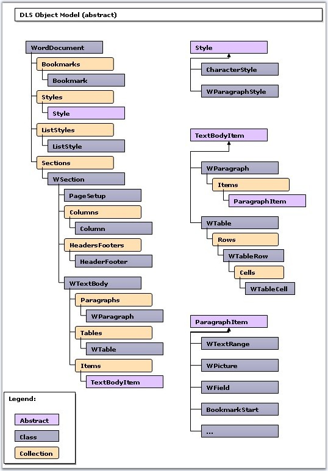

::: {style="DISPLAY: none"}
{#d2h_url_template}{#d2h_package_url style="WIDTH: 0px; DISPLAY: none; HEIGHT: 0px"}
:::

::::: {#nsbanner .d2h_main_nsbanner style="BORDER-BOTTOM: #999999 1px solid; POSITION: relative; PADDING-BOTTOM: 0px; BACKGROUND-COLOR: transparent; PADDING-LEFT: 0px; PADDING-RIGHT: 0px; DISPLAY: none; BORDER-TOP: #999999 1px solid; PADDING-TOP: 0px; LEFT: 0px"}
:::: {#TitleRow .d2h_main_titlerow style="PADDING-BOTTOM: 4px; BACKGROUND-COLOR: transparent; PADDING-LEFT: 22px; WIDTH: 100%; PADDING-RIGHT: 10px; DISPLAY: none; PADDING-TOP: 4px"}
::: {#ienav .d2h_main_ienav style="DISPLAY: none"}
{#D2HPrevious .D2HPreviousEnabled}  {#D2HNext .D2HNextEnabled}
:::
::::
:::::

:::::: {#nstext .d2h_main_nstext style="PADDING-BOTTOM: 10px; BACKGROUND-COLOR: transparent; PADDING-LEFT: 22px; PADDING-RIGHT: 10px; HEIGHT: 100%; OVERFLOW: auto; PADDING-TOP: 5px" hasuserbackground="true" valign="bottom"}
::: {#d2h_breadcrumbs .d2h_breadcrumbs}
[Essential Studio User Guide Documentation](ms-xhelp:///?Id=12457748-09e3-4d74-a240-8e049cedf030){.d2h_breadcrumbsNormal}[ \> ]{.d2h_breadcrumbsLinkSeparator}[Reporting Edition](ms-xhelp:///?Id=027aa5b6-6676-4f93-ad23-c20e8c45792e){.d2h_breadcrumbsNormal}[ \> ]{.d2h_breadcrumbsLinkSeparator}[Essential DocIO](ms-xhelp:///?Id=b88d77b3-4c51-460f-a761-d2ef6d5b0ca6){.d2h_breadcrumbsNormal}[ \> ]{.d2h_breadcrumbsLinkSeparator}[Getting Started](ms-xhelp:///?Id=b13bdbaa-4c11-4a19-ba3a-3401037013af){.d2h_breadcrumbsNormal}
:::

## Class Diagram {#class-diagram style="tab-stops: 0pt"}

 

The following illustration shows the Class Diagram for Essential DocIO.

 

{border="0"}

Figure 10: Class Diagram for Essential DocIO

 

 

::: {style="BORDER-BOTTOM: windowtext 1pt solid; BORDER-LEFT: medium none; PADDING-BOTTOM: 1pt; MARGIN-TOP: 9pt; PADDING-LEFT: 0pt; PADDING-RIGHT: 0pt; MARGIN-BOTTOM: 9pt; BORDER-TOP: windowtext 1pt solid; BORDER-RIGHT: medium none; PADDING-TOP: 1pt"}
{border="0"}Note:
:::

 

::: {style="BORDER-BOTTOM: windowtext 1pt solid; BORDER-LEFT: medium none; PADDING-BOTTOM: 1pt; MARGIN: 9pt 0pt 9pt 18pt; PADDING-LEFT: 0pt; PADDING-RIGHT: 0pt; BORDER-TOP: windowtext 1pt solid; BORDER-RIGHT: medium none; PADDING-TOP: 1pt"}
***[·    ]{style="FONT-FAMILY: Symbol"}***DOM Basics (DLS)-Document Logical Structure \[DLS\] is an object model of DocIO that enables you to interact with the Word document.

***[·    ]{style="FONT-FAMILY: Symbol"}***Bookmarks-the list of bookmarks  (MS Word: Insert-\>Bookmarks...)

***[·    ]{style="FONT-FAMILY: Symbol"}***Styles-the list of document styles (MS Word: Format-\>Styles and Formatting)

***[·    ]{style="FONT-FAMILY: Symbol"}***Sections-sections collection (Every section is a region with its own PageSetup options and HeaderFooters)

***[·    ]{style="FONT-FAMILY: Symbol"}***TextBodyItem-base class for container elements of a document such as paragraphs and tables

***[·    ]{style="FONT-FAMILY: Symbol"}***ParagraphItem-elements which contain paragraphs: formatted text, pictures, special symbols, bookmark markers, fields and so on
:::

[]{#related-topics}
::::::
