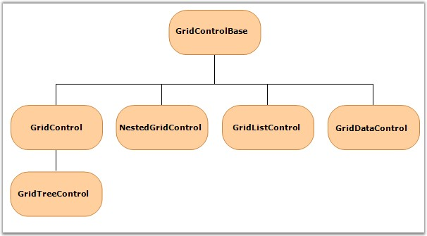

::: {style="DISPLAY: none"}
{#d2h_url_template}{#d2h_package_url style="WIDTH: 0px; DISPLAY: none; HEIGHT: 0px"}
:::

::::: {#nsbanner .d2h_main_nsbanner style="BORDER-BOTTOM: #999999 1px solid; POSITION: relative; PADDING-BOTTOM: 0px; BACKGROUND-COLOR: transparent; PADDING-LEFT: 0px; PADDING-RIGHT: 0px; DISPLAY: none; BORDER-TOP: #999999 1px solid; PADDING-TOP: 0px; LEFT: 0px"}
:::: {#TitleRow .d2h_main_titlerow style="PADDING-BOTTOM: 4px; BACKGROUND-COLOR: transparent; PADDING-LEFT: 22px; WIDTH: 100%; PADDING-RIGHT: 10px; DISPLAY: none; PADDING-TOP: 4px"}
::: {#ienav .d2h_main_ienav style="DISPLAY: none"}
{#D2HPrevious .D2HPreviousEnabled}  {#D2HNext .D2HNextEnabled}
:::
::::
:::::

:::: {#nstext .d2h_main_nstext style="PADDING-BOTTOM: 10px; BACKGROUND-COLOR: transparent; PADDING-LEFT: 22px; PADDING-RIGHT: 10px; HEIGHT: 100%; OVERFLOW: auto; PADDING-TOP: 5px" hasuserbackground="true" valign="bottom"}
::: {#d2h_breadcrumbs .d2h_breadcrumbs}
[Essential Studio User Guide Documentation](ms-xhelp:///?Id=12457748-09e3-4d74-a240-8e049cedf030){.d2h_breadcrumbsNormal}[ \> ]{.d2h_breadcrumbsLinkSeparator}[User Interface Edition](ms-xhelp:///?Id=c29296b7-531c-413b-a0ec-488ca1f7f669){.d2h_breadcrumbsNormal}[ \> ]{.d2h_breadcrumbsLinkSeparator}[Essential WPF](ms-xhelp:///?Id=7f4f82c5-151c-4262-94d0-75c4626c77bc){.d2h_breadcrumbsNormal}[ \> ]{.d2h_breadcrumbsLinkSeparator}[Essential Grid]{.d2h_breadcrumbsContentsOnly}[ \> ]{.d2h_breadcrumbsLinkSeparator}[Getting Started](ms-xhelp:///?Id=99894a49-7527-4c40-8048-00676aa25151){.d2h_breadcrumbsNormal}
:::

## Class Hierarchy {#class-hierarchy style="tab-stops: 0pt"}

[]{#p14}The following hierarchy diagram depicts the relationship between different Grid control classes.

[]{style="COLOR: #15428b"} 

{border="0"}

Figure 14: Class Hierarchy

Let us see some introduction to all these classes.

[·      ]{style="FONT-FAMILY: Symbol"}GridControlBase serves as the parent class for the other grids and derives from VirtualizingCellsControl. The VirtualizingCellsControl is an abstract class and can be used as a base class for any control that tends to display cells within scrollable rows and columns with built-in virtualization of visual elements inside the cells.

 

[·      ]{style="FONT-FAMILY: Symbol"}GridControl, derived from GridControlBase, is a powerful cell-oriented control. It supports virtual mode, 20+ cell types, rich style support, etc.

 

[·      ]{style="FONT-FAMILY: Symbol"}GridDataControl is a binding grid that offers excellent features like grouping, sorting, filtering and summaries. It can also display relational data in a nested grid structure. NestedGridControl is used in conjunction with GridDataControl and is used to display the child tables in nested relation.

 

[·      ]{style="FONT-FAMILY: Symbol"}GridTreeControl, which is derived from GridControl, is a multi-column tree control. It is especially used to display hierarchical data in a tree-like structure. It offers unique features such as multi-column sorting, level styling, custom glyphs, and more.

[]{#related-topics}
::::
