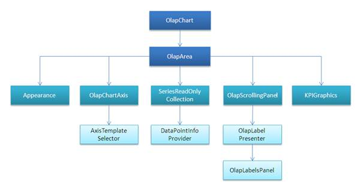

::: {style="DISPLAY: none"}
{#d2h_url_template}{#d2h_package_url style="WIDTH: 0px; DISPLAY: none; HEIGHT: 0px"}
:::

::::: {#nsbanner .d2h_main_nsbanner style="BORDER-BOTTOM: #999999 1px solid; POSITION: relative; PADDING-BOTTOM: 0px; BACKGROUND-COLOR: transparent; PADDING-LEFT: 0px; PADDING-RIGHT: 0px; DISPLAY: none; BORDER-TOP: #999999 1px solid; PADDING-TOP: 0px; LEFT: 0px"}
:::: {#TitleRow .d2h_main_titlerow style="PADDING-BOTTOM: 4px; BACKGROUND-COLOR: transparent; PADDING-LEFT: 22px; WIDTH: 100%; PADDING-RIGHT: 10px; DISPLAY: none; PADDING-TOP: 4px"}
::: {#ienav .d2h_main_ienav style="DISPLAY: none"}
{#D2HPrevious .D2HPreviousEnabled}  {#D2HNext .D2HNextEnabled}
:::
::::
:::::

:::: {#nstext .d2h_main_nstext style="PADDING-BOTTOM: 10px; BACKGROUND-COLOR: transparent; PADDING-LEFT: 22px; PADDING-RIGHT: 10px; HEIGHT: 100%; OVERFLOW: auto; PADDING-TOP: 5px" hasuserbackground="true" valign="bottom"}
::: {#d2h_breadcrumbs .d2h_breadcrumbs}
[Essential Studio User Guide Documentation](ms-xhelp:///?Id=12457748-09e3-4d74-a240-8e049cedf030){.d2h_breadcrumbsNormal}[ \> ]{.d2h_breadcrumbsLinkSeparator}[Business Intelligence Edition](ms-xhelp:///?Id=fdf33dd8-62b2-47b9-ad7b-fc50e590bca5){.d2h_breadcrumbsNormal}[ \> ]{.d2h_breadcrumbsLinkSeparator}[Essential BI WPF](ms-xhelp:///?Id=41e3d586-d922-4a01-8272-679fe4ae7343){.d2h_breadcrumbsNormal}[ \> ]{.d2h_breadcrumbsLinkSeparator}[Essential BI Chart]{.d2h_breadcrumbsContentsOnly}[ \> ]{.d2h_breadcrumbsLinkSeparator}[Essential OLAP Chart for WPF](ms-xhelp:///?Id=4d89e52f-a14a-4da7-a710-b908bfbede08){.d2h_breadcrumbsNormal}[ \> ]{.d2h_breadcrumbsLinkSeparator}[Syncfusion OLAP Architecture](ms-xhelp:///?Id=4321f4f9-27e9-4d15-9c29-9cfd961022ad){.d2h_breadcrumbsNormal}
:::

### Class Structure Diagram {#class-structure-diagram style="tab-stops: 0pt"}

**[]{style="FONT-FAMILY: 'Calibri','sans-serif'; FONT-SIZE: 11pt"}** 

{border="0"}

Figure 6: OLAP Chart WPF Class Structure diagram[]{style="FONT-FAMILY: 'Calibri','sans-serif'; FONT-SIZE: 11pt"}

**[]{style="FONT-FAMILY: 'Calibri','sans-serif'; FONT-SIZE: 11pt"}** 

More:

[ ]{#related-topics}

[{border="0" align="absMiddle"}Properties, Methods, and Events](ms-xhelp:///?Id=daecfa62-240f-4246-8eba-4345a3fbf710){style="TEXT-DECORATION: none"}
::::
