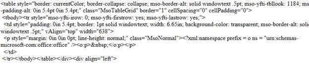
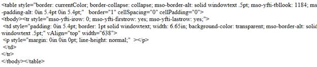

::: {style="DISPLAY: none"}
{#d2h_url_template}{#d2h_package_url style="WIDTH: 0px; DISPLAY: none; HEIGHT: 0px"}
:::

::: {.d2h_secondary_topic style="PADDING-BOTTOM: 10pt; MARGIN: 0pt; PADDING-LEFT: 0pt; PADDING-RIGHT: 0pt; PADDING-TOP: 0pt"}
#### CleanUp HTML contents of the RTE {#cleanup-html-contents-of-the-rte style="tab-stops: 0pt"}

 

When you copy a part of a Word document and paste it into the RTE, the tags associated with the entire Word document are copied to the HTML source page.

This feature helps you to clean up the unnecessary HTML tags in your RTE, and leads to the creation of a valid XHTML document.\
\

When it is not enabled, the tags for the whole document are available.

 

{border="0"}

Figure 220: Code for text copied from a Word document, with XHTML disabled

 

If the user enables XHTML, the HTML tags get cleaned up.

 

{border="0"}

Figure 221: Code for text copied from word, with XHTML enabled

 

Use Case Scenario

The user can clean up HTML tags, and copy the tags that are specific to the portion of the Word document copied.

 

Where do I find Installed samples?[]{style="COLOR: #4f81bd"}

 

Sample Installation Location

XHTML samples for MVC Tools are installed under the following location:

***C:\\Syncfusion\\Essential Studio\\vx.x.x.x\\**MVC**\\Tools.MVC\\Samples***

 

Viewing Samples

To view the samples:

1.   Click Dashboard.

2.   Click the Run Locally Installed Samples link. The Essential Studio MVC Edition sample browser is displayed.[ ]{style="FONT-SIZE: 9pt"}

3.   Select Tools from the drop-down.[]{style="FONT-SIZE: 9pt"}

4.   Select any sample from the Rich Text Editor tab and browse through the features.[]{style="FONT-SIZE: 9pt"}

***[]{style="FONT-SIZE: 11pt"}*** 

More:

[ ]{#related-topics}

[{border="0" align="absMiddle"}How to Clean up the HTML tags in the RTE](ms-xhelp:///?Id=e8ed89a4-4c29-4536-a182-b29ea46ce745){style="TEXT-DECORATION: none"}
:::
