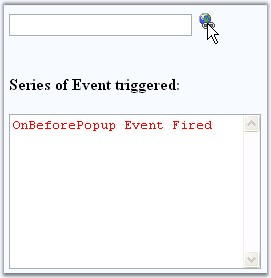
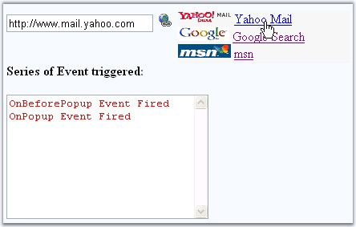
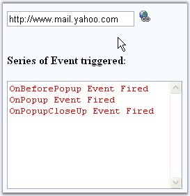

::: {style="DISPLAY: none"}
{#d2h_url_template}{#d2h_package_url style="WIDTH: 0px; DISPLAY: none; HEIGHT: 0px"}
:::

::: {.d2h_secondary_topic style="PADDING-BOTTOM: 10pt; MARGIN: 0pt; PADDING-LEFT: 0pt; PADDING-RIGHT: 0pt; PADDING-TOP: 0pt"}
##### Client-side Events {#client-side-events style="tab-stops: 0pt"}

[]{style="FONT-FAMILY: 'Trebuchet MS','sans-serif'; COLOR: #15428b; FONT-SIZE: 9pt"} 

The PopupContainer control provides the flexibility to invoke functions on client side which can be triggered on some user action.\
To invoke the client side events:

[]{style="FONT-FAMILY: 'Trebuchet MS','sans-serif'; COLOR: #15428b; FONT-SIZE: 9pt"} 

1.   In HTML view of the project, add the following client side javascript content inside the \<script\> tags.

2.   Here, methods like **OnPopup**, **OnPopUpCloseup** and **OnBeforePopup** are called to display the event that is being called before the popup container is shown, when the popup container is shown and after the container is closed.

[]{style="FONT-FAMILY: 'Trebuchet MS','sans-serif'; COLOR: #15428b; FONT-SIZE: 9pt"} 

+--------------------------------------------------------------------------------------------------------------------------------------------------------------------------------------------------------------------------------+
| [\<]{style="FONT-FAMILY: 'Courier New'; COLOR: blue"}[script]{style="FONT-FAMILY: 'Courier New'; COLOR: maroon"}[ [type]{style="COLOR: red"}[=\"text/javascript\"\>]{style="COLOR: blue"}]{style="FONT-FAMILY: 'Courier New'"} |
|                                                                                                                                                                                                                                |
| [function]{style="FONT-FAMILY: 'Courier New'; COLOR: blue"}[ OnPopup()]{style="FONT-FAMILY: 'Courier New'"}                                                                                                                    |
|                                                                                                                                                                                                                                |
| [{]{style="FONT-FAMILY: 'Courier New'"}                                                                                                                                                                                        |
|                                                                                                                                                                                                                                |
| [        var]{style="FONT-FAMILY: 'Courier New'; COLOR: blue"}[ oEl = document.getElementById([\"txtEvent\"]{style="COLOR: maroon"});]{style="FONT-FAMILY: 'Courier New'"}                                                     |
|                                                                                                                                                                                                                                |
| [        oEl.innerHTML = [\"PopupControlContainer is being shown\"]{style="COLOR: maroon"};]{style="FONT-FAMILY: 'Courier New'"}                                                                                               |
|                                                                                                                                                                                                                                |
| [}]{style="FONT-FAMILY: 'Courier New'"}                                                                                                                                                                                        |
|                                                                                                                                                                                                                                |
| [function]{style="FONT-FAMILY: 'Courier New'; COLOR: blue"}[ OnPopupCloseUp()]{style="FONT-FAMILY: 'Courier New'"}                                                                                                             |
|                                                                                                                                                                                                                                |
| [{]{style="FONT-FAMILY: 'Courier New'"}                                                                                                                                                                                        |
|                                                                                                                                                                                                                                |
| [        [var]{style="COLOR: blue"} oEl = document.getElementById([\"txtEvent\"]{style="COLOR: maroon"});]{style="FONT-FAMILY: 'Courier New'"}                                                                                 |
|                                                                                                                                                                                                                                |
| [        oEl.innerHTML = [\"PopupControlContainer has been closed\"]{style="COLOR: maroon"};]{style="FONT-FAMILY: 'Courier New'"}                                                                                              |
|                                                                                                                                                                                                                                |
| [}]{style="FONT-FAMILY: 'Courier New'"}                                                                                                                                                                                        |
|                                                                                                                                                                                                                                |
| [function]{style="FONT-FAMILY: 'Courier New'; COLOR: blue"}[ OnBeforePopup()]{style="FONT-FAMILY: 'Courier New'"}                                                                                                              |
|                                                                                                                                                                                                                                |
| [{]{style="FONT-FAMILY: 'Courier New'"}                                                                                                                                                                                        |
|                                                                                                                                                                                                                                |
| [        var]{style="FONT-FAMILY: 'Courier New'; COLOR: blue"}[ oEl1 = document.getElementById([\"textBeforePopup\"]{style="COLOR: maroon"});]{style="FONT-FAMILY: 'Courier New'"}                                             |
|                                                                                                                                                                                                                                |
| [        [var]{style="COLOR: blue"} oEl2 = document.getElementById([\"text1\"]{style="COLOR: maroon"});]{style="FONT-FAMILY: 'Courier New'"}                                                                                   |
|                                                                                                                                                                                                                                |
| [        oEl1.innerHTML = oEl2.value;]{style="FONT-FAMILY: 'Courier New'"}                                                                                                                                                     |
|                                                                                                                                                                                                                                |
| [}]{style="FONT-FAMILY: 'Courier New'"}                                                                                                                                                                                        |
|                                                                                                                                                                                                                                |
| [\</]{style="FONT-FAMILY: 'Courier New'; COLOR: blue"}[script]{style="FONT-FAMILY: 'Courier New'; COLOR: maroon"}[\>]{style="FONT-FAMILY: 'Courier New'; COLOR: blue"}                                                         |
+--------------------------------------------------------------------------------------------------------------------------------------------------------------------------------------------------------------------------------+

[]{style="FONT-FAMILY: 'Trebuchet MS','sans-serif'; COLOR: #15428b; FONT-SIZE: 9pt"} 

3.   Build and run the application. On performing some action like clicking the popup to open and on close the client actions will be triggered.

[]{style="FONT-FAMILY: 'Trebuchet MS','sans-serif'; COLOR: #15428b; FONT-SIZE: 9pt"} 

{border="0"}

**[]{style="FONT-FAMILY: 'Trebuchet MS','sans-serif'; COLOR: #15428b; FONT-SIZE: 9pt"}** 

Figure 416: Before the Popup container is shown the Client side event is called

**[]{style="FONT-FAMILY: 'Trebuchet MS','sans-serif'; COLOR: #15428b; FONT-SIZE: 9pt"}** 

{border="0"}

**[]{style="FONT-FAMILY: 'Trebuchet MS','sans-serif'; COLOR: #15428b; FONT-SIZE: 9pt"}** 

Figure 417: When the Popup container is shown the Client side event is called

[]{style="FONT-FAMILY: 'Trebuchet MS','sans-serif'; COLOR: #15428b; FONT-SIZE: 9pt"} 

{border="0"}

**[]{style="FONT-FAMILY: 'Trebuchet MS','sans-serif'; COLOR: #15428b; FONT-SIZE: 9pt"}** 

Figure 418: After the Popup container is closed the Client side event is called

 

[]{#related-topics}
:::
