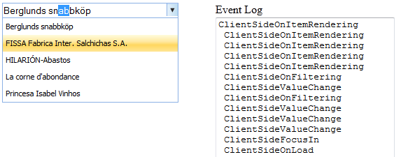

::: {style="DISPLAY: none"}
{#d2h_url_template}{#d2h_package_url style="WIDTH: 0px; DISPLAY: none; HEIGHT: 0px"}
:::

::::::: {.d2h_secondary_topic style="PADDING-BOTTOM: 10pt; MARGIN: 0pt; PADDING-LEFT: 0pt; PADDING-RIGHT: 0pt; PADDING-TOP: 0pt"}
#### Client-Side Events {#client-side-events style="tab-stops: 0pt"}

Client-side events are triggered in response to specific actions in the client.

 

Use Case Scenarios

You are able to control the AutoComplete text box on the client-side by using the client-side events.

You can get the current value of the AutocompleteTextBox control, the active item in the suggestion list, current event name, and instance of AutoComplete text box using the client-side event arguments.

 

Events

  **[Event ]{style="COLOR: black"}**[]{style="COLOR: black"}   **[Description ]{style="COLOR: black"}**[]{style="COLOR: black"}   **[Arguments ]{style="COLOR: black"}**[]{style="COLOR: black"}   **[Type ]{style="COLOR: black"}**[]{style="COLOR: black"}
  ------------------------------------------------------------ ------------------------------------------------------------------ ---------------------------------------------------------------- -----------------------------------------------------------
  ClientSideFocusIn                                            Raised when the AutoComplete text box gains focus.                 obj, args                                                        Client side
  ClientSideFocusOut                                           Raised when the AutoComplete text box loses focus.                 obj, args                                                        Client side
  ClientSideValueChange                                        Raised when the AutoComplete text box value changes.               obj, args                                                        Client side
  ClientSideOnLoad                                             Triggered when the AutoComplete text box loads.                    obj, args                                                        Client side
  ClientSideOnFiltering                                        Triggered on client-side data fetching.                            obj, args                                                        Client side
  ClientSideOnBeforeRequest                                    Triggered before AJAX post.                                        obj, args                                                        Client side
  ClientSideOnSuccess                                          Triggered on AJAX post success.                                    obj, args                                                        Client side
  ClientSideOnComplete                                         Triggered on AJAX post complete.                                   obj, args                                                        Client side
  ClientSideOnFailure                                          Triggered on AJAX post failure.                                    obj, args                                                        Client side

 

Sample Link

To view a sample:

1.   Open the Essential Tools sample browser from the dashboard. (Refer to the Samples and Location chapter).

2.   Navigate to **Tools.MVC** \> **AutoComplete Textbox** \> **Client-Side Events**

 

 

Adding Client-Side Events to an Application

 

Using AutocompleteTextBoxBuilder

To use client-side events in the AutoComplete text box by using AutocompleteTextBoxBuilder:

1.   Create a **view**.

2.   In the **view**, invoke the **AutocompleteTextBox** helper with the control ID.

3.   Set the script function name for the **ClientSideEvents.**

 

::: {align="center"}
+-------------------------------------------------------------------------------------------------------------------------------------------------------------------------------------------------------------------------+
| **[\[script\]]{style="FONT-FAMILY: 'Courier New'"}**                                                                                                                                                                    |
|                                                                                                                                                                                                                         |
| **[]{style="FONT-FAMILY: 'Courier New'"}**                                                                                                                                                                              |
|                                                                                                                                                                                                                         |
| [    [function]{style="COLOR: blue"} ClientSideEvents(oEv, args) {]{style="FONT-FAMILY: Consolas; FONT-SIZE: 9.5pt"}                                                                                                    |
|                                                                                                                                                                                                                         |
| [        \$([\"#EventLog\"]{style="COLOR: maroon"}).val(args.get_EventName() + [\"\\n \"]{style="COLOR: maroon"} + \$([\"#EventLog\"]{style="COLOR: maroon"}).val());]{style="FONT-FAMILY: Consolas; FONT-SIZE: 9.5pt"} |
|                                                                                                                                                                                                                         |
| [    }]{style="FONT-FAMILY: Consolas; FONT-SIZE: 9.5pt"}                                                                                                                                                                |
|                                                                                                                                                                                                                         |
| []{style="FONT-FAMILY: 'Courier New'"}                                                                                                                                                                                  |
+-------------------------------------------------------------------------------------------------------------------------------------------------------------------------------------------------------------------------+
:::

 

::: {align="center"}
+--------------------------------------------------------------------------------------------------------------------------------------------------------------------------------------------------------------------------------------------------------------------------------------------------------------------------------------------------------------------------------------------------------------------------------------------------------------------------------------------------------+
| **[\[ASPX\]]{style="FONT-FAMILY: 'Courier New'"}**                                                                                                                                                                                                                                                                                                                                                                                                                                                     |
|                                                                                                                                                                                                                                                                                                                                                                                                                                                                                                        |
| **[]{style="FONT-FAMILY: 'Courier New'"}**                                                                                                                                                                                                                                                                                                                                                                                                                                                             |
|                                                                                                                                                                                                                                                                                                                                                                                                                                                                                                        |
| [\<%]{style="FONT-FAMILY: Consolas; BACKGROUND: yellow; FONT-SIZE: 9.5pt"}[=]{style="FONT-FAMILY: Consolas; COLOR: blue; FONT-SIZE: 9.5pt"}[Html.Syncfusion().AutocompleteTextBox([\"myAutocomplete\"]{style="COLOR: #a31515"}).RequestMapper([\"GetData\"]{style="COLOR: #a31515"})                           .ClientSideFocusIn([\"ClientSideEvents\"]{style="COLOR: #a31515"}).ClientSideFocusOut([\"ClientSideEvents\"]{style="COLOR: #a31515"})]{style="FONT-FAMILY: Consolas; FONT-SIZE: 9.5pt"} |
|                                                                                                                                                                                                                                                                                                                                                                                                                                                                                                        |
| [.ClientSideOnBeforeRequest([\"ClientSideEvents\"]{style="COLOR: #a31515"}).ClientSideOnComplete([\"ClientSideEvents\"]{style="COLOR: #a31515"})]{style="FONT-FAMILY: Consolas; FONT-SIZE: 9.5pt"}                                                                                                                                                                                                                                                                                                     |
|                                                                                                                                                                                                                                                                                                                                                                                                                                                                                                        |
| [.ClientSideOnFailure([\"ClientSideEvents\"]{style="COLOR: #a31515"}).ClientSideOnFiltering([\"ClientSideEvents\"]{style="COLOR: #a31515"})]{style="FONT-FAMILY: Consolas; FONT-SIZE: 9.5pt"}                                                                                                                                                                                                                                                                                                          |
|                                                                                                                                                                                                                                                                                                                                                                                                                                                                                                        |
| [.ClientSideOnLoad([\"ClientSideEvents\"]{style="COLOR: #a31515"}).ClientSideOnSelect([\"ClientSideEvents\"]{style="COLOR: #a31515"})]{style="FONT-FAMILY: Consolas; FONT-SIZE: 9.5pt"}                                                                                                                                                                                                                                                                                                                |
|                                                                                                                                                                                                                                                                                                                                                                                                                                                                                                        |
| [.ClientSideOnSuccess([\"ClientSideEvents\"]{style="COLOR: #a31515"}).ClientSideValueChange([\"ClientSideEvents\"]{style="COLOR: #a31515"})]{style="FONT-FAMILY: Consolas; FONT-SIZE: 9.5pt"}                                                                                                                                                                                                                                                                                                          |
|                                                                                                                                                                                                                                                                                                                                                                                                                                                                                                        |
| [.ClientSideOnItemRendering([\"ClientSideEvents\"]{style="COLOR: #a31515"})]{style="FONT-FAMILY: Consolas; FONT-SIZE: 9.5pt"}                                                                                                                                                                                                                                                                                                                                                                          |
|                                                                                                                                                                                                                                                                                                                                                                                                                                                                                                        |
| []{style="FONT-FAMILY: Consolas; FONT-SIZE: 9.5pt"}                                                                                                                                                                                                                                                                                                                                                                                                                                                    |
|                                                                                                                                                                                                                                                                                                                                                                                                                                                                                                        |
| [%\>]{style="FONT-FAMILY: 'Courier New'; BACKGROUND: yellow"}[]{style="FONT-FAMILY: 'Courier New'"}                                                                                                                                                                                                                                                                                                                                                                                                    |
|                                                                                                                                                                                                                                                                                                                                                                                                                                                                                                        |
| []{style="FONT-FAMILY: 'Courier New'"}                                                                                                                                                                                                                                                                                                                                                                                                                                                                 |
+--------------------------------------------------------------------------------------------------------------------------------------------------------------------------------------------------------------------------------------------------------------------------------------------------------------------------------------------------------------------------------------------------------------------------------------------------------------------------------------------------------+
:::

 

::: {align="center"}
+-----------------------------------------------------------------------------------------------------------------------------------------------------------------------------------------------------------------------------------------------------+
| **[\[Razor\]]{style="FONT-FAMILY: 'Courier New'"}**                                                                                                                                                                                                 |
|                                                                                                                                                                                                                                                     |
| [@]{style="FONT-FAMILY: 'Courier New'; BACKGROUND: yellow"}[Html.Syncfusion().AutocompleteTextBox([\"myAutocomplete]{style="COLOR: #a31515"}.RequestMapper([\"GetData\"]{style="COLOR: #a31515"})]{style="FONT-FAMILY: Consolas; FONT-SIZE: 9.5pt"} |
|                                                                                                                                                                                                                                                     |
| [.ClientSideFocusIn([\"ClientSideEvents\"]{style="COLOR: #a31515"}).ClientSideFocusOut([\"ClientSideEvents\"]{style="COLOR: #a31515"})]{style="FONT-FAMILY: Consolas; FONT-SIZE: 9.5pt"}                                                            |
|                                                                                                                                                                                                                                                     |
| [.ClientSideOnBeforeRequest([\"ClientSideEvents\"]{style="COLOR: #a31515"}).ClientSideOnComplete([\"ClientSideEvents\"]{style="COLOR: #a31515"})]{style="FONT-FAMILY: Consolas; FONT-SIZE: 9.5pt"}                                                  |
|                                                                                                                                                                                                                                                     |
| [.ClientSideOnFailure([\"ClientSideEvents\"]{style="COLOR: #a31515"}).ClientSideOnFiltering([\"ClientSideEvents\"]{style="COLOR: #a31515"})]{style="FONT-FAMILY: Consolas; FONT-SIZE: 9.5pt"}                                                       |
|                                                                                                                                                                                                                                                     |
| [.ClientSideOnLoad([\"ClientSideEvents\"]{style="COLOR: #a31515"}).ClientSideOnSelect([\"ClientSideEvents\"]{style="COLOR: #a31515"})]{style="FONT-FAMILY: Consolas; FONT-SIZE: 9.5pt"}                                                             |
|                                                                                                                                                                                                                                                     |
| [.ClientSideOnSuccess([\"ClientSideEvents\"]{style="COLOR: #a31515"}).ClientSideValueChange([\"ClientSideEvents\"]{style="COLOR: #a31515"})]{style="FONT-FAMILY: Consolas; FONT-SIZE: 9.5pt"}                                                       |
|                                                                                                                                                                                                                                                     |
| [.ClientSideOnItemRendering([\"ClientSideEvents\"]{style="COLOR: #a31515"})]{style="FONT-FAMILY: Consolas; FONT-SIZE: 9.5pt"}[]{style="FONT-FAMILY: 'Courier New'"}                                                                                 |
|                                                                                                                                                                                                                                                     |
| []{style="FONT-FAMILY: 'Courier New'"}                                                                                                                                                                                                              |
+-----------------------------------------------------------------------------------------------------------------------------------------------------------------------------------------------------------------------------------------------------+
:::

 

::: {align="center"}
+-------------------------------------------------------------------------------------------------------------------------------------------------------------------------------------------+
| **[Controller]{style="FONT-FAMILY: 'Courier New'"}**                                                                                                                                      |
|                                                                                                                                                                                           |
| [        [public]{style="COLOR: blue"} [ActionResult]{style="COLOR: #2b91af"} Index()]{style="FONT-FAMILY: Consolas; FONT-SIZE: 9.5pt"}                                                   |
|                                                                                                                                                                                           |
| [        {]{style="FONT-FAMILY: Consolas; FONT-SIZE: 9.5pt"}                                                                                                                              |
|                                                                                                                                                                                           |
| [            [return]{style="COLOR: blue"} View();]{style="FONT-FAMILY: Consolas; FONT-SIZE: 9.5pt"}                                                                                      |
|                                                                                                                                                                                           |
| [        }]{style="FONT-FAMILY: Consolas; FONT-SIZE: 9.5pt"}                                                                                                                              |
|                                                                                                                                                                                           |
| [        \[[AcceptVerbs]{style="COLOR: #2b91af"}([HttpVerbs]{style="COLOR: #2b91af"}.Post)\]]{style="FONT-FAMILY: Consolas; FONT-SIZE: 9.5pt"}                                            |
|                                                                                                                                                                                           |
| [        [public]{style="COLOR: blue"} [ActionResult]{style="COLOR: #2b91af"} GetData([string]{style="COLOR: blue"} QueryString)]{style="FONT-FAMILY: Consolas; FONT-SIZE: 9.5pt"}        |
|                                                                                                                                                                                           |
| [        {]{style="FONT-FAMILY: Consolas; FONT-SIZE: 9.5pt"}                                                                                                                              |
|                                                                                                                                                                                           |
| [            [Northwind]{style="COLOR: #2b91af"} context = SqlCE;]{style="FONT-FAMILY: Consolas; FONT-SIZE: 9.5pt"}                                                                       |
|                                                                                                                                                                                           |
| [            [var]{style="COLOR: blue"} dataSource = [from]{style="COLOR: blue"} suggestion [in]{style="COLOR: blue"} context.Customers]{style="FONT-FAMILY: Consolas; FONT-SIZE: 9.5pt"} |
|                                                                                                                                                                                           |
| [                             [select]{style="COLOR: blue"} suggestion.CustomerID;]{style="FONT-FAMILY: Consolas; FONT-SIZE: 9.5pt"}                                                      |
|                                                                                                                                                                                           |
| []{style="FONT-FAMILY: Consolas; FONT-SIZE: 9.5pt"}                                                                                                                                       |
|                                                                                                                                                                                           |
| []{style="FONT-FAMILY: Consolas; FONT-SIZE: 9.5pt"}                                                                                                                                       |
|                                                                                                                                                                                           |
| [            [ActionResult]{style="COLOR: #2b91af"} jsonResult = dataSource.AutocompleteActionResult();]{style="FONT-FAMILY: Consolas; FONT-SIZE: 9.5pt"}                                 |
|                                                                                                                                                                                           |
| [            [return]{style="COLOR: blue"} jsonResult;]{style="FONT-FAMILY: Consolas; FONT-SIZE: 9.5pt"}                                                                                  |
|                                                                                                                                                                                           |
| [        }]{style="FONT-FAMILY: Consolas; FONT-SIZE: 9.5pt"}                                                                                                                              |
+-------------------------------------------------------------------------------------------------------------------------------------------------------------------------------------------+
:::

 

 

4.   Build and run the application.

{border="0"}

Figure 81: AutoComplete---Client-Side Events

 

[]{#related-topics}
:::::::
