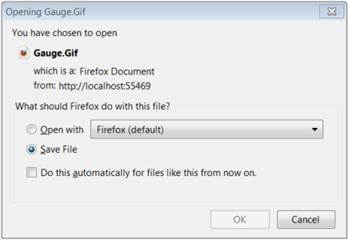

::: {style="DISPLAY: none"}
{#d2h_url_template}{#d2h_package_url style="WIDTH: 0px; DISPLAY: none; HEIGHT: 0px"}
:::

:::: {.d2h_secondary_topic style="PADDING-BOTTOM: 10pt; MARGIN: 0pt; PADDING-LEFT: 0pt; PADDING-RIGHT: 0pt; PADDING-TOP: 0pt"}
##### ClientSide Export {#clientside-export style="tab-stops: 0pt"}

 

Refer to the below code to export the gauge in client side.

Step 1:

Controller:

 

Add the below code in your controller.

By setting the **GaugeExport** property to **ClientSide** and calling the **GenerateGaugeImage()** function, you can export the gauge in client side .

[]{style="FONT-FAMILY: 'Calibri','sans-serif'"} 

+-----------------------------------------------------------------------------------------------------------------------------------------------------------------------------------+
| []{style="FONT-FAMILY: 'Courier New'; COLOR: blue"}                                                                                                                               |
|                                                                                                                                                                                   |
| [public]{style="FONT-FAMILY: 'Courier New'; COLOR: blue"}[ [ActionResult]{style="COLOR: #2b91af"} Index()]{style="FONT-FAMILY: 'Courier New'"}                                    |
|                                                                                                                                                                                   |
| [        {]{style="FONT-FAMILY: 'Courier New'"}                                                                                                                                   |
|                                                                                                                                                                                   |
| [            [CircularGaugeModel]{style="COLOR: #2b91af"} model = [new]{style="COLOR: blue"} [CircularGaugeModel]{style="COLOR: #2b91af"}();]{style="FONT-FAMILY: 'Courier New'"} |
|                                                                                                                                                                                   |
| [            model.Radius = 160;]{style="FONT-FAMILY: 'Courier New'"}                                                                                                             |
|                                                                                                                                                                                   |
| [            model.GaugeSkins = [GaugeSkins]{style="COLOR: #2b91af"}.VS2010;]{style="FONT-FAMILY: 'Courier New'"}                                                                 |
|                                                                                                                                                                                   |
| [            model.FrameType = [GaugeFrameType]{style="COLOR: #2b91af"}.FullCircle;]{style="FONT-FAMILY: 'Courier New'"}                                                          |
|                                                                                                                                                                                   |
| []{style="FONT-FAMILY: 'Courier New'"}                                                                                                                                            |
|                                                                                                                                                                                   |
| [            [CircularScale]{style="COLOR: #2b91af"} c_Scale = [new]{style="COLOR: blue"} [CircularScale]{style="COLOR: #2b91af"}();]{style="FONT-FAMILY: 'Courier New'"}         |
|                                                                                                                                                                                   |
| [            c_Scale.PointerCapRadius = 8;]{style="FONT-FAMILY: 'Courier New'"}                                                                                                   |
|                                                                                                                                                                                   |
| [            c_Scale.BackgroundBrush = [Brushes]{style="COLOR: #2b91af"}.Gray;]{style="FONT-FAMILY: 'Courier New'"}                                                               |
|                                                                                                                                                                                   |
| []{style="FONT-FAMILY: 'Courier New'"}                                                                                                                                            |
|                                                                                                                                                                                   |
| [            [GaugeLabelTick]{style="COLOR: #2b91af"} c_LabelTick = [new]{style="COLOR: blue"} [GaugeLabelTick]{style="COLOR: #2b91af"}();]{style="FONT-FAMILY: 'Courier New'"}   |
|                                                                                                                                                                                   |
| [            c_LabelTick.FontSize = 15;]{style="FONT-FAMILY: 'Courier New'"}                                                                                                      |
|                                                                                                                                                                                   |
| []{style="FONT-FAMILY: 'Courier New'"}                                                                                                                                            |
|                                                                                                                                                                                   |
| [            [TickMark]{style="COLOR: #2b91af"} \_minor = [new]{style="COLOR: blue"} [TickMark]{style="COLOR: #2b91af"}();]{style="FONT-FAMILY: 'Courier New'"}                   |
|                                                                                                                                                                                   |
| [            \_minor.TickStyle = [TickStyle]{style="COLOR: #2b91af"}.MinorTick;]{style="FONT-FAMILY: 'Courier New'"}                                                              |
|                                                                                                                                                                                   |
| [            \_minor.TickWidth = 1;]{style="FONT-FAMILY: 'Courier New'"}                                                                                                          |
|                                                                                                                                                                                   |
| [            \_minor.TickHeight = 9;]{style="FONT-FAMILY: 'Courier New'"}                                                                                                         |
|                                                                                                                                                                                   |
| [            \_minor.TickPlacement = [ScalePlacement]{style="COLOR: #2b91af"}.Outside;]{style="FONT-FAMILY: 'Courier New'"}                                                       |
|                                                                                                                                                                                   |
| [            \_minor.BackgroundBrush = [Brushes]{style="COLOR: #2b91af"}.White;]{style="FONT-FAMILY: 'Courier New'"}                                                              |
|                                                                                                                                                                                   |
| []{style="FONT-FAMILY: 'Courier New'"}                                                                                                                                            |
|                                                                                                                                                                                   |
| [            [TickMark]{style="COLOR: #2b91af"} \_major = [new]{style="COLOR: blue"} [TickMark]{style="COLOR: #2b91af"}();]{style="FONT-FAMILY: 'Courier New'"}                   |
|                                                                                                                                                                                   |
| [            \_major.TickStyle = [TickStyle]{style="COLOR: #2b91af"}.MajorTick;]{style="FONT-FAMILY: 'Courier New'"}                                                              |
|                                                                                                                                                                                   |
| [            \_major.TickWidth = 3;]{style="FONT-FAMILY: 'Courier New'"}                                                                                                          |
|                                                                                                                                                                                   |
| [            \_major.TickHeight = 14;]{style="FONT-FAMILY: 'Courier New'"}                                                                                                        |
|                                                                                                                                                                                   |
| [            \_major.TickPlacement = [ScalePlacement]{style="COLOR: #2b91af"}.Outside;]{style="FONT-FAMILY: 'Courier New'"}                                                       |
|                                                                                                                                                                                   |
| []{style="FONT-FAMILY: 'Courier New'"}                                                                                                                                            |
|                                                                                                                                                                                   |
| [            [CircularPointer]{style="COLOR: #2b91af"} c_Pointer = [new]{style="COLOR: blue"} [CircularPointer]{style="COLOR: #2b91af"}();]{style="FONT-FAMILY: 'Courier New'"}   |
|                                                                                                                                                                                   |
| [            c_Pointer.PointerLength = 100;]{style="FONT-FAMILY: 'Courier New'"}                                                                                                  |
|                                                                                                                                                                                   |
| [            c_Pointer.PointerWidth = 10;]{style="FONT-FAMILY: 'Courier New'"}                                                                                                    |
|                                                                                                                                                                                   |
| [            c_Pointer.BorderWidth = 2;]{style="FONT-FAMILY: 'Courier New'"}                                                                                                      |
|                                                                                                                                                                                   |
| [            c_Pointer.PointerPlacement = [ScalePlacement]{style="COLOR: #2b91af"}.Inside;]{style="FONT-FAMILY: 'Courier New'"}                                                   |
|                                                                                                                                                                                   |
| [            c_Pointer.MarkerStyle = [MarkerStyle]{style="COLOR: #2b91af"}.Trapezoid;]{style="FONT-FAMILY: 'Courier New'"}                                                        |
|                                                                                                                                                                                   |
| [            c_Pointer.Value = 0;]{style="FONT-FAMILY: 'Courier New'"}                                                                                                            |
|                                                                                                                                                                                   |
| []{style="FONT-FAMILY: 'Courier New'"}                                                                                                                                            |
|                                                                                                                                                                                   |
| [            c_Scale.Ticks.Add(\_minor);]{style="FONT-FAMILY: 'Courier New'"}                                                                                                     |
|                                                                                                                                                                                   |
| [            c_Scale.Ticks.Add(\_major);]{style="FONT-FAMILY: 'Courier New'"}                                                                                                     |
|                                                                                                                                                                                   |
| [            c_Scale.Pointers.Add(c_Pointer);]{style="FONT-FAMILY: 'Courier New'"}                                                                                                |
|                                                                                                                                                                                   |
| [            c_Scale.Labels.Add(c_LabelTick);]{style="FONT-FAMILY: 'Courier New'"}                                                                                                |
|                                                                                                                                                                                   |
| []{style="FONT-FAMILY: 'Courier New'"}                                                                                                                                            |
|                                                                                                                                                                                   |
| [            model.Scales.Add(c_Scale);]{style="FONT-FAMILY: 'Courier New'"}                                                                                                      |
|                                                                                                                                                                                   |
| []{style="FONT-FAMILY: 'Courier New'"}                                                                                                                                            |
|                                                                                                                                                                                   |
| [            [//Sets for client side export.]{style="COLOR: green"}]{style="FONT-FAMILY: 'Courier New'"}                                                                          |
|                                                                                                                                                                                   |
| [            model.GaugeExport = [GaugeExport]{style="COLOR: #2b91af"}.ClientSide;]{style="FONT-FAMILY: 'Courier New'"}                                                           |
|                                                                                                                                                                                   |
| [            [//Function to generate the gauge in Server or client side in Gif format.]{style="COLOR: green"}]{style="FONT-FAMILY: 'Courier New'"}                                |
|                                                                                                                                                                                   |
| [            model.GenerateGaugeImage(model, [\"Gauge\"]{style="COLOR: #a31515"}, [ImageFormat]{style="COLOR: #2b91af"}.Gif);]{style="FONT-FAMILY: 'Courier New'"}                |
|                                                                                                                                                                                   |
| []{style="FONT-FAMILY: 'Courier New'"}                                                                                                                                            |
|                                                                                                                                                                                   |
| [            ViewData\[[\"GaugeModel\"]{style="COLOR: #a31515"}\] = model;]{style="FONT-FAMILY: 'Courier New'"}                                                                   |
|                                                                                                                                                                                   |
| []{style="FONT-FAMILY: 'Courier New'"}                                                                                                                                            |
|                                                                                                                                                                                   |
| [            [return]{style="COLOR: blue"} View();]{style="FONT-FAMILY: 'Courier New'"}                                                                                           |
|                                                                                                                                                                                   |
| [        }]{style="FONT-FAMILY: 'Courier New'"}                                                                                                                                   |
+-----------------------------------------------------------------------------------------------------------------------------------------------------------------------------------+

**[]{style="FONT-FAMILY: 'Calibri','sans-serif'"}** 

Step 2:

View:

 

Add the below code in view page.

 

+-------------------------------------------------------------------------------------------------------------------------------------------------------------------------------------------------------------------------------------------------------------------------------------------------------------+
| [View\[ASPX\]]{style="FONT-FAMILY: 'Courier New'"}                                                                                                                                                                                                                                                          |
|                                                                                                                                                                                                                                                                                                             |
| [\<%]{style="FONT-FAMILY: 'Courier New'; BACKGROUND: yellow"}[\--Rendering the linear gauge\--]{style="FONT-FAMILY: 'Courier New'; COLOR: darkgreen"}[%\>]{style="FONT-FAMILY: 'Courier New'; BACKGROUND: yellow"}[]{style="FONT-FAMILY: 'Courier New'"}                                                    |
|                                                                                                                                                                                                                                                                                                             |
| []{style="FONT-FAMILY: 'Courier New'"}                                                                                                                                                                                                                                                                      |
|                                                                                                                                                                                                                                                                                                             |
| [   [\<%]{style="BACKGROUND: yellow"}[=]{style="COLOR: blue"}Html.Syncfusion().CircularGauge([\"Gauge\"]{style="COLOR: #a31515"}, ([CircularGaugeModel]{style="COLOR: #2b91af"})ViewData\[[\"GaugeModel\"]{style="COLOR: #a31515"}\])[%\>]{style="BACKGROUND: yellow"}]{style="FONT-FAMILY: 'Courier New'"} |
+-------------------------------------------------------------------------------------------------------------------------------------------------------------------------------------------------------------------------------------------------------------------------------------------------------------+

**[]{style="FONT-FAMILY: 'Calibri','sans-serif'"}** 

 

+----------------------------------------------------------------------------------------------------------------------------------------------------------------------------------------------------------------------------------------------------------------------------------------------------+
| **[View\[cshtml\]]{style="FONT-FAMILY: 'Courier New'"}**                                                                                                                                                                                                                                           |
|                                                                                                                                                                                                                                                                                                    |
| []{style="FONT-FAMILY: 'Courier New'"}                                                                                                                                                                                                                                                             |
|                                                                                                                                                                                                                                                                                                    |
| [@\*]{style="FONT-FAMILY: 'Courier New'; BACKGROUND: yellow"}[\--Rendering the linear gauge\--]{style="FONT-FAMILY: 'Courier New'; COLOR: darkgreen"}[\*@]{style="FONT-FAMILY: 'Courier New'; BACKGROUND: yellow"}[]{style="FONT-FAMILY: 'Courier New'"}                                           |
|                                                                                                                                                                                                                                                                                                    |
| [@]{style="FONT-FAMILY: Consolas; BACKGROUND: yellow; FONT-SIZE: 9.5pt"}[Html.Syncfusion().CircularGauge([\"Gauge\"]{style="COLOR: #a31515"},([CircularGaugeModel]{style="COLOR: #2b91af"})ViewData\[[\"GaugeModel\"]{style="COLOR: #a31515"}\])]{style="FONT-FAMILY: Consolas; FONT-SIZE: 9.5pt"} |
|                                                                                                                                                                                                                                                                                                    |
| []{style="FONT-FAMILY: 'Courier New'"}                                                                                                                                                                                                                                                             |
+----------------------------------------------------------------------------------------------------------------------------------------------------------------------------------------------------------------------------------------------------------------------------------------------------+

**[]{style="FONT-FAMILY: 'Calibri','sans-serif'"}** 

**[]{style="FONT-FAMILY: 'Calibri','sans-serif'"}** 

Step 3:

[]{style="FONT-FAMILY: 'Calibri','sans-serif'"} 

Run the code. Then the below Save dialog window will open . Then you can save the image.

 

{border="0"}

Figure 84: Client Side-Save Dialog Box[                                ]{style="FONT-FAMILY: 'Calibri','sans-serif'"}

::: {style="BORDER-BOTTOM: windowtext 1pt solid; BORDER-LEFT: medium none; PADDING-BOTTOM: 1pt; MARGIN-TOP: 9pt; PADDING-LEFT: 0pt; PADDING-RIGHT: 0pt; MARGIN-BOTTOM: 9pt; BORDER-TOP: windowtext 1pt solid; BORDER-RIGHT: medium none; PADDING-TOP: 1pt"}
 

{border="0"} Note: On Ajax call, you can't export the gauge in client-side.

 
:::

[]{#related-topics}
::::
