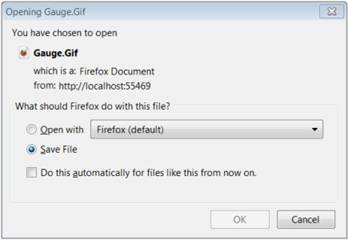

::: {style="DISPLAY: none"}
{#d2h_url_template}{#d2h_package_url style="WIDTH: 0px; DISPLAY: none; HEIGHT: 0px"}
:::

::: {.d2h_secondary_topic style="PADDING-BOTTOM: 10pt; MARGIN: 0pt; PADDING-LEFT: 0pt; PADDING-RIGHT: 0pt; PADDING-TOP: 0pt"}
##### ClientSide Export {#clientside-export style="tab-stops: 0pt"}

[]{style="FONT-FAMILY: 'Calibri','sans-serif'"} 

Refer to the below code to export the gauge in client side.

Step 1:

Controller:

 

Add the below code in your controller.

 By setting the **GaugeExport** property to **ClientSide** and calling the **GenerateGaugeImage()** function, you can export the gauge in client side .

 

+-----------------------------------------------------------------------------------------------------------------------------------------------------------------------------------+
| []{style="FONT-FAMILY: 'Courier New'"}                                                                                                                                            |
|                                                                                                                                                                                   |
| [public]{style="FONT-FAMILY: 'Courier New'; COLOR: blue"}[ [ActionResult]{style="COLOR: #2b91af"} Index()]{style="FONT-FAMILY: 'Courier New'"}                                    |
|                                                                                                                                                                                   |
| [        {]{style="FONT-FAMILY: 'Courier New'"}                                                                                                                                   |
|                                                                                                                                                                                   |
| [            [DigitalGaugeModel]{style="COLOR: #2b91af"} d_Gauge = [new]{style="COLOR: blue"} [DigitalGaugeModel]{style="COLOR: #2b91af"}();]{style="FONT-FAMILY: 'Courier New'"} |
|                                                                                                                                                                                   |
| [            d_Gauge.Height = 105;]{style="FONT-FAMILY: 'Courier New'"}                                                                                                           |
|                                                                                                                                                                                   |
| [            d_Gauge.Width = 350;]{style="FONT-FAMILY: 'Courier New'"}                                                                                                            |
|                                                                                                                                                                                   |
| [            d_Gauge.GaugeSkins = [GaugeSkins]{style="COLOR: #2b91af"}.VS2010;]{style="FONT-FAMILY: 'Courier New'"}                                                               |
|                                                                                                                                                                                   |
| [            d_Gauge.FrameType = [DigitalGaugeFrameType]{style="COLOR: #2b91af"}.CroppedRectangle;]{style="FONT-FAMILY: 'Courier New'"}                                           |
|                                                                                                                                                                                   |
| [            d_Gauge.SegmentSpacing = 0.8;]{style="FONT-FAMILY: 'Courier New'"}                                                                                                   |
|                                                                                                                                                                                   |
| [            d_Gauge.CharacterType = [CharacterType]{style="COLOR: #2b91af"}.SegmentFourteen;]{style="FONT-FAMILY: 'Courier New'"}                                                |
|                                                                                                                                                                                   |
| [            d_Gauge.CharacterHeight = 28;]{style="FONT-FAMILY: 'Courier New'"}                                                                                                   |
|                                                                                                                                                                                   |
| [            d_Gauge.CharacterSpacing = 5;]{style="FONT-FAMILY: 'Courier New'"}                                                                                                   |
|                                                                                                                                                                                   |
| [            d_Gauge.SegmentWidth = 2.5;]{style="FONT-FAMILY: 'Courier New'"}                                                                                                     |
|                                                                                                                                                                                   |
| [            d_Gauge.Value = [\"Syncfusion\"]{style="COLOR: #a31515"};]{style="FONT-FAMILY: 'Courier New'"}                                                                       |
|                                                                                                                                                                                   |
| []{style="FONT-FAMILY: 'Courier New'"}                                                                                                                                            |
|                                                                                                                                                                                   |
| [            [//Sets for client side export.]{style="COLOR: green"}]{style="FONT-FAMILY: 'Courier New'"}                                                                          |
|                                                                                                                                                                                   |
| [            d_Gauge.GaugeExport = [GaugeExport]{style="COLOR: #2b91af"}.ClientSide;]{style="FONT-FAMILY: 'Courier New'"}                                                         |
|                                                                                                                                                                                   |
| [            [//Function to generate the gauge in Server or client side in Gif format.]{style="COLOR: green"}]{style="FONT-FAMILY: 'Courier New'"}                                |
|                                                                                                                                                                                   |
| [            d_Gauge.GenerateGaugeImage(d_Gauge, [\"Gauge\"]{style="COLOR: #a31515"}, [ImageFormat]{style="COLOR: #2b91af"}.Gif);]{style="FONT-FAMILY: 'Courier New'"}            |
|                                                                                                                                                                                   |
| [            ViewData\[[\"GaugeModel\"]{style="COLOR: #a31515"}\] = d_Gauge;]{style="FONT-FAMILY: 'Courier New'"}                                                                 |
|                                                                                                                                                                                   |
| [            [return]{style="COLOR: blue"} View();]{style="FONT-FAMILY: 'Courier New'"}                                                                                           |
|                                                                                                                                                                                   |
| [        }]{style="FONT-FAMILY: 'Courier New'"}                                                                                                                                   |
+-----------------------------------------------------------------------------------------------------------------------------------------------------------------------------------+

**[]{style="FONT-FAMILY: 'Calibri','sans-serif'"}** 

Step 2:

View:

**[]{style="FONT-FAMILY: 'Calibri','sans-serif'"}** 

Add the below code in view page.

 

+-----------------------------------------------------------------------------------------------------------------------------------------------------------------------------------------------------------------------------------------------------------+
| [View\[ASPX\]]{style="FONT-FAMILY: 'Courier New'"}                                                                                                                                                                                                        |
|                                                                                                                                                                                                                                                           |
| [\<%]{style="FONT-FAMILY: 'Courier New'; BACKGROUND: yellow"}[\--Rendering the Digital Gauge\--]{style="FONT-FAMILY: 'Courier New'; COLOR: darkgreen"}[%\>]{style="FONT-FAMILY: 'Courier New'; BACKGROUND: yellow"}[]{style="FONT-FAMILY: 'Courier New'"} |
|                                                                                                                                                                                                                                                           |
| []{style="FONT-FAMILY: 'Courier New'"}                                                                                                                                                                                                                    |
|                                                                                                                                                                                                                                                           |
| [     [\<%]{style="BACKGROUND: yellow"}[=]{style="COLOR: blue"}Html.Syncfusion().DigitalGauge([\"Gauge\"]{style="COLOR: #a31515"}, [\"GaugeModel\"]{style="COLOR: #a31515"})[%\>]{style="BACKGROUND: yellow"}]{style="FONT-FAMILY: 'Courier New'"}        |
+-----------------------------------------------------------------------------------------------------------------------------------------------------------------------------------------------------------------------------------------------------------+

**[]{style="FONT-FAMILY: 'Calibri','sans-serif'"}** 

 

+-----------------------------------------------------------------------------------------------------------------------------------------------------------------------------------------------------------------------------------------------------------------------------------------------------------------------------------------------+
| [View\[cshtml\]]{style="FONT-FAMILY: 'Courier New'"}                                                                                                                                                                                                                                                                                          |
|                                                                                                                                                                                                                                                                                                                                               |
| [@\*]{style="FONT-FAMILY: 'Courier New'; BACKGROUND: yellow"}[\--Rendering the Digital Gauge\--]{style="FONT-FAMILY: 'Courier New'; COLOR: darkgreen"}[\*@]{style="FONT-FAMILY: 'Courier New'; BACKGROUND: yellow"}[]{style="FONT-FAMILY: 'Courier New'"}                                                                                     |
|                                                                                                                                                                                                                                                                                                                                               |
| []{style="FONT-FAMILY: 'Courier New'"}                                                                                                                                                                                                                                                                                                        |
|                                                                                                                                                                                                                                                                                                                                               |
| [     ]{style="FONT-FAMILY: 'Courier New'"}[@]{style="FONT-FAMILY: Consolas; BACKGROUND: yellow; FONT-SIZE: 9.5pt"}[Html.Syncfusion().DigitalGauge([\"Gauge\"]{style="COLOR: #a31515"}, [\"GaugeModel\"]{style="COLOR: #a31515"})]{style="FONT-FAMILY: 'Courier New'"}[]{style="FONT-FAMILY: Consolas; BACKGROUND: yellow; FONT-SIZE: 9.5pt"} |
|                                                                                                                                                                                                                                                                                                                                               |
| []{style="FONT-FAMILY: 'Courier New'"}                                                                                                                                                                                                                                                                                                        |
+-----------------------------------------------------------------------------------------------------------------------------------------------------------------------------------------------------------------------------------------------------------------------------------------------------------------------------------------------+

**[]{style="FONT-FAMILY: 'Calibri','sans-serif'"}** 

Step 3:

Run the code. Then the below save dialog window will open . Then you can save the image.

 

{border="0"}

Figure 138: Client Side Exporting-Save Dialog Box**[]{style="FONT-FAMILY: 'Calibri','sans-serif'"}**

**[                         ]{style="FONT-FAMILY: 'Calibri','sans-serif'"}**

[]{#related-topics}
:::
