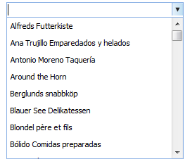

::: {style="DISPLAY: none"}
{#d2h_url_template}{#d2h_package_url style="WIDTH: 0px; DISPLAY: none; HEIGHT: 0px"}
:::

::::::::: {.d2h_secondary_topic style="PADDING-BOTTOM: 10pt; MARGIN: 0pt; PADDING-LEFT: 0pt; PADDING-RIGHT: 0pt; PADDING-TOP: 0pt"}
#### Client-Side Filtering {#client-side-filtering style="tab-stops: 0pt"}

**Client data fetching** allows us to filter data without post actions. The AutoComplete filtering takes place on the client side; to achieve this functionality the data source should set to **AutocompleteTextBox**.

 

Use Case Scenarios

This feature will allow you to do client-side data fetching by giving the data to the AutoComplete text box on load.

This increases the performance without post actions.

Properties

+-------------------------------------+-------------------------------------------------------------+----------------------------------------+-----------------------------------------------------------------------------------+
| **Property**                        | **Description**                                             | **Type**                               | **Data Type**                                                                     |
+-------------------------------------+-------------------------------------------------------------+----------------------------------------+-----------------------------------------------------------------------------------+
| DataFetch[]{style="COLOR: #c00000"} | Specifies the client- or server-side data fetching.         | Server side []{style="COLOR: #c00000"} | AutocompleteTextBoxModel. DataFetchList, Client/Server[ ]{style="COLOR: #c00000"} |
|                                     |                                                             |                                        |                                                                                   |
|                                     | The default value is server-side.[]{style="COLOR: #c00000"} |                                        |                                                                                   |
+-------------------------------------+-------------------------------------------------------------+----------------------------------------+-----------------------------------------------------------------------------------+
| DataSource                          | Specifies the IEnumerable data.                             | Server side                            | IEnumerable                                                                       |
|                                     |                                                             |                                        |                                                                                   |
|                                     |                                                             |                                        |                                                                                   |
+-------------------------------------+-------------------------------------------------------------+----------------------------------------+-----------------------------------------------------------------------------------+

[]{style="FONT-FAMILY: 'Calibri','sans-serif'; COLOR: black"} 

Events

  **[Event ]{style="COLOR: black"}**[]{style="COLOR: black"}   **[Description ]{style="COLOR: black"}**[]{style="COLOR: black"}   **[Arguments ]{style="COLOR: black"}**[]{style="COLOR: black"}   **[Type ]{style="COLOR: black"}**[]{style="COLOR: black"}
  ------------------------------------------------------------ ------------------------------------------------------------------ ---------------------------------------------------------------- -----------------------------------------------------------
  ClientSideOnFiltering                                        This event will trigger on client-side data fetching.              String                                                           Client side

[]{style="FONT-FAMILY: 'Calibri','sans-serif'; COLOR: black"}[]{style="COLOR: #c00000"} 

Sample Link

To view a sample:

1.   Open the **Tools Sample Browser** from the dashboard. Refer to the Samples and Location chapter.

2.  Navigate to **Tools.MVC** \> **AutoComplete Textbox** \> **Client Side Data Filtering**.

 

Adding AutoComplete Client-Side Filtering to an Application

Using AutocompleteTextBoxBuilder

To fetch data on the client-side by using AutocompleteTextBoxBuilder:

1.   Create a strongly typed view.

2.   Set the **DataFetch** method with **DataFetchList** and the **DataSource** with **IEnumerable** data.

 

::: {align="center"}
+-------------------------------------------------------------------------------------------------------------------------------------------------------------------------------------------------+
| **[Controller]{style="FONT-FAMILY: 'Courier New'"}[]{style="FONT-FAMILY: 'Courier New'"}**                                                                                                      |
|                                                                                                                                                                                                 |
| [        [public]{style="COLOR: blue"} [ActionResult]{style="COLOR: #2b91af"} ClientDataFiltering()]{style="FONT-FAMILY: Consolas; FONT-SIZE: 9.5pt"}                                           |
|                                                                                                                                                                                                 |
| [        {]{style="FONT-FAMILY: Consolas; FONT-SIZE: 9.5pt"}                                                                                                                                    |
|                                                                                                                                                                                                 |
| [            [Northwind]{style="COLOR: #2b91af"} context = SqlCE;]{style="FONT-FAMILY: Consolas; FONT-SIZE: 9.5pt"}                                                                             |
|                                                                                                                                                                                                 |
| [            [IEnumerable]{style="COLOR: #2b91af"} data =  [from]{style="COLOR: blue"} suggestion [in]{style="COLOR: blue"} context.Customers]{style="FONT-FAMILY: Consolas; FONT-SIZE: 9.5pt"} |
|                                                                                                                                                                                                 |
| [                             [select]{style="COLOR: blue"} suggestion.CustomerID;]{style="FONT-FAMILY: Consolas; FONT-SIZE: 9.5pt"}                                                            |
|                                                                                                                                                                                                 |
| []{style="FONT-FAMILY: Consolas; FONT-SIZE: 9.5pt"}                                                                                                                                             |
|                                                                                                                                                                                                 |
| [            [return]{style="COLOR: blue"} View(data);]{style="FONT-FAMILY: Consolas; FONT-SIZE: 9.5pt"}                                                                                        |
|                                                                                                                                                                                                 |
| [        }]{style="FONT-FAMILY: Consolas; FONT-SIZE: 9.5pt"}                                                                                                                                    |
|                                                                                                                                                                                                 |
| []{style="FONT-FAMILY: 'Courier New'"}                                                                                                                                                          |
+-------------------------------------------------------------------------------------------------------------------------------------------------------------------------------------------------+
:::

 

::: {align="center"}
+-------------------------------------------------------------------------------------------------------------------------------------------------------------------------------------------------------------------------------------------------------------------------------------------------------------------------------------------------------------------------------------------------------------------+
| **[\[ASPX\]]{style="FONT-FAMILY: 'Courier New'"}**                                                                                                                                                                                                                                                                                                                                                                |
|                                                                                                                                                                                                                                                                                                                                                                                                                   |
| **[]{style="FONT-FAMILY: 'Courier New'"}**                                                                                                                                                                                                                                                                                                                                                                        |
|                                                                                                                                                                                                                                                                                                                                                                                                                   |
| [\<%]{style="FONT-FAMILY: Consolas; BACKGROUND: yellow; FONT-SIZE: 9.5pt"}[=]{style="FONT-FAMILY: Consolas; COLOR: blue; FONT-SIZE: 9.5pt"}[Html.Syncfusion().AutocompleteTextBox([\"myAutocomplete\"]{style="COLOR: #a31515"}) .DataFetch([AutocompleteTextBoxModel]{style="COLOR: #2b91af"}.[DataFetchList]{style="COLOR: #2b91af"}.Client).DataSource(Model)]{style="FONT-FAMILY: Consolas; FONT-SIZE: 9.5pt"} |
|                                                                                                                                                                                                                                                                                                                                                                                                                   |
| [%\>]{style="FONT-FAMILY: 'Courier New'; BACKGROUND: yellow"}[]{style="FONT-FAMILY: 'Courier New'"}                                                                                                                                                                                                                                                                                                               |
|                                                                                                                                                                                                                                                                                                                                                                                                                   |
| []{style="FONT-FAMILY: 'Courier New'"}                                                                                                                                                                                                                                                                                                                                                                            |
+-------------------------------------------------------------------------------------------------------------------------------------------------------------------------------------------------------------------------------------------------------------------------------------------------------------------------------------------------------------------------------------------------------------------+
:::

 

::: {align="center"}
+--------------------------------------------------------------------------------------------------------------------------------------------------------------------------------------------------------------------------------------------------------------------------------------------------------------------------------------------------------------------------+
| **[\[Razor\]]{style="FONT-FAMILY: 'Courier New'"}**                                                                                                                                                                                                                                                                                                                      |
|                                                                                                                                                                                                                                                                                                                                                                          |
| [@]{style="FONT-FAMILY: 'Courier New'; BACKGROUND: yellow"}[Html.Syncfusion().AutocompleteTextBox([\"myAutocomplete\"]{style="COLOR: #a31515"}) .DataFetch([AutocompleteTextBoxModel]{style="COLOR: #2b91af"}.[DataFetchList]{style="COLOR: #2b91af"}.Client).DataSource(Model)]{style="FONT-FAMILY: Consolas; FONT-SIZE: 9.5pt"}[ ]{style="FONT-FAMILY: 'Courier New'"} |
+--------------------------------------------------------------------------------------------------------------------------------------------------------------------------------------------------------------------------------------------------------------------------------------------------------------------------------------------------------------------------+
:::

 

3.   Build and run the application.

{border="0"} 

Figure 65: AutoComplete---Client-side Data Fetching

 

Using AutocompleteTextBoxModel

To fetch data on the client-side by using AutocompleteTextBoxModel:

1.   In the **controller**, create an object for the **AutocompleteTextBoxModel** class.

2.   Set the **DataFetch** method with **DataFetchList** and the **DataSource** with **IEnumerable** data.

 

::: {align="center"}
+--------------------------------------------------------------------------------------------------------------------------------------------------------------------------------------------------------------+
| **[Controller]{style="FONT-FAMILY: 'Courier New'"}[]{style="FONT-FAMILY: 'Courier New'"}**                                                                                                                   |
|                                                                                                                                                                                                              |
| [        [public]{style="COLOR: blue"} [ActionResult]{style="COLOR: #2b91af"} ClientDataFiltering()]{style="FONT-FAMILY: Consolas; FONT-SIZE: 9.5pt"}                                                        |
|                                                                                                                                                                                                              |
| [        {]{style="FONT-FAMILY: Consolas; FONT-SIZE: 9.5pt"}                                                                                                                                                 |
|                                                                                                                                                                                                              |
| [            [AutocompleteTextBoxModel]{style="COLOR: #2b91af"} myModel = [new]{style="COLOR: blue"} [AutocompleteTextBoxModel]{style="COLOR: #2b91af"}();]{style="FONT-FAMILY: Consolas; FONT-SIZE: 9.5pt"} |
|                                                                                                                                                                                                              |
| [            [Northwind]{style="COLOR: #2b91af"} context = SqlCE;]{style="FONT-FAMILY: Consolas; FONT-SIZE: 9.5pt"}                                                                                          |
|                                                                                                                                                                                                              |
| [            [var]{style="COLOR: blue"} dataSource = [from]{style="COLOR: blue"} suggestion [in]{style="COLOR: blue"} context.Customers]{style="FONT-FAMILY: Consolas; FONT-SIZE: 9.5pt"}                    |
|                                                                                                                                                                                                              |
| [                             [select]{style="COLOR: blue"} suggestion.CustomerID;]{style="FONT-FAMILY: Consolas; FONT-SIZE: 9.5pt"}                                                                         |
|                                                                                                                                                                                                              |
| [            myModel.DataFetch = [AutocompleteTextBoxModel]{style="COLOR: #2b91af"}.[DataFetchList]{style="COLOR: #2b91af"}.Client]{style="FONT-FAMILY: Consolas; FONT-SIZE: 9.5pt"}                         |
|                                                                                                                                                                                                              |
| [            myModel.DataSource = dataSource;]{style="FONT-FAMILY: Consolas; FONT-SIZE: 9.5pt"}                                                                                                              |
|                                                                                                                                                                                                              |
| [            ViewData\[[\"myAutocomplete\"]{style="COLOR: #a31515"}\] = myModel;]{style="FONT-FAMILY: Consolas; FONT-SIZE: 9.5pt"}                                                                           |
|                                                                                                                                                                                                              |
| []{style="FONT-FAMILY: Consolas; FONT-SIZE: 9.5pt"}                                                                                                                                                          |
|                                                                                                                                                                                                              |
| [            [return]{style="COLOR: blue"} View();]{style="FONT-FAMILY: Consolas; FONT-SIZE: 9.5pt"}                                                                                                         |
|                                                                                                                                                                                                              |
| [        }]{style="FONT-FAMILY: Consolas; FONT-SIZE: 9.5pt"}                                                                                                                                                 |
|                                                                                                                                                                                                              |
| []{style="FONT-FAMILY: 'Courier New'"}                                                                                                                                                                       |
+--------------------------------------------------------------------------------------------------------------------------------------------------------------------------------------------------------------+
:::

**[]{style="FONT-FAMILY: 'Calibri','sans-serif'"}** 

3.   Create a **view**.

4.   In the **view**, invoke the **AutocompleteTextBox** helper with the control ID.

5.   From the **ViewData**, assign the **AutocompleteTextBoxModel** class to the **AutocompleteTextBox** helper.

::: {align="center"}
+--------------------------------------------------------------------------------------------------------------------------------------------------------------------------------------------------------------------------------------------------------------------------------------------------------------------------------------------------------------------------------------+
| **[\[ASPX\]]{style="FONT-FAMILY: 'Courier New'"}**                                                                                                                                                                                                                                                                                                                                   |
|                                                                                                                                                                                                                                                                                                                                                                                      |
| **[]{style="FONT-FAMILY: 'Courier New'"}**                                                                                                                                                                                                                                                                                                                                           |
|                                                                                                                                                                                                                                                                                                                                                                                      |
| [\<%]{style="FONT-FAMILY: Consolas; BACKGROUND: yellow; FONT-SIZE: 9.5pt"}[=]{style="FONT-FAMILY: Consolas; COLOR: blue; FONT-SIZE: 9.5pt"}[Html.Syncfusion().AutocompleteTextBox([\"myAutocomplete\"]{style="COLOR: #a31515"})]{style="FONT-FAMILY: Consolas; FONT-SIZE: 9.5pt"}[%\>]{style="FONT-FAMILY: 'Courier New'; BACKGROUND: yellow"}[]{style="FONT-FAMILY: 'Courier New'"} |
|                                                                                                                                                                                                                                                                                                                                                                                      |
| []{style="FONT-FAMILY: 'Courier New'"}                                                                                                                                                                                                                                                                                                                                               |
+--------------------------------------------------------------------------------------------------------------------------------------------------------------------------------------------------------------------------------------------------------------------------------------------------------------------------------------------------------------------------------------+
:::

 

::: {align="center"}
+-----------------------------------------------------------------------------------------------------------------------------------------------------------------------------------------------------------------------------------------+
| **[\[Razor\]]{style="FONT-FAMILY: 'Courier New'"}**                                                                                                                                                                                     |
|                                                                                                                                                                                                                                         |
| **[]{style="FONT-FAMILY: 'Courier New'"}**                                                                                                                                                                                              |
|                                                                                                                                                                                                                                         |
| [@]{style="FONT-FAMILY: 'Courier New'; BACKGROUND: yellow"}[Html.Syncfusion().AutocompleteTextBox([\"myAutocomplete\"]{style="COLOR: #a31515"})]{style="FONT-FAMILY: Consolas; FONT-SIZE: 9.5pt"}[]{style="FONT-FAMILY: 'Courier New'"} |
|                                                                                                                                                                                                                                         |
| []{style="FONT-FAMILY: 'Courier New'"}                                                                                                                                                                                                  |
+-----------------------------------------------------------------------------------------------------------------------------------------------------------------------------------------------------------------------------------------+
:::

[]{style="FONT-FAMILY: Consolas; BACKGROUND: yellow; FONT-SIZE: 9.5pt"} 

6.   Build and run the application.

{border="0"} 

Figure 66: AutoComplete TextBox---Client-Side Filtering

[]{#related-topics}
:::::::::
