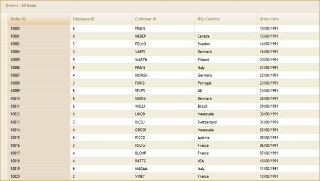
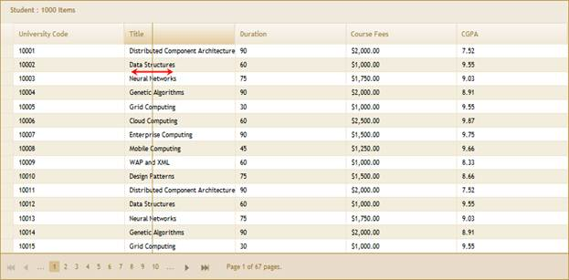
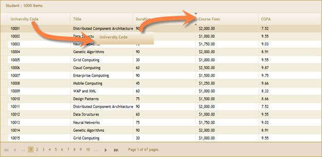

::: {style="DISPLAY: none"}
{#d2h_url_template}{#d2h_package_url style="WIDTH: 0px; DISPLAY: none; HEIGHT: 0px"}
:::

::::: {#nsbanner .d2h_main_nsbanner style="BORDER-BOTTOM: #999999 1px solid; POSITION: relative; PADDING-BOTTOM: 0px; BACKGROUND-COLOR: transparent; PADDING-LEFT: 0px; PADDING-RIGHT: 0px; DISPLAY: none; BORDER-TOP: #999999 1px solid; PADDING-TOP: 0px; LEFT: 0px"}
:::: {#TitleRow .d2h_main_titlerow style="PADDING-BOTTOM: 4px; BACKGROUND-COLOR: transparent; PADDING-LEFT: 22px; WIDTH: 100%; PADDING-RIGHT: 10px; DISPLAY: none; PADDING-TOP: 4px"}
::: {#ienav .d2h_main_ienav style="DISPLAY: none"}
{#D2HPrevious .D2HPreviousEnabled}  {#D2HNext .D2HNextEnabled}
:::
::::
:::::

:::: {#nstext .d2h_main_nstext style="PADDING-BOTTOM: 10px; BACKGROUND-COLOR: transparent; PADDING-LEFT: 22px; PADDING-RIGHT: 10px; HEIGHT: 100%; OVERFLOW: auto; PADDING-TOP: 5px" hasuserbackground="true" valign="bottom"}
::: {#d2h_breadcrumbs .d2h_breadcrumbs}
[Essential Studio User Guide Documentation](ms-xhelp:///?Id=12457748-09e3-4d74-a240-8e049cedf030){.d2h_breadcrumbsNormal}[ \> ]{.d2h_breadcrumbsLinkSeparator}[User Interface Edition](ms-xhelp:///?Id=c29296b7-531c-413b-a0ec-488ca1f7f669){.d2h_breadcrumbsNormal}[ \> ]{.d2h_breadcrumbsLinkSeparator}[Essential ASP.NET MVC](ms-xhelp:///?Id=4b14e7d1-65c4-4f67-b1aa-2c37709905a5){.d2h_breadcrumbsNormal}[ \> ]{.d2h_breadcrumbsLinkSeparator}[Essential Grid]{.d2h_breadcrumbsContentsOnly}[ \> ]{.d2h_breadcrumbsLinkSeparator}[Getting Started](ms-xhelp:///?Id=c7ed3902-b25b-4170-be58-1d3d0b57748a){.d2h_breadcrumbsNormal}[ \> ]{.d2h_breadcrumbsLinkSeparator}[Feature Summary](ms-xhelp:///?Id=1923e679-441a-44e0-9bca-e0e50988a857){.d2h_breadcrumbsNormal}
:::

### Client-Side Interactivity {#client-side-interactivity style="tab-stops: 0pt"}

 

Essential Grid has several client-side interactions to enhance the end-user experience. See[ Client-Side Events and Methods]{style="COLOR: windowtext"}.

**a.   Selection**

Essential Grid has client-side interaction options to select a single row, a group or rows or the whole grid. For details, see [Selection]{style="COLOR: windowtext"}.

 

{border="0"}

Figure 80: Selecting a Column**[]{style="FONT-STYLE: normal"}**

**** 

**** 

**** 

**b.   Column resizing**

Essential Grid\'s column widths can be interactively adjusted by dragging and resizing the desired columns.

{border="0"}

Figure 81: Column Resizing

 

**c.   Drag-and-drop support:**

Essential Grid\'s column positions can be re-arranged by dragging a desired column header to a new location. Cue arrows provide hints about the destination location.

 

{border="0"}

Figure 82: Column Drag-and-Drop

[]{#related-topics}
::::
