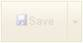
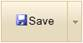

::: {style="DISPLAY: none"}
{#d2h_url_template}{#d2h_package_url style="WIDTH: 0px; DISPLAY: none; HEIGHT: 0px"}
:::

::: {.d2h_secondary_topic style="PADDING-BOTTOM: 10pt; MARGIN: 0pt; PADDING-LEFT: 0pt; PADDING-RIGHT: 0pt; PADDING-TOP: 0pt"}
#### Client-Side Methods {#client-side-methods style="tab-stops: 0pt"}

The Split-Button supports a set of Client-Side methods to control its behavior.

 

Use Case Scenarios

It allows for easy customization of the behavior of the Split-Button.

 

Adding Client-Side Methods[ ]{style="COLOR: red"}to an Application

The following steps guides you in using the Client-Side methods.

1.   In **View**, invoke the **SplitButton** helper with the button id as the first argument followed by their methods.

[]{style="FONT-FAMILY: 'Myriad Pro','sans-serif'"} 

[]{style="FONT-FAMILY: 'Myriad Pro','sans-serif'"} 

+------------------------------------------------------------------------------------------------------------------------------------------------------------------------------------+
| **[View\[aspx\]]{style="FONT-FAMILY: 'Courier New'"}**                                                                                                                             |
|                                                                                                                                                                                    |
| [        [\<%]{style="BACKGROUND: yellow"}[=]{style="COLOR: blue"}Html.Syncfusion().SplitButton([\"mySplitButton \"]{style="COLOR: #a31515"})]{style="FONT-FAMILY: 'Courier New'"} |
|                                                                                                                                                                                    |
| [        .Text([\"Save\"]{style="COLOR: #a31515"})]{style="FONT-FAMILY: 'Courier New'"}                                                                                            |
|                                                                                                                                                                                    |
| [        .Skin([Skins]{style="COLOR: #2b91af"}.Almond)]{style="FONT-FAMILY: 'Courier New'"}                                                                                        |
|                                                                                                                                                                                    |
| [        .IsChecked = [true]{style="COLOR: blue"},]{style="FONT-FAMILY: 'Courier New'"}                                                                                            |
|                                                                                                                                                                                    |
| [        .ImageUrl([\"Content/icon_save.png\"]{style="COLOR: #a31515"})]{style="FONT-FAMILY: 'Courier New'"}                                                                       |
|                                                                                                                                                                                    |
| [        .ContentType([ContentTypes]{style="COLOR: #2b91af"}.TextAndImage)]{style="FONT-FAMILY: 'Courier New'"}                                                                    |
|                                                                                                                                                                                    |
| [        [%\>]{style="BACKGROUND: yellow"}]{style="FONT-FAMILY: 'Courier New'"}                                                                                                    |
+------------------------------------------------------------------------------------------------------------------------------------------------------------------------------------+

 

[]{style="FONT-FAMILY: 'Myriad Pro','sans-serif'"} 

+------------------------------------------------------------------------------------------------------------------------------------------------------------------------------------+
| **[View\[cshtml\]]{style="FONT-FAMILY: 'Courier New'"}**                                                                                                                           |
|                                                                                                                                                                                    |
| [        [\@{]{style="BACKGROUND: yellow"}[ ]{style="COLOR: blue"}Html.Syncfusion().SplitButton([\"mySplitButton \"]{style="COLOR: #a31515"})]{style="FONT-FAMILY: 'Courier New'"} |
|                                                                                                                                                                                    |
| [        .Text([\"Save\"]{style="COLOR: #a31515"})]{style="FONT-FAMILY: 'Courier New'"}                                                                                            |
|                                                                                                                                                                                    |
| [        .Skin([Skins]{style="COLOR: #2b91af"}.Almond)]{style="FONT-FAMILY: 'Courier New'"}                                                                                        |
|                                                                                                                                                                                    |
| [        .IsChecked = [true]{style="COLOR: blue"},]{style="FONT-FAMILY: 'Courier New'"}                                                                                            |
|                                                                                                                                                                                    |
| [        .ImageUrl([\"Content/icon_save.png\"]{style="COLOR: #a31515"})]{style="FONT-FAMILY: 'Courier New'"}                                                                       |
|                                                                                                                                                                                    |
| [        .ContentType([ContentTypes]{style="COLOR: #2b91af"}.TextAndImage)]{style="FONT-FAMILY: 'Courier New'"}                                                                    |
|                                                                                                                                                                                    |
| [        .Render();]{style="FONT-FAMILY: 'Courier New'"}                                                                                                                           |
|                                                                                                                                                                                    |
| [        [}]{style="BACKGROUND: yellow"}]{style="FONT-FAMILY: 'Courier New'"}                                                                                                      |
+------------------------------------------------------------------------------------------------------------------------------------------------------------------------------------+

 

 

2.   In Javascript, use the methods to enable and disable an item as follows.

 

+-------------------------------------------------------------------------------------------------------------------------------------------------------------------------------------------------------------------------------------------------------------------------------------------------------------------------------------------------------------------------------------------------------------------------------------+
| **[\[Javascript\]]{style="FONT-FAMILY: 'Courier New'"}**[]{style="FONT-FAMILY: 'Courier New'"}                                                                                                                                                                                                                                                                                                                                      |
|                                                                                                                                                                                                                                                                                                                                                                                                                                     |
| [\<]{style="FONT-FAMILY: 'Courier New'; COLOR: blue"}[script]{style="FONT-FAMILY: 'Courier New'; COLOR: #a31515"}[ [type]{style="COLOR: red"}[=\"text/javascript\"\>]{style="COLOR: blue"}]{style="FONT-FAMILY: 'Courier New'"}                                                                                                                                                                                                     |
|                                                                                                                                                                                                                                                                                                                                                                                                                                     |
| [        [function]{style="COLOR: blue"} DisableButton() {]{style="FONT-FAMILY: 'Courier New'"}                                                                                                                                                                                                                                                                                                                                     |
|                                                                                                                                                                                                                                                                                                                                                                                                                                     |
| [            [// Code to disable the Button.]{style="COLOR: green"}]{style="FONT-FAMILY: 'Courier New'"}                                                                                                                                                                                                                                                                                                                            |
|                                                                                                                                                                                                                                                                                                                                                                                                                                     |
| [            \$find([\"]{style="COLOR: #a31515"}]{style="FONT-FAMILY: 'Courier New'"}[mySplitButton]{style="FONT-FAMILY: 'Courier New'; COLOR: #a31515"}[\"]{style="FONT-FAMILY: 'Courier New'; COLOR: #a31515"}[).Disable();]{style="FONT-FAMILY: 'Courier New'"}                                                                                                                                                                  |
|                                                                                                                                                                                                                                                                                                                                                                                                                                     |
| [        }]{style="FONT-FAMILY: 'Courier New'"}                                                                                                                                                                                                                                                                                                                                                                                     |
|                                                                                                                                                                                                                                                                                                                                                                                                                                     |
| [        [function]{style="COLOR: blue"} EnableButton() {]{style="FONT-FAMILY: 'Courier New'"}                                                                                                                                                                                                                                                                                                                                      |
|                                                                                                                                                                                                                                                                                                                                                                                                                                     |
| [            [// Code to enable the Button.]{style="COLOR: green"}]{style="FONT-FAMILY: 'Courier New'"}                                                                                                                                                                                                                                                                                                                             |
|                                                                                                                                                                                                                                                                                                                                                                                                                                     |
| [            \$find([\"]{style="COLOR: #a31515"}]{style="FONT-FAMILY: 'Courier New'"}[mySplitButton]{style="FONT-FAMILY: 'Courier New'; COLOR: #a31515"}[\"]{style="FONT-FAMILY: 'Courier New'; COLOR: #a31515"}[).Enable();]{style="FONT-FAMILY: 'Courier New'"}                                                                                                                                                                   |
|                                                                                                                                                                                                                                                                                                                                                                                                                                     |
| [        }]{style="FONT-FAMILY: 'Courier New'"}                                                                                                                                                                                                                                                                                                                                                                                     |
|                                                                                                                                                                                                                                                                                                                                                                                                                                     |
| [        [function]{style="COLOR: blue"} DisableItem() {]{style="FONT-FAMILY: 'Courier New'"}                                                                                                                                                                                                                                                                                                                                       |
|                                                                                                                                                                                                                                                                                                                                                                                                                                     |
| [            [// Code to disable an item passing the ID as a parameter.]{style="COLOR: green"}]{style="FONT-FAMILY: 'Courier New'"}                                                                                                                                                                                                                                                                                                 |
|                                                                                                                                                                                                                                                                                                                                                                                                                                     |
| [            \$find([\"]{style="COLOR: #a31515"}]{style="FONT-FAMILY: 'Courier New'"}[mySplitButton]{style="FONT-FAMILY: 'Courier New'; COLOR: #a31515"}[\"]{style="FONT-FAMILY: 'Courier New'; COLOR: #a31515"}[).]{style="FONT-FAMILY: 'Courier New'"}[ DisableItembyID]{style="FONT-FAMILY: 'Courier New'"}[([\"Products\"]{style="COLOR: #a31515"});]{style="FONT-FAMILY: 'Courier New'"}[]{style="FONT-FAMILY: 'Courier New'"} |
|                                                                                                                                                                                                                                                                                                                                                                                                                                     |
| [        }]{style="FONT-FAMILY: 'Courier New'"}                                                                                                                                                                                                                                                                                                                                                                                     |
|                                                                                                                                                                                                                                                                                                                                                                                                                                     |
| [        [function]{style="COLOR: blue"} EnableItem() {]{style="FONT-FAMILY: 'Courier New'"}                                                                                                                                                                                                                                                                                                                                        |
|                                                                                                                                                                                                                                                                                                                                                                                                                                     |
| [            [// Code to enable an item passing the ID as a parameter.]{style="COLOR: green"}]{style="FONT-FAMILY: 'Courier New'"}                                                                                                                                                                                                                                                                                                  |
|                                                                                                                                                                                                                                                                                                                                                                                                                                     |
| [            \$find([\"myMenu\"]{style="COLOR: #a31515"}).]{style="FONT-FAMILY: 'Courier New'"}[ EnableItembyID]{style="FONT-FAMILY: 'Courier New'"}[([\"Products\"]{style="COLOR: #a31515"});]{style="FONT-FAMILY: 'Courier New'"}[]{style="FONT-FAMILY: 'Courier New'"}                                                                                                                                                           |
|                                                                                                                                                                                                                                                                                                                                                                                                                                     |
| [        }]{style="FONT-FAMILY: 'Courier New'"}                                                                                                                                                                                                                                                                                                                                                                                     |
|                                                                                                                                                                                                                                                                                                                                                                                                                                     |
| [ [\</]{style="COLOR: blue"}[script]{style="COLOR: #a31515"}[\>]{style="COLOR: blue"}]{style="FONT-FAMILY: 'Courier New'"}                                                                                                                                                                                                                                                                                                          |
|                                                                                                                                                                                                                                                                                                                                                                                                                                     |
| []{style="FONT-FAMILY: 'Courier New'; BACKGROUND: yellow"}                                                                                                                                                                                                                                                                                                                                                                          |
+-------------------------------------------------------------------------------------------------------------------------------------------------------------------------------------------------------------------------------------------------------------------------------------------------------------------------------------------------------------------------------------------------------------------------------------+

[]{style="FONT-FAMILY: 'Myriad Pro','sans-serif'"} 

3.   Run the application.

 

The output is shown in the following screenshot.

 

{border="0"}

Figure 251: Split-Button in a disabled state

{border="0"}

Figure 252: Split-Button in an enabled state

**Methods**

 

The following table illustrates the methods which describes the Client-Side methods of the Split-Button.

 

+-----------------+------------------------------------------------------------+---------------------------------------------+-----------+-------------+-----------------+
| Method          | Description                                                | Parameters                                  | Type      | Return Type | Reference links |
+-----------------+------------------------------------------------------------+---------------------------------------------+-----------+-------------+-----------------+
| DisableItembyID | Disables the specified drop-down item in the Split-Button. | itemToDisable -- DOM element to be disabled | Client    | \-          | \-              |
|                 |                                                            |                                             |           |             |                 |
|                 |                                                            |                                             |           |             |                 |
+-----------------+------------------------------------------------------------+---------------------------------------------+-----------+-------------+-----------------+
| EnableItembyID  | Enables the disabled item.                                 | itemToEnable -- DOM element to be enabled   | Client    | \-          | \-              |
|                 |                                                            |                                             |           |             |                 |
|                 |                                                            |                                             |           |             |                 |
+-----------------+------------------------------------------------------------+---------------------------------------------+-----------+-------------+-----------------+
| Disable         | Disables the button.                                       | \-                                          | Client    | \-          | \-              |
+-----------------+------------------------------------------------------------+---------------------------------------------+-----------+-------------+-----------------+
| Enable          | Enables the disabled button.                               | \-                                          | Client    | \-          | \-              |
+=================+============================================================+=============================================+===========+=============+=================+

[]{style="COLOR: black"} 

 

Sample Link

 

To view the samples, follow the steps below.

1.   Open the Tools sample browser from the dashboard. (Refer to the [Samples and Location]{.UGHyperlink} chapter)

2.   Navigate to **Tools.Mvc -\> Button -\> Client-Side API**.

 

[]{#related-topics}
:::
