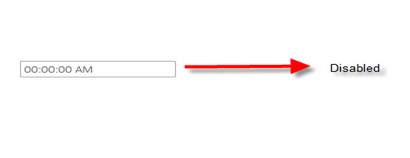
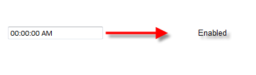
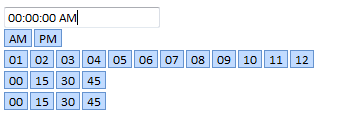

::: {style="DISPLAY: none"}
{#d2h_url_template}{#d2h_package_url style="WIDTH: 0px; DISPLAY: none; HEIGHT: 0px"}
:::

::::: {#nsbanner .d2h_main_nsbanner style="BORDER-BOTTOM: #999999 1px solid; POSITION: relative; PADDING-BOTTOM: 0px; BACKGROUND-COLOR: transparent; PADDING-LEFT: 0px; PADDING-RIGHT: 0px; DISPLAY: none; BORDER-TOP: #999999 1px solid; PADDING-TOP: 0px; LEFT: 0px"}
:::: {#TitleRow .d2h_main_titlerow style="PADDING-BOTTOM: 4px; BACKGROUND-COLOR: transparent; PADDING-LEFT: 22px; WIDTH: 100%; PADDING-RIGHT: 10px; DISPLAY: none; PADDING-TOP: 4px"}
::: {#ienav .d2h_main_ienav style="DISPLAY: none"}
{#D2HPrevious .D2HPreviousEnabled}  {#D2HNext .D2HNextEnabled}
:::
::::
:::::

:::: {#nstext .d2h_main_nstext style="PADDING-BOTTOM: 10px; BACKGROUND-COLOR: transparent; PADDING-LEFT: 22px; PADDING-RIGHT: 10px; HEIGHT: 100%; OVERFLOW: auto; PADDING-TOP: 5px" hasuserbackground="true" valign="bottom"}
::: {#d2h_breadcrumbs .d2h_breadcrumbs}
[Essential Studio User Guide Documentation](ms-xhelp:///?Id=12457748-09e3-4d74-a240-8e049cedf030){.d2h_breadcrumbsNormal}[ \> ]{.d2h_breadcrumbsLinkSeparator}[User Interface Edition](ms-xhelp:///?Id=c29296b7-531c-413b-a0ec-488ca1f7f669){.d2h_breadcrumbsNormal}[ \> ]{.d2h_breadcrumbsLinkSeparator}[Essential ASP.NET MVC](ms-xhelp:///?Id=4b14e7d1-65c4-4f67-b1aa-2c37709905a5){.d2h_breadcrumbsNormal}[ \> ]{.d2h_breadcrumbsLinkSeparator}[Essential Tools]{.d2h_breadcrumbsContentsOnly}[ \> ]{.d2h_breadcrumbsLinkSeparator}[Controls and Components](ms-xhelp:///?Id=f0af2fff-6f00-4ca4-85a6-54e41ac5dc96){.d2h_breadcrumbsNormal}[ \> ]{.d2h_breadcrumbsLinkSeparator}[TimePicker Control](ms-xhelp:///?Id=1a1de4ee-d424-4020-be0c-c7a526b2197a){.d2h_breadcrumbsNormal}
:::

### Client-Side Methods {#client-side-methods style="TEXT-JUSTIFY: inter-ideograph; TEXT-ALIGN: justify; TEXT-INDENT: -36pt; MARGIN-LEFT: 36pt; tab-stops: 36.0pt"}

[The following section details the client-side methods supported by the TimePicker control.]{style="BACKGROUND: white; COLOR: black"}

 

**Client-Side Methods**

+-----------------------+-----------------------+----------------------------------------------------------------------------+
| **Name**              | **Type**              | **Description**                                                            |
+-----------------------+-----------------------+----------------------------------------------------------------------------+
| Disable()             | Void                  | Used to set the TimePicker control in read-only mode.                      |
|                       |                       |                                                                            |
|                       |                       |                                                                            |
+-----------------------+-----------------------+----------------------------------------------------------------------------+
| Enable()              | Void                  | Used to enable the TimePicker control in active mode for user interaction. |
|                       |                       |                                                                            |
|                       |                       |                                                                            |
+-----------------------+-----------------------+----------------------------------------------------------------------------+
| Open()                | Void                  | Used to show the TimePicker control navigator.                             |
|                       |                       |                                                                            |
|                       |                       |                                                                            |
+-----------------------+-----------------------+----------------------------------------------------------------------------+
| Close()               | Void                  | Used to hide the TimePicker control navigator.                             |
+-----------------------+-----------------------+----------------------------------------------------------------------------+

###   {#section style="LINE-HEIGHT: 12pt; MARGIN: 10pt 0pt 0pt 36pt"}

**[Using Builder]{style="COLOR: black"}**

The following steps will guide you in handling client-side methods through Builder.

1.   In the **view**, invoke the **TimePicker** helper with the time picker ID as the first argument.

 

+--------------------------------------------------------------------------------------------------------------------------------------------------------------------------------------------------------------------------------------------------------------------------------------------------------------------------------------------------------------------------------------------+
| **[\[ASPX\]]{style="FONT-FAMILY: 'Courier New'"}**[]{style="FONT-FAMILY: 'Courier New'"}                                                                                                                                                                                                                                                                                                   |
|                                                                                                                                                                                                                                                                                                                                                                                            |
| []{style="FONT-FAMILY: 'Courier New'; BACKGROUND: yellow"}                                                                                                                                                                                                                                                                                                                                 |
|                                                                                                                                                                                                                                                                                                                                                                                            |
| [\<%]{style="FONT-FAMILY: 'Courier New'; BACKGROUND: yellow"}[=]{style="FONT-FAMILY: 'Courier New'; COLOR: blue"}[ Html.Syncfusion().TimePicker([\"TimePicker\"]{style="COLOR: #a31515"})]{style="FONT-FAMILY: Consolas; FONT-SIZE: 9.5pt"}**[ ]{style="FONT-FAMILY: 'Courier New'"}**[%\>]{style="FONT-FAMILY: 'Courier New'; BACKGROUND: yellow"}[ ]{style="FONT-FAMILY: 'Courier New'"} |
+--------------------------------------------------------------------------------------------------------------------------------------------------------------------------------------------------------------------------------------------------------------------------------------------------------------------------------------------------------------------------------------------+

 

+--------------------------------------------------------------------------------------------------------------------------------------------------------------------------------------------------------------------------------------------------+
| **[\[Razor\]]{style="FONT-FAMILY: 'Courier New'"}**[ ]{style="FONT-FAMILY: 'Courier New'"}                                                                                                                                                       |
|                                                                                                                                                                                                                                                  |
| [@(]{style="FONT-FAMILY: 'Courier New'; BACKGROUND: yellow"}[Html.Syncfusion().TimePicker([\"TimePicker\"]{style="COLOR: #a31515"})]{style="FONT-FAMILY: Consolas; FONT-SIZE: 9.5pt"}[)]{style="FONT-FAMILY: 'Courier New'; BACKGROUND: yellow"} |
|                                                                                                                                                                                                                                                  |
| []{style="FONT-FAMILY: 'Courier New'"}                                                                                                                                                                                                           |
+--------------------------------------------------------------------------------------------------------------------------------------------------------------------------------------------------------------------------------------------------+

[]{style="BACKGROUND: white; COLOR: black"}[]{style="COLOR: black"} 

2.   [In JavaScript, use the following methods]{style="BACKGROUND: white; COLOR: black"}.

 

+---------------------------------------------------------------------------------------------------------------------------------------------------------------------------------------------------------------------------------------------------------------------------------------------------------------------------------------------------------------------------+
| **[\[Javascript\]]{style="FONT-FAMILY: 'Courier New'"}**[]{style="FONT-FAMILY: 'Courier New'"}                                                                                                                                                                                                                                                                            |
|                                                                                                                                                                                                                                                                                                                                                                           |
|                                                                                                                                                                                                                                                                                                                                                                           |
|                                                                                                                                                                                                                                                                                                                                                                           |
| [\<]{style="FONT-FAMILY: 'Courier New'; COLOR: blue"}[script]{style="FONT-FAMILY: 'Courier New'; COLOR: #a31515"}[ [type]{style="COLOR: red"}[=\"text/javascript\"\>]{style="COLOR: blue"}]{style="FONT-FAMILY: 'Courier New'"}                                                                                                                                           |
|                                                                                                                                                                                                                                                                                                                                                                           |
| [       ]{style="FONT-FAMILY: 'Courier New'; COLOR: black"}[function]{style="FONT-FAMILY: 'Courier New'; COLOR: blue"}[ DisableTimePicker() {]{style="FONT-FAMILY: 'Courier New'; COLOR: black"}[]{style="COLOR: black"}                                                                                                                                                  |
|                                                                                                                                                                                                                                                                                                                                                                           |
| [            ]{style="FONT-FAMILY: 'Courier New'; COLOR: black"}[//Code to disable TimePicker control]{style="FONT-FAMILY: 'Courier New'; COLOR: green"}[]{style="COLOR: black"}                                                                                                                                                                                          |
|                                                                                                                                                                                                                                                                                                                                                                           |
| [            \$find(]{style="FONT-FAMILY: 'Courier New'; COLOR: black"}[\"]{style="FONT-FAMILY: 'Courier New'; COLOR: #a31515"}[TimePicker]{style="FONT-FAMILY: Consolas; COLOR: #a31515; FONT-SIZE: 9.5pt"}[ \"]{style="FONT-FAMILY: 'Courier New'; COLOR: #a31515"}[).Disable();            ]{style="FONT-FAMILY: 'Courier New'; COLOR: black"}[]{style="COLOR: black"} |
|                                                                                                                                                                                                                                                                                                                                                                           |
| [        }]{style="FONT-FAMILY: 'Courier New'; COLOR: black"}[]{style="COLOR: black"}                                                                                                                                                                                                                                                                                     |
|                                                                                                                                                                                                                                                                                                                                                                           |
| [        ]{style="FONT-FAMILY: 'Courier New'; COLOR: black"}[function]{style="FONT-FAMILY: 'Courier New'; COLOR: blue"}[ EnableTimePicker() {]{style="FONT-FAMILY: 'Courier New'; COLOR: black"}[]{style="COLOR: black"}                                                                                                                                                  |
|                                                                                                                                                                                                                                                                                                                                                                           |
| [            ]{style="FONT-FAMILY: 'Courier New'; COLOR: black"}[//Code to Enable TimePicker control]{style="FONT-FAMILY: 'Courier New'; COLOR: green"}[]{style="COLOR: black"}                                                                                                                                                                                           |
|                                                                                                                                                                                                                                                                                                                                                                           |
| [            \$find(]{style="FONT-FAMILY: 'Courier New'; COLOR: black"}[\"]{style="FONT-FAMILY: 'Courier New'; COLOR: #a31515"}[TimePicker]{style="FONT-FAMILY: Consolas; COLOR: #a31515; FONT-SIZE: 9.5pt"}[ \"]{style="FONT-FAMILY: 'Courier New'; COLOR: #a31515"}[).Enable(); ]{style="FONT-FAMILY: 'Courier New'; COLOR: black"}[]{style="COLOR: black"}             |
|                                                                                                                                                                                                                                                                                                                                                                           |
| [        }]{style="FONT-FAMILY: 'Courier New'; COLOR: black"}                                                                                                                                                                                                                                                                                                             |
|                                                                                                                                                                                                                                                                                                                                                                           |
| [        function]{style="FONT-FAMILY: 'Courier New'; COLOR: blue"}[ OpenTimePicker() {]{style="FONT-FAMILY: 'Courier New'; COLOR: black"}[]{style="COLOR: black"}                                                                                                                                                                                                        |
|                                                                                                                                                                                                                                                                                                                                                                           |
| [            ]{style="FONT-FAMILY: 'Courier New'; COLOR: black"}[//Code to Open TimePicker control]{style="FONT-FAMILY: 'Courier New'; COLOR: green"}[]{style="COLOR: black"}                                                                                                                                                                                             |
|                                                                                                                                                                                                                                                                                                                                                                           |
| [            \$find(]{style="FONT-FAMILY: 'Courier New'; COLOR: black"}[\"]{style="FONT-FAMILY: 'Courier New'; COLOR: #a31515"}[TimePicker]{style="FONT-FAMILY: Consolas; COLOR: #a31515; FONT-SIZE: 9.5pt"}[ \"]{style="FONT-FAMILY: 'Courier New'; COLOR: #a31515"}[).Open();            ]{style="FONT-FAMILY: 'Courier New'; COLOR: black"}[]{style="COLOR: black"}    |
|                                                                                                                                                                                                                                                                                                                                                                           |
| [        }]{style="FONT-FAMILY: 'Courier New'; COLOR: black"}[]{style="COLOR: black"}                                                                                                                                                                                                                                                                                     |
|                                                                                                                                                                                                                                                                                                                                                                           |
| [        ]{style="FONT-FAMILY: 'Courier New'; COLOR: black"}[function]{style="FONT-FAMILY: 'Courier New'; COLOR: blue"}[ CloseTimePicker() {]{style="FONT-FAMILY: 'Courier New'; COLOR: black"}[]{style="COLOR: black"}                                                                                                                                                   |
|                                                                                                                                                                                                                                                                                                                                                                           |
| [            ]{style="FONT-FAMILY: 'Courier New'; COLOR: black"}[//Code to Close TimePicker control]{style="FONT-FAMILY: 'Courier New'; COLOR: green"}[]{style="COLOR: black"}                                                                                                                                                                                            |
|                                                                                                                                                                                                                                                                                                                                                                           |
| [            \$find(]{style="FONT-FAMILY: 'Courier New'; COLOR: black"}[\"]{style="FONT-FAMILY: 'Courier New'; COLOR: #a31515"}[TimePicker]{style="FONT-FAMILY: Consolas; COLOR: #a31515; FONT-SIZE: 9.5pt"}[ \"]{style="FONT-FAMILY: 'Courier New'; COLOR: #a31515"}[).Close(); ]{style="FONT-FAMILY: 'Courier New'; COLOR: black"}[]{style="COLOR: black"}              |
|                                                                                                                                                                                                                                                                                                                                                                           |
| [        }]{style="FONT-FAMILY: 'Courier New'; COLOR: black"}[]{style="COLOR: black"}                                                                                                                                                                                                                                                                                     |
|                                                                                                                                                                                                                                                                                                                                                                           |
| []{style="COLOR: black"}                                                                                                                                                                                                                                                                                                                                                  |
|                                                                                                                                                                                                                                                                                                                                                                           |
|                                                                                                                                                                                                                                                                                                                                                                           |
|                                                                                                                                                                                                                                                                                                                                                                           |
| [       [\</]{style="BACKGROUND: #f0f0f0; COLOR: blue"}[script]{style="BACKGROUND: #f0f0f0; COLOR: #a31515"}[\>]{style="BACKGROUND: #f0f0f0; COLOR: blue"} ]{style="FONT-FAMILY: 'Courier New'"}[ ]{style="FONT-FAMILY: 'Times New Roman','serif'; FONT-SIZE: 12pt"}                                                                                                      |
+---------------------------------------------------------------------------------------------------------------------------------------------------------------------------------------------------------------------------------------------------------------------------------------------------------------------------------------------------------------------------+

 

Using Properties Model       

[The following steps will guide you in handling client-side methods through the properties model.]{style="COLOR: black"}

[1.  In the **controller**, create an instance of **TimePickerModel** and pass the instance through **view-specific data** to the **view** as given below.]{style="COLOR: black"}

 

+-----------------------------------------------------------------------------------------------------------------------------------------------------------------------------------------------------------------------------------+
| **[Controller]{style="FONT-FAMILY: 'Courier New'"}**[]{style="FONT-FAMILY: 'Courier New'"}                                                                                                                                        |
|                                                                                                                                                                                                                                   |
|                                                                                                                                                                                                                                   |
|                                                                                                                                                                                                                                   |
| [public]{style="FONT-FAMILY: 'Courier New'; COLOR: blue"}[ [ActionResult]{style="COLOR: #2b91af"} Index()]{style="FONT-FAMILY: 'Courier New'"}                                                                                    |
|                                                                                                                                                                                                                                   |
| [        {]{style="FONT-FAMILY: 'Courier New'"}                                                                                                                                                                                   |
|                                                                                                                                                                                                                                   |
| [            [TimePicker]{style="COLOR: #4bacc6"}[Model]{style="COLOR: #2b91af"} myModel = [new]{style="COLOR: blue"} [TimePicker]{style="COLOR: #4bacc6"}[Model]{style="COLOR: #2b91af"}();]{style="FONT-FAMILY: 'Courier New'"} |
|                                                                                                                                                                                                                                   |
| [            ViewData\[[\"myModel\"]{style="COLOR: #a31515"}\] = myModel;]{style="FONT-FAMILY: 'Courier New'"}                                                                                                                    |
|                                                                                                                                                                                                                                   |
| [            [return]{style="COLOR: blue"} View();]{style="FONT-FAMILY: 'Courier New'"}                                                                                                                                           |
|                                                                                                                                                                                                                                   |
| [        }]{style="FONT-FAMILY: 'Courier New'"}                                                                                                                                                                                   |
|                                                                                                                                                                                                                                   |
| []{style="FONT-FAMILY: 'Times New Roman','serif'; FONT-SIZE: 12pt"}                                                                                                                                                               |
+-----------------------------------------------------------------------------------------------------------------------------------------------------------------------------------------------------------------------------------+

 

+--------------------------------------------------------------------------------------------------------------------------------------------------------------------------------------------------------------------------------------------------------------------------------------------------------------------------------------------------------------------------------------------------------------------------------------------------------------------------------------------------------------------------------------------------------------------------------------------------------------------------------------------------------------------+
| **[\[ASPX\]]{style="FONT-FAMILY: 'Courier New'"}**                                                                                                                                                                                                                                                                                                                                                                                                                                                                                                                                                                                                                 |
|                                                                                                                                                                                                                                                                                                                                                                                                                                                                                                                                                                                                                                                                    |
| []{style="FONT-FAMILY: 'Courier New'"}                                                                                                                                                                                                                                                                                                                                                                                                                                                                                                                                                                                                                             |
|                                                                                                                                                                                                                                                                                                                                                                                                                                                                                                                                                                                                                                                                    |
| [\<%]{style="FONT-FAMILY: 'Courier New'; BACKGROUND: yellow"}[=]{style="FONT-FAMILY: 'Courier New'; COLOR: blue"}[Html.Syncfusion().TimePicker([\"TimePicker\"]{style="COLOR: #a31515"},([TimePickerModel]{style="COLOR: #4bacc6"})ViewData\[[\"]{style="COLOR: #a31515"}]{style="FONT-FAMILY: Consolas; FONT-SIZE: 9.5pt"}[myModel]{style="FONT-FAMILY: 'Courier New'; COLOR: #a31515"}[\"]{style="FONT-FAMILY: Consolas; COLOR: #a31515; FONT-SIZE: 9.5pt"}[\])]{style="FONT-FAMILY: Consolas; FONT-SIZE: 9.5pt"}**[ ]{style="FONT-FAMILY: 'Courier New'"}**[%\>]{style="FONT-FAMILY: 'Courier New'; BACKGROUND: yellow"}[ ]{style="FONT-FAMILY: 'Courier New'"} |
+--------------------------------------------------------------------------------------------------------------------------------------------------------------------------------------------------------------------------------------------------------------------------------------------------------------------------------------------------------------------------------------------------------------------------------------------------------------------------------------------------------------------------------------------------------------------------------------------------------------------------------------------------------------------+

[]{style="COLOR: black"} 

2.   [In JavaScript, use the following methods]{style="BACKGROUND: white; COLOR: black"}.

 

+---------------------------------------------------------------------------------------------------------------------------------------------------------------------------------------------------------------------------------------------------------------------------------------------------------------------------------------------------------------------------+
| **[\[JavaScript\]]{style="FONT-FAMILY: 'Courier New'"}**[]{style="FONT-FAMILY: 'Courier New'"}                                                                                                                                                                                                                                                                            |
|                                                                                                                                                                                                                                                                                                                                                                           |
|                                                                                                                                                                                                                                                                                                                                                                           |
|                                                                                                                                                                                                                                                                                                                                                                           |
| [\<]{style="FONT-FAMILY: 'Courier New'; COLOR: blue"}[script]{style="FONT-FAMILY: 'Courier New'; COLOR: #a31515"}[ [type]{style="COLOR: red"}[=\"text/javascript\"\>]{style="COLOR: blue"}]{style="FONT-FAMILY: 'Courier New'"}                                                                                                                                           |
|                                                                                                                                                                                                                                                                                                                                                                           |
| [       ]{style="FONT-FAMILY: 'Courier New'; COLOR: black"}[function]{style="FONT-FAMILY: 'Courier New'; COLOR: blue"}[ DisableTimePicker() {]{style="FONT-FAMILY: 'Courier New'; COLOR: black"}[]{style="COLOR: black"}                                                                                                                                                  |
|                                                                                                                                                                                                                                                                                                                                                                           |
| [            ]{style="FONT-FAMILY: 'Courier New'; COLOR: black"}[//Code to disable TimePicker control]{style="FONT-FAMILY: 'Courier New'; COLOR: green"}[]{style="COLOR: black"}                                                                                                                                                                                          |
|                                                                                                                                                                                                                                                                                                                                                                           |
| [            \$find(]{style="FONT-FAMILY: 'Courier New'; COLOR: black"}[\"]{style="FONT-FAMILY: 'Courier New'; COLOR: #a31515"}[TimePicker]{style="FONT-FAMILY: Consolas; COLOR: #a31515; FONT-SIZE: 9.5pt"}[ \"]{style="FONT-FAMILY: 'Courier New'; COLOR: #a31515"}[).Disable();            ]{style="FONT-FAMILY: 'Courier New'; COLOR: black"}[]{style="COLOR: black"} |
|                                                                                                                                                                                                                                                                                                                                                                           |
| [        }]{style="FONT-FAMILY: 'Courier New'; COLOR: black"}[]{style="COLOR: black"}                                                                                                                                                                                                                                                                                     |
|                                                                                                                                                                                                                                                                                                                                                                           |
| [        ]{style="FONT-FAMILY: 'Courier New'; COLOR: black"}[function]{style="FONT-FAMILY: 'Courier New'; COLOR: blue"}[ EnableTimePicker() {]{style="FONT-FAMILY: 'Courier New'; COLOR: black"}[]{style="COLOR: black"}                                                                                                                                                  |
|                                                                                                                                                                                                                                                                                                                                                                           |
| [            ]{style="FONT-FAMILY: 'Courier New'; COLOR: black"}[//Code to Enable TimePicker control]{style="FONT-FAMILY: 'Courier New'; COLOR: green"}[]{style="COLOR: black"}                                                                                                                                                                                           |
|                                                                                                                                                                                                                                                                                                                                                                           |
| [            \$find(]{style="FONT-FAMILY: 'Courier New'; COLOR: black"}[\"]{style="FONT-FAMILY: 'Courier New'; COLOR: #a31515"}[TimePicker]{style="FONT-FAMILY: Consolas; COLOR: #a31515; FONT-SIZE: 9.5pt"}[ \"]{style="FONT-FAMILY: 'Courier New'; COLOR: #a31515"}[).Enable(); ]{style="FONT-FAMILY: 'Courier New'; COLOR: black"}[]{style="COLOR: black"}             |
|                                                                                                                                                                                                                                                                                                                                                                           |
| [        }]{style="FONT-FAMILY: 'Courier New'; COLOR: black"}                                                                                                                                                                                                                                                                                                             |
|                                                                                                                                                                                                                                                                                                                                                                           |
| [        function]{style="FONT-FAMILY: 'Courier New'; COLOR: blue"}[ OpenTimePicker() {]{style="FONT-FAMILY: 'Courier New'; COLOR: black"}[]{style="COLOR: black"}                                                                                                                                                                                                        |
|                                                                                                                                                                                                                                                                                                                                                                           |
| [            ]{style="FONT-FAMILY: 'Courier New'; COLOR: black"}[//Code to Open TimePicker control]{style="FONT-FAMILY: 'Courier New'; COLOR: green"}[]{style="COLOR: black"}                                                                                                                                                                                             |
|                                                                                                                                                                                                                                                                                                                                                                           |
| [            \$find(]{style="FONT-FAMILY: 'Courier New'; COLOR: black"}[\"]{style="FONT-FAMILY: 'Courier New'; COLOR: #a31515"}[TimePicker]{style="FONT-FAMILY: Consolas; COLOR: #a31515; FONT-SIZE: 9.5pt"}[ \"]{style="FONT-FAMILY: 'Courier New'; COLOR: #a31515"}[).Open();            ]{style="FONT-FAMILY: 'Courier New'; COLOR: black"}[]{style="COLOR: black"}    |
|                                                                                                                                                                                                                                                                                                                                                                           |
| [        }]{style="FONT-FAMILY: 'Courier New'; COLOR: black"}[]{style="COLOR: black"}                                                                                                                                                                                                                                                                                     |
|                                                                                                                                                                                                                                                                                                                                                                           |
| [        ]{style="FONT-FAMILY: 'Courier New'; COLOR: black"}[function]{style="FONT-FAMILY: 'Courier New'; COLOR: blue"}[ CloseTimePicker() {]{style="FONT-FAMILY: 'Courier New'; COLOR: black"}[]{style="COLOR: black"}                                                                                                                                                   |
|                                                                                                                                                                                                                                                                                                                                                                           |
| [            ]{style="FONT-FAMILY: 'Courier New'; COLOR: black"}[//Code to Close TimePicker control]{style="FONT-FAMILY: 'Courier New'; COLOR: green"}[]{style="COLOR: black"}                                                                                                                                                                                            |
|                                                                                                                                                                                                                                                                                                                                                                           |
| [            \$find(]{style="FONT-FAMILY: 'Courier New'; COLOR: black"}[\"]{style="FONT-FAMILY: 'Courier New'; COLOR: #a31515"}[TimePicker]{style="FONT-FAMILY: Consolas; COLOR: #a31515; FONT-SIZE: 9.5pt"}[ \"]{style="FONT-FAMILY: 'Courier New'; COLOR: #a31515"}[).Close(); ]{style="FONT-FAMILY: 'Courier New'; COLOR: black"}[]{style="COLOR: black"}              |
|                                                                                                                                                                                                                                                                                                                                                                           |
| [        }]{style="FONT-FAMILY: 'Courier New'; COLOR: black"}                                                                                                                                                                                                                                                                                                             |
|                                                                                                                                                                                                                                                                                                                                                                           |
| [       [\</]{style="BACKGROUND: #f0f0f0; COLOR: blue"}[script]{style="BACKGROUND: #f0f0f0; COLOR: #a31515"}[\>]{style="BACKGROUND: #f0f0f0; COLOR: blue"} ]{style="FONT-FAMILY: 'Courier New'"}[ ]{style="FONT-FAMILY: 'Times New Roman','serif'; FONT-SIZE: 12pt"}                                                                                                      |
+---------------------------------------------------------------------------------------------------------------------------------------------------------------------------------------------------------------------------------------------------------------------------------------------------------------------------------------------------------------------------+

[]{style="COLOR: black"} 

[3.   Run the application.]{style="COLOR: black"}

[The output for the disabled state of the TimePicker control is shown below.]{style="BACKGROUND: white; COLOR: black"}

{border="0"}

Figure 289: TimePicker in Disabled State

[]{style="BACKGROUND: white; COLOR: black"} 

[       The output for the enabled state of the TimePicker control is shown below.]{style="BACKGROUND: white; COLOR: black"}

     []{style="COLOR: black"}

{border="0"}

Figure 290: TimePicker in Enabled State

 

         The outputs for the open and closed states of the TimePicker control are shown below.

 

{border="0"}

Figure 291: Time Picker in Open State

 

{border="0"}

Figure 292: TimePicker in Closed State

 

[]{#related-topics}
::::
