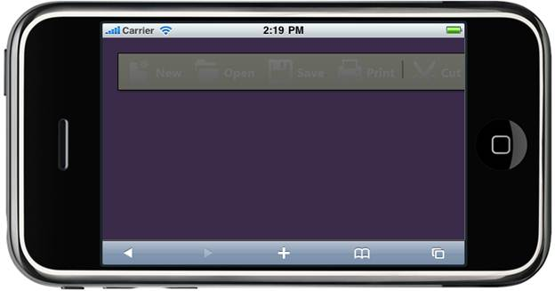

::: {style="DISPLAY: none"}
{#d2h_url_template} {#d2h_package_url style="WIDTH: 0px; DISPLAY: none; HEIGHT: 0px"}
:::

::: {.d2h_secondary_topic style="PADDING-BOTTOM: 10pt; MARGIN: 0pt; PADDING-LEFT: 0pt; PADDING-RIGHT: 0pt; PADDING-TOP: 0pt"}
#### Client Side Methods {#client-side-methods style="tab-stops: 0pt"}

Toolbar supports a rich set of client side methods to control its behavior.

Methods

  --------- ------------ ------------- ------------------------------------
  Name      Parameters   Return type   Description
  disable   \-           \-            Disables all the Toolbar items.
  enable    \-           \-            Enables all the Toolbar items.
  show      \-           \-            Show the Toolbar from hidden state
  hide      \-           \-            Hide the Toolbar
  --------- ------------ ------------- ------------------------------------

 

The following steps guide you in using client side methods.

1.   In **View**, invoke the Toolbar helper with Toolbar ID as the first argument.

**[]{style="FONT-FAMILY: 'Calibri','sans-serif'"}**  

+----------------------------------------------------------------------------------------------------------------------------------------------------------------------------------------------------------------------------------------+
| **[\[ASPX\]]{style="FONT-FAMILY: 'Courier New'"}**                                                                                                                                                                                     |
|                                                                                                                                                                                                                                        |
| [\<%]{style="FONT-FAMILY: 'Courier New'; BACKGROUND: yellow"} [=]{style="FONT-FAMILY: 'Courier New'; COLOR: blue"} [Html.MobSyncfusion().Toolbar([\"MethodsToolbar\"]{style="COLOR: #a31515"})]{style="FONT-FAMILY: 'Courier New'"}    |
|                                                                                                                                                                                                                                        |
| [   .Items(items =\>]{style="FONT-FAMILY: 'Courier New'"}                                                                                                                                                                              |
|                                                                                                                                                                                                                                        |
| [   {]{style="FONT-FAMILY: 'Courier New'"}                                                                                                                                                                                             |
|                                                                                                                                                                                                                                        |
| [                   items.Add().Value([\"New\"]{style="COLOR: #a31515"}).Text([\"New\"]{style="COLOR: #a31515"}).ImageUrl([\"\~/Content/Toolbar/Images/new.png\"]{style="COLOR: #a31515"});]{style="FONT-FAMILY: 'Courier New'"}       |
|                                                                                                                                                                                                                                        |
| [                   items.Add().Value([\"Open\"]{style="COLOR: #a31515"}).Text([\"Open\"]{style="COLOR: #a31515"}).ImageUrl([\"\~/Content/Toolbar/Images/open.png\"]{style="COLOR: #a31515"});]{style="FONT-FAMILY: 'Courier New'"}    |
|                                                                                                                                                                                                                                        |
| [                   items.Add().Value([\"Save\"]{style="COLOR: #a31515"}).Text([\"Save\"]{style="COLOR: #a31515"}).ImageUrl([\"\~/Content/Toolbar/Images/save.png\"]{style="COLOR: #a31515"});]{style="FONT-FAMILY: 'Courier New'"}    |
|                                                                                                                                                                                                                                        |
| [                   items.Add().Value([\"Print\"]{style="COLOR: #a31515"}).Text([\"Print\"]{style="COLOR: #a31515"}).ImageUrl([\"\~/Content/Toolbar/Images/print.png\"]{style="COLOR: #a31515"});]{style="FONT-FAMILY: 'Courier New'"} |
|                                                                                                                                                                                                                                        |
| []{style="FONT-FAMILY: 'Courier New'"}                                                                                                                                                                                                 |
|                                                                                                                                                                                                                                        |
| [items.Add().IsSeparator([true]{style="COLOR: blue"});]{style="FONT-FAMILY: 'Courier New'"}                                                                                                                                            |
|                                                                                                                                                                                                                                        |
| [                   items.Add().Value([\"Cut\"]{style="COLOR: #a31515"}).Text([\"Cut\"]{style="COLOR: #a31515"}).ImageUrl([\"\~/Content/Toolbar/Images/Cut.png\"]{style="COLOR: #a31515"});]{style="FONT-FAMILY: 'Courier New'"}       |
|                                                                                                                                                                                                                                        |
| []{style="FONT-FAMILY: 'Courier New'"}                                                                                                                                                                                                 |
|                                                                                                                                                                                                                                        |
| [   })[%\>]{style="BACKGROUND: yellow"}[]{style="BACKGROUND: yellow"}]{style="FONT-FAMILY: 'Courier New'"}                                                                                                                             |
+----------------------------------------------------------------------------------------------------------------------------------------------------------------------------------------------------------------------------------------+

[]{style="FONT-FAMILY: 'Courier New'"} 

+-------------------------------------------------------------------------------------------------------------------------------------------------------------------------------------------------------------------------------------+
| **[\[Razor\]]{style="FONT-FAMILY: 'Courier New'"}**                                                                                                                                                                                 |
|                                                                                                                                                                                                                                     |
| [\@{]{style="FONT-FAMILY: 'Courier New'; BACKGROUND: yellow"} []{style="FONT-FAMILY: 'Courier New'"}                                                                                                                                |
|                                                                                                                                                                                                                                     |
| [  Html.MobSyncfusion().Toolbar([\"MethodsToolbar\"]{style="COLOR: #a31515"})]{style="FONT-FAMILY: 'Courier New'"}                                                                                                                  |
|                                                                                                                                                                                                                                     |
| [  .Items(items =\>]{style="FONT-FAMILY: 'Courier New'"}                                                                                                                                                                            |
|                                                                                                                                                                                                                                     |
| [  {]{style="FONT-FAMILY: 'Courier New'"}                                                                                                                                                                                           |
|                                                                                                                                                                                                                                     |
| [                items.Add().Value([\"New\"]{style="COLOR: #a31515"}).Text([\"New\"]{style="COLOR: #a31515"}).ImageUrl([\"\~/Content/Toolbar/Images/new.png\"]{style="COLOR: #a31515"});]{style="FONT-FAMILY: 'Courier New'"}       |
|                                                                                                                                                                                                                                     |
| [                items.Add().Value([\"Open\"]{style="COLOR: #a31515"}).Text([\"Open\"]{style="COLOR: #a31515"}).ImageUrl([\"\~/Content/Toolbar/Images/open.png\"]{style="COLOR: #a31515"});]{style="FONT-FAMILY: 'Courier New'"}    |
|                                                                                                                                                                                                                                     |
| [                items.Add().Value([\"Save\"]{style="COLOR: #a31515"}).Text([\"Save\"]{style="COLOR: #a31515"}).ImageUrl([\"\~/Content/Toolbar/Images/save.png\"]{style="COLOR: #a31515"});]{style="FONT-FAMILY: 'Courier New'"}    |
|                                                                                                                                                                                                                                     |
| [                items.Add().Value([\"Print\"]{style="COLOR: #a31515"}).Text([\"Print\"]{style="COLOR: #a31515"}).ImageUrl([\"\~/Content/Toolbar/Images/print.png\"]{style="COLOR: #a31515"});]{style="FONT-FAMILY: 'Courier New'"} |
|                                                                                                                                                                                                                                     |
| []{style="FONT-FAMILY: 'Courier New'"}                                                                                                                                                                                              |
|                                                                                                                                                                                                                                     |
| [items.Add().IsSeparator([true]{style="COLOR: blue"});]{style="FONT-FAMILY: 'Courier New'"}                                                                                                                                         |
|                                                                                                                                                                                                                                     |
| [                items.Add().Value([\"Cut\"]{style="COLOR: #a31515"}).Text([\"Cut\"]{style="COLOR: #a31515"}).ImageUrl([\"\~/Content/Toolbar/Images/Cut.png\"]{style="COLOR: #a31515"});]{style="FONT-FAMILY: 'Courier New'"}       |
|                                                                                                                                                                                                                                     |
| []{style="FONT-FAMILY: 'Courier New'"}                                                                                                                                                                                              |
|                                                                                                                                                                                                                                     |
| [  })]{style="FONT-FAMILY: 'Courier New'"}                                                                                                                                                                                          |
|                                                                                                                                                                                                                                     |
| [  .Render();[}]{style="BACKGROUND: yellow"}]{style="FONT-FAMILY: 'Courier New'"} []{style="FONT-FAMILY: 'Courier New'"}                                                                                                            |
+-------------------------------------------------------------------------------------------------------------------------------------------------------------------------------------------------------------------------------------+

[]{style="FONT-FAMILY: 'Courier New'"} 

2.   In Javascript, use the methods to enable and disable an item as follows.

**[]{style="FONT-FAMILY: 'Calibri','sans-serif'"}**  

+---------------------------------------------------------------------------------------------------------------------------------------------------------------------------+
| **[\[Javascript\]]{style="FONT-FAMILY: 'Courier New'"}**                                                                                                                  |
|                                                                                                                                                                           |
| [    [\<]{style="COLOR: blue"}[script]{style="COLOR: maroon"}[type]{style="COLOR: red"}[=\"text/javascript\"\>]{style="COLOR: blue"}]{style="FONT-FAMILY: 'Courier New'"} |
|                                                                                                                                                                           |
| [        [function]{style="COLOR: blue"} disableToolbar() {]{style="FONT-FAMILY: 'Courier New'"}                                                                          |
|                                                                                                                                                                           |
| [            [//Code to disable the Toolbar ]{style="COLOR: darkgreen"}]{style="FONT-FAMILY: 'Courier New'"}                                                              |
|                                                                                                                                                                           |
| [            \$([\"#MethodsToolbar\"]{style="COLOR: maroon"}).sfToolbar([\"disable\"]{style="COLOR: maroon"});]{style="FONT-FAMILY: 'Courier New'"}                       |
|                                                                                                                                                                           |
| [        }]{style="FONT-FAMILY: 'Courier New'"}                                                                                                                           |
|                                                                                                                                                                           |
| []{style="FONT-FAMILY: 'Courier New'"}                                                                                                                                    |
|                                                                                                                                                                           |
| [        [function]{style="COLOR: blue"} enableToolbar() {]{style="FONT-FAMILY: 'Courier New'"}                                                                           |
|                                                                                                                                                                           |
| [            [//Code to enable the Toolbar ]{style="COLOR: darkgreen"}]{style="FONT-FAMILY: 'Courier New'"}                                                               |
|                                                                                                                                                                           |
| [            \$([\"#MethodsToolbar\"]{style="COLOR: maroon"}).sfToolbar([\"enable\"]{style="COLOR: maroon"});]{style="FONT-FAMILY: 'Courier New'"}                        |
|                                                                                                                                                                           |
| [        }]{style="FONT-FAMILY: 'Courier New'"}                                                                                                                           |
|                                                                                                                                                                           |
| []{style="FONT-FAMILY: 'Courier New'"}                                                                                                                                    |
|                                                                                                                                                                           |
| [        [function]{style="COLOR: blue"} hideToolbar() {]{style="FONT-FAMILY: 'Courier New'"}                                                                             |
|                                                                                                                                                                           |
| [            [//Code to hide the Toolbar ]{style="COLOR: darkgreen"}]{style="FONT-FAMILY: 'Courier New'"}                                                                 |
|                                                                                                                                                                           |
| [            \$([\"#MethodsToolbar\"]{style="COLOR: maroon"}).sfToolbar([\"hide\"]{style="COLOR: maroon"});]{style="FONT-FAMILY: 'Courier New'"}                          |
|                                                                                                                                                                           |
| [        }]{style="FONT-FAMILY: 'Courier New'"}                                                                                                                           |
|                                                                                                                                                                           |
| []{style="FONT-FAMILY: 'Courier New'"}                                                                                                                                    |
|                                                                                                                                                                           |
| [        [function]{style="COLOR: blue"} showToolbar() {]{style="FONT-FAMILY: 'Courier New'"}                                                                             |
|                                                                                                                                                                           |
| [            [//Code to show the Toolbar ]{style="COLOR: darkgreen"}]{style="FONT-FAMILY: 'Courier New'"}                                                                 |
|                                                                                                                                                                           |
| [            \$([\"#MethodsToolbar\"]{style="COLOR: maroon"}).sfToolbar([\"show\"]{style="COLOR: maroon"});]{style="FONT-FAMILY: 'Courier New'"}                          |
|                                                                                                                                                                           |
| [        }]{style="FONT-FAMILY: 'Courier New'"}                                                                                                                           |
|                                                                                                                                                                           |
| [    [\</]{style="COLOR: blue"}[script]{style="COLOR: maroon"}[\>]{style="COLOR: blue"}]{style="FONT-FAMILY: 'Courier New'"}                                              |
|                                                                                                                                                                           |
| []{style="FONT-FAMILY: 'Courier New'; BACKGROUND: yellow"}                                                                                                                |
+---------------------------------------------------------------------------------------------------------------------------------------------------------------------------+

[]{style="FONT-FAMILY: 'Calibri','sans-serif'"} 

3.   Build and run the application.

The output when the Toolbar is disabled is shown in the following screenshots.

{border="0"}

Figure 175: Toolbar with disabled state

 

 

 

[]{#related-topics}
:::
