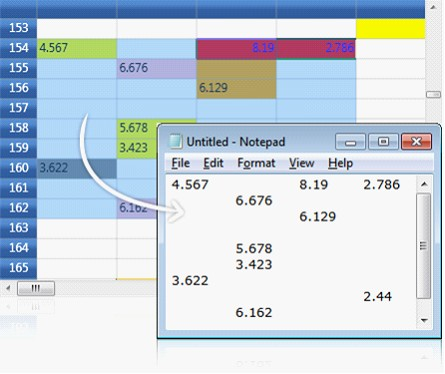
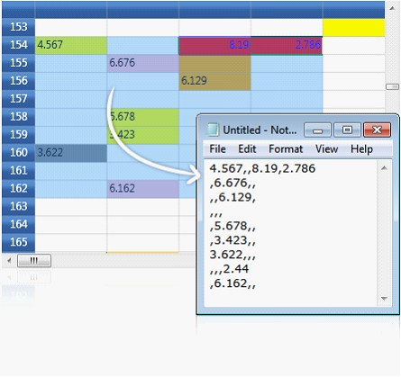

::: {style="DISPLAY: none"}
{#d2h_url_template}{#d2h_package_url style="WIDTH: 0px; DISPLAY: none; HEIGHT: 0px"}
:::

:::: {.d2h_secondary_topic style="PADDING-BOTTOM: 10pt; MARGIN: 0pt; PADDING-LEFT: 0pt; PADDING-RIGHT: 0pt; PADDING-TOP: 0pt"}
#### Clipboard Support       {#clipboard-support style="tab-stops: 0pt"}

[]{style="FONT-FAMILY: 'Trebuchet MS','sans-serif'; COLOR: #15428b; FONT-SIZE: 9pt"} 

Essential Grid provides complete support for clipboard operations. Users can cut/copy & paste any data inside the grid to or from other **OLE** \[Object Linking and Embedding\]-enabled applications such as Notepad. The built-in source allows the users to copy the text data along with the style information and also provides hooks that let users customize the clipboard operation of pasting the custom formatted data.

[]{style="BACKGROUND: white; COLOR: black; FONT-SIZE: 9pt"} 

Copy Paste Options

[]{style="BACKGROUND: white; COLOR: black; FONT-SIZE: 9pt"} 

Copy Paste Option property defines the list of clipboard operations supported by the grid. It exposes the following options:

[]{style="BACKGROUND: white; COLOR: black; FONT-SIZE: 9pt"} 

[·      ]{style="FONT-FAMILY: Symbol"}[ ]{style="COLOR: black"}**CopyText** -- Copies only the text from the grid selection to clipboard

[·      ]{style="FONT-FAMILY: Symbol"}[ ]{style="COLOR: black"}**CopyCellData** -- Copies both text and style information from grid cells to clipboard

[·      ]{style="FONT-FAMILY: Symbol"}[ ]{style="COLOR: black"}**PasteTex t**-- Pastes only the text from clipboard

[·      ]{style="FONT-FAMILY: Symbol"}[ ]{style="COLOR: black"}**PasteCell** -- Pastes the cell text and style information from the clipboard

[·      ]{style="FONT-FAMILY: Symbol"}[ ]{style="COLOR: black"}**CutText** -- Moves only the text from grid to clipboard

[·      ]{style="FONT-FAMILY: Symbol"}[ ]{style="COLOR: black"}**CutCell** -- Moves the text and the style information from grid to clipboard

[·      ]{style="FONT-FAMILY: Symbol"}[ ]{style="COLOR: black"}**ExcludeCurrentCell** -- Skips current cell while doing clipboard operations

[]{style="BACKGROUND: white; COLOR: black; FONT-SIZE: 9pt"} 

Example

**[]{style="FONT-FAMILY: 'Trebuchet MS','sans-serif'; COLOR: #15428b; FONT-SIZE: 9pt"}** 

Define copy paste behaviors, by using the following code. 

[]{style="BACKGROUND: white; COLOR: black; FONT-SIZE: 9pt"} 

+-------------------------------------------------------------------------------------------------------------------------------------------------------------------------------------------------------------------------------------------------------------------------------------+
| **[\[C#\]]{style="FONT-FAMILY: 'Courier New'; COLOR: black; FONT-SIZE: 9pt"}**                                                                                                                                                                                                      |
|                                                                                                                                                                                                                                                                                     |
| []{style="COLOR: black"}                                                                                                                                                                                                                                                            |
|                                                                                                                                                                                                                                                                                     |
| [//Copy cell data with style]{style="FONT-FAMILY: 'Courier New'; COLOR: green; FONT-SIZE: 9pt"}                                                                                                                                                                                     |
|                                                                                                                                                                                                                                                                                     |
| [gridControl.Model.Options.CopyPasteOption \|= ]{style="FONT-FAMILY: 'Courier New'; COLOR: black; FONT-SIZE: 9pt"}[CopyPaste]{style="FONT-FAMILY: 'Courier New'; COLOR: #2b91af; FONT-SIZE: 9pt"}[.CopyCellData;]{style="FONT-FAMILY: 'Courier New'; COLOR: black; FONT-SIZE: 9pt"} |
|                                                                                                                                                                                                                                                                                     |
| []{style="COLOR: black"}                                                                                                                                                                                                                                                            |
|                                                                                                                                                                                                                                                                                     |
| [//Cut cell data with style]{style="FONT-FAMILY: 'Courier New'; COLOR: green; FONT-SIZE: 9pt"}                                                                                                                                                                                      |
|                                                                                                                                                                                                                                                                                     |
| [gridControl.Model.Options.CopyPasteOption \|= ]{style="FONT-FAMILY: 'Courier New'; COLOR: black; FONT-SIZE: 9pt"}[CopyPaste]{style="FONT-FAMILY: 'Courier New'; COLOR: #2b91af; FONT-SIZE: 9pt"}[.CutCell;]{style="FONT-FAMILY: 'Courier New'; COLOR: black; FONT-SIZE: 9pt"}      |
|                                                                                                                                                                                                                                                                                     |
| []{style="COLOR: black"}                                                                                                                                                                                                                                                            |
|                                                                                                                                                                                                                                                                                     |
| [//Paste cell data with style]{style="FONT-FAMILY: 'Courier New'; COLOR: green; FONT-SIZE: 9pt"}                                                                                                                                                                                    |
|                                                                                                                                                                                                                                                                                     |
| [gridControl.Model.Options.CopyPasteOption \|= ]{style="FONT-FAMILY: 'Courier New'; COLOR: black; FONT-SIZE: 9pt"}[CopyPaste]{style="FONT-FAMILY: 'Courier New'; COLOR: #2b91af; FONT-SIZE: 9pt"}[.PasteCell;]{style="FONT-FAMILY: 'Courier New'; COLOR: black; FONT-SIZE: 9pt"}    |
|                                                                                                                                                                                                                                                                                     |
| []{style="COLOR: black"}                                                                                                                                                                                                                                                            |
|                                                                                                                                                                                                                                                                                     |
| [//Code to cut copy paste cell text (excluding style)]{style="FONT-FAMILY: 'Courier New'; COLOR: green; FONT-SIZE: 9pt"}                                                                                                                                                            |
|                                                                                                                                                                                                                                                                                     |
| [gridControl.Model.Options.CopyPasteOption = (]{style="FONT-FAMILY: 'Courier New'; COLOR: black; FONT-SIZE: 9pt"}[CopyPaste]{style="FONT-FAMILY: 'Courier New'; COLOR: #2b91af; FONT-SIZE: 9pt"}[)(0);]{style="FONT-FAMILY: 'Courier New'; COLOR: black; FONT-SIZE: 9pt"}           |
|                                                                                                                                                                                                                                                                                     |
| [gridControl.Model.Options.CopyPasteOption \|= ]{style="FONT-FAMILY: 'Courier New'; COLOR: black; FONT-SIZE: 9pt"}[CopyPaste]{style="FONT-FAMILY: 'Courier New'; COLOR: #2b91af; FONT-SIZE: 9pt"}[.CopyText;]{style="FONT-FAMILY: 'Courier New'; COLOR: black; FONT-SIZE: 9pt"}     |
|                                                                                                                                                                                                                                                                                     |
| [gridControl.Model.Options.CopyPasteOption \|= ]{style="FONT-FAMILY: 'Courier New'; COLOR: black; FONT-SIZE: 9pt"}[CopyPaste]{style="FONT-FAMILY: 'Courier New'; COLOR: #2b91af; FONT-SIZE: 9pt"}[.CutText;]{style="FONT-FAMILY: 'Courier New'; COLOR: black; FONT-SIZE: 9pt"}      |
|                                                                                                                                                                                                                                                                                     |
| [gridControl.Model.Options.CopyPasteOption \|= ]{style="FONT-FAMILY: 'Courier New'; COLOR: black; FONT-SIZE: 9pt"}[CopyPaste]{style="FONT-FAMILY: 'Courier New'; COLOR: #2b91af; FONT-SIZE: 9pt"}[.PasteText;]{style="FONT-FAMILY: 'Courier New'; COLOR: black; FONT-SIZE: 9pt"}    |
+-------------------------------------------------------------------------------------------------------------------------------------------------------------------------------------------------------------------------------------------------------------------------------------+

[]{style="BACKGROUND: white; COLOR: black; FONT-SIZE: 9pt"} 

[]{style="FONT-FAMILY: 'Trebuchet MS','sans-serif'; COLOR: #15428b; FONT-SIZE: 9pt"} 

[]{style="FONT-FAMILY: 'Trebuchet MS','sans-serif'; COLOR: #15428b; FONT-SIZE: 9pt"} 

{border="0"}

Figure 66: Pasting the grid data in Notepad

[]{style="BACKGROUND: white; COLOR: black; FONT-SIZE: 9pt"} 

Text Data Exchange

[]{style="BACKGROUND: white; COLOR: black; FONT-SIZE: 9pt"} 

**GridModel.TextDataExchange **helps the users in customizing the clipboard operations. It is used as an interface that exposes the following property and methods. 

[]{style="BACKGROUND: white; COLOR: black; FONT-SIZE: 9pt"} 

[·      ]{style="FONT-FAMILY: Symbol"}Property - TabDelimiter

[·      ]{style="FONT-FAMILY: Symbol"}Method - CopyTextToBuffer(), PasteTextFromBuffer()

**[]{style="BACKGROUND: white; COLOR: black; FONT-SIZE: 9pt"}** 

[]{style="BACKGROUND: white; COLOR: black; FONT-SIZE: 9pt"} 

Property

**[]{style="FONT-FAMILY: 'Trebuchet MS','sans-serif'; COLOR: #15428b; FONT-SIZE: 9pt"}** 

1.   TabDelimiter Property

[                                                                                                   ]{style="FONT-FAMILY: 'Trebuchet MS','sans-serif'; COLOR: #15428b; FONT-SIZE: 9pt"}

This property specifies a delimiter for the text to be pasted. This is useful to paste the cell data in CSV (Comma-Separated Values) format.

[]{style="BACKGROUND: white; COLOR: black; FONT-SIZE: 9pt"} 

+------------------------------------------------------------------------------------------------------------------------------------------------------------------------------------------------------------------------------------------------------------------------+
| **[\[C#\]]{style="FONT-FAMILY: 'Courier New'; COLOR: black; FONT-SIZE: 9pt"}**                                                                                                                                                                                         |
|                                                                                                                                                                                                                                                                        |
| []{style="COLOR: black"}                                                                                                                                                                                                                                               |
|                                                                                                                                                                                                                                                                        |
| [gridControl.Model.TextDataExchange.TabDelimiter = ]{style="FONT-FAMILY: 'Courier New'; COLOR: black; FONT-SIZE: 9pt"}[\",\"]{style="FONT-FAMILY: 'Courier New'; COLOR: #a31515; FONT-SIZE: 9pt"}[;]{style="FONT-FAMILY: 'Courier New'; COLOR: black; FONT-SIZE: 9pt"} |
+------------------------------------------------------------------------------------------------------------------------------------------------------------------------------------------------------------------------------------------------------------------------+

[]{style="BACKGROUND: white; COLOR: black; FONT-SIZE: 9pt"} 

[]{style="FONT-FAMILY: 'Trebuchet MS','sans-serif'; COLOR: #15428b; FONT-SIZE: 9pt"} 

[]{style="FONT-FAMILY: 'Trebuchet MS','sans-serif'; COLOR: #15428b; FONT-SIZE: 9pt"} 

{border="0"}

Figure 67: Pasting the grid data in CSV format

***[]{style="FONT-FAMILY: 'Trebuchet MS','sans-serif'; COLOR: #15428b; FONT-SIZE: 9pt"}*** 

Methods

[]{style="BACKGROUND: white; COLOR: black; FONT-SIZE: 9pt"} 

2.   CopyTextToBuffer() Method

[]{style="BACKGROUND: white; COLOR: black; FONT-SIZE: 9pt"} 

This method lets the users to place the cell data into an intermediate buffer, which can be customized. The method performs clipboard Cut or Copy operation depending on the third parameter given to it. This method accepts the following parameters:

[]{style="BACKGROUND: white; COLOR: black; FONT-SIZE: 9pt"} 

[·      ]{style="FONT-FAMILY: Symbol"}String buffer

[·      ]{style="FONT-FAMILY: Symbol"}[  ]{style="COLOR: black"}Selected range of cells

[·      ]{style="FONT-FAMILY: Symbol"}[  ]{style="COLOR: black"}Boolean value -This should be set to true for cut operation and should be set to false for copy operation.

[]{style="BACKGROUND: white; COLOR: black; FONT-SIZE: 9pt"} 

The following code illustrates the **CopyTextToBuffer** method:

[]{style="BACKGROUND: white; COLOR: black; FONT-SIZE: 9pt"} 

+-------------------------------------------------------------------------------------------------------------------------------------------------------------------------------------------------------------------------------------------------------------------------------------------------------------------------------------------------------------------------------------------------------------------------------------------------------------------------------------------------------------------------------------------------------------------------------------------------------------------------------------------------------------------------------------------------------------------------------------------------------------+
| **[\[C#\]]{style="FONT-FAMILY: 'Courier New'; COLOR: black; FONT-SIZE: 9pt"}**                                                                                                                                                                                                                                                                                                                                                                                                                                                                                                                                                                                                                                                                              |
|                                                                                                                                                                                                                                                                                                                                                                                                                                                                                                                                                                                                                                                                                                                                                             |
| []{style="COLOR: black"}                                                                                                                                                                                                                                                                                                                                                                                                                                                                                                                                                                                                                                                                                                                                    |
|                                                                                                                                                                                                                                                                                                                                                                                                                                                                                                                                                                                                                                                                                                                                                             |
| [gridControl.Model.TextDataExchange.CopyTextToBuffer(]{style="FONT-FAMILY: 'Courier New'; COLOR: black; FONT-SIZE: 9pt"}[out]{style="FONT-FAMILY: 'Courier New'; COLOR: blue; FONT-SIZE: 9pt"}[ buffer, gridControl.Model.SelectedRanges, ]{style="FONT-FAMILY: 'Courier New'; COLOR: black; FONT-SIZE: 9pt"}[out]{style="FONT-FAMILY: 'Courier New'; COLOR: blue; FONT-SIZE: 9pt"}[ row, ]{style="FONT-FAMILY: 'Courier New'; COLOR: black; FONT-SIZE: 9pt"}[out]{style="FONT-FAMILY: 'Courier New'; COLOR: blue; FONT-SIZE: 9pt"}[ col, ]{style="FONT-FAMILY: 'Courier New'; COLOR: black; FONT-SIZE: 9pt"}[false]{style="FONT-FAMILY: 'Courier New'; COLOR: blue; FONT-SIZE: 9pt"}[);]{style="FONT-FAMILY: 'Courier New'; COLOR: black; FONT-SIZE: 9pt"} |
+-------------------------------------------------------------------------------------------------------------------------------------------------------------------------------------------------------------------------------------------------------------------------------------------------------------------------------------------------------------------------------------------------------------------------------------------------------------------------------------------------------------------------------------------------------------------------------------------------------------------------------------------------------------------------------------------------------------------------------------------------------------+

[]{style="BACKGROUND: white; COLOR: black; FONT-SIZE: 9pt"} 

When the code runs, it returns the following values:

[]{style="BACKGROUND: white; COLOR: black; FONT-SIZE: 9pt"} 

[·      ]{style="FONT-FAMILY: Symbol"}Cell text

[·      ]{style="FONT-FAMILY: Symbol"}No. Of rows affected

[·      ]{style="FONT-FAMILY: Symbol"}No. Of columns affected

[]{style="BACKGROUND: white; COLOR: black; FONT-SIZE: 9pt"} 

3.   PasteTextFromBuffer() Method

[]{style="BACKGROUND: white; COLOR: black; FONT-SIZE: 9pt"} 

Pass the values returned by the **CopyTextToBuffer** method as parameter to the **PasteTextFromBuffer** method, by using the following code:

[]{style="BACKGROUND: white; COLOR: black; FONT-SIZE: 9pt"} 

+-----------------------------------------------------------------------------------------------------------------------------------------------------------------------+
| **[\[C#\]]{style="FONT-FAMILY: 'Courier New'; COLOR: black; FONT-SIZE: 9pt"}**                                                                                        |
|                                                                                                                                                                       |
| []{style="COLOR: black"}                                                                                                                                              |
|                                                                                                                                                                       |
| [gridControl.Model.TextDataExchange.PasteTextFromBuffer(buffer, gridControl.Model.SelectedRanges);]{style="FONT-FAMILY: 'Courier New'; COLOR: black; FONT-SIZE: 9pt"} |
+-----------------------------------------------------------------------------------------------------------------------------------------------------------------------+

[]{style="BACKGROUND: white; COLOR: black; FONT-SIZE: 9pt"} 

[]{style="BACKGROUND: white; COLOR: black; FONT-SIZE: 9pt"} 

When the code runs**,** [i]{style="BACKGROUND: white; COLOR: black"}t pastes the text from the given buffer into specified range of grid cells.

[]{style="BACKGROUND: white; COLOR: black; FONT-SIZE: 9pt"} 

[]{style="BACKGROUND: white; COLOR: black; FONT-SIZE: 9pt"} 

Events

[]{style="BACKGROUND: white; COLOR: black; FONT-SIZE: 9pt"} 

Grid provides the following events to customize the clipboard data.

[]{style="BACKGROUND: white; COLOR: black; FONT-SIZE: 9pt"} 

[·      ]{style="FONT-FAMILY: Symbol"}ClipboardCanCopy

[·      ]{style="FONT-FAMILY: Symbol"}ClipboardCanCut

[·      ]{style="FONT-FAMILY: Symbol"}ClipboardCanPaste

[·      ]{style="FONT-FAMILY: Symbol"}ClipboardCopy

[·      ]{style="FONT-FAMILY: Symbol"}ClipboardCut

[·      ]{style="FONT-FAMILY: Symbol"}ClipboardPaste

[]{style="BACKGROUND: white; COLOR: black"} 

**[]{style="FONT-FAMILY: 'Trebuchet MS','sans-serif'; COLOR: #15428b; FONT-SIZE: 9pt"}** 

IGridCopyPaste

[]{style="BACKGROUND: white; COLOR: black; FONT-SIZE: 9pt"} 

Essential Grid defines an interface called **IGridCopyPaste** that exposes some methods, namely **Copy()**, **Cut()** and **Paste()**. Here the users can write custom code to perform cut copy or paste operations with any kind of user-defined data. Thereby, it extends its clipboard support behavior to perform clipboard operations in various forms.

[]{style="BACKGROUND: white; COLOR: black; FONT-SIZE: 9pt"} 

::: {style="BORDER-BOTTOM: windowtext 1pt solid; BORDER-LEFT: medium none; PADDING-BOTTOM: 1pt; MARGIN-TOP: 9pt; PADDING-LEFT: 0pt; PADDING-RIGHT: 0pt; MARGIN-BOTTOM: 9pt; BORDER-TOP: windowtext 1pt solid; BORDER-RIGHT: medium none; PADDING-TOP: 1pt"}
[{border="0"}]{style="BACKGROUND: white; COLOR: black"}Note: This feature would be available only in Silveright 4 application, because Microsoft has support for Clipboard only in Silverlight 4.
:::

[]{#p192} 

 

[]{#related-topics}
::::
